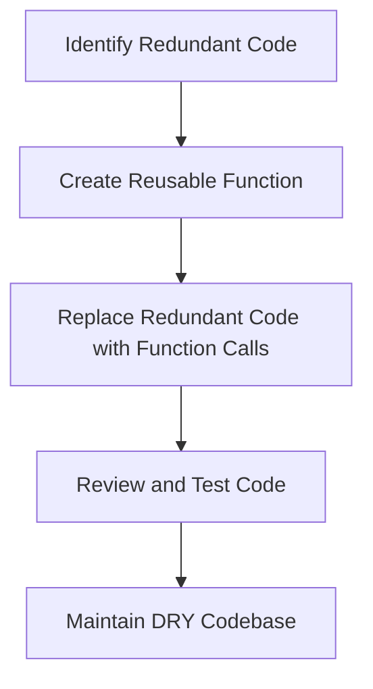

## 14.9 Keeping Code DRY (Don't Repeat Yourself)

In the world of software development, writing clean, efficient, and maintainable code is crucial. One of the fundamental principles that guide developers in achieving this is the DRY principle, which stands for "Don't Repeat Yourself." In this section, we will explore the DRY principle in detail, understand its benefits, and learn how to apply it effectively in JavaScript to build dynamic web pages.

### Understanding the DRY Principle

The DRY principle is a software development concept that emphasizes the reduction of code repetition. The idea is simple: every piece of knowledge or logic should have a single, unambiguous representation within a system. By adhering to this principle, developers can avoid redundancy, making their codebase more manageable and reducing the likelihood of errors.

#### Benefits of the DRY Principle

1. **Maintainability**: When code is not repeated, changes need to be made in only one place, making it easier to maintain and update.
2. **Readability**: DRY code is often more concise and easier to read, as it eliminates unnecessary clutter.
3. **Consistency**: By centralizing logic, the code behaves consistently across different parts of the application.
4. **Reduced Errors**: Fewer repetitions mean fewer places where bugs can hide, reducing the risk of errors.
5. **Scalability**: DRY code is easier to scale and extend, as new features can be added without duplicating existing logic.

### Refactoring Redundant Code

Refactoring is the process of restructuring existing code without changing its external behavior. It is a crucial step in applying the DRY principle. Let's look at some common scenarios where refactoring can help eliminate redundancy.

#### Example: Refactoring Repeated Code Blocks

Consider the following JavaScript code that calculates the area of a rectangle in two different places:

```javascript
// Calculate area of rectangle in function A
function calculateAreaA(length, width) {
    let areaA = length * width;
    console.log("Area A: " + areaA);
}

// Calculate area of rectangle in function B
function calculateAreaB(length, width) {
    let areaB = length * width;
    console.log("Area B: " + areaB);
}
```

Both functions perform the same calculation. We can refactor this code by creating a reusable function:

```javascript
// Reusable function to calculate area
function calculateArea(length, width) {
    return length * width;
}

// Use the reusable function
function calculateAreaA(length, width) {
    console.log("Area A: " + calculateArea(length, width));
}

function calculateAreaB(length, width) {
    console.log("Area B: " + calculateArea(length, width));
}
```

By creating a single `calculateArea` function, we eliminate redundancy and make the code easier to maintain.

### Using Loops and Abstraction

Loops and abstraction are powerful tools for applying the DRY principle. They allow us to handle repetitive tasks efficiently without duplicating code.

#### Example: Using Loops to Avoid Repetition

Imagine we want to print numbers from 1 to 5. Instead of writing repetitive code:

```javascript
console.log(1);
console.log(2);
console.log(3);
console.log(4);
console.log(5);
```

We can use a loop:

```javascript
for (let i = 1; i <= 5; i++) {
    console.log(i);
}
```

This not only reduces code repetition but also makes it easy to change the range of numbers by modifying a single line.

#### Example: Abstracting Logic with Functions

Let's say we have a task that involves calculating the total price of items in a shopping cart. Instead of repeating the logic for each item, we can abstract it into a function:

```javascript
function calculateTotalPrice(items) {
    let total = 0;
    for (let item of items) {
        total += item.price * item.quantity;
    }
    return total;
}

// Example usage
const cart = [
    { price: 10, quantity: 2 },
    { price: 5, quantity: 4 }
];

console.log("Total Price: " + calculateTotalPrice(cart));
```

By abstracting the logic into the `calculateTotalPrice` function, we can reuse it for any list of items, making our code more flexible and DRY.

### Encouraging Code Reviews

Code reviews are an essential practice for identifying duplication and ensuring adherence to the DRY principle. During a code review, peers examine each other's code to spot redundancies and suggest improvements.

#### Benefits of Code Reviews

- **Fresh Perspective**: Another set of eyes can catch redundancies that the original author might miss.
- **Knowledge Sharing**: Team members learn from each other, spreading best practices across the team.
- **Quality Assurance**: Ensures that the codebase remains clean, efficient, and maintainable.

Encourage regular code reviews in your development process to keep your code DRY and improve overall code quality.

### DRY Code and Maintainability

Maintaining a large codebase can be challenging, but adhering to the DRY principle can significantly ease this process. DRY code is easier to read, understand, and modify, which is crucial when working on long-term projects or collaborating with a team.

#### Example: Simplifying Code Maintenance

Consider a scenario where you need to update a calculation used in multiple places. In a non-DRY codebase, you would have to locate and update each instance, increasing the risk of errors. In a DRY codebase, you update the logic in one place, and the changes propagate throughout the application.

### Try It Yourself

Now that we've covered the basics of the DRY principle, it's time to put it into practice. Here's a simple exercise to help you apply what you've learned:

#### Exercise: Refactor Repetitive Code

You have the following code that calculates the discount for two different products:

```javascript
// Calculate discount for product A
let priceA = 100;
let discountA = 10;
let finalPriceA = priceA - (priceA * (discountA / 100));
console.log("Final Price A: " + finalPriceA);

// Calculate discount for product B
let priceB = 200;
let discountB = 15;
let finalPriceB = priceB - (priceB * (discountB / 100));
console.log("Final Price B: " + finalPriceB);
```

**Task**: Refactor the code to eliminate redundancy by creating a reusable function.

#### Solution

```javascript
// Reusable function to calculate final price after discount
function calculateFinalPrice(price, discount) {
    return price - (price * (discount / 100));
}

// Use the reusable function
let priceA = 100;
let discountA = 10;
console.log("Final Price A: " + calculateFinalPrice(priceA, discountA));

let priceB = 200;
let discountB = 15;
console.log("Final Price B: " + calculateFinalPrice(priceB, discountB));
```

By creating the `calculateFinalPrice` function, we eliminate redundancy and make the code easier to maintain.

### Visualizing the DRY Principle

To better understand how the DRY principle helps in organizing code, let's visualize the process of refactoring redundant code into reusable components.



**Diagram Description**: This flowchart illustrates the process of applying the DRY principle. It starts with identifying redundant code, creating a reusable function, replacing redundant code with function calls, reviewing and testing the code, and maintaining a DRY codebase.

### Key Takeaways

- The DRY principle is essential for writing clean, efficient, and maintainable code.
- Refactoring redundant code into reusable functions or components helps eliminate repetition.
- Loops and abstraction are powerful tools for applying the DRY principle.
- Code reviews are crucial for identifying duplication and ensuring code quality.
- DRY code aids in maintainability, readability, and scalability.

By keeping your code DRY, you can build robust and efficient web applications that are easy to maintain and extend. Remember, the goal is not just to write code that works, but to write code that is clean, efficient, and maintainable.

## Quiz Time!



### What does the DRY principle stand for?

- [x] Don't Repeat Yourself
- [ ] Do Repeat Yourself
- [ ] Don't Refactor Yourself
- [ ] Do Refactor Yourself

> **Explanation:** The DRY principle stands for "Don't Repeat Yourself," emphasizing the importance of reducing code repetition.

### Which of the following is a benefit of the DRY principle?

- [x] Maintainability
- [ ] Increased code redundancy
- [ ] More complex code
- [ ] Slower performance

> **Explanation:** The DRY principle improves maintainability by reducing redundancy, making code easier to update and manage.

### How can loops help in keeping code DRY?

- [x] By reducing repetitive tasks
- [ ] By increasing code complexity
- [ ] By duplicating logic
- [ ] By making code harder to read

> **Explanation:** Loops help reduce repetitive tasks by allowing you to execute a block of code multiple times without duplication.

### What is refactoring?

- [x] Restructuring code without changing its behavior
- [ ] Writing new code from scratch
- [ ] Adding more comments to code
- [ ] Deleting unused code

> **Explanation:** Refactoring involves restructuring existing code to improve its structure and readability without changing its external behavior.

### Which of the following is a tool for identifying code duplication?

- [x] Code reviews
- [ ] Code deletion
- [ ] Code duplication
- [ ] Code obfuscation

> **Explanation:** Code reviews are a practice where peers examine each other's code to identify duplication and suggest improvements.

### What is the purpose of abstraction in programming?

- [x] To simplify complex logic into reusable components
- [ ] To make code more complex
- [ ] To hide code from other developers
- [ ] To duplicate code across the application

> **Explanation:** Abstraction simplifies complex logic by creating reusable components, making code easier to manage and understand.

### How does DRY code aid in scalability?

- [x] By making it easier to extend features
- [ ] By increasing code redundancy
- [ ] By making code harder to read
- [ ] By slowing down performance

> **Explanation:** DRY code is easier to extend and scale because changes are made in one place, reducing the risk of errors.

### What is the first step in applying the DRY principle?

- [x] Identify redundant code
- [ ] Write new code
- [ ] Delete existing code
- [ ] Add more comments

> **Explanation:** The first step in applying the DRY principle is to identify redundant code that can be refactored.

### Which of the following is NOT a benefit of the DRY principle?

- [ ] Maintainability
- [ ] Readability
- [x] Increased redundancy
- [ ] Consistency

> **Explanation:** The DRY principle reduces redundancy, making code more maintainable, readable, and consistent.

### True or False: DRY code is harder to maintain.

- [ ] True
- [x] False

> **Explanation:** DRY code is easier to maintain because it reduces redundancy, making it simpler to update and manage.


