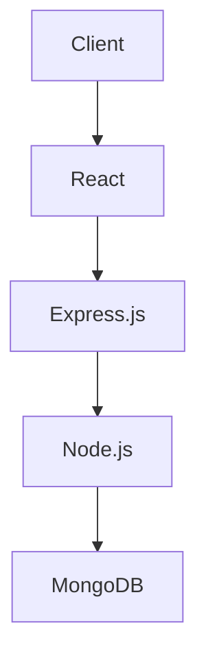

## 15.2 Learning Backend Development

As we venture further into the world of web development, it's time to explore the other side of the coin: backend development. While frontend development focuses on what users see and interact with, backend development is all about what happens behind the scenes. This section will guide you through the basics of backend development, introduce you to server-side programming languages, discuss databases, and provide a roadmap for becoming a full-stack developer.

### Understanding Backend Development

Backend development refers to the server-side of web applications. It involves building and maintaining the technology that powers the components which, together, enable the user-facing side of a website to exist. This includes databases, servers, and applications.

#### The Role of Backend Development

Backend development is crucial for several reasons:

- **Data Management**: It handles data storage, retrieval, and manipulation, ensuring that user data is stored securely and efficiently.
- **Business Logic**: It implements the rules and operations that dictate how data is processed and transformed.
- **Security**: It ensures that sensitive data is protected through authentication and authorization mechanisms.
- **Performance**: It optimizes server-side operations to deliver fast and responsive user experiences.

Backend developers work with databases, server-side languages, and APIs (Application Programming Interfaces) to create robust and scalable web applications.

### Server-Side Programming Languages

Several programming languages are used for backend development. Each has its strengths and is suited for different types of projects. Let's explore some of the most popular ones:

#### Node.js

Node.js is a JavaScript runtime built on Chrome's V8 JavaScript engine. It allows developers to use JavaScript for server-side scripting, enabling the development of dynamic web applications.

```javascript
// A simple Node.js server
const http = require('http');

// Create a server object
http.createServer((req, res) => {
  res.write('Hello, World!'); // Write a response to the client
  res.end(); // End the response
}).listen(8080); // The server object listens on port 8080

console.log('Server running at http://localhost:8080/');
```

- **Advantages**: 
  - Uses JavaScript, allowing full-stack development with a single language.
  - Non-blocking, event-driven architecture, making it suitable for I/O-heavy applications.

#### Python

Python is known for its readability and simplicity, making it a popular choice for beginners and experienced developers alike. Frameworks like Django and Flask make web development in Python efficient and enjoyable.

```python
from flask import Flask

app = Flask(__name__)

@app.route('/')
def hello_world():
    return 'Hello, World!'

if __name__ == '__main__':
    app.run(debug=True)
```

- **Advantages**:
  - Easy to learn and write.
  - Extensive libraries and frameworks for web development.

#### PHP

PHP is a server-side scripting language designed specifically for web development. It is embedded within HTML and is widely used for building dynamic web pages.

```php
<?php
// A simple PHP script
echo "Hello, World!";
?>
```

- **Advantages**:
  - Deep integration with HTML.
  - Large community and a wealth of resources.

### Databases and Data Persistence

Databases are essential for storing and retrieving data in web applications. They come in two main types: relational and non-relational.

#### Relational Databases

Relational databases store data in tables with rows and columns. They use Structured Query Language (SQL) for querying data. Examples include MySQL, PostgreSQL, and SQLite.

```sql
-- Creating a simple table in SQL
CREATE TABLE users (
    id INT AUTO_INCREMENT PRIMARY KEY,
    name VARCHAR(100),
    email VARCHAR(100)
);

-- Inserting data into the table
INSERT INTO users (name, email) VALUES ('John Doe', 'john@example.com');
```

#### Non-Relational Databases

Non-relational databases, also known as NoSQL databases, store data in various formats like documents, key-value pairs, or graphs. Examples include MongoDB, CouchDB, and Redis.

```javascript
// Inserting a document into a MongoDB collection
db.users.insertOne({
    name: "John Doe",
    email: "john@example.com"
});
```

- **Advantages**:
  - Flexible schema design.
  - Suitable for handling large volumes of unstructured data.

### Understanding the Full Web Development Stack

A full-stack developer is someone who is comfortable working with both frontend and backend technologies. Understanding the full stack allows developers to build complete web applications from start to finish.

#### The MERN Stack

One popular full-stack development stack is the MERN stack, which consists of:

- **MongoDB**: A NoSQL database for storing data.
- **Express.js**: A web application framework for Node.js.
- **React**: A JavaScript library for building user interfaces.
- **Node.js**: A JavaScript runtime for server-side programming.



- **Advantages**:
  - JavaScript is used across the stack, simplifying development.
  - Each component is open-source and has a large community.

### Where to Start Learning Backend Technologies

Embarking on a journey to learn backend development can be overwhelming, but here are some steps to help you get started:

1. **Choose a Language**: Start with a language that complements your current skills. If you're familiar with JavaScript, Node.js is a great choice.

2. **Learn the Basics**: Understand the fundamentals of server-side programming, including handling requests and responses, routing, and middleware.

3. **Explore Frameworks**: Use frameworks like Express.js, Django, or Flask to streamline development and follow best practices.

4. **Understand Databases**: Learn about different types of databases and how to interact with them using your chosen language.

5. **Build Projects**: Apply your knowledge by building small projects, such as a simple API or a CRUD (Create, Read, Update, Delete) application.

6. **Study Security**: Learn about common security practices to protect your applications from vulnerabilities.

7. **Join Communities**: Engage with online communities, forums, and meetups to learn from others and stay updated with the latest trends.

8. **Practice Regularly**: Consistent practice is key to mastering backend development. Challenge yourself with new projects and problems.

### Summary

Backend development is a vital part of web applications, handling data management, business logic, security, and performance. By learning server-side programming languages, understanding databases, and exploring the full stack, you can become a well-rounded developer capable of building robust and scalable web applications.

### Try It Yourself

To reinforce what you've learned, try building a simple REST API using Node.js and Express.js. Experiment with different routes, handle various HTTP methods, and connect to a database to store and retrieve data.

### Further Reading

For more in-depth information, consider exploring the following resources:

- [MDN Web Docs on Server-side Programming](https://developer.mozilla.org/en-US/docs/Learn/Server-side)
- [Node.js Official Documentation](https://nodejs.org/en/docs/)
- [Python's Flask Documentation](https://flask.palletsprojects.com/en/2.0.x/)
- [PHP Manual](https://www.php.net/manual/en/)

## Quiz Time!



### What is the primary role of backend development in web applications?

- [x] Data management, business logic, security, and performance
- [ ] Designing user interfaces
- [ ] Creating animations
- [ ] Styling web pages

> **Explanation:** Backend development focuses on handling data, implementing business logic, ensuring security, and optimizing performance.

### Which language allows you to use JavaScript for server-side scripting?

- [x] Node.js
- [ ] Python
- [ ] PHP
- [ ] Ruby

> **Explanation:** Node.js is a JavaScript runtime that enables server-side scripting using JavaScript.

### What is a relational database?

- [x] A database that stores data in tables with rows and columns
- [ ] A database that stores data as key-value pairs
- [ ] A database that stores data in a document format
- [ ] A database that stores data as graphs

> **Explanation:** Relational databases store data in structured tables and use SQL for querying.

### Which of the following is a non-relational database?

- [x] MongoDB
- [ ] MySQL
- [ ] PostgreSQL
- [ ] SQLite

> **Explanation:** MongoDB is a NoSQL database that stores data in a flexible document format.

### What does the 'M' in the MERN stack stand for?

- [x] MongoDB
- [ ] MySQL
- [ ] MariaDB
- [ ] Memcached

> **Explanation:** The 'M' in MERN stands for MongoDB, a NoSQL database used in the stack.

### What is the purpose of a web application framework?

- [x] To streamline development and follow best practices
- [ ] To create animations
- [ ] To design user interfaces
- [ ] To store data

> **Explanation:** Web application frameworks provide tools and libraries to simplify development and enforce best practices.

### Which of the following is a server-side programming language?

- [x] PHP
- [ ] HTML
- [ ] CSS
- [ ] JavaScript

> **Explanation:** PHP is a server-side scripting language used for web development.

### What is a CRUD application?

- [x] An application that allows Create, Read, Update, and Delete operations
- [ ] An application that creates animations
- [ ] An application that designs user interfaces
- [ ] An application that stores data

> **Explanation:** CRUD applications perform basic data manipulation operations: Create, Read, Update, and Delete.

### What is the advantage of using Node.js for backend development?

- [x] It allows full-stack development with a single language
- [ ] It is only used for frontend development
- [ ] It is a database management system
- [ ] It is a CSS framework

> **Explanation:** Node.js uses JavaScript, enabling developers to work on both frontend and backend with the same language.

### True or False: Backend development is only about managing databases.

- [ ] True
- [x] False

> **Explanation:** Backend development involves data management, business logic, security, and performance, not just databases.


