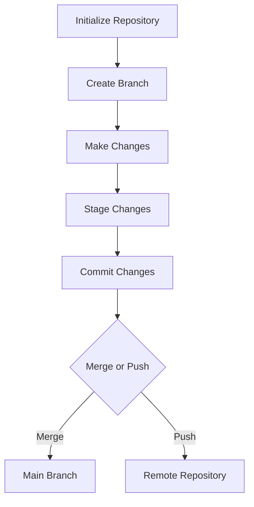

## 15.3 Version Control with Git and GitHub

In the world of web development, managing code changes efficiently and collaborating seamlessly with others are crucial skills. This is where version control systems like Git, along with platforms like GitHub, come into play. In this section, we will explore the fundamentals of version control, delve into the basics of Git, and learn how to leverage GitHub for remote repositories and collaboration.

### Understanding Version Control

**Version Control** is a system that records changes to a file or set of files over time so that you can recall specific versions later. It allows multiple people to work on a project simultaneously without overwriting each other's work, tracks changes, and helps in reverting to previous versions if necessary.

#### Why Use Version Control?

- **Collaboration**: Multiple developers can work on the same project simultaneously.
- **History**: Every change is recorded, allowing you to revert to previous versions.
- **Backup**: Your code is safely stored in repositories, reducing the risk of data loss.
- **Branching**: Experiment with new features without affecting the main codebase.

### Introduction to Git

**Git** is a distributed version control system that allows developers to track changes in their codebase. It is widely used in the software industry due to its speed, efficiency, and flexibility.

#### Key Concepts in Git

- **Repository (Repo)**: A directory where Git tracks changes. It can be local (on your computer) or remote (on a server like GitHub).
- **Commit**: A snapshot of your code at a particular point in time.
- **Branch**: A parallel version of your codebase where you can work on new features independently.
- **Merge**: Combining changes from different branches into one.

#### Installing Git

Before we dive into using Git, let's install it on your system. You can download Git from the official website: [Git Downloads](https://git-scm.com/downloads). Follow the instructions specific to your operating system.

### Basic Git Commands

Once Git is installed, you can start using it to manage your projects. Let's explore some fundamental Git commands.

#### Initializing a Repository

To start tracking a project with Git, you need to initialize a repository.

```bash
cd path/to/your/project

git init
```

This command creates a hidden `.git` directory in your project folder, which Git uses to track changes.

#### Checking the Status

To see the current state of your project, use the `git status` command.

```bash
git status
```

This command shows which files are staged for commit, which are not tracked, and which have changes.

#### Adding Changes

Before committing changes, you need to stage them. Use the `git add` command to add files to the staging area.

```bash
git add filename

git add .
```

#### Committing Changes

Once your changes are staged, you can commit them to the repository.

```bash
git commit -m "Your commit message"
```

The commit message should be descriptive, explaining what changes were made.

#### Viewing Commit History

To see the history of commits, use the `git log` command.

```bash
git log
```

This command displays a list of all commits, including the author, date, and commit message.

### Branching in Git

Branching allows you to work on different features or fixes independently. Let's explore how to create and manage branches.

#### Creating a Branch

To create a new branch, use the `git branch` command.

```bash
git branch new-feature
```

#### Switching Branches

To switch to a different branch, use the `git checkout` command.

```bash
git checkout new-feature
```

#### Merging Branches

Once you've completed work on a branch, you can merge it back into the main branch.

```bash
git checkout main

git merge new-feature
```

#### Deleting a Branch

After merging, you can delete the branch if it's no longer needed.

```bash
git branch -d new-feature
```

### Introduction to GitHub

**GitHub** is a web-based platform that hosts Git repositories. It provides a collaborative environment where developers can share code, track issues, and contribute to projects.

#### Creating a GitHub Account

To get started with GitHub, create an account at [GitHub](https://github.com/).

#### Creating a Remote Repository

Once you have an account, you can create a new repository on GitHub.

1. Click on the "New" button on your GitHub dashboard.
2. Enter a repository name and description.
3. Choose the visibility (public or private).
4. Click "Create repository".

#### Connecting Local Repository to GitHub

To connect your local repository to GitHub, use the `git remote` command.

```bash
git remote add origin https://github.com/yourusername/your-repo.git
```

#### Pushing Changes to GitHub

To upload your local commits to GitHub, use the `git push` command.

```bash
git push origin main
```

This command pushes your changes to the `main` branch on GitHub.

#### Pulling Changes from GitHub

To update your local repository with changes from GitHub, use the `git pull` command.

```bash
git pull origin main
```

### Collaborating with GitHub

GitHub provides several features to facilitate collaboration among developers.

#### Forking a Repository

Forking creates a personal copy of someone else's repository. This allows you to experiment with changes without affecting the original project.

1. Navigate to the repository you want to fork.
2. Click the "Fork" button in the upper right corner.

#### Cloning a Repository

To work on a repository locally, you need to clone it.

```bash
git clone https://github.com/username/repo.git
```

#### Pull Requests

Pull requests allow you to propose changes to a repository. Once submitted, the repository owner can review and merge your changes.

1. Push your changes to a branch on your forked repository.
2. Navigate to the original repository.
3. Click "New Pull Request" and select your branch.

### Practical Example: Committing Code and Pushing to GitHub

Let's walk through a practical example of committing code and pushing it to GitHub.

1. **Initialize a Local Repository**: Create a new project folder and initialize a Git repository.

    ```bash
    mkdir my-web-project
    cd my-web-project
    git init
    ```

2. **Create a Simple HTML File**: Create an `index.html` file with basic content.

    ```html
    <!DOCTYPE html>
    <html lang="en">
    <head>
        <meta charset="UTF-8">
        <meta name="viewport" content="width=device-width, initial-scale=1.0">
        <title>My Web Project</title>
    </head>
    <body>
        <h1>Hello, World!</h1>
    </body>
    </html>
    ```

3. **Stage and Commit the File**: Add the file to the staging area and commit it.

    ```bash
    git add index.html
    git commit -m "Add index.html with basic structure"
    ```

4. **Create a GitHub Repository**: Follow the steps to create a new repository on GitHub.

5. **Connect and Push to GitHub**: Link your local repository to GitHub and push your changes.

    ```bash
    git remote add origin https://github.com/yourusername/my-web-project.git
    git push -u origin main
    ```

### Encouraging Practice with Version Control

Version control is an essential skill for any developer. Here are some tips to practice and improve your Git and GitHub skills:

- **Use Git for All Projects**: Even for small projects, using Git helps you get accustomed to version control.
- **Experiment with Branching**: Create branches for new features or experiments to see how they work.
- **Contribute to Open Source**: Find open-source projects on GitHub and contribute to them. This is a great way to learn and collaborate.
- **Explore GitHub Features**: Familiarize yourself with GitHub features like issues, pull requests, and actions.

### Visualizing Git Workflow

To better understand the Git workflow, let's visualize it using a flowchart.



This flowchart illustrates the typical steps in a Git workflow, from initializing a repository to merging changes or pushing them to a remote repository.

### Summary

In this section, we've explored the fundamentals of version control using Git and GitHub. We've learned how to initialize repositories, commit changes, create branches, and collaborate using GitHub. Version control is a powerful tool that enhances collaboration, tracks changes, and ensures the integrity of your codebase. By practicing these skills, you'll be well-equipped to manage your web development projects effectively.

## Quiz Time!



### What is the primary purpose of version control?

- [x] To track changes and collaborate on code
- [ ] To compile code into executable files
- [ ] To design user interfaces
- [ ] To optimize code performance

> **Explanation:** Version control systems like Git are used to track changes in code and facilitate collaboration among developers.

### Which command initializes a new Git repository?

- [ ] git add
- [x] git init
- [ ] git commit
- [ ] git clone

> **Explanation:** The `git init` command initializes a new Git repository in the current directory.

### What does the `git commit` command do?

- [x] Saves changes to the repository
- [ ] Adds files to the staging area
- [ ] Deletes a branch
- [ ] Merges branches

> **Explanation:** The `git commit` command saves changes to the repository with a descriptive message.

### How do you create a new branch in Git?

- [ ] git merge new-feature
- [ ] git push origin new-feature
- [x] git branch new-feature
- [ ] git checkout main

> **Explanation:** The `git branch new-feature` command creates a new branch named `new-feature`.

### What is the purpose of a pull request on GitHub?

- [ ] To delete a repository
- [x] To propose changes to a repository
- [ ] To clone a repository
- [ ] To initialize a repository

> **Explanation:** A pull request is used to propose changes to a repository, allowing the owner to review and merge them.

### Which command uploads local commits to a remote repository?

- [ ] git pull
- [ ] git branch
- [x] git push
- [ ] git init

> **Explanation:** The `git push` command uploads local commits to a remote repository.

### What is the function of the `git status` command?

- [x] Displays the current state of the repository
- [ ] Merges branches
- [ ] Deletes files
- [ ] Clones a repository

> **Explanation:** The `git status` command displays the current state of the repository, including staged and unstaged changes.

### How do you connect a local repository to a GitHub repository?

- [ ] git commit -m "message"
- [x] git remote add origin URL
- [ ] git branch new-feature
- [ ] git init

> **Explanation:** The `git remote add origin URL` command connects a local repository to a remote repository on GitHub.

### What is the purpose of the `git merge` command?

- [ ] To delete a branch
- [x] To combine changes from different branches
- [ ] To initialize a repository
- [ ] To push changes to GitHub

> **Explanation:** The `git merge` command combines changes from different branches into one.

### True or False: GitHub is a version control system.

- [ ] True
- [x] False

> **Explanation:** False. GitHub is a platform that hosts Git repositories and facilitates collaboration, but Git itself is the version control system.


