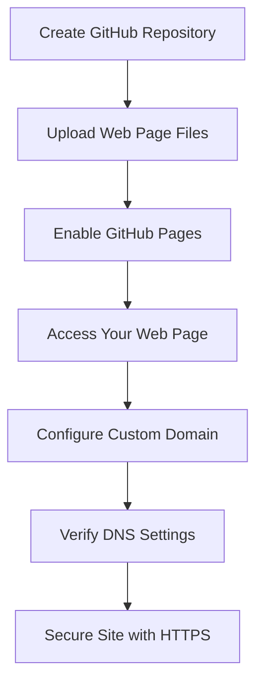

## 15.4 Deploying Your Web Page

Congratulations on building your first web page! Now, it's time to share your creation with the world by deploying it to the internet. In this section, we'll explore the various hosting options available, guide you through deploying a static site using GitHub Pages, discuss domain names and DNS settings, introduce FTP/SFTP for file transfers, and encourage securing your site with HTTPS.

### Understanding Hosting Options

Before deploying your web page, it's essential to understand the different hosting options available. Hosting is the service that allows your web page to be accessible on the internet. Here are some common hosting options:

#### Shared Hosting

Shared hosting is a cost-effective option where multiple websites share the same server resources. It's suitable for beginners and small websites with low traffic. Popular shared hosting providers include Bluehost, HostGator, and SiteGround.

**Pros:**
- Affordable pricing
- Easy to set up and manage
- Suitable for small websites

**Cons:**
- Limited resources and performance
- Less control over server settings
- Potential security risks due to shared environment

#### Cloud Hosting

Cloud hosting uses a network of virtual servers to host your website, providing scalability and flexibility. It's ideal for websites with variable traffic and resource needs. Popular cloud hosting providers include Amazon Web Services (AWS), Google Cloud Platform (GCP), and Microsoft Azure.

**Pros:**
- Scalable resources
- High availability and reliability
- Greater control over server settings

**Cons:**
- More complex setup and management
- Higher cost compared to shared hosting

#### Static Site Hosting

Static site hosting is specifically designed for hosting static websites, which consist of HTML, CSS, and JavaScript files. GitHub Pages, Netlify, and Vercel are popular options for hosting static sites.

**Pros:**
- Free or low-cost options
- Simple deployment process
- Fast loading times

**Cons:**
- Limited to static content
- May require additional configuration for dynamic features

### Deploying a Static Site Using GitHub Pages

GitHub Pages is a free service that allows you to host static websites directly from your GitHub repository. It's an excellent option for beginners and small projects. Let's walk through the process of deploying your web page using GitHub Pages.

#### Step 1: Create a GitHub Repository

1. **Sign Up for GitHub**: If you don't have a GitHub account, sign up at [github.com](https://github.com).

2. **Create a New Repository**: Click on the "New" button in the repositories section of your GitHub dashboard. Name your repository (e.g., `my-first-webpage`) and add a description. Ensure the repository is public and initialize it with a README file.

#### Step 2: Upload Your Web Page Files

1. **Clone the Repository**: Clone your repository to your local machine using Git. Open your terminal or command prompt and run the following command, replacing `username` and `repository-name` with your GitHub username and repository name:

   ```bash
   git clone https://github.com/username/repository-name.git
   ```

2. **Add Your Files**: Copy your HTML, CSS, and JavaScript files into the cloned repository folder on your local machine.

3. **Commit and Push Changes**: Navigate to the repository folder in your terminal and run the following commands to commit and push your changes to GitHub:

   ```bash
   git add .
   git commit -m "Add initial web page files"
   git push origin main
   ```

#### Step 3: Enable GitHub Pages

1. **Go to Repository Settings**: Navigate to your repository on GitHub and click on the "Settings" tab.

2. **Enable GitHub Pages**: Scroll down to the "GitHub Pages" section. Under "Source," select the branch you want to use for GitHub Pages (usually `main`) and click "Save."

3. **Access Your Web Page**: Once GitHub Pages is enabled, your web page will be available at `https://username.github.io/repository-name/`. It may take a few minutes for the page to become live.

### Domain Names and DNS Settings

While GitHub Pages provides a default URL for your web page, you may want to use a custom domain name for a more professional appearance. Let's explore how to set up a custom domain name and configure DNS settings.

#### Choosing a Domain Name

A domain name is the web address users will type into their browser to access your site. Consider the following tips when choosing a domain name:

- **Keep it Short and Memorable**: Choose a name that is easy to remember and type.
- **Use Keywords**: Include relevant keywords related to your website's content or purpose.
- **Avoid Numbers and Hyphens**: These can be confusing and hard to remember.

#### Registering a Domain Name

To register a domain name, you'll need to use a domain registrar. Popular registrars include GoDaddy, Namecheap, and Google Domains. Follow these steps to register a domain name:

1. **Search for Available Domains**: Use the registrar's search tool to find an available domain name.

2. **Register the Domain**: Once you've found an available domain, follow the registrar's instructions to complete the registration process.

3. **Configure DNS Settings**: After registering your domain, you'll need to configure DNS settings to point your domain to your GitHub Pages site.

#### Configuring DNS Settings

DNS (Domain Name System) settings control how your domain name is translated into an IP address. To configure DNS settings for GitHub Pages, follow these steps:

1. **Access DNS Settings**: Log in to your domain registrar's website and navigate to the DNS settings for your domain.

2. **Add CNAME Record**: Create a CNAME record that points your domain to `username.github.io`. This tells DNS to direct traffic to your GitHub Pages site.

3. **Verify DNS Configuration**: It may take a few hours for DNS changes to propagate. Once complete, your custom domain should direct users to your GitHub Pages site.

### Using FTP/SFTP for File Transfers

FTP (File Transfer Protocol) and SFTP (Secure File Transfer Protocol) are methods for transferring files between your local machine and a web server. While GitHub Pages doesn't require FTP/SFTP, understanding these protocols is useful for other hosting options.

#### Setting Up an FTP/SFTP Client

To transfer files using FTP/SFTP, you'll need an FTP/SFTP client. FileZilla and Cyberduck are popular options. Follow these steps to set up an FTP/SFTP client:

1. **Download and Install**: Download and install your chosen FTP/SFTP client from the official website.

2. **Connect to Your Server**: Open the client and enter your server's hostname, username, and password. For SFTP, ensure the port is set to 22.

3. **Transfer Files**: Once connected, you can drag and drop files between your local machine and the server.

#### Secure File Transfers with SFTP

SFTP is a secure version of FTP that encrypts data during transfer. Always use SFTP over FTP to protect your data and credentials.

### Securing Your Site with HTTPS

HTTPS (Hypertext Transfer Protocol Secure) encrypts data exchanged between your website and users, providing a secure browsing experience. Let's explore how to secure your site with HTTPS.

#### Why HTTPS Matters

- **Data Security**: Encrypts data to prevent interception by malicious actors.
- **Trust and Credibility**: Users are more likely to trust and engage with secure websites.
- **SEO Benefits**: Search engines prioritize secure sites in search results.

#### Enabling HTTPS on GitHub Pages

GitHub Pages supports HTTPS by default. To ensure HTTPS is enabled, follow these steps:

1. **Go to Repository Settings**: Navigate to your repository on GitHub and click on the "Settings" tab.

2. **Enable HTTPS**: In the "GitHub Pages" section, ensure the "Enforce HTTPS" option is checked.

3. **Verify HTTPS**: Access your site using `https://` to confirm HTTPS is enabled.

#### Obtaining an SSL Certificate

For other hosting options, you'll need an SSL certificate to enable HTTPS. Let's Encrypt is a free certificate authority that provides SSL certificates. Follow these steps to obtain an SSL certificate:

1. **Choose a Certificate Authority**: Visit [letsencrypt.org](https://letsencrypt.org) to learn more about Let's Encrypt.

2. **Install the Certificate**: Follow your hosting provider's instructions to install the SSL certificate on your server.

3. **Configure HTTPS**: Update your server settings to redirect HTTP traffic to HTTPS.

### Try It Yourself

Now that you've learned how to deploy your web page, try experimenting with different hosting options and configurations. Here are some suggestions:

- **Deploy to Netlify or Vercel**: Explore other static site hosting platforms and compare their features.
- **Experiment with DNS Settings**: Try setting up a subdomain or redirecting traffic to another site.
- **Secure a Different Site with HTTPS**: Practice obtaining and installing an SSL certificate on a different hosting platform.

### Visual Aids

To help you visualize the deployment process, here's a flowchart representing the steps involved in deploying a static site using GitHub Pages:



### Key Takeaways

- **Understand Hosting Options**: Choose the right hosting option based on your website's needs and budget.
- **Deploy with GitHub Pages**: Use GitHub Pages for easy and free static site hosting.
- **Configure Domain and DNS**: Set up a custom domain and configure DNS settings for a professional web presence.
- **Secure with HTTPS**: Protect your site and users by enabling HTTPS.

### Further Reading

For more information on deploying web pages and securing your site, check out these resources:

- [GitHub Pages Documentation](https://docs.github.com/en/pages)
- [Let's Encrypt Documentation](https://letsencrypt.org/docs/)
- [MDN Web Docs: Domain Name System (DNS)](https://developer.mozilla.org/en-US/docs/Glossary/DNS)

## Quiz Time!



### What is shared hosting?

- [x] A cost-effective option where multiple websites share the same server resources.
- [ ] A hosting service that uses a network of virtual servers.
- [ ] A hosting service specifically designed for dynamic websites.
- [ ] A method for transferring files between your local machine and a web server.

> **Explanation:** Shared hosting is a cost-effective option where multiple websites share the same server resources, suitable for beginners and small websites.

### Which of the following is a benefit of cloud hosting?

- [x] Scalable resources
- [ ] Limited resources and performance
- [ ] Less control over server settings
- [ ] Potential security risks due to shared environment

> **Explanation:** Cloud hosting provides scalable resources, making it ideal for websites with variable traffic and resource needs.

### What is the purpose of DNS settings?

- [x] To control how your domain name is translated into an IP address.
- [ ] To encrypt data exchanged between your website and users.
- [ ] To provide a secure browsing experience.
- [ ] To manage code changes and collaborate with others.

> **Explanation:** DNS settings control how your domain name is translated into an IP address, directing traffic to your website.

### What is the benefit of using SFTP over FTP?

- [x] SFTP encrypts data during transfer, providing secure file transfers.
- [ ] SFTP is faster than FTP.
- [ ] SFTP allows for more complex file structures.
- [ ] SFTP is a free service provided by GitHub.

> **Explanation:** SFTP encrypts data during transfer, providing secure file transfers and protecting your data and credentials.

### How can you enable HTTPS on GitHub Pages?

- [x] Ensure the "Enforce HTTPS" option is checked in the repository settings.
- [ ] Install an SSL certificate from Let's Encrypt.
- [ ] Configure DNS settings to redirect HTTP traffic to HTTPS.
- [ ] Use a custom domain name with HTTPS support.

> **Explanation:** To enable HTTPS on GitHub Pages, ensure the "Enforce HTTPS" option is checked in the repository settings.

### What is a CNAME record used for?

- [x] To point your domain to another domain, such as `username.github.io`.
- [ ] To encrypt data exchanged between your website and users.
- [ ] To manage code changes and collaborate with others.
- [ ] To provide a secure browsing experience.

> **Explanation:** A CNAME record is used to point your domain to another domain, such as `username.github.io`, directing traffic to your site.

### Which of the following is a popular FTP/SFTP client?

- [x] FileZilla
- [ ] GitHub Pages
- [ ] Let's Encrypt
- [ ] Google Domains

> **Explanation:** FileZilla is a popular FTP/SFTP client used for transferring files between your local machine and a web server.

### What is the primary purpose of HTTPS?

- [x] To encrypt data exchanged between your website and users.
- [ ] To manage code changes and collaborate with others.
- [ ] To control how your domain name is translated into an IP address.
- [ ] To provide a free hosting service for static websites.

> **Explanation:** The primary purpose of HTTPS is to encrypt data exchanged between your website and users, providing a secure browsing experience.

### What is the first step in deploying a static site using GitHub Pages?

- [x] Create a GitHub repository
- [ ] Upload your web page files
- [ ] Enable GitHub Pages
- [ ] Configure DNS settings

> **Explanation:** The first step in deploying a static site using GitHub Pages is to create a GitHub repository.

### True or False: GitHub Pages supports HTTPS by default.

- [x] True
- [ ] False

> **Explanation:** GitHub Pages supports HTTPS by default, providing a secure browsing experience for your site.


