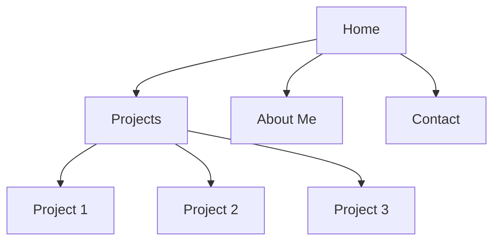

## 15.5 Building a Portfolio

In today's digital age, having an online presence is crucial for showcasing your skills and projects to potential employers or clients. A well-crafted portfolio can set you apart from the competition and demonstrate your capabilities as a web developer. In this section, we'll guide you through the process of building an effective portfolio, from design tips to content suggestions. Let's dive in!

### Why Build a Portfolio?

Before we get into the how, let's discuss the why. A portfolio serves several important purposes:

- **Demonstrates Your Skills**: Your portfolio is a tangible representation of your abilities. It shows what you can do, not just what you say you can do.
- **Showcases Your Work**: It provides a platform to display your best projects, highlighting your experience and expertise.
- **Establishes Your Online Presence**: In a world where digital presence is key, a portfolio helps you stand out and be found by potential employers or clients.
- **Reflects Your Personal Brand**: Your portfolio is a reflection of who you are as a developer. It communicates your style, personality, and professional ethos.

### Designing an Effective Portfolio Site

Designing your portfolio site is a critical step in the process. Here are some tips to help you create a site that is both visually appealing and functional:

#### 1. Keep It Simple and Clean

A clean, simple design ensures that your work takes center stage. Avoid clutter and unnecessary elements that can distract from your projects. Use whitespace effectively to create a sense of balance and focus.

#### 2. Make Navigation Intuitive

Your portfolio should be easy to navigate. Use clear, descriptive labels for your menu items and ensure that users can find what they're looking for without frustration. Consider using a sticky menu that remains visible as users scroll down the page.

#### 3. Use Responsive Design

Ensure your portfolio looks great on all devices, from desktops to smartphones. Use responsive design techniques, such as media queries, to adapt your layout to different screen sizes. This ensures a seamless experience for all users.

```css
/* Example of a simple media query for responsive design */
@media (max-width: 768px) {
  .portfolio-item {
    width: 100%;
    margin-bottom: 20px;
  }
}
```

#### 4. Highlight Your Unique Style

Your portfolio is an opportunity to express your unique style and personality. Choose a color scheme and typography that reflects who you are as a developer. However, ensure that your choices enhance readability and user experience.

### Content to Include in Your Portfolio

Now that you have a design in mind, let's talk about the content your portfolio should include:

#### 1. Projects

Your projects are the heart of your portfolio. Include a selection of your best work, showcasing a range of skills and technologies. For each project, provide:

- **A Brief Description**: Explain the project's purpose and your role in its development.
- **Technologies Used**: List the technologies and tools you used to build the project.
- **Screenshots or Demos**: Include visual elements to give visitors a sense of the project's look and feel.
- **Link to the Live Project or Code**: If possible, provide a link to the live project or its source code on a platform like GitHub.

```html
<!-- Example of a project section in HTML -->
<div class="project">
  <h3>Weather App</h3>
  <p>A simple weather application that displays current weather conditions for any city.</p>
  <ul>
    <li>JavaScript</li>
    <li>HTML/CSS</li>
    <li>OpenWeather API</li>
  </ul>
  
  <a href="https://github.com/yourusername/weather-app" target="_blank">View Code</a>
</div>
```

#### 2. Code Samples

Including code samples demonstrates your coding style and problem-solving skills. Choose snippets that highlight your proficiency in JavaScript and other relevant technologies. Ensure your code is well-commented and easy to understand.

```javascript
// Example of a simple JavaScript function
function calculateSum(a, b) {
  // Add two numbers and return the result
  return a + b;
}

// Try It Yourself: Modify the function to subtract the numbers instead
```

#### 3. Personal Bio

Your bio is an opportunity to introduce yourself to visitors. Keep it concise and engaging, highlighting your background, skills, and interests. Include a professional photo to add a personal touch.

```html
<!-- Example of a personal bio section in HTML -->
<div class="bio">
  
  <h2>About Me</h2>
  <p>Hello! I'm a passionate web developer with a love for creating dynamic and interactive web applications. With a background in computer science, I have experience in JavaScript, HTML, CSS, and various frameworks.</p>
</div>
```

#### 4. Contact Information

Make it easy for potential employers or clients to get in touch with you. Include your email address, LinkedIn profile, and any other relevant contact information. Consider adding a contact form for convenience.

```html
<!-- Example of a contact form in HTML -->
<form action="submit-form.php" method="post">
  <label for="name">Name:</label>
  <input type="text" id="name" name="name" required>
  
  <label for="email">Email:</label>
  <input type="email" id="email" name="email" required>
  
  <label for="message">Message:</label>
  <textarea id="message" name="message" required></textarea>
  
  <button type="submit">Send</button>
</form>
```

### Highlighting Unique Skills and Experiences

Your portfolio should reflect your unique skills and experiences. Here are some ways to do that:

#### 1. Include Testimonials or Reviews

If you've worked with clients or on collaborative projects, include testimonials or reviews. These provide social proof of your skills and professionalism.

#### 2. Showcase Diverse Projects

Demonstrate your versatility by including a variety of projects. This could include web applications, mobile apps, or even open-source contributions.

#### 3. Highlight Problem-Solving Skills

Include projects or code samples that showcase your ability to solve complex problems. Explain the challenges you faced and how you overcame them.

#### 4. Emphasize Continuous Learning

Show that you are committed to continuous learning by including recent projects or courses you've completed. This demonstrates your dedication to staying current in the field.

### Keeping Your Portfolio Updated

A portfolio is not a one-time project; it's a living document that should evolve with your career. Here are some tips for keeping it updated:

- **Regularly Add New Projects**: As you complete new projects, add them to your portfolio. This keeps your portfolio fresh and relevant.
- **Update Your Bio and Skills**: As you gain new skills or experiences, update your bio and skills section to reflect them.
- **Review and Revise Content**: Periodically review your portfolio to ensure all information is accurate and up-to-date.
- **Seek Feedback**: Ask peers or mentors to review your portfolio and provide feedback. Use their insights to make improvements.

### Visual Aids: Portfolio Structure

To help you visualize the structure of your portfolio, let's look at a simple diagram representing the layout of a typical portfolio site:



**Diagram Description**: This diagram illustrates a basic portfolio structure with a home page linking to sections for projects, about me, and contact information. Each project is a sub-section under the projects section.

### Try It Yourself: Portfolio Enhancements

Now that you have the basics, try enhancing your portfolio with these ideas:

- **Add a Blog**: Share your thoughts on web development, tutorials, or industry trends.
- **Incorporate Animations**: Use CSS animations to add subtle effects that enhance user experience.
- **Implement a Dark Mode**: Offer users the option to switch between light and dark themes.

### References and Links

For further reading and inspiration, check out these resources:

- [MDN Web Docs on Responsive Design](https://developer.mozilla.org/en-US/docs/Learn/CSS/CSS_layout/Responsive_Design)
- [W3Schools Portfolio Tutorial](https://www.w3schools.com/howto/howto_website_make_a_portfolio.asp)
- [GitHub Pages](https://pages.github.com/) - Host your portfolio for free

### Engagement and Reinforcement

To reinforce what you've learned, consider these exercises:

- **Exercise 1**: Create a new project and add it to your portfolio. Include a description, technologies used, and a link to the code.
- **Exercise 2**: Revise your personal bio to reflect any new skills or experiences.
- **Exercise 3**: Ask a peer to review your portfolio and provide feedback.

### Summary

Building a portfolio is a crucial step in establishing your online presence and showcasing your skills as a web developer. By following the tips and guidelines in this section, you can create a portfolio that effectively highlights your projects, skills, and unique qualities. Remember to keep it updated and seek feedback to continually improve.

## Quiz Time!



### Why is having an online portfolio important?

- [x] It demonstrates your skills and showcases your work.
- [ ] It is required by all employers.
- [ ] It guarantees a job offer.
- [ ] It replaces the need for a resume.

> **Explanation:** An online portfolio demonstrates your skills and showcases your work, making it an important tool for potential employers or clients.


### What is a key design principle for a portfolio site?

- [x] Keep it simple and clean.
- [ ] Use as many colors as possible.
- [ ] Include every project you've ever worked on.
- [ ] Avoid using whitespace.

> **Explanation:** Keeping the design simple and clean ensures that your work is the main focus and enhances user experience.


### What should be included in the project section of your portfolio?

- [x] A brief description, technologies used, screenshots, and a link to the code.
- [ ] Only the project name.
- [ ] Just a screenshot.
- [ ] A list of unrelated projects.

> **Explanation:** The project section should include a brief description, technologies used, screenshots, and a link to the code to provide a comprehensive overview.


### How can you make your portfolio responsive?

- [x] Use media queries to adapt the layout to different screen sizes.
- [ ] Use only fixed-width layouts.
- [ ] Ignore mobile users.
- [ ] Use large images for all devices.

> **Explanation:** Media queries allow you to adapt the layout to different screen sizes, ensuring a responsive design.


### What is a benefit of including testimonials in your portfolio?

- [x] They provide social proof of your skills and professionalism.
- [ ] They are required by law.
- [ ] They replace the need for a resume.
- [ ] They guarantee a job offer.

> **Explanation:** Testimonials provide social proof of your skills and professionalism, enhancing your credibility.


### Why should you keep your portfolio updated?

- [x] To ensure it reflects your current skills and projects.
- [ ] To avoid having to create a new one.
- [ ] To make it look busy.
- [ ] To confuse potential employers.

> **Explanation:** Keeping your portfolio updated ensures it reflects your current skills and projects, maintaining its relevance.


### What is a good way to express your unique style in your portfolio?

- [x] Choose a color scheme and typography that reflects your personality.
- [ ] Use every color available.
- [ ] Avoid using any design elements.
- [ ] Copy another developer's style.

> **Explanation:** Choosing a color scheme and typography that reflects your personality helps express your unique style.


### What is a recommended way to include contact information in your portfolio?

- [x] Include a contact form and relevant links.
- [ ] Only provide your phone number.
- [ ] Use a hidden link.
- [ ] Avoid providing any contact information.

> **Explanation:** Including a contact form and relevant links makes it easy for potential employers or clients to get in touch.


### What is the purpose of the "About Me" section in a portfolio?

- [x] To introduce yourself and highlight your background and skills.
- [ ] To list every job you've ever had.
- [ ] To provide personal anecdotes unrelated to work.
- [ ] To replace the need for a resume.

> **Explanation:** The "About Me" section introduces yourself and highlights your background and skills, providing context to your work.


### True or False: A portfolio is a one-time project that doesn't need updating.

- [ ] True
- [x] False

> **Explanation:** A portfolio is a living document that should be regularly updated to reflect your current skills and projects.


