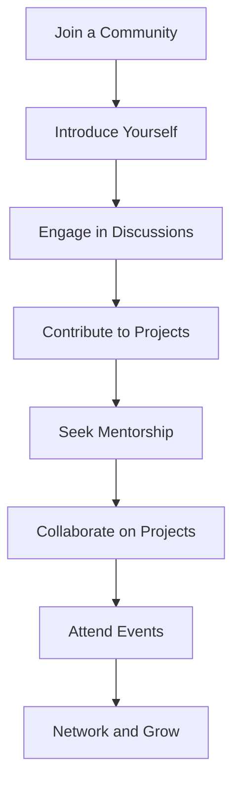

## 15.6 Joining Developer Communities

As you embark on your journey to build your first web page with JavaScript, you might find yourself facing challenges or seeking guidance. One of the most effective ways to overcome these hurdles and accelerate your learning is by joining developer communities. These communities are invaluable resources for beginners and experienced developers alike, offering support, mentorship, and opportunities for collaboration. In this section, we'll explore various platforms and strategies to help you connect with other developers, contribute positively to communities, and grow as a JavaScript developer.

### Why Join Developer Communities?

Before diving into the how-tos, let's first understand why joining developer communities is beneficial:

- **Support and Guidance**: Developer communities are filled with individuals who have been in your shoes. They can offer advice, answer questions, and provide solutions to problems you might encounter.
- **Networking Opportunities**: Building connections with other developers can open doors to job opportunities, collaborations, and partnerships.
- **Mentorship**: Many experienced developers are willing to mentor newcomers, offering insights and guidance that can accelerate your learning.
- **Collaboration**: Working on projects with others can enhance your skills, introduce you to new tools and techniques, and make learning more enjoyable.
- **Staying Updated**: Communities are often the first to discuss new trends, tools, and technologies, helping you stay ahead in the fast-evolving world of web development.

### Platforms to Engage with Developers

There are numerous platforms where you can connect with other developers. Each has its unique culture and focus, so it's worth exploring several to find the ones that best suit your needs.

#### 1. Stack Overflow

**Stack Overflow** is a question-and-answer site for programmers. It's an excellent place to ask specific technical questions and get answers from experienced developers. Here's how to make the most of it:

- **Search Before Asking**: Many questions have already been answered. Use the search function to find existing solutions.
- **Ask Clear Questions**: When asking a question, provide as much detail as possible, including code snippets and error messages.
- **Contribute by Answering**: If you know the answer to a question, don't hesitate to contribute. It's a great way to reinforce your knowledge and help others.

#### 2. Reddit

**Reddit** is a social news aggregation and discussion website with numerous subreddits dedicated to programming and web development. Some popular subreddits include:

- **r/learnprogramming**: A place for beginners to ask questions and share resources.
- **r/javascript**: A community focused on JavaScript discussions, news, and projects.
- **r/webdev**: A subreddit for web developers to discuss all things related to web development.

Engage by participating in discussions, sharing your projects, and asking for feedback.

#### 3. Discord

**Discord** is a voice, video, and text communication platform popular among developers. Many programming communities have Discord servers where you can chat in real-time with other developers. Benefits of using Discord include:

- **Real-Time Communication**: Get instant feedback and engage in live discussions.
- **Community Events**: Participate in coding challenges, webinars, and workshops.
- **Networking**: Connect with developers from around the world.

#### 4. GitHub

**GitHub** is a platform for version control and collaboration. It's not only a place to host your code but also a community where developers collaborate on open-source projects. Here's how to engage:

- **Explore Open Source Projects**: Find projects that interest you and contribute by fixing bugs, adding features, or improving documentation.
- **Follow Developers**: Learn from experienced developers by following their work and contributions.
- **Share Your Projects**: Showcase your work and get feedback from the community.

#### 5. Local Meetups and Conferences

While online communities are invaluable, don't underestimate the power of face-to-face interactions. Local meetups and conferences offer opportunities to network, learn, and collaborate. Here's how to get involved:

- **Attend Meetups**: Use platforms like Meetup.com to find local developer meetups. These events often feature talks, workshops, and networking sessions.
- **Participate in Hackathons**: Hackathons are events where developers collaborate intensively on projects. They're a great way to learn, network, and have fun.
- **Volunteer or Speak**: Offer to volunteer at events or, if you're comfortable, present a talk. It's a great way to give back to the community and build your reputation.

### Benefits of Networking and Mentorship

Networking and mentorship are two of the most significant benefits of joining developer communities. Let's explore how they can impact your development journey:

#### Networking

- **Job Opportunities**: Many job openings are filled through referrals. Networking increases your chances of being recommended for positions.
- **Collaboration**: Meeting other developers can lead to collaborations on projects, which can enhance your skills and portfolio.
- **Learning from Others**: Networking exposes you to different perspectives and experiences, broadening your understanding of web development.

#### Mentorship

- **Guidance and Support**: A mentor can provide personalized advice, helping you navigate challenges and make informed decisions.
- **Skill Development**: Mentors can introduce you to new tools, techniques, and best practices, accelerating your learning.
- **Confidence Building**: Having someone believe in your potential can boost your confidence and motivation.

### Contributing Positively to Communities

Being a part of a community is not just about taking; it's also about giving back. Here are some ways to contribute positively:

- **Be Respectful and Inclusive**: Treat others with respect and be inclusive of diverse perspectives and backgrounds.
- **Share Your Knowledge**: Whether it's answering questions, writing tutorials, or giving talks, sharing your knowledge helps others and reinforces your learning.
- **Provide Constructive Feedback**: When reviewing others' work, offer constructive feedback that helps them improve.
- **Be Patient and Understanding**: Remember that everyone is at a different stage in their learning journey. Be patient with beginners and offer encouragement.

### Opportunities for Collaboration and Learning

Developer communities offer numerous opportunities for collaboration and learning. Here are some ways to take advantage of these opportunities:

- **Pair Programming**: Partner with another developer to work on a project. This collaborative approach can enhance problem-solving skills and introduce you to new techniques.
- **Open Source Contributions**: Contributing to open-source projects is a great way to collaborate with others and learn from experienced developers.
- **Coding Challenges**: Participate in coding challenges or competitions to test your skills and learn new concepts.
- **Workshops and Webinars**: Attend workshops and webinars to learn from experts and engage with other participants.

### Try It Yourself: Engaging with a Developer Community

To get started, choose one of the platforms mentioned above and create an account if you haven't already. Here are some steps to guide you:

1. **Join a Community**: Select a platform that interests you, such as Stack Overflow, Reddit, or Discord, and join a relevant community or group.
2. **Introduce Yourself**: Write a brief introduction about yourself, your interests, and what you hope to learn or achieve.
3. **Engage in Discussions**: Participate in discussions by asking questions, sharing your experiences, or offering help to others.
4. **Contribute to a Project**: Explore open-source projects on GitHub and find one where you can contribute, whether it's fixing a bug, adding a feature, or improving documentation.

### Visualizing Community Engagement

To help you visualize how engaging with developer communities can enhance your learning and growth, let's look at a flowchart that outlines the process:

**Description**: This flowchart illustrates the steps to engage with developer communities, starting from joining a community to networking and growing as a developer.

### References and Links

To further explore the topics discussed in this section, here are some reputable resources:

- [Stack Overflow](https://stackoverflow.com/)
- [Reddit Programming Subreddits](https://www.reddit.com/r/programming/)
- [Discord Developer Communities](https://discord.com/)
- [GitHub Open Source Projects](https://github.com/)
- [Meetup.com](https://www.meetup.com/)

### Engagement and Reinforcement

To reinforce your understanding of the importance of joining developer communities, consider these questions:

- How can networking with other developers benefit your career?
- What are some ways you can contribute positively to a community?
- How can mentorship accelerate your learning and development?

### Summary

Joining developer communities is a crucial step in your journey as a JavaScript developer. These communities offer support, mentorship, and opportunities for collaboration, helping you grow both personally and professionally. By engaging with platforms like Stack Overflow, Reddit, Discord, and GitHub, attending local meetups, and contributing positively, you'll build valuable connections and enhance your skills. Remember, the key to thriving in these communities is to be respectful, inclusive, and willing to give back.

## Quiz Time!



### What is one of the main benefits of joining developer communities?

- [x] Networking opportunities
- [ ] Guaranteed job offers
- [ ] Free coding courses
- [ ] Unlimited access to premium tools

> **Explanation:** Developer communities provide networking opportunities, which can lead to job referrals and collaborations.

### Which platform is known for its question-and-answer format for programmers?

- [x] Stack Overflow
- [ ] Reddit
- [ ] Discord
- [ ] GitHub

> **Explanation:** Stack Overflow is a popular question-and-answer site for programmers.

### What is a common way to contribute to GitHub?

- [x] Fixing bugs in open-source projects
- [ ] Posting memes
- [ ] Writing personal blogs
- [ ] Uploading videos

> **Explanation:** Contributing to open-source projects by fixing bugs is a common way to engage on GitHub.

### What should you do before asking a question on Stack Overflow?

- [x] Search for existing answers
- [ ] Post without checking
- [ ] Ask multiple questions at once
- [ ] Ignore the guidelines

> **Explanation:** It's important to search for existing answers before asking a question to avoid duplicates.

### How can you engage with local developer communities?

- [x] Attend meetups and hackathons
- [ ] Only participate online
- [ ] Avoid face-to-face interactions
- [ ] Focus solely on personal projects

> **Explanation:** Attending meetups and hackathons is a great way to engage with local developer communities.

### What is an advantage of having a mentor?

- [x] Personalized guidance and support
- [ ] Guaranteed job placement
- [ ] Free access to all programming tools
- [ ] Automatic skill acquisition

> **Explanation:** Mentors provide personalized guidance and support, helping you navigate challenges.

### Which platform allows real-time communication with other developers?

- [x] Discord
- [ ] Stack Overflow
- [ ] Reddit
- [ ] GitHub

> **Explanation:** Discord is known for real-time communication through voice, video, and text.

### What is a way to contribute positively to a community?

- [x] Share your knowledge and help others
- [ ] Criticize others' work harshly
- [ ] Focus only on personal gain
- [ ] Avoid participating in discussions

> **Explanation:** Sharing your knowledge and helping others is a positive way to contribute to a community.

### What is pair programming?

- [x] Collaborating with another developer on a project
- [ ] Writing code alone
- [ ] Competing against another developer
- [ ] Teaching a class

> **Explanation:** Pair programming involves collaborating with another developer on a project.

### True or False: Networking can lead to job opportunities.

- [x] True
- [ ] False

> **Explanation:** Networking can lead to job opportunities through referrals and connections.


