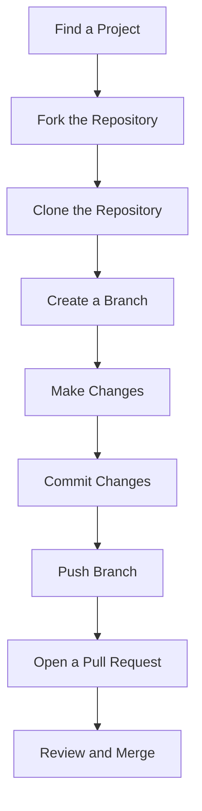

## 15.7 Contributing to Open Source Projects

In this section, we'll explore the world of open-source software and how you, as a budding JavaScript developer, can contribute to these projects. Contributing to open source is not only a fantastic way to improve your skills but also a means to give back to the community and collaborate with developers worldwide.

### Understanding Open Source Software

**Open-source software (OSS)** refers to software whose source code is made available to the public for use, modification, and distribution. This model promotes collaboration and transparency, allowing developers to contribute to and improve software collectively. Some well-known examples of open-source projects include Linux, Mozilla Firefox, and the Apache HTTP Server.

#### Significance of Open Source

1. **Community Collaboration**: Open source thrives on community contributions, bringing together diverse perspectives and expertise.
2. **Transparency**: Anyone can inspect, modify, and enhance the code, leading to more secure and reliable software.
3. **Innovation**: Open-source projects often drive technological advancements by allowing developers to experiment and innovate freely.
4. **Learning and Growth**: Contributing to open source is an excellent way to learn from experienced developers and improve your coding skills.

### Finding Projects to Contribute To

Before diving into contributions, it's crucial to find a project that aligns with your interests and skill level. Here are some steps to help you get started:

#### 1. Identify Your Interests

Consider the types of projects that excite you. Are you interested in web development, data visualization, or perhaps game development? Identifying your interests will help you find projects that you are passionate about.

#### 2. Explore Platforms

Several platforms host open-source projects, with GitHub being the most popular. Other platforms include GitLab and Bitbucket. These platforms allow you to search for projects based on language, topic, or popularity.

#### 3. Use Search Filters

On GitHub, you can use search filters to narrow down projects. For example, you can search for JavaScript projects by using the filter `language:JavaScript`. You can also look for projects labeled as "good first issue" or "help wanted," which are often beginner-friendly.

#### 4. Evaluate Project Activity

When choosing a project, consider its activity level. Active projects with recent commits and responsive maintainers are more likely to provide a supportive environment for new contributors.

#### 5. Read the Documentation

Before contributing, read the project's documentation, including the README, CONTRIBUTING guide, and code of conduct. This will give you a sense of the project's goals, contribution process, and community expectations.

### Making Contributions

Once you've found a project you'd like to contribute to, it's time to make your first contribution. Here's a step-by-step guide:

#### 1. Fork the Repository

Forking a repository creates a personal copy of the project on your GitHub account. This allows you to make changes without affecting the original project.

```bash
# Clone your fork to your local machine
git clone https://github.com/your-username/project-name.git
```

#### 2. Create a Branch

Create a new branch for your changes. This keeps your work organized and makes it easier for maintainers to review your contributions.

```bash
cd project-name

git checkout -b feature/your-feature-name
```

#### 3. Make Your Changes

Now, it's time to make your changes. Whether you're fixing a bug, adding a feature, or improving documentation, ensure your changes align with the project's guidelines.

```javascript
// Example: Fixing a bug in a JavaScript file
function add(a, b) {
  return a + b;
}

// Test your changes to ensure they work as expected
console.log(add(2, 3)); // Expected output: 5
```

#### 4. Commit Your Changes

Once you're satisfied with your changes, commit them with a descriptive message.

```bash
git add .

git commit -m "Fix: Corrected addition function to return the correct sum"
```

#### 5. Push Your Branch

Push your branch to your GitHub repository.

```bash
git push origin feature/your-feature-name
```

#### 6. Open a Pull Request

Navigate to the original repository on GitHub and open a pull request. Provide a clear description of your changes and reference any related issues.

### Learning Opportunities and Community Impact

Contributing to open source offers numerous learning opportunities:

1. **Code Review**: Your contributions will be reviewed by experienced developers, providing valuable feedback and insights.
2. **Problem-Solving**: You'll encounter real-world problems, enhancing your problem-solving skills.
3. **Networking**: Engaging with the open-source community allows you to connect with developers worldwide, expanding your professional network.
4. **Portfolio Building**: Contributions to open-source projects can be showcased in your portfolio, demonstrating your skills and commitment to potential employers.

### Encouraging Persistence and Open Communication

Contributing to open source can be challenging, especially for beginners. Here are some tips to help you succeed:

1. **Be Patient**: Contributions may take time to be reviewed and merged. Be patient and open to feedback.
2. **Communicate Clearly**: Engage with project maintainers and other contributors through comments, issues, and pull requests. Clear communication is key to successful collaboration.
3. **Start Small**: Begin with small contributions, such as fixing typos or improving documentation, before tackling more complex issues.
4. **Seek Help**: Don't hesitate to ask for help if you're stuck. The open-source community is generally supportive and willing to assist newcomers.

### Try It Yourself

Now that you've learned the basics of contributing to open source, it's time to try it yourself. Here are some suggestions to get started:

- **Find a Beginner-Friendly Project**: Use GitHub's "good first issue" label to find projects that welcome new contributors.
- **Improve Documentation**: Look for projects with outdated or incomplete documentation and offer to update it.
- **Fix a Bug**: Identify a small bug in a project and submit a fix.
- **Add a Feature**: Propose and implement a new feature that aligns with the project's goals.

### Visual Aids

To help visualize the process of contributing to open source, here's a flowchart illustrating the steps involved:



### References and Links

For further reading and resources on contributing to open source, consider the following:

- [GitHub Guide to Open Source](https://opensource.guide/)
- [First Contributions](https://firstcontributions.github.io/)
- [How to Contribute to Open Source](https://opensource.guide/how-to-contribute/)

### Engagement and Reinforcement

To reinforce your learning, consider these questions and challenges:

- **What is the significance of open-source software?**
- **How can you find projects to contribute to?**
- **What are the steps involved in making a contribution?**

### Summary

Contributing to open source is a rewarding experience that offers numerous benefits, from skill development to community engagement. By following the steps outlined in this guide, you'll be well on your way to making meaningful contributions to the open-source community.

---

## Quiz Time!



### What is open-source software?

- [x] Software with publicly available source code for modification and distribution
- [ ] Software that is free to use but not to modify
- [ ] Software that is only available to a select group of developers
- [ ] Software that requires a license fee for usage

> **Explanation:** Open-source software is characterized by its publicly accessible source code, allowing anyone to modify and distribute it.

### Which platform is most popular for hosting open-source projects?

- [x] GitHub
- [ ] GitLab
- [ ] Bitbucket
- [ ] SourceForge

> **Explanation:** GitHub is the most popular platform for hosting open-source projects, providing tools for collaboration and version control.

### What is the first step in contributing to an open-source project?

- [x] Forking the repository
- [ ] Creating a branch
- [ ] Making changes
- [ ] Opening a pull request

> **Explanation:** Forking the repository is the first step, creating a personal copy of the project for you to work on.

### What should you do before making changes to a project?

- [x] Create a new branch
- [ ] Open a pull request
- [ ] Push your changes
- [ ] Delete the original repository

> **Explanation:** Creating a new branch allows you to organize your changes separately from the main codebase.

### How can you find beginner-friendly issues to work on?

- [x] Look for labels like "good first issue" or "help wanted"
- [ ] Search for the most popular projects
- [ ] Only work on projects with no issues
- [ ] Choose projects with the most contributors

> **Explanation:** Labels like "good first issue" or "help wanted" indicate issues that are suitable for beginners.

### What is a pull request?

- [x] A request to merge your changes into the original repository
- [ ] A request to delete a branch
- [ ] A request to fork a repository
- [ ] A request to create a new issue

> **Explanation:** A pull request is a request to merge your changes into the original repository, allowing maintainers to review and approve them.

### Why is open communication important in open-source contributions?

- [x] It ensures clear understanding and collaboration
- [ ] It allows you to bypass project guidelines
- [ ] It helps you avoid making any changes
- [ ] It reduces the need for documentation

> **Explanation:** Open communication ensures that contributors and maintainers understand each other, facilitating effective collaboration.

### What is the benefit of starting with small contributions?

- [x] It helps you learn the process without being overwhelmed
- [ ] It guarantees your changes will be accepted
- [ ] It allows you to skip the review process
- [ ] It enables you to work on multiple projects simultaneously

> **Explanation:** Starting with small contributions helps you learn the contribution process gradually, building confidence and understanding.

### What should you do if you're stuck while contributing?

- [x] Ask for help from the community
- [ ] Abandon the project
- [ ] Make random changes until it works
- [ ] Delete your fork

> **Explanation:** Asking for help from the community is encouraged, as open-source communities are generally supportive and willing to assist.

### True or False: Contributing to open source can help build your professional network.

- [x] True
- [ ] False

> **Explanation:** True. Engaging with the open-source community allows you to connect with developers worldwide, expanding your professional network.


