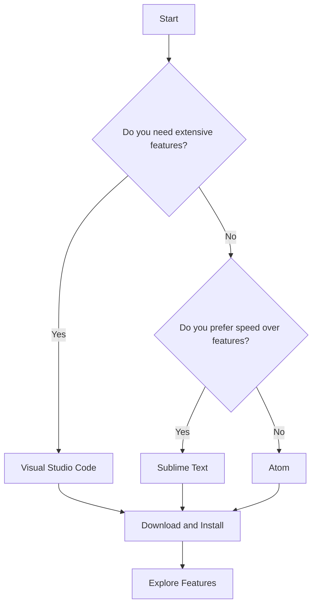

## 2.1 Choosing a Text Editor or IDE

Embarking on your journey to build your first web page with JavaScript requires the right tools to write and manage your code efficiently. A text editor or Integrated Development Environment (IDE) is essential for coding, as it provides the interface where you'll write, edit, and organize your code. In this section, we'll explore some popular text editors and IDEs that are particularly suitable for beginners: Visual Studio Code, Sublime Text, and Atom. We'll compare their features, discuss their pros and cons, and guide you in choosing the one that best fits your needs.

### Why a Text Editor or IDE is Essential for Coding

Before diving into specific tools, let's understand why a text editor or an IDE is crucial for coding:

1. **Syntax Highlighting**: This feature color-codes your code, making it easier to read and spot errors.
2. **Code Completion**: Many editors offer suggestions as you type, speeding up coding and reducing errors.
3. **Error Detection**: Editors can highlight syntax errors in real-time, helping you fix issues as you code.
4. **Project Management**: Organize your files and folders efficiently within the editor.
5. **Plugins and Extensions**: Enhance functionality with additional tools tailored to your needs.
6. **Version Control**: Some IDEs integrate with version control systems like Git, allowing you to track changes.

### Visual Studio Code (VSCode)

Visual Studio Code, commonly referred to as VSCode, is a free, open-source code editor developed by Microsoft. It's renowned for its versatility and extensive range of features, making it a favorite among developers of all levels.

#### Key Features

- **IntelliSense**: Offers smart completions based on variable types, function definitions, and imported modules.
- **Built-in Git**: Seamless integration with Git for version control.
- **Extensions Marketplace**: Thousands of extensions available to enhance functionality, including themes, debuggers, and language support.
- **Integrated Terminal**: Access the command line directly within the editor.
- **Debugging Tools**: Powerful debugging capabilities for various languages.

#### Pros and Cons

**Pros:**

- Highly customizable with themes and extensions.
- Strong community support and regular updates.
- Lightweight and fast performance.

**Cons:**

- Can be overwhelming for absolute beginners due to its many features.
- Some extensions may slow down performance if not managed properly.

#### Getting Started with VSCode

To download and install Visual Studio Code, visit the [official website](https://code.visualstudio.com/). Here, you'll find installation instructions for Windows, macOS, and Linux. Once installed, explore the Extensions Marketplace to add tools that suit your development needs.

### Sublime Text

Sublime Text is a sophisticated text editor for code, markup, and prose. It's known for its speed and simplicity, making it an excellent choice for beginners who want a straightforward coding experience.

#### Key Features

- **Goto Anything**: Quickly navigate to files, symbols, or lines with a few keystrokes.
- **Multiple Selections**: Make ten changes at the same time, not one change ten times.
- **Command Palette**: Access frequently used functions without navigating menus.
- **Split Editing**: Edit files side by side or edit two locations in a single file.

#### Pros and Cons

**Pros:**

- Extremely fast and responsive.
- Minimalistic interface that reduces distractions.
- Supports a wide range of programming languages.

**Cons:**

- Some advanced features require a paid license.
- Fewer built-in features compared to IDEs like VSCode.

#### Getting Started with Sublime Text

Download Sublime Text from the [official website](https://www.sublimetext.com/). It's available for Windows, macOS, and Linux. While Sublime Text is free to use, purchasing a license is encouraged for continued use.

### Atom

Atom is a free, open-source text editor developed by GitHub. It's designed to be hackable, allowing users to customize it to their liking. Atom is particularly popular among developers who appreciate its flexibility and community-driven development.

#### Key Features

- **Built-in Package Manager**: Install new packages or create your own.
- **Smart Autocompletion**: Helps you write code faster with intelligent suggestions.
- **File System Browser**: Easily browse and open files and projects.
- **Teletype for Atom**: Collaborate with other developers in real-time.

#### Pros and Cons

**Pros:**

- Highly customizable with a vast library of community packages.
- Strong integration with Git and GitHub.
- User-friendly interface suitable for beginners.

**Cons:**

- Can be slower than other editors, especially with many packages installed.
- Some users report performance issues with large projects.

#### Getting Started with Atom

Visit the [Atom website](https://atom.io/) to download the editor for your operating system. Once installed, explore the package manager to find and install packages that enhance your coding experience.

### Comparing Text Editors and IDEs

Let's summarize the key differences between these editors in a table for easy comparison:

| Feature                | Visual Studio Code | Sublime Text | Atom         |
|------------------------|--------------------|--------------|--------------|
| **Price**              | Free               | Free (Paid License) | Free       |
| **Customization**      | Extensive          | Moderate     | Extensive    |
| **Performance**        | Fast               | Very Fast    | Moderate     |
| **Community Support**  | Strong             | Moderate     | Strong       |
| **Built-in Features**  | Extensive          | Minimal      | Moderate     |
| **Ease of Use**        | Moderate           | Easy         | Easy         |

### Choosing the Right Editor for You

When selecting a text editor or IDE, consider the following factors:

- **Ease of Use**: If you're an absolute beginner, you might prefer a simpler interface like Sublime Text.
- **Features**: If you want more built-in tools and customization options, Visual Studio Code or Atom might be better choices.
- **Performance**: Consider how the editor performs on your machine, especially if you plan to work with large projects.
- **Community and Support**: A strong community can be invaluable for finding solutions and learning new tips.

Ultimately, the best editor is the one that feels right for you. Don't hesitate to try out a few different options to see which one you prefer.

### Try It Yourself

Now that we've covered the basics of choosing a text editor or IDE, it's time to try them out. Download one of the editors mentioned above and explore its features. Here are some suggestions to get started:

- **Experiment with Syntax Highlighting**: Open a JavaScript file and observe how the editor highlights different parts of the code.
- **Test Code Completion**: Start typing a JavaScript function and see how the editor suggests completions.
- **Explore Extensions or Packages**: If you're using VSCode or Atom, browse the extensions or packages available and install one that interests you.

### Visual Aids

To help visualize the differences and features of each editor, let's use a simple flowchart to represent the decision-making process when choosing an editor:

This flowchart illustrates a basic decision-making process based on your preferences for features and speed.

### References and Links

For further reading and resources, check out the following links:

- [Visual Studio Code Documentation](https://code.visualstudio.com/docs)
- [Sublime Text Documentation](https://www.sublimetext.com/docs/)
- [Atom Documentation](https://flight-manual.atom.io/)

### Engagement and Reinforcement

To reinforce your understanding, consider the following questions:

- What features are most important to you in a text editor?
- How does the community support of an editor impact your choice?
- What are some potential drawbacks of using a highly customizable editor?

### Summary

In this section, we've explored the importance of choosing the right text editor or IDE for your web development journey. We've introduced Visual Studio Code, Sublime Text, and Atom, highlighting their key features, pros, and cons. By considering your preferences and needs, you can select the editor that will best support your learning and development process.

## Quiz Time!



### Which feature is common to all text editors discussed?

- [x] Syntax Highlighting
- [ ] Built-in Git Integration
- [ ] Real-time Collaboration
- [ ] Extensive Debugging Tools

> **Explanation:** All the discussed text editors offer syntax highlighting, which is essential for coding.

### What is a key advantage of using Visual Studio Code?

- [x] Extensive customization with extensions
- [ ] Minimalistic interface
- [ ] Requires a paid license
- [ ] Limited community support

> **Explanation:** Visual Studio Code is known for its extensive customization options through a wide range of extensions.

### Which text editor is known for its speed and simplicity?

- [ ] Atom
- [x] Sublime Text
- [ ] Visual Studio Code
- [ ] Notepad++

> **Explanation:** Sublime Text is renowned for its speed and simplicity, making it a favorite for those who prefer a lightweight editor.

### What is a potential downside of Atom?

- [ ] Lack of customization
- [ ] Requires a paid license
- [x] Performance issues with large projects
- [ ] No community support

> **Explanation:** Atom can experience performance issues, especially when dealing with large projects.

### Which editor is developed by Microsoft?

- [x] Visual Studio Code
- [ ] Sublime Text
- [ ] Atom
- [ ] Notepad++

> **Explanation:** Visual Studio Code is developed by Microsoft and is widely used in the developer community.

### What is a common feature of IDEs that text editors may lack?

- [x] Integrated debugging tools
- [ ] Syntax highlighting
- [ ] Code completion
- [ ] File browsing

> **Explanation:** IDEs often include integrated debugging tools, which are not always present in basic text editors.

### Which editor is known for its hackability and community-driven development?

- [ ] Visual Studio Code
- [ ] Sublime Text
- [x] Atom
- [ ] Notepad++

> **Explanation:** Atom is known for its hackability, allowing users to customize it extensively, and is supported by a strong community.

### What is the primary function of a text editor or IDE?

- [x] To write and manage code efficiently
- [ ] To compile code
- [ ] To host websites
- [ ] To design graphics

> **Explanation:** The primary function of a text editor or IDE is to provide an environment for writing and managing code efficiently.

### Which feature helps in organizing files and folders within an editor?

- [x] Project Management
- [ ] Syntax Highlighting
- [ ] Code Completion
- [ ] Real-time Collaboration

> **Explanation:** Project management features in editors help organize files and folders efficiently.

### True or False: Sublime Text requires a paid license for all features.

- [ ] True
- [x] False

> **Explanation:** Sublime Text is free to use, but purchasing a license is encouraged for continued use and access to advanced features.


