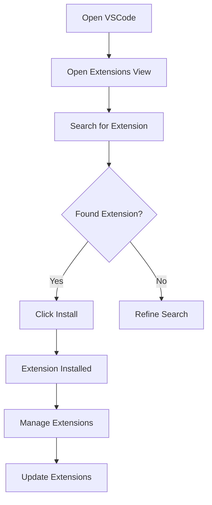

## 2.3 Enhancing VSCode with Extensions

Visual Studio Code (VSCode) is a powerful and versatile code editor that can be customized to suit your development needs. One of the most compelling features of VSCode is its extensibility through extensions. These extensions can significantly enhance your productivity and streamline your workflow, especially when working with HTML, CSS, and JavaScript. In this section, we will explore some essential extensions that will help you build your first web page more efficiently.

### Why Use Extensions?

Before we dive into specific extensions, let's understand why they are beneficial:

- **Increased Productivity**: Extensions automate repetitive tasks, provide code snippets, and offer real-time feedback, allowing you to focus on writing code.
- **Error Reduction**: With linters and formatters, you can catch errors early and maintain a consistent coding style.
- **Enhanced Features**: Extensions can add new features to VSCode, such as live previews, version control integration, and more.
- **Customization**: Tailor your development environment to fit your workflow and preferences.

### Installing and Managing Extensions in VSCode

Let's start by learning how to install and manage extensions in VSCode. Follow these steps:

1. **Open the Extensions View**: Launch VSCode and click on the Extensions icon in the Activity Bar on the side of the window, or press `Ctrl+Shift+X` (Windows/Linux) or `Cmd+Shift+X` (Mac).

2. **Search for Extensions**: In the Extensions view, you can search for extensions by typing keywords into the search bar. For example, type "Live Server" to find the Live Server extension.

3. **Install Extensions**: Once you find the desired extension, click the "Install" button. The extension will be downloaded and installed automatically.

4. **Manage Installed Extensions**: You can view all installed extensions by clicking on the "Installed" tab. From here, you can disable, uninstall, or configure extensions as needed.

5. **Update Extensions**: VSCode will notify you when updates are available for your extensions. It's a good practice to keep them updated to benefit from the latest features and bug fixes.

### Essential Extensions for HTML, CSS, and JavaScript Development

Now that you know how to install and manage extensions, let's explore some must-have extensions for web development.

#### 1. Live Server

**Description**: Live Server is a popular extension that launches a local development server with a live reload feature. It allows you to see changes in your HTML, CSS, and JavaScript files in real-time without manually refreshing the browser.

**Benefits**:
- **Real-Time Preview**: Instantly see the effects of your code changes in the browser.
- **Automatic Reload**: Automatically reloads the page when you save changes to your files.
- **Convenience**: Simplifies the development process by eliminating the need to switch between VSCode and the browser.

**Installation**:
1. Open the Extensions view in VSCode.
2. Search for "Live Server".
3. Click "Install".

**Usage**:
- Right-click on your HTML file and select "Open with Live Server".
- Your default browser will open with a live preview of your web page.

#### 2. ESLint

**Description**: ESLint is a powerful linter for JavaScript and TypeScript. It helps you find and fix problems in your code by analyzing it for syntax errors, style issues, and potential bugs.

**Benefits**:
- **Error Detection**: Identifies syntax errors and potential issues in your code.
- **Code Consistency**: Enforces coding standards and best practices.
- **Customizable**: Configure ESLint to match your project's coding style.

**Installation**:
1. Open the Extensions view in VSCode.
2. Search for "ESLint".
3. Click "Install".

**Usage**:
- ESLint will automatically analyze your JavaScript files and highlight issues.
- You can configure ESLint rules by creating an `.eslintrc` file in your project.

#### 3. Prettier

**Description**: Prettier is an opinionated code formatter that supports many languages, including JavaScript, HTML, and CSS. It enforces a consistent code style by automatically formatting your code.

**Benefits**:
- **Consistent Formatting**: Ensures your code looks the same across your project.
- **Time-Saving**: Automatically formats your code on save, reducing manual formatting.
- **Supports Multiple Languages**: Works with JavaScript, HTML, CSS, and more.

**Installation**:
1. Open the Extensions view in VSCode.
2. Search for "Prettier - Code formatter".
3. Click "Install".

**Usage**:
- Prettier will format your code automatically when you save your files.
- You can configure Prettier settings in a `.prettierrc` file.

#### 4. HTML CSS Support

**Description**: This extension enhances VSCode's built-in support for HTML and CSS. It provides IntelliSense and validation for CSS class names and IDs in your HTML files.

**Benefits**:
- **Improved IntelliSense**: Offers suggestions for CSS class names and IDs as you type in HTML files.
- **Validation**: Checks for missing or incorrect class names and IDs.
- **Seamless Integration**: Works with existing HTML and CSS files without additional configuration.

**Installation**:
1. Open the Extensions view in VSCode.
2. Search for "HTML CSS Support".
3. Click "Install".

**Usage**:
- Start typing a class name in your HTML file, and you'll see suggestions based on your CSS files.

#### 5. JavaScript (ES6) Code Snippets

**Description**: This extension provides a collection of JavaScript code snippets for ES6 syntax. It helps you write JavaScript code faster by offering shortcuts for common patterns.

**Benefits**:
- **Faster Coding**: Quickly insert common JavaScript patterns with snippets.
- **ES6 Support**: Includes snippets for modern JavaScript features like arrow functions, destructuring, and more.
- **Customizable**: Add your own snippets or modify existing ones.

**Installation**:
1. Open the Extensions view in VSCode.
2. Search for "JavaScript (ES6) code snippets".
3. Click "Install".

**Usage**:
- Type a snippet prefix (e.g., `clg` for `console.log`) and press `Tab` to insert the snippet.

### Exploring Additional Extensions

While the extensions mentioned above are essential for web development, there are many more available in the VSCode marketplace. Here are a few additional extensions you might find useful:

- **Path Intellisense**: Provides path autocompletion for files in your project.
- **Bracket Pair Colorizer**: Colors matching brackets to make it easier to identify code blocks.
- **GitLens**: Enhances Git capabilities in VSCode with features like blame annotations and code lens.
- **Debugger for Chrome**: Allows you to debug JavaScript code running in the Chrome browser directly from VSCode.

### Try It Yourself

Now that you're familiar with some essential extensions, let's try installing and using them in your VSCode setup. Follow these steps:

1. **Install Live Server**: Open the Extensions view, search for "Live Server", and click "Install". Open an HTML file and start the live server to see real-time changes.

2. **Configure ESLint**: Install the ESLint extension and create an `.eslintrc` file in your project. Add some JavaScript code and see how ESLint highlights issues.

3. **Format with Prettier**: Install Prettier and create a `.prettierrc` file with your preferred settings. Save a JavaScript file and watch it automatically format.

4. **Explore Additional Extensions**: Search for and install any additional extensions that interest you. Experiment with their features and see how they enhance your workflow.

### Visual Aids

To help you visualize the process of installing and managing extensions, here is a flowchart that outlines the steps:

### Key Takeaways

- **Extensions Enhance Productivity**: They automate tasks, provide real-time feedback, and add new features to VSCode.
- **Installation is Simple**: Use the Extensions view to search, install, and manage extensions.
- **Essential Extensions**: Live Server, ESLint, Prettier, HTML CSS Support, and JavaScript (ES6) Code Snippets are must-haves for web development.
- **Explore and Customize**: The VSCode marketplace offers a wide range of extensions to suit your needs.

### Engagement and Reinforcement

To reinforce what you've learned, try answering these questions:

- What are the benefits of using extensions in VSCode?
- How do you install an extension in VSCode?
- Name three essential extensions for web development and their benefits.
- How does Live Server enhance the development process?
- What is the purpose of ESLint, and how does it help improve your code?

By exploring and experimenting with these extensions, you'll be well-equipped to build your first web page with JavaScript efficiently and effectively.

## Quiz Time!



### What is the primary benefit of using extensions in VSCode?

- [x] They enhance productivity by automating tasks and providing real-time feedback.
- [ ] They make VSCode run faster.
- [ ] They are only useful for advanced developers.
- [ ] They replace the need for a browser.

> **Explanation:** Extensions enhance productivity by automating tasks, providing real-time feedback, and adding new features to VSCode.

### How can you open the Extensions view in VSCode?

- [x] Click on the Extensions icon in the Activity Bar or press `Ctrl+Shift+X`.
- [ ] Use the command `Open Extensions` in the terminal.
- [ ] Click on the File menu and select Extensions.
- [ ] Press `Alt+E`.

> **Explanation:** You can open the Extensions view by clicking the Extensions icon in the Activity Bar or pressing `Ctrl+Shift+X`.

### What does the Live Server extension do?

- [x] It launches a local development server with a live reload feature.
- [ ] It formats your code automatically.
- [ ] It provides IntelliSense for CSS.
- [ ] It enhances Git capabilities.

> **Explanation:** Live Server launches a local development server with a live reload feature, allowing you to see changes in real-time.

### What is the purpose of ESLint?

- [x] To identify syntax errors and enforce coding standards.
- [ ] To provide path autocompletion.
- [ ] To color matching brackets.
- [ ] To debug JavaScript code in Chrome.

> **Explanation:** ESLint identifies syntax errors and enforces coding standards, helping maintain code quality.

### How does Prettier help developers?

- [x] It formats code automatically to ensure consistency.
- [ ] It provides Git annotations.
- [ ] It launches a live server.
- [ ] It offers path suggestions.

> **Explanation:** Prettier formats code automatically, ensuring consistency and saving time on manual formatting.

### Which extension provides suggestions for CSS class names in HTML files?

- [x] HTML CSS Support
- [ ] ESLint
- [ ] Prettier
- [ ] Live Server

> **Explanation:** HTML CSS Support provides suggestions for CSS class names and IDs in HTML files.

### What is a feature of the JavaScript (ES6) Code Snippets extension?

- [x] It offers shortcuts for common JavaScript patterns.
- [ ] It provides live server functionality.
- [ ] It formats code automatically.
- [ ] It enhances Git capabilities.

> **Explanation:** The JavaScript (ES6) Code Snippets extension offers shortcuts for common JavaScript patterns, speeding up coding.

### How can you manage installed extensions in VSCode?

- [x] Click on the "Installed" tab in the Extensions view.
- [ ] Use the command `Manage Extensions` in the terminal.
- [ ] Click on the File menu and select Manage Extensions.
- [ ] Press `Ctrl+M`.

> **Explanation:** You can manage installed extensions by clicking on the "Installed" tab in the Extensions view.

### What should you do to keep your extensions up to date?

- [x] Regularly check for updates and install them.
- [ ] Reinstall VSCode frequently.
- [ ] Disable and re-enable extensions.
- [ ] Use the command `Update Extensions` in the terminal.

> **Explanation:** Regularly checking for updates and installing them ensures you benefit from the latest features and fixes.

### True or False: You can create your own custom code snippets in VSCode.

- [x] True
- [ ] False

> **Explanation:** True. You can create your own custom code snippets in VSCode to suit your coding needs.


