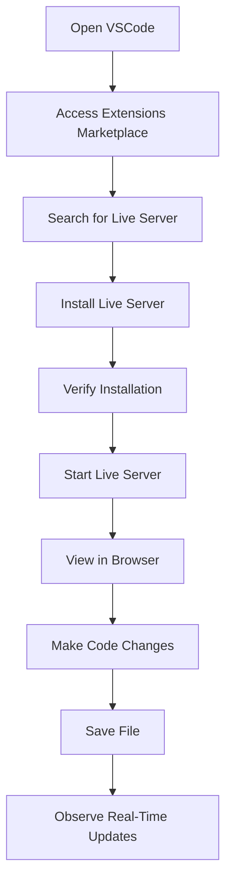

## 2.4 Setting Up Live Server

In this section, we will explore how to set up Live Server, a powerful tool that allows you to see your web page changes in real-time. This tool is particularly useful for beginners as it provides immediate feedback, helping you understand how your code translates into a visual web page. By the end of this guide, you will be able to install Live Server, start and stop it, and see your code changes instantly reflected in your browser.

### What is Live Server?

Live Server is an extension for Visual Studio Code (VSCode) that launches a local development server with a live reload feature for static and dynamic pages. It is an essential tool for web developers, as it allows you to see changes in your HTML, CSS, and JavaScript files instantly in the browser without having to refresh the page manually.

#### Why Use Live Server?

- **Instant Feedback**: As you write or modify your code, Live Server automatically refreshes your browser, showing you the results immediately.
- **Improved Workflow**: It speeds up your development process by eliminating the need to manually refresh the browser every time you make a change.
- **Error Detection**: By seeing changes in real-time, you can quickly identify and fix errors in your code.
- **User-Friendly**: Easy to install and use, making it perfect for beginners.

### Installing Live Server

Before we begin, ensure you have Visual Studio Code installed on your computer. If you haven't installed it yet, refer to section 2.2 of this guide for a step-by-step installation process.

#### Step-by-Step Installation Instructions

1. **Open Visual Studio Code**: Launch the VSCode application on your computer.

2. **Access the Extensions Marketplace**:
   - Click on the Extensions icon in the Activity Bar on the side of the window. This icon looks like four squares.
   - Alternatively, you can press `Ctrl+Shift+X` on Windows/Linux or `Cmd+Shift+X` on macOS to open the Extensions view.

3. **Search for Live Server**:
   - In the Extensions view, type "Live Server" into the search bar.
   - You should see the Live Server extension by Ritwick Dey in the search results.

4. **Install Live Server**:
   - Click on the Install button next to the Live Server extension.
   - Wait for the installation to complete. You will see a notification once it's installed successfully.

5. **Verify Installation**:
   - After installation, you should see a "Go Live" button at the bottom right corner of the VSCode window. This indicates that Live Server is ready to use.

### Starting and Stopping Live Server

Once Live Server is installed, you can easily start and stop it to preview your web pages.

#### Starting Live Server

1. **Open Your Project**:
   - Open the folder containing your HTML, CSS, and JavaScript files in VSCode.

2. **Start Live Server**:
   - Click on the "Go Live" button located at the bottom right corner of the VSCode window.
   - Alternatively, right-click on your HTML file in the Explorer view and select "Open with Live Server."

3. **View in Browser**:
   - Your default web browser will open automatically, displaying your web page.
   - The URL will typically look like `http://127.0.0.1:5500/your-file.html`, where `5500` is the default port used by Live Server.

#### Stopping Live Server

1. **Stop the Server**:
   - To stop Live Server, click on the "Port: 5500" button at the bottom right corner of the VSCode window.
   - Alternatively, you can close the browser tab or window displaying your web page.

### Real-Time Code Changes

One of the most powerful features of Live Server is its ability to reflect code changes instantly in the browser. Let's explore how this works.

#### Demonstrating Real-Time Updates

1. **Open Your HTML File**:
   - Ensure your HTML file is open in VSCode and Live Server is running.

2. **Make Changes to Your Code**:
   - Modify the HTML, CSS, or JavaScript code in your file.
   - For example, change the text inside a `<h1>` tag or update the background color in your CSS.

3. **Observe the Changes**:
   - As soon as you save the file (`Ctrl+S` on Windows/Linux or `Cmd+S` on macOS), Live Server will automatically refresh the browser.
   - You will see the changes reflected instantly without needing to manually reload the page.

#### Example Code

Let's illustrate this with a simple example. Suppose you have the following HTML file:

```html
<!DOCTYPE html>
<html lang="en">
<head>
    <meta charset="UTF-8">
    <meta name="viewport" content="width=device-width, initial-scale=1.0">
    <title>My First Web Page</title>
    <style>
        body {
            background-color: lightblue;
        }
        h1 {
            color: navy;
        }
    </style>
</head>
<body>
    <h1>Hello, World!</h1>
    <p>This is my first web page with Live Server.</p>
</body>
</html>
```

- **Change the Background Color**: Modify the `background-color` in the `<style>` section to `lightgreen`.
- **Save the File**: Press `Ctrl+S` or `Cmd+S`.
- **Instant Update**: Your browser will automatically refresh, and the background color will change to light green.

### Screenshots and Visual Aids

To further assist you, here are some visual aids that demonstrate the process:



**Figure 1**: Flowchart illustrating the steps to install and use Live Server.

### Try It Yourself

Now that you understand how Live Server works, try experimenting with your own HTML, CSS, and JavaScript files. Here are some suggestions:

- **Modify Text Content**: Change the text inside your HTML tags and observe how it updates in real-time.
- **Experiment with Styles**: Play around with different CSS properties to see their effects instantly.
- **Add JavaScript**: Introduce simple JavaScript code to manipulate the DOM and watch it execute live.

### Common Issues and Troubleshooting

While Live Server is generally straightforward to use, you might encounter some common issues. Here are a few tips to help you troubleshoot:

- **Port Conflicts**: If Live Server fails to start, it might be due to a port conflict. Change the port number in the Live Server settings.
- **Browser Caching**: If changes don't appear immediately, try clearing your browser cache or using a private browsing window.
- **File Not Found**: Ensure your files are saved and located in the correct directory.

### Key Takeaways

- **Live Server** is a valuable tool for web development, providing real-time feedback and improving workflow efficiency.
- **Installation** is simple and can be done directly from the VSCode Extensions Marketplace.
- **Real-Time Updates** allow you to see changes instantly, making it easier to debug and refine your code.

### Further Reading

For more information on Live Server and its features, you can refer to the following resources:

- [Visual Studio Code Marketplace - Live Server](https://marketplace.visualstudio.com/items?itemName=ritwickdey.LiveServer)
- [MDN Web Docs - Introduction to HTML](https://developer.mozilla.org/en-US/docs/Learn/HTML/Introduction_to_HTML)
- [MDN Web Docs - CSS: Cascading Style Sheets](https://developer.mozilla.org/en-US/docs/Web/CSS)

## Quiz Time!



### What is Live Server?

- [x] A tool that provides real-time web page previews.
- [ ] A database management system.
- [ ] A web hosting service.
- [ ] A programming language.

> **Explanation:** Live Server is a tool that allows developers to see real-time updates of their web pages as they code.

### How do you start Live Server in VSCode?

- [x] Click the "Go Live" button.
- [ ] Press `Ctrl+Alt+L`.
- [ ] Use the terminal command `live-server`.
- [ ] Open the browser manually.

> **Explanation:** The "Go Live" button in VSCode starts the Live Server.

### What is the default port used by Live Server?

- [ ] 8080
- [ ] 3000
- [x] 5500
- [ ] 8000

> **Explanation:** Live Server typically uses port 5500 by default.

### Which of the following is a benefit of using Live Server?

- [x] Instant feedback on code changes.
- [ ] Automatic code completion.
- [ ] Built-in debugging tools.
- [ ] Cloud hosting.

> **Explanation:** Live Server provides instant feedback by automatically refreshing the browser when code changes are saved.

### What should you do if Live Server fails to start due to a port conflict?

- [x] Change the port number in the settings.
- [ ] Restart your computer.
- [ ] Uninstall and reinstall Live Server.
- [ ] Disable all other extensions.

> **Explanation:** Changing the port number in the settings can resolve port conflicts.

### How can you verify that Live Server is installed correctly?

- [x] Look for the "Go Live" button in VSCode.
- [ ] Check the terminal for installation logs.
- [ ] Open the browser and type `localhost`.
- [ ] Restart VSCode.

> **Explanation:** The presence of the "Go Live" button indicates Live Server is installed correctly.

### What happens when you save a file while Live Server is running?

- [x] The browser automatically refreshes.
- [ ] The file is uploaded to a server.
- [ ] The file is deleted.
- [ ] Nothing happens.

> **Explanation:** Saving a file triggers Live Server to refresh the browser automatically.

### Which extension in VSCode allows real-time preview of web pages?

- [x] Live Server
- [ ] Prettier
- [ ] ESLint
- [ ] GitLens

> **Explanation:** Live Server is the extension that provides real-time previews.

### What is one common issue you might encounter with Live Server?

- [x] Port conflicts
- [ ] Missing syntax highlighting
- [ ] Slow internet connection
- [ ] Lack of support for JavaScript

> **Explanation:** Port conflicts can occur if another application is using the same port as Live Server.

### True or False: Live Server can only be used with HTML files.

- [ ] True
- [x] False

> **Explanation:** Live Server can be used with HTML, CSS, and JavaScript files to provide real-time previews.


