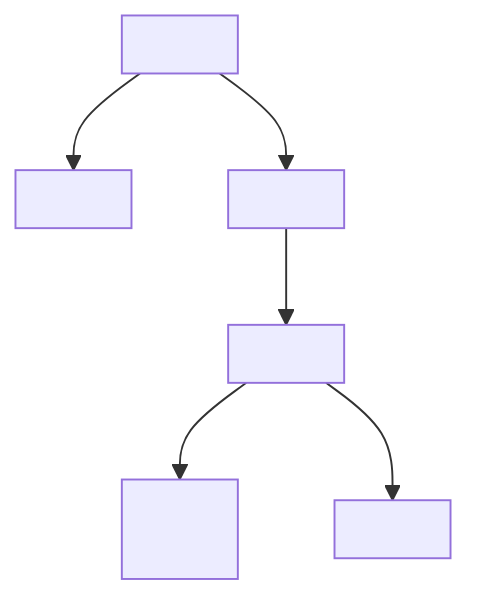
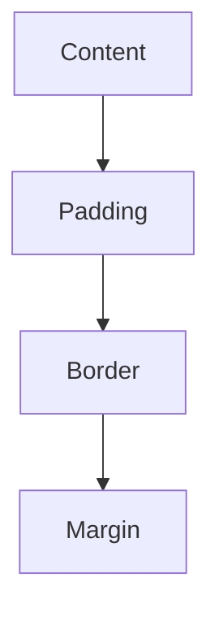

## 2.6 Introduction to Browser Developer Tools

As you embark on your journey to build your first web page with JavaScript, you'll quickly discover the importance of having the right tools at your disposal. Browser Developer Tools are essential for debugging, testing, and optimizing your web pages. In this section, we'll explore what these tools are, how to access them, and how to use their key features effectively.

### What Are Browser Developer Tools?

Browser Developer Tools are built-in features in modern web browsers that allow developers to inspect, debug, and analyze web pages. They provide a suite of utilities that help you understand how your web page is structured, how it behaves, and how it can be improved. Whether you're working on HTML, CSS, or JavaScript, these tools are invaluable for troubleshooting and enhancing your web development workflow.

### Accessing Developer Tools in Popular Browsers

Before we dive into the features of Developer Tools, let's first learn how to access them in two of the most popular web browsers: Google Chrome and Mozilla Firefox.

#### Accessing Chrome DevTools

1. **Open Google Chrome**: Launch the Chrome browser on your computer.
2. **Navigate to a Web Page**: Go to any web page you want to inspect.
3. **Open DevTools**: 
   - **Keyboard Shortcut**: Press `Ctrl + Shift + I` (Windows/Linux) or `Cmd + Option + I` (Mac).
   - **Right-Click Method**: Right-click on any element on the page and select "Inspect" from the context menu.

#### Accessing Firefox Developer Tools

1. **Open Mozilla Firefox**: Launch the Firefox browser.
2. **Navigate to a Web Page**: Visit any web page you're interested in.
3. **Open Developer Tools**: 
   - **Keyboard Shortcut**: Press `Ctrl + Shift + I` (Windows/Linux) or `Cmd + Option + I` (Mac).
   - **Right-Click Method**: Right-click on an element and choose "Inspect Element" from the menu.

### Key Features of Developer Tools

Now that you know how to access Developer Tools, let's explore some of their key features. We'll focus on the Elements panel, Console, and Network tab, as these are the most commonly used tools for web development.

#### Elements Panel

The Elements panel is where you can inspect and modify the HTML and CSS of a web page. It's an excellent tool for understanding the structure of a page and experimenting with style changes.

- **Inspecting HTML**: You can view the entire DOM (Document Object Model) structure of the page. Clicking on an element in the Elements panel will highlight it on the web page, allowing you to see exactly where it is located.
  
- **Editing HTML**: Double-click on any HTML element to edit it directly. This is useful for testing changes without modifying the actual source code.

- **Inspecting CSS**: The right side of the Elements panel shows the CSS styles applied to the selected element. You can toggle styles on and off, add new styles, or modify existing ones.

- **Box Model Visualization**: The Elements panel also provides a visual representation of the CSS box model, showing margins, borders, padding, and the content area.

```html
<!-- Example HTML structure -->
<div class="container">
  <h1>Welcome to My Web Page</h1>
  <p>This is a sample paragraph.</p>
</div>
```

```css
/* Example CSS styles */
.container {
  width: 80%;
  margin: 0 auto;
  padding: 20px;
  border: 1px solid #ccc;
}
```

#### Console

The Console is a powerful tool for debugging JavaScript code. It allows you to execute JavaScript commands, view error messages, and log information.

- **Logging Messages**: Use `console.log()` to output messages to the Console. This is helpful for checking variable values and program flow.

```javascript
// Example JavaScript code
let greeting = "Hello, World!";
console.log(greeting); // Outputs: Hello, World!
```

- **Error Messages**: The Console displays JavaScript errors with detailed information, including the file name and line number where the error occurred.

- **Executing Commands**: You can enter JavaScript commands directly into the Console to test code snippets or manipulate the page.

#### Network Tab

The Network tab provides insights into the resources loaded by a web page, such as images, scripts, and stylesheets. It's useful for analyzing page load performance and diagnosing issues related to resource loading.

- **Monitoring Network Requests**: View all network requests made by the page, including their status, type, and size.

- **Analyzing Load Times**: Check how long each resource takes to load, helping you identify bottlenecks.

- **Inspecting Headers**: Examine request and response headers to understand how data is being transferred.

### Using Developer Tools to Inspect and Modify HTML/CSS

Let's walk through an example of using Developer Tools to inspect and modify HTML and CSS on a web page.

1. **Open a Web Page**: Navigate to a web page you want to inspect.
2. **Open Developer Tools**: Use the methods described earlier to open DevTools.
3. **Inspect an Element**: In the Elements panel, click on an element you want to inspect. The corresponding HTML will be highlighted.
4. **Modify HTML**: Double-click on an element's tag or text to edit it. Try changing the text of a heading or paragraph.
5. **Modify CSS**: In the Styles pane, try changing a CSS property, such as `color` or `font-size`. Notice how the changes reflect immediately on the page.

```html
<!-- Original HTML -->
<h1>Original Heading</h1>
<p>This is the original paragraph text.</p>
```

```html
<!-- Modified HTML -->
<h1>Modified Heading</h1>
<p>This is the modified paragraph text.</p>
```

```css
/* Original CSS */
h1 {
  color: black;
  font-size: 24px;
}

/* Modified CSS */
h1 {
  color: blue;
  font-size: 30px;
}
```

### Encouragement to Explore Developer Tools

Developer Tools are a treasure trove of features that can significantly enhance your web development skills. As you build your web pages, take the time to explore these tools and experiment with different features. Try inspecting different elements, modifying styles, and using the Console to test JavaScript code. The more you practice, the more confident you'll become in using these tools to troubleshoot and optimize your web pages.

### Try It Yourself

To reinforce your understanding, try the following exercises:

1. **Inspect and Modify**: Open a web page, inspect an element, and change its text or style using the Elements panel.
2. **Log a Message**: Use the Console to log a message or variable value.
3. **Analyze Network Requests**: Open the Network tab and observe the requests made by the page. Identify the largest resource and its load time.

### Visual Aids

To help visualize the concepts discussed, let's include a few diagrams.

#### DOM Tree Structure



*Figure 1: DOM Tree Structure*

#### CSS Box Model



*Figure 2: CSS Box Model*

### References and Links

For further reading and exploration, check out these resources:

- [MDN Web Docs: Introduction to the DOM](https://developer.mozilla.org/en-US/docs/Web/API/Document_Object_Model/Introduction)
- [Google Chrome DevTools Documentation](https://developer.chrome.com/docs/devtools/)
- [Mozilla Firefox Developer Tools](https://developer.mozilla.org/en-US/docs/Tools)

### Engagement and Reinforcement

As you continue to build your web pages, remember to leverage Developer Tools to enhance your understanding and improve your skills. Pose questions to yourself, such as "How can I optimize this page's load time?" or "What happens if I change this CSS property?" By actively engaging with these tools, you'll become a more proficient and confident web developer.

### Summary of Key Takeaways

- **Developer Tools** are essential for inspecting, debugging, and optimizing web pages.
- **Access DevTools** in Chrome and Firefox using keyboard shortcuts or right-click menus.
- **Key Features** include the Elements panel, Console, and Network tab.
- **Experiment** with modifying HTML and CSS directly in the Elements panel.
- **Use the Console** to log messages and execute JavaScript commands.
- **Analyze Network Requests** to understand resource loading and performance.

By mastering these tools, you'll be well-equipped to tackle any challenges you encounter in your web development journey.

---

## Quiz Time!



### What is the primary purpose of browser developer tools?

- [x] To inspect, debug, and analyze web pages
- [ ] To create new web pages
- [ ] To replace text editors
- [ ] To manage web hosting

> **Explanation:** Browser developer tools are designed to help developers inspect, debug, and analyze web pages, providing insights into the structure and behavior of the page.

### How can you access Chrome DevTools using a keyboard shortcut on Windows?

- [x] Ctrl + Shift + I
- [ ] Ctrl + Alt + I
- [ ] Ctrl + Shift + J
- [ ] Ctrl + Alt + J

> **Explanation:** The keyboard shortcut to access Chrome DevTools on Windows is `Ctrl + Shift + I`.

### Which panel in Developer Tools allows you to inspect and modify HTML and CSS?

- [x] Elements panel
- [ ] Console
- [ ] Network tab
- [ ] Sources panel

> **Explanation:** The Elements panel is used to inspect and modify HTML and CSS on a web page.

### What can you use the Console for in Developer Tools?

- [x] Logging messages and debugging JavaScript
- [ ] Editing HTML
- [ ] Analyzing network requests
- [ ] Managing cookies

> **Explanation:** The Console is used for logging messages, debugging JavaScript, and executing commands.

### What information can you find in the Network tab?

- [x] Resource load times and network requests
- [ ] HTML structure
- [ ] CSS styles
- [ ] JavaScript errors

> **Explanation:** The Network tab provides information about resource load times and network requests made by the page.

### What does the CSS Box Model represent?

- [x] Margins, borders, padding, and content area
- [ ] HTML tags
- [ ] JavaScript functions
- [ ] Network requests

> **Explanation:** The CSS Box Model represents the margins, borders, padding, and content area of an element.

### Which method allows you to log messages to the Console?

- [x] console.log()
- [ ] console.error()
- [ ] console.warn()
- [ ] console.info()

> **Explanation:** The `console.log()` method is used to log messages to the Console.

### How can you modify an HTML element directly in the Elements panel?

- [x] Double-click on the element's tag or text
- [ ] Right-click and select "Edit"
- [ ] Use the Console
- [ ] Use the Network tab

> **Explanation:** You can modify an HTML element directly in the Elements panel by double-clicking on its tag or text.

### What is the purpose of the DOM Tree Structure diagram?

- [x] To visualize the hierarchical structure of HTML elements
- [ ] To show CSS styles
- [ ] To display network requests
- [ ] To log JavaScript errors

> **Explanation:** The DOM Tree Structure diagram visualizes the hierarchical structure of HTML elements on a web page.

### True or False: Developer Tools can only be used in Google Chrome.

- [ ] True
- [x] False

> **Explanation:** Developer Tools are available in multiple browsers, including Google Chrome and Mozilla Firefox.




