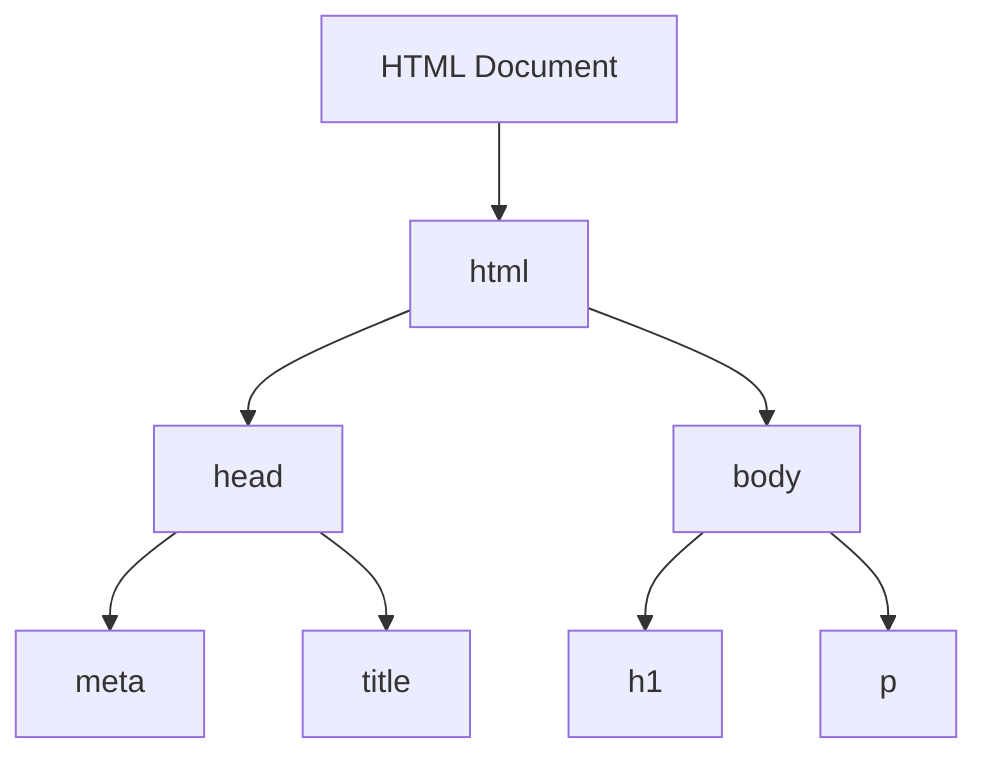

## 2.7 Testing Your Setup

Welcome to an exciting milestone in your web development journey! In this section, we will create a simple "Hello, World" web page. This exercise will help you verify that your development environment is set up correctly and that you are ready to start building dynamic web pages with HTML, CSS, and JavaScript. Let's dive in and celebrate this first step together!

### Writing a Basic HTML File

Let's start by creating a basic HTML file. HTML (Hypertext Markup Language) is the standard language for creating web pages. It structures the content on the web page. Follow these steps to create your first HTML file:

1. **Open Your Text Editor or IDE**: Launch the text editor or Integrated Development Environment (IDE) you installed earlier. For this guide, we'll use Visual Studio Code (VSCode), but feel free to use any editor of your choice.

2. **Create a New File**: In VSCode, click on `File` > `New File` or use the shortcut `Ctrl + N` (Windows/Linux) or `Cmd + N` (Mac).

3. **Write the HTML Code**: Type the following code into your new file:

    ```html
    <!DOCTYPE html>
    <html lang="en">
    <head>
        <meta charset="UTF-8">
        <meta name="viewport" content="width=device-width, initial-scale=1.0">
        <title>Hello, World!</title>
    </head>
    <body>
        <h1>Hello, World!</h1>
        <p>Welcome to your first web page!</p>
    </body>
    </html>
    ```

    **Explanation**:
    - `<!DOCTYPE html>`: This declaration defines the document type and version of HTML.
    - `<html lang="en">`: The root element of the HTML document, with a language attribute set to English.
    - `<head>`: Contains meta-information about the document, such as character set and viewport settings.
    - `<title>`: Sets the title of the web page, which appears in the browser tab.
    - `<body>`: Contains the content of the web page, including a heading and a paragraph.

### Saving the HTML File

Now that you've written your HTML code, let's save the file:

1. **Save the File**: Click on `File` > `Save As` or use the shortcut `Ctrl + S` (Windows/Linux) or `Cmd + S` (Mac).

2. **Choose a Location**: Navigate to the folder where you want to save your file. It's a good practice to create a dedicated folder for your projects.

3. **Name the File**: Enter a name for your file, such as `index.html`. Ensure the file extension is `.html` to indicate it's an HTML file.

4. **Save the File**: Click `Save` to store your file.

### Opening the HTML File in a Browser

Let's view your newly created web page in a browser:

1. **Locate the File**: Use your file explorer to navigate to the location where you saved `index.html`.

2. **Open with a Browser**: Right-click on the file and select `Open with` followed by your preferred web browser (e.g., Chrome, Firefox, Edge).

3. **View the Page**: Your browser should display a page with the heading "Hello, World!" and the paragraph "Welcome to your first web page!"

### Using Live Server for Real-Time Viewing

To make web development more efficient, we can use the Live Server extension in VSCode. This extension allows you to see changes in real-time without manually refreshing the browser.

1. **Install Live Server**: If you haven't already, install the Live Server extension in VSCode. Go to the Extensions view (`Ctrl + Shift + X` or `Cmd + Shift + X`), search for "Live Server," and click `Install`.

2. **Open with Live Server**: With your `index.html` file open in VSCode, right-click in the editor and select `Open with Live Server`. Alternatively, click the `Go Live` button in the status bar at the bottom of VSCode.

3. **View Changes in Real-Time**: Your default browser will open a new tab displaying your web page. Any changes you make to the HTML file will automatically update in the browser.

### Verifying Editors and Extensions

Let's ensure that your editor and extensions are functioning correctly:

- **Syntax Highlighting**: Check that your HTML code is color-coded. This indicates that syntax highlighting is working, which helps identify different parts of the code.

- **Auto-Completion**: As you type, VSCode should suggest tags and attributes. This feature speeds up coding and reduces errors.

- **Live Server Functionality**: Confirm that changes in your HTML file reflect immediately in the browser when using Live Server.

### Celebrating Your First Step

Congratulations! You've successfully created and tested your first web page. This is a significant achievement, and you should be proud of taking the first step in your web development journey. As you continue, remember that practice and experimentation are key to mastering these skills.

### Try It Yourself

Now that you've created a basic "Hello, World" page, try experimenting with the following:

- **Change the Content**: Modify the text inside the `<h1>` and `<p>` tags to personalize your message.

- **Add More Elements**: Introduce additional HTML elements, such as a list or an image, to enhance your page.

- **Style with CSS**: Add some inline CSS to change the color or font of your text.

### Visual Aids

To help visualize the structure of your HTML document, here's a simple diagram representing the DOM (Document Object Model) tree structure of your "Hello, World" page:



**Diagram Explanation**:
- The root of the tree is the HTML document.
- The `<html>` element contains two main branches: `<head>` and `<body>`.
- The `<head>` includes `<meta>` and `<title>`.
- The `<body>` contains the content elements `<h1>` and `<p>`.

### References and Links

For further reading and exploration, check out these resources:

- [MDN Web Docs: HTML Basics](https://developer.mozilla.org/en-US/docs/Learn/Getting_started_with_the_web/HTML_basics)
- [W3Schools: HTML Introduction](https://www.w3schools.com/html/html_intro.asp)

### Engagement and Reinforcement

To reinforce what you've learned, consider these questions:

- What is the purpose of the `<head>` section in an HTML document?
- How does Live Server enhance the web development process?
- Why is it important to save your file with a `.html` extension?

### Exercises

1. **Create a New Web Page**: Build a new HTML page with a different title and content. Use Live Server to view it in real-time.

2. **Add an Image**: Find an image online and add it to your page using the `` tag. Ensure you use the correct file path.

3. **Experiment with Styles**: Use inline CSS to change the background color of your page.

### Key Takeaways

- You have successfully set up your development environment and created your first HTML file.
- Live Server is a valuable tool for real-time viewing and testing.
- Experimentation is crucial for learning and mastering web development.

### Tone and Style

Remember, this is just the beginning. As you progress, you'll build more complex and interactive web pages. Keep experimenting, stay curious, and enjoy the journey!

## Quiz Time!



### What is the purpose of the `<!DOCTYPE html>` declaration?

- [x] It defines the document type and version of HTML.
- [ ] It adds a title to the web page.
- [ ] It styles the web page.
- [ ] It links the HTML file to a CSS file.

> **Explanation:** The `<!DOCTYPE html>` declaration is used to specify the version of HTML being used, ensuring the browser renders the page correctly.

### Which HTML element contains the main content of the web page?

- [ ] `<head>`
- [x] `<body>`
- [ ] `<title>`
- [ ] `<meta>`

> **Explanation:** The `<body>` element contains the main content of the web page, including text, images, and other elements.

### How do you open a file with Live Server in VSCode?

- [ ] Right-click the file and select `Open with Live Server`.
- [x] Click the `Go Live` button in the status bar.
- [ ] Use the shortcut `Ctrl + L`.
- [ ] Select `File` > `Open with Live Server`.

> **Explanation:** You can open a file with Live Server by clicking the `Go Live` button in the status bar or by right-clicking the file and selecting `Open with Live Server`.

### What is the file extension for an HTML file?

- [ ] `.css`
- [x] `.html`
- [ ] `.js`
- [ ] `.txt`

> **Explanation:** HTML files use the `.html` extension to indicate they contain HTML code.

### What does the `<title>` element do?

- [x] Sets the title of the web page that appears in the browser tab.
- [ ] Adds a heading to the web page.
- [ ] Links to an external CSS file.
- [ ] Contains the main content of the web page.

> **Explanation:** The `<title>` element sets the title of the web page, which is displayed in the browser tab.

### Which HTML element is used to display a heading?

- [ ] `<p>`
- [x] `<h1>`
- [ ] `<div>`
- [ ] `<span>`

> **Explanation:** The `<h1>` element is used to display a heading, with `<h1>` being the largest and `<h6>` the smallest.

### What is the purpose of the `<meta>` tag in the `<head>` section?

- [x] To provide metadata about the HTML document.
- [ ] To display images.
- [ ] To create hyperlinks.
- [ ] To style the page with CSS.

> **Explanation:** The `<meta>` tag provides metadata about the HTML document, such as character set and viewport settings.

### How can you ensure changes in your HTML file reflect immediately in the browser?

- [ ] By refreshing the browser manually.
- [x] By using Live Server.
- [ ] By saving the file with a `.css` extension.
- [ ] By using the `<script>` tag.

> **Explanation:** Live Server allows changes in the HTML file to reflect immediately in the browser without manual refreshing.

### What should you do if syntax highlighting is not working in your editor?

- [ ] Reinstall the editor.
- [x] Check if the file extension is correct.
- [ ] Use a different browser.
- [ ] Disable Live Server.

> **Explanation:** If syntax highlighting is not working, ensure the file extension is correct (e.g., `.html` for HTML files).

### True or False: The `<body>` element is part of the `<head>` section.

- [ ] True
- [x] False

> **Explanation:** False. The `<body>` element is separate from the `<head>` section and contains the main content of the web page.




