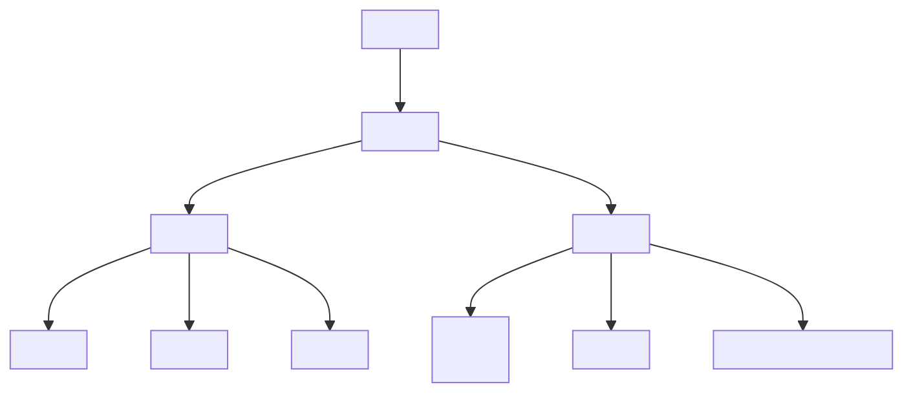

## 3.1 Understanding the Structure of an HTML Document

Welcome to the exciting world of web development! As we embark on this journey to build your first web page, it's crucial to understand the fundamental building blocks of the web: HTML documents. In this section, we'll break down the essential components of an HTML file, explain their purposes, and provide you with a solid foundation to create well-structured web pages.

### What is HTML?

HTML, or Hypertext Markup Language, is the standard language used to create web pages. It provides the structure and layout of a web page by using a series of elements and tags. These elements and tags tell the web browser how to display the content on the page. HTML is the backbone of any web page, and understanding its structure is the first step in becoming a proficient web developer.

### The Basic Structure of an HTML Document

An HTML document is like a blueprint for a web page. It consists of several key components that work together to define the content and layout. Let's explore these components:

#### 1. The `<!DOCTYPE html>` Declaration

The `<!DOCTYPE html>` declaration is the first line of an HTML document. It is not an HTML tag but a declaration that tells the web browser which version of HTML the document is using. In modern web development, we use HTML5, and the `<!DOCTYPE html>` declaration ensures that the browser renders the page in standards mode, which is essential for consistent behavior across different browsers.

```html
<!DOCTYPE html>
```

#### 2. The `<html>` Tag

The `<html>` tag is the root element of an HTML document. It encapsulates all the content on the page, including the head and body sections. Every HTML document begins with an opening `<html>` tag and ends with a closing `</html>` tag.

```html
<html>
  <!-- Content goes here -->
</html>
```

#### 3. The `<head>` Section

The `<head>` section of an HTML document contains meta-information about the page. This information is not displayed on the page itself but is used by the browser and search engines. Common elements found in the `<head>` section include:

- **`<title>`**: Sets the title of the web page, which appears in the browser tab.
- **Meta Tags**: Provide metadata such as character set, viewport settings, and author information.
- **Links to Stylesheets**: Connect external CSS files to style the page.
- **Scripts**: Include JavaScript files or inline scripts.

Here's an example of a basic `<head>` section:

```html
<head>
  <meta charset="UTF-8">
  <meta name="viewport" content="width=device-width, initial-scale=1.0">
  <title>My First Web Page</title>
  <link rel="stylesheet" href="styles.css">
</head>
```

#### 4. The `<body>` Section

The `<body>` section contains the actual content of the web page that is visible to users. This includes text, images, links, and other elements that make up the page's content. The `<body>` section is where you define the structure and layout of your web page.

```html
<body>
  <h1>Welcome to My Web Page</h1>
  <p>This is a paragraph of text on my web page.</p>
  
</body>
```

### Putting It All Together: A Basic HTML Document

Now that we've covered the essential components, let's put them together to create a basic HTML document. This example includes all the elements we've discussed:

```html
<!DOCTYPE html>
<html>
<head>
  <meta charset="UTF-8">
  <meta name="viewport" content="width=device-width, initial-scale=1.0">
  <title>My First Web Page</title>
  <link rel="stylesheet" href="styles.css">
</head>
<body>
  <h1>Welcome to My Web Page</h1>
  <p>This is a paragraph of text on my web page.</p>
  
</body>
</html>
```

### The Importance of Proper Nesting and Syntax

In HTML, proper nesting and syntax are crucial for creating well-formed documents. Nesting refers to placing elements within other elements, and it's essential to ensure that each opening tag has a corresponding closing tag. Improper nesting can lead to rendering issues and unexpected behavior.

For example, consider the following incorrect nesting:

```html
<p>This is a paragraph <strong>with bold text.</p></strong>
```

The correct nesting should be:

```html
<p>This is a paragraph <strong>with bold text.</strong></p>
```

### HTML Elements and Tags

HTML is composed of elements, which are defined by tags. Tags are the building blocks of HTML and are used to create elements. Each element consists of an opening tag, content, and a closing tag. Some elements, like ``, are self-closing and do not require a closing tag.

Here's an example of a simple HTML element:

```html
<p>This is a paragraph.</p>
```

- **Opening Tag**: `<p>`
- **Content**: `This is a paragraph.`
- **Closing Tag**: `</p>`

### Try It Yourself

Now that you have a basic understanding of HTML structure, try creating your own HTML document. Experiment with adding different elements and see how they affect the page. Here's a simple exercise to get you started:

1. Create a new HTML file and save it as `index.html`.
2. Add the `<!DOCTYPE html>` declaration at the top.
3. Create the `<html>`, `<head>`, and `<body>` sections.
4. Add a title to the `<head>` section.
5. In the `<body>` section, add a heading, a paragraph, and an image.
6. Save the file and open it in a web browser to see your first web page in action!

### Visualizing the HTML Structure

To better understand the structure of an HTML document, let's visualize it using a diagram. This diagram represents the hierarchy of elements in a typical HTML document.



**Diagram Description**: This diagram illustrates the hierarchical structure of an HTML document. The `<!DOCTYPE html>` declaration is at the top, followed by the `<html>` element, which contains the `<head>` and `<body>` sections. The `<head>` section includes meta tags, the title, and links to stylesheets, while the `<body>` section contains the visible content.

### Key Takeaways

- The `<!DOCTYPE html>` declaration is essential for ensuring consistent rendering across browsers.
- The `<html>` tag is the root element of an HTML document and contains the `<head>` and `<body>` sections.
- The `<head>` section contains meta-information, while the `<body>` section contains the visible content.
- Proper nesting and syntax are crucial for creating well-formed HTML documents.
- HTML elements are defined by tags and can contain content and other elements.

### Further Reading

To deepen your understanding of HTML and web development, consider exploring the following resources:

- [MDN Web Docs: HTML Basics](https://developer.mozilla.org/en-US/docs/Learn/Getting_started_with_the_web/HTML_basics)
- [W3Schools: HTML Introduction](https://www.w3schools.com/html/html_intro.asp)

### Quiz Time!



### What is the purpose of the `<!DOCTYPE html>` declaration?

- [x] It tells the browser which version of HTML the document is using.
- [ ] It is an HTML tag that displays content on the page.
- [ ] It is used to link external stylesheets to the document.
- [ ] It sets the title of the web page.

> **Explanation:** The `<!DOCTYPE html>` declaration informs the browser that the document is using HTML5, ensuring consistent rendering across browsers.

### Which tag is the root element of an HTML document?

- [ ] `<head>`
- [ ] `<body>`
- [x] `<html>`
- [ ] `<!DOCTYPE html>`

> **Explanation:** The `<html>` tag is the root element that encapsulates all other elements in an HTML document.

### What information is typically found in the `<head>` section of an HTML document?

- [x] Meta-information, title, links to stylesheets, and scripts.
- [ ] Visible content such as headings and paragraphs.
- [ ] Images and multimedia elements.
- [ ] User input forms and buttons.

> **Explanation:** The `<head>` section contains meta-information, the title, and links to stylesheets and scripts, which are not directly visible on the page.

### What is the purpose of the `<body>` section in an HTML document?

- [ ] To provide metadata about the document.
- [x] To contain the visible content of the web page.
- [ ] To define the document's character set.
- [ ] To link external JavaScript files.

> **Explanation:** The `<body>` section contains the actual content of the web page that users see, such as text, images, and links.

### Which of the following is a self-closing HTML tag?

- [ ] `<p>`
- [x] ``
- [ ] `<h1>`
- [ ] `<div>`

> **Explanation:** The `` tag is self-closing and does not require a closing tag, unlike other elements like `<p>`, `<h1>`, and `<div>`.

### What is the correct nesting of HTML tags?

- [x] `<p>This is a paragraph <strong>with bold text.</strong></p>`
- [ ] `<p>This is a paragraph <strong>with bold text.</p></strong>`
- [ ] `<strong>This is a paragraph <p>with bold text.</p></strong>`
- [ ] `<p>This is a paragraph with bold text.</strong><strong></p>`

> **Explanation:** Proper nesting ensures that each opening tag has a corresponding closing tag, maintaining a valid HTML structure.

### What is the role of the `<title>` tag in an HTML document?

- [x] It sets the title of the web page, which appears in the browser tab.
- [ ] It defines the main heading of the page content.
- [ ] It links external stylesheets to the document.
- [ ] It provides metadata about the document.

> **Explanation:** The `<title>` tag sets the title of the web page, which is displayed in the browser tab and used by search engines.

### Which section of an HTML document contains links to external stylesheets?

- [x] `<head>`
- [ ] `<body>`
- [ ] `<html>`
- [ ] `<!DOCTYPE html>`

> **Explanation:** The `<head>` section contains links to external stylesheets, which define the styles applied to the page content.

### What is the significance of the `charset` attribute in the `<meta>` tag?

- [x] It specifies the character encoding for the HTML document.
- [ ] It sets the title of the web page.
- [ ] It links external JavaScript files to the document.
- [ ] It provides metadata about the document's author.

> **Explanation:** The `charset` attribute in the `<meta>` tag specifies the character encoding, ensuring that the document is displayed correctly.

### True or False: The `<body>` section is where you define the structure and layout of your web page.

- [x] True
- [ ] False

> **Explanation:** The `<body>` section contains the visible content and layout of the web page, including text, images, and other elements.



By understanding the structure of an HTML document, you're well on your way to creating your first web page. Keep experimenting and building upon this foundation, and soon you'll be crafting beautiful and functional web pages with ease!
