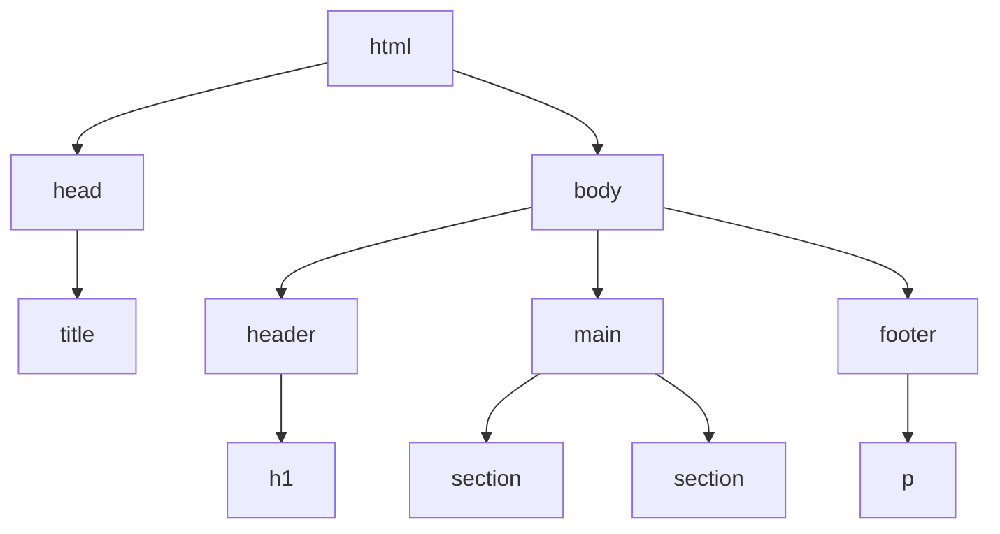

## 3.10 Comments, Whitespace, and Formatting

Creating a web page is not just about writing code that works; it's also about writing code that is easy to read, understand, and maintain. In this section, we'll explore how to use comments, whitespace, and formatting to enhance the readability of your HTML code. These practices are crucial, especially when collaborating with others or revisiting your code after some time.

### Understanding HTML Comments

Comments are an essential part of any programming language, including HTML. They allow you to leave notes within your code that are not displayed on the web page. Comments can explain the purpose of a section of code, indicate areas that need improvement, or temporarily disable code without deleting it.

#### How to Add Comments in HTML

In HTML, comments are added using the `<!-- Comment -->` syntax. Here's a simple example:

```html
<!-- This is a comment in HTML -->
<p>This paragraph is visible on the web page.</p>
<!-- The following line is a comment and will not be displayed -->
<!-- <p>This paragraph is commented out and won't appear on the page.</p> -->
```

#### Best Practices for Using Comments

1. **Explain Complex Code**: Use comments to clarify complex or non-intuitive sections of your code.
2. **Use Comments Sparingly**: Avoid over-commenting. Your code should be self-explanatory whenever possible.
3. **Update Comments**: Ensure your comments are updated when you modify the code they describe.
4. **Consistent Style**: Use a consistent style for comments throughout your codebase.

### The Role of Whitespace in HTML

Whitespace refers to any space, tab, or newline in your code. While browsers typically ignore extra whitespace in HTML, it plays a crucial role in improving code readability for developers.

#### How Whitespace Enhances Readability

- **Indentation**: Indent nested elements to clearly show their hierarchy.
- **Line Breaks**: Use line breaks to separate logical sections of your code.
- **Alignment**: Align attributes and values for better readability.

Here's an example of how whitespace can improve the readability of HTML:

```html
<!DOCTYPE html>
<html>
<head>
    <title>My Web Page</title>
</head>
<body>
    <header>
        <h1>Welcome to My Web Page</h1>
    </header>
    <main>
        <section>
            <h2>About Me</h2>
            <p>This is a paragraph about me.</p>
        </section>
        <section>
            <h2>Contact Information</h2>
            <p>Email: example@example.com</p>
        </section>
    </main>
    <footer>
        <p>&copy; 2024 My Web Page</p>
    </footer>
</body>
</html>
```

### Formatting HTML Code

Proper formatting of HTML code involves organizing your code in a way that makes it easy to read and understand. This includes consistent indentation, line breaks, and the use of comments.

#### Best Practices for HTML Formatting

1. **Consistent Indentation**: Use spaces or tabs consistently to indent your code. A common practice is to use two or four spaces per indentation level.
2. **Line Length**: Keep lines of code to a reasonable length (e.g., 80-100 characters) to avoid horizontal scrolling.
3. **Attribute Alignment**: Align attributes for elements with multiple attributes to improve readability.
4. **Logical Grouping**: Group related elements together and separate them with line breaks.

#### Example of Well-Formatted HTML

```html
<!DOCTYPE html>
<html lang="en">
<head>
    <meta charset="UTF-8">
    <meta name="viewport" content="width=device-width, initial-scale=1.0">
    <title>Sample Page</title>
    <!-- Stylesheet link -->
    <link rel="stylesheet" href="styles.css">
</head>
<body>
    <header>
        <h1>Sample Page</h1>
        <nav>
            <ul>
                <li><a href="#home">Home</a></li>
                <li><a href="#about">About</a></li>
                <li><a href="#contact">Contact</a></li>
            </ul>
        </nav>
    </header>
    <main>
        <section id="home">
            <h2>Home Section</h2>
            <p>Welcome to the home section of this sample page.</p>
        </section>
        <section id="about">
            <h2>About Section</h2>
            <p>This section contains information about the page.</p>
        </section>
        <section id="contact">
            <h2>Contact Section</h2>
            <p>Contact us at <a href="mailto:info@example.com">info@example.com</a>.</p>
        </section>
    </main>
    <footer>
        <p>&copy; 2024 Sample Page</p>
    </footer>
</body>
</html>
```

### Consistent Indentation and Line Breaks

Consistent indentation and line breaks are critical for maintaining a clean and readable codebase. They help you and others quickly understand the structure and flow of your HTML document.

#### Indentation Styles

- **Spaces vs. Tabs**: Choose between spaces or tabs for indentation and stick with your choice throughout the project. Many developers prefer spaces for consistency across different editors.
- **Indentation Levels**: Use one level of indentation for each nested element. This visually represents the hierarchy of elements.

#### Line Breaks

- **Separate Logical Sections**: Use line breaks to separate different sections of your code, such as between the `<head>` and `<body>` tags.
- **Break Long Lines**: If a line of code is too long, break it into multiple lines for better readability.

### Collaboration and Code Readability

Well-formatted code is not only easier for you to read but also for others who may work on your project. This is especially important in collaborative environments where multiple developers contribute to the same codebase.

#### Benefits of Well-Formatted Code

1. **Easier Debugging**: Readable code makes it easier to identify and fix errors.
2. **Simplified Maintenance**: Code that is easy to read and understand is easier to maintain and update.
3. **Improved Collaboration**: Consistent formatting helps team members understand each other's code more quickly.

### Try It Yourself

To reinforce what you've learned, try modifying the following HTML code to improve its readability:

```html
<!DOCTYPE html><html><head><title>Test Page</title></head><body><h1>Test Page</h1><p>This is a test page.</p><ul><li>Item 1</li><li>Item 2</li><li>Item 3</li></ul></body></html>
```

**Suggestions:**

- Add comments to explain the purpose of each section.
- Use consistent indentation to show the hierarchy of elements.
- Break long lines into multiple lines for better readability.
- Separate different sections with line breaks.

### Visual Aids: HTML Document Structure

To better understand the structure of an HTML document, let's visualize it using a DOM tree diagram. This diagram represents the hierarchical nature of HTML elements.



**Diagram Description**: This diagram illustrates the basic structure of an HTML document. The `<html>` element is the root, with `<head>` and `<body>` as its children. The `<body>` contains `<header>`, `<main>`, and `<footer>`, each with their own child elements.

### Key Takeaways

- **Comments**: Use comments to explain complex code and keep them updated.
- **Whitespace**: Use whitespace to improve readability through indentation and line breaks.
- **Formatting**: Follow best practices for consistent indentation, line length, and attribute alignment.
- **Collaboration**: Well-formatted code is easier to read, debug, and maintain, benefiting both individual and team efforts.

By incorporating these practices into your HTML coding routine, you'll create web pages that are not only functional but also easy to read and maintain. This foundation will serve you well as you continue to build more complex web applications.

## Quiz Time!



### What is the purpose of comments in HTML?

- [x] To leave notes within the code that are not displayed on the web page
- [ ] To execute additional code
- [ ] To change the appearance of the web page
- [ ] To link to external stylesheets

> **Explanation:** Comments are used to leave notes within the code that are not displayed on the web page, helping developers understand the code better.

### Which of the following is a correct HTML comment?

- [x] `<!-- This is a comment -->`
- [ ] `// This is a comment`
- [ ] `/* This is a comment */`
- [ ] `# This is a comment`

> **Explanation:** HTML comments are written using the `<!-- Comment -->` syntax.

### Why is whitespace important in HTML?

- [x] It improves the readability of the code
- [ ] It changes the appearance of the web page
- [ ] It increases the loading speed of the page
- [ ] It is required for the code to function

> **Explanation:** Whitespace improves the readability of the code by making it easier to understand the structure and flow.

### What is a common practice for indentation in HTML?

- [x] Use two or four spaces per indentation level
- [ ] Use ten spaces per indentation level
- [ ] Use no spaces for indentation
- [ ] Use random spaces for indentation

> **Explanation:** A common practice is to use two or four spaces per indentation level for consistency and readability.

### How can line breaks improve HTML code?

- [x] By separating logical sections of the code
- [ ] By making the code run faster
- [x] By making the code easier to read
- [ ] By changing the color of the text

> **Explanation:** Line breaks separate logical sections of the code and make it easier to read.

### What is the benefit of well-formatted code in a collaborative environment?

- [x] It improves collaboration by making the code easier to understand
- [ ] It makes the code run faster
- [ ] It changes the appearance of the web page
- [ ] It is only beneficial for solo projects

> **Explanation:** Well-formatted code improves collaboration by making it easier for team members to understand each other's code.

### Which of the following is NOT a best practice for HTML formatting?

- [ ] Consistent indentation
- [ ] Logical grouping of elements
- [ ] Keeping lines of code to a reasonable length
- [x] Using random indentation styles

> **Explanation:** Using random indentation styles is not a best practice as it reduces code readability and consistency.

### What is the role of the `<head>` element in an HTML document?

- [x] To contain metadata and links to stylesheets
- [ ] To display the main content of the page
- [ ] To create a footer for the page
- [ ] To add images to the page

> **Explanation:** The `<head>` element contains metadata and links to stylesheets, scripts, and other resources.

### How do comments aid in debugging HTML code?

- [x] By explaining the purpose of code sections
- [ ] By executing additional code
- [ ] By changing the appearance of the web page
- [ ] By linking to external scripts

> **Explanation:** Comments explain the purpose of code sections, making it easier to identify and fix errors.

### True or False: Browsers ignore extra whitespace in HTML.

- [x] True
- [ ] False

> **Explanation:** Browsers typically ignore extra whitespace in HTML, but it is important for code readability.


