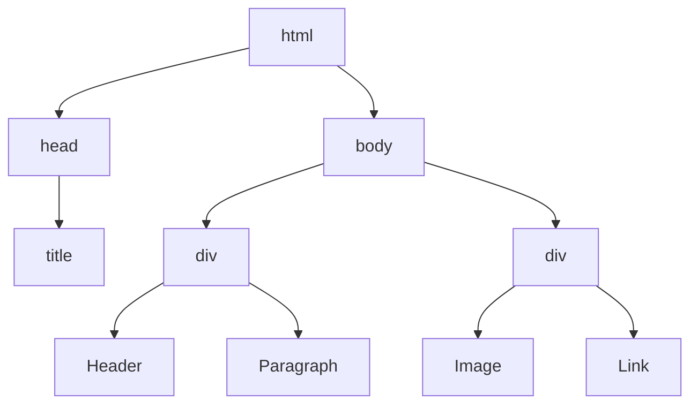

## 3.2 Common HTML Tags and Elements

Welcome to the world of HTML, the backbone of web content! In this section, we will explore some of the most commonly used HTML tags that form the foundation of any web page. Understanding these tags is crucial for structuring and presenting content effectively. Let's dive into the essential tags that every web developer should know.

### Understanding HTML Tags

HTML (HyperText Markup Language) is a markup language used to create the structure of web pages. It consists of a series of elements, represented by tags, that define the content and layout of a web page. Each HTML element is enclosed in angle brackets, like `<tagname>`, and usually comes in pairs: an opening tag `<tagname>` and a closing tag `</tagname>`. Some elements, known as self-closing tags, do not require a closing tag.

### Block-Level vs. Inline Elements

Before we delve into specific tags, it's important to understand the difference between block-level and inline elements:

- **Block-Level Elements**: These elements take up the full width available, starting on a new line, and stacking vertically. They are used to create the structure of a document. Examples include `<div>`, `<p>`, and `<h1>` to `<h6>`.

- **Inline Elements**: These elements only take up as much width as necessary, flowing within the content of block-level elements. They do not start on a new line. Examples include `<span>`, `<a>`, and ``.

Understanding the distinction between these two types of elements is crucial for effective web design and layout.

### Essential HTML Tags

Let's explore some of the most commonly used HTML tags, their purposes, and how they contribute to structuring web content.

#### 1. The `<p>` Tag

The `<p>` tag is used to define paragraphs of text. It is a block-level element, meaning it creates a new line before and after the content.

**Usage Example:**

```html
<!DOCTYPE html>
<html lang="en">
<head>
    <meta charset="UTF-8">
    <title>Paragraph Example</title>
</head>
<body>
    <p>This is a paragraph of text. It is enclosed within the <code>&lt;p&gt;</code> tags.</p>
    <p>Here is another paragraph, demonstrating how the <code>&lt;p&gt;</code> tag creates a new line.</p>
</body>
</html>
```

**Explanation:**

- The `<p>` tag is used to enclose text content that forms a paragraph.
- Each paragraph starts on a new line, providing a clear separation between blocks of text.

#### 2. The `<div>` Tag

The `<div>` tag is a versatile block-level element used to group other elements together. It is often used for styling and layout purposes, as it allows developers to apply CSS styles to a group of elements.

**Usage Example:**

```html
<!DOCTYPE html>
<html lang="en">
<head>
    <meta charset="UTF-8">
    <title>Division Example</title>
    <style>
        .container {
            border: 1px solid #000;
            padding: 10px;
        }
    </style>
</head>
<body>
    <div class="container">
        <p>This is a paragraph inside a div.</p>
        <p>Divs are useful for grouping elements together.</p>
    </div>
</body>
</html>
```

**Explanation:**

- The `<div>` tag is used to create a container for other elements.
- It is commonly used in combination with CSS to apply styles and layout properties.

#### 3. The `<span>` Tag

The `<span>` tag is an inline element used to apply styles or manipulate a specific part of text or content without disrupting the flow of the document.

**Usage Example:**

```html
<!DOCTYPE html>
<html lang="en">
<head>
    <meta charset="UTF-8">
    <title>Span Example</title>
    <style>
        .highlight {
            color: red;
            font-weight: bold;
        }
    </style>
</head>
<body>
    <p>This is a <span class="highlight">highlighted</span> word within a paragraph.</p>
</body>
</html>
```

**Explanation:**

- The `<span>` tag is used to apply styles to a specific portion of text within a block-level element.
- It is often used for styling purposes, such as changing the color or font of text.

#### 4. The `<a>` Tag

The `<a>` tag is used to create hyperlinks, allowing users to navigate between web pages or to different sections within the same page. It is an inline element.

**Usage Example:**

```html
<!DOCTYPE html>
<html lang="en">
<head>
    <meta charset="UTF-8">
    <title>Anchor Example</title>
</head>
<body>
    <p>Visit the <a href="https://www.example.com">Example Website</a> for more information.</p>
</body>
</html>
```

**Explanation:**

- The `<a>` tag uses the `href` attribute to specify the URL of the link destination.
- It is an inline element, meaning it does not disrupt the flow of text.

#### 5. The `` Tag

The `` tag is used to embed images into a web page. It is a self-closing inline element, meaning it does not require a closing tag.

**Usage Example:**

```html
<!DOCTYPE html>
<html lang="en">
<head>
    <meta charset="UTF-8">
    <title>Image Example</title>
</head>
<body>
    
</body>
</html>
```

**Explanation:**

- The `` tag uses the `src` attribute to specify the path to the image file.
- The `alt` attribute provides alternative text for the image, which is important for accessibility.
- The `width` and `height` attributes define the dimensions of the image.

### Structuring Content with HTML Tags

HTML tags play a crucial role in structuring and organizing web content. By using a combination of block-level and inline elements, developers can create well-structured and visually appealing web pages. Let's explore how these tags contribute to content structure.

#### Organizing Content with Block-Level Elements

Block-level elements, such as `<div>` and `<p>`, are used to create the overall structure of a document. They help in dividing content into logical sections, making it easier to apply styles and layout properties.

**Example:**

```html
<!DOCTYPE html>
<html lang="en">
<head>
    <meta charset="UTF-8">
    <title>Content Structure Example</title>
    <style>
        .header, .footer {
            background-color: #f0f0f0;
            padding: 10px;
        }
        .content {
            padding: 20px;
        }
    </style>
</head>
<body>
    <div class="header">
        <h1>Website Header</h1>
    </div>
    <div class="content">
        <p>This is the main content area.</p>
    </div>
    <div class="footer">
        <p>Website Footer</p>
    </div>
</body>
</html>
```

**Explanation:**

- The `<div>` tag is used to create sections for the header, content, and footer.
- CSS styles are applied to each section to enhance the layout and appearance.

#### Enhancing Content with Inline Elements

Inline elements, such as `<span>` and `<a>`, are used to enhance specific parts of content without affecting the overall structure. They allow developers to apply styles, create links, and embed media within block-level elements.

**Example:**

```html
<!DOCTYPE html>
<html lang="en">
<head>
    <meta charset="UTF-8">
    <title>Inline Elements Example</title>
    <style>
        .highlight {
            background-color: yellow;
        }
    </style>
</head>
<body>
    <p>This is a <span class="highlight">highlighted</span> word in a paragraph.</p>
    <p>Visit the <a href="https://www.example.com">Example Website</a> for more information.</p>
</body>
</html>
```

**Explanation:**

- The `<span>` tag is used to highlight a specific word within a paragraph.
- The `<a>` tag creates a hyperlink to an external website.

### Try It Yourself

Now that we've covered the basics of common HTML tags, it's time to experiment! Try creating a simple web page using the tags we've discussed. Here are some ideas to get you started:

1. **Create a Simple Web Page**: Use `<div>`, `<p>`, and `<h1>` to create a basic web page structure. Add some text content using `<p>` tags.

2. **Add Styles**: Apply CSS styles to your web page to enhance its appearance. Use `<span>` to style specific parts of text.

3. **Create Links**: Use `<a>` tags to create hyperlinks to other web pages or sections within the same page.

4. **Embed Images**: Use `` tags to add images to your web page. Experiment with different image sizes and alt text.

5. **Experiment with Layout**: Use CSS to create a simple layout with a header, content area, and footer. Use `<div>` tags to group elements together.

### Visualizing HTML Structure

To help visualize how HTML elements relate to each other, let's take a look at a simple DOM (Document Object Model) tree structure. The DOM represents the hierarchical structure of an HTML document.



**Description:**

- The `<html>` element is the root of the document.
- The `<head>` element contains metadata, such as the `<title>`.
- The `<body>` element contains the main content, structured using `<div>`, `<h1>`, `<p>`, ``, and `<a>` tags.

### Further Reading

To deepen your understanding of HTML tags and elements, consider exploring the following resources:

- [MDN Web Docs: HTML Elements](https://developer.mozilla.org/en-US/docs/Web/HTML/Element)
- [W3Schools: HTML Reference](https://www.w3schools.com/tags/default.asp)

### Key Takeaways

- HTML tags are the building blocks of web content, used to define the structure and presentation of a web page.
- Block-level elements, such as `<div>` and `<p>`, create the overall structure of a document, while inline elements, such as `<span>` and `<a>`, enhance specific parts of content.
- Understanding the distinction between block-level and inline elements is crucial for effective web design and layout.
- Experimenting with HTML tags and elements is a great way to reinforce learning and build confidence in web development.

### Quiz Time!



### Which HTML tag is used to define a paragraph?

- [x] `<p>`
- [ ] `<div>`
- [ ] `<span>`
- [ ] `<a>`

> **Explanation:** The `<p>` tag is used to define a paragraph of text in HTML.

### What type of element is the `<div>` tag?

- [x] Block-level
- [ ] Inline
- [ ] Self-closing
- [ ] None of the above

> **Explanation:** The `<div>` tag is a block-level element used to group other elements together.

### Which attribute is used to specify the URL of a hyperlink in the `<a>` tag?

- [x] `href`
- [ ] `src`
- [ ] `alt`
- [ ] `title`

> **Explanation:** The `href` attribute is used to specify the URL of a hyperlink in the `<a>` tag.

### What is the purpose of the `<span>` tag?

- [x] To apply styles to a specific portion of text
- [ ] To create a new line
- [ ] To embed images
- [ ] To define a paragraph

> **Explanation:** The `<span>` tag is used to apply styles to a specific portion of text within a block-level element.

### Which HTML tag is used to embed images?

- [x] ``
- [ ] `<a>`
- [ ] `<div>`
- [ ] `<span>`

> **Explanation:** The `` tag is used to embed images into a web page.

### What type of element is the `` tag?

- [x] Inline
- [ ] Block-level
- [ ] Self-closing
- [ ] None of the above

> **Explanation:** The `` tag is an inline element that is self-closing.

### Which attribute provides alternative text for an image?

- [x] `alt`
- [ ] `src`
- [ ] `href`
- [ ] `title`

> **Explanation:** The `alt` attribute provides alternative text for an image, which is important for accessibility.

### What is the difference between block-level and inline elements?

- [x] Block-level elements start on a new line, while inline elements do not.
- [ ] Inline elements start on a new line, while block-level elements do not.
- [ ] Block-level elements are self-closing, while inline elements are not.
- [ ] Inline elements are self-closing, while block-level elements are not.

> **Explanation:** Block-level elements start on a new line and take up the full width available, while inline elements do not start on a new line and only take up as much width as necessary.

### Which HTML tag is used to create hyperlinks?

- [x] `<a>`
- [ ] `<p>`
- [ ] `<div>`
- [ ] ``

> **Explanation:** The `<a>` tag is used to create hyperlinks in HTML.

### The `<span>` tag is a block-level element. True or False?

- [ ] True
- [x] False

> **Explanation:** The `<span>` tag is an inline element, not a block-level element.



By experimenting with these tags and practicing with code examples, you'll gain a solid foundation in HTML and be well on your way to creating structured and engaging web content. Happy coding!
