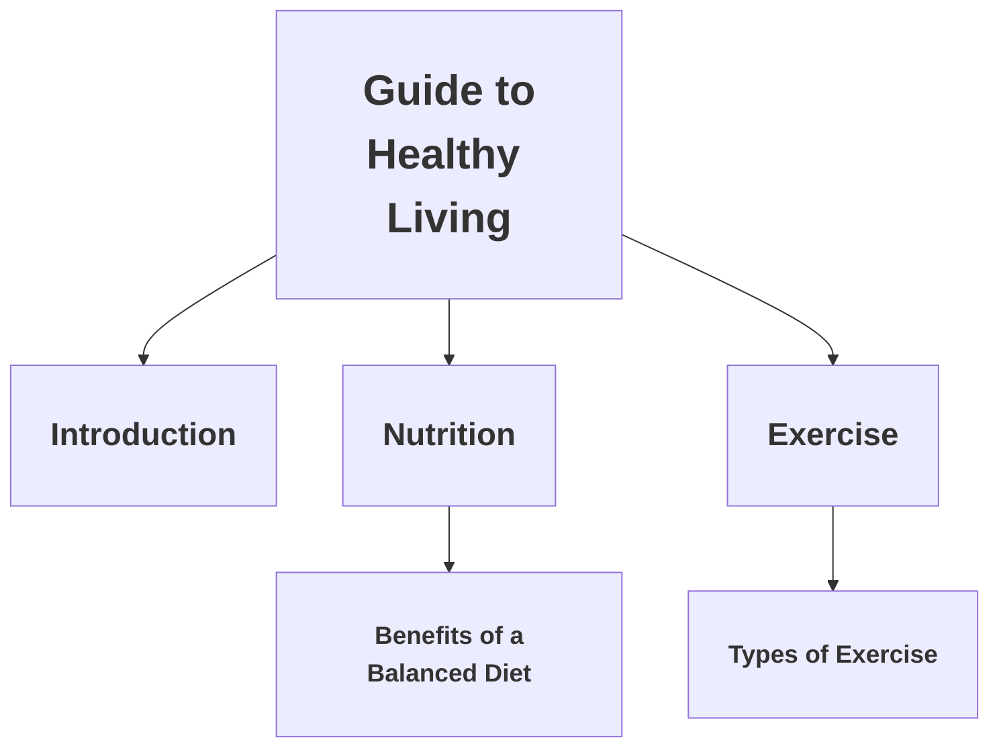

## 3.3 Using Headings and Paragraphs

In this section, we will delve into the fundamental building blocks of web content: headings and paragraphs. These elements are essential for organizing and presenting text on a web page. By the end of this chapter, you'll have a solid understanding of how to use heading and paragraph tags in HTML, the importance of semantic HTML, and how these elements contribute to the overall accessibility and structure of your web content.

### Understanding Headings in HTML

Headings are used to define the structure and hierarchy of content on a web page. HTML provides six levels of headings, `<h1>` through `<h6>`, with `<h1>` being the highest level and `<h6>` the lowest. These tags help search engines and assistive technologies understand the content's organization.

#### The `<h1>` to `<h6>` Tags

- **`<h1>`: Main Heading**
  - The `<h1>` tag is used for the main title of a page or a major section. It should be unique on a page to indicate the primary topic or purpose.
  
- **`<h2>`: Subheading**
  - The `<h2>` tag is used for subheadings that fall under the main heading. It helps break down content into sections.
  
- **`<h3>`: Sub-subheading**
  - The `<h3>` tag is used for further subdivisions within an `<h2>` section. It provides additional granularity.
  
- **`<h4>`, `<h5>`, `<h6>`: Further Subdivisions**
  - These tags are used for even finer subdivisions. They are less commonly used but can be helpful for complex content structures.

#### Example of Headings

```html
<!DOCTYPE html>
<html lang="en">
<head>
    <meta charset="UTF-8">
    <meta name="viewport" content="width=device-width, initial-scale=1.0">
    <title>Sample Page with Headings</title>
</head>
<body>
    <h1>Introduction to Web Development</h1>
    <h2>HTML Basics</h2>
    <h3>Using Headings</h3>
    <h4>Understanding the Hierarchy</h4>
    <h5>Best Practices</h5>
    <h6>Additional Resources</h6>
</body>
</html>
```

In this example, we see a clear hierarchy from `<h1>` to `<h6>`, illustrating how headings can be used to organize content logically.

#### Semantic HTML and Accessibility

Semantic HTML refers to the use of HTML tags that convey the meaning and structure of the content. Using headings semantically helps screen readers and search engines understand the importance and relationships of the content sections.

- **Accessibility:** Proper use of headings improves accessibility for users relying on screen readers. These devices often navigate content based on headings, allowing users to skip to sections of interest.
  
- **SEO Benefits:** Search engines use headings to index the content structure, which can impact search rankings positively.

#### Tips for Using Headings

- **Use `<h1>` for the main title only once per page.**
- **Use headings to create a logical structure.** Avoid skipping heading levels (e.g., jumping from `<h1>` to `<h3>`).
- **Keep headings concise and descriptive.** They should give a clear idea of the content that follows.

### Working with Paragraphs in HTML

The `<p>` tag is used to define paragraphs of text. It is a block-level element, meaning it starts on a new line and takes up the full width available.

#### The `<p>` Tag

- **Purpose:** The `<p>` tag is used to group sentences and provide structure to the text content.
- **Attributes:** While the `<p>` tag itself is simple, it can be styled using CSS to change its appearance.

#### Example of Paragraphs

```html
<!DOCTYPE html>
<html lang="en">
<head>
    <meta charset="UTF-8">
    <meta name="viewport" content="width=device-width, initial-scale=1.0">
    <title>Sample Page with Paragraphs</title>
</head>
<body>
    <h1>Welcome to Our Website</h1>
    <p>Our website offers a variety of resources for learning web development. Whether you're a beginner or an experienced developer, you'll find valuable information here.</p>
    <p>We cover topics such as HTML, CSS, JavaScript, and more. Our tutorials are designed to be easy to follow and understand.</p>
</body>
</html>
```

In this example, two paragraphs are used to provide information under the main heading.

#### Semantic HTML and Paragraphs

While paragraphs are inherently semantic, it's important to ensure that they are used appropriately to convey complete thoughts or ideas.

- **Clarity:** Each paragraph should focus on a single idea or topic.
- **Readability:** Break up long blocks of text into multiple paragraphs to enhance readability.

#### Tips for Using Paragraphs

- **Use paragraphs to separate distinct ideas.**
- **Avoid overly long paragraphs.** They can be difficult to read and may lose the reader's attention.
- **Use CSS for styling.** While the `<p>` tag itself is plain, CSS can be used to enhance its appearance.

### Structuring Content with Headings and Paragraphs

Combining headings and paragraphs allows you to create well-structured, readable web pages. Let's explore how to effectively use these elements together.

#### Example of Structured Content

```html
<!DOCTYPE html>
<html lang="en">
<head>
    <meta charset="UTF-8">
    <meta name="viewport" content="width=device-width, initial-scale=1.0">
    <title>Structured Content Example</title>
</head>
<body>
    <h1>Guide to Healthy Living</h1>
    <h2>Introduction</h2>
    <p>Living a healthy life involves making choices that improve your physical and mental well-being. This guide provides tips and advice on how to achieve a balanced lifestyle.</p>
    
    <h2>Nutrition</h2>
    <p>Nutrition is a key component of health. Eating a balanced diet provides the nutrients your body needs to function properly.</p>
    
    <h3>Benefits of a Balanced Diet</h3>
    <p>A balanced diet can help you maintain a healthy weight, reduce the risk of chronic diseases, and promote overall health.</p>
    
    <h2>Exercise</h2>
    <p>Regular physical activity is essential for maintaining a healthy body and mind. Exercise can improve cardiovascular health, strengthen muscles, and boost mood.</p>
    
    <h3>Types of Exercise</h3>
    <p>There are many types of exercise to choose from, including aerobic, strength training, and flexibility exercises. Find what works best for you and make it a regular part of your routine.</p>
</body>
</html>
```

In this example, headings are used to organize the content into sections and subsections, while paragraphs provide detailed information within each section.

### Visualizing Content Structure

To better understand how headings and paragraphs structure content, let's visualize the hierarchy using a diagram.



This diagram illustrates the hierarchical structure of the content, showing how headings nest within each other to create a clear outline.

### Try It Yourself

Now that we've covered the basics of using headings and paragraphs, it's time to experiment on your own. Try creating a simple web page with a structured layout using different heading levels and paragraphs. Here are some ideas to get you started:

- **Create a personal blog page** with sections for different topics you're interested in.
- **Design a product page** for an imaginary item, using headings to highlight features and benefits.
- **Build a simple tutorial page** on a topic you know well, using headings to break down the steps.

### Key Takeaways

- **Headings (`<h1>` to `<h6>`)** create a hierarchical structure for content, aiding both accessibility and SEO.
- **Paragraphs (`<p>`)** group related sentences, enhancing readability and clarity.
- **Semantic HTML** improves accessibility and search engine understanding.
- **Use CSS** to style headings and paragraphs for better visual appeal.

### Further Reading

For more information on headings, paragraphs, and semantic HTML, consider exploring the following resources:

- [MDN Web Docs: HTML Elements Reference](https://developer.mozilla.org/en-US/docs/Web/HTML/Element)
- [W3Schools: HTML Headings](https://www.w3schools.com/html/html_headings.asp)
- [WebAIM: Semantic Structure](https://webaim.org/techniques/semanticstructure/)

## Quiz Time!



### What is the purpose of the `<h1>` tag?

- [x] To define the main heading of a page
- [ ] To create a paragraph
- [ ] To add a hyperlink
- [ ] To insert an image

> **Explanation:** The `<h1>` tag is used to define the main heading of a page, indicating the primary topic or purpose.

### How many levels of headings are available in HTML?

- [x] Six
- [ ] Three
- [ ] Five
- [ ] Seven

> **Explanation:** HTML provides six levels of headings, from `<h1>` to `<h6>`, to organize content hierarchically.

### Which tag is used to define a paragraph in HTML?

- [x] `<p>`
- [ ] `<div>`
- [ ] `<span>`
- [ ] `<a>`

> **Explanation:** The `<p>` tag is used to define a paragraph in HTML, grouping related sentences together.

### Why is semantic HTML important?

- [x] It improves accessibility and search engine understanding.
- [ ] It makes the page load faster.
- [ ] It reduces the file size.
- [ ] It changes the color of the text.

> **Explanation:** Semantic HTML improves accessibility for users relying on assistive technologies and helps search engines understand the content's structure.

### What is the best practice for using the `<h1>` tag on a page?

- [x] Use it only once per page for the main title.
- [ ] Use it multiple times for different sections.
- [ ] Use it for every paragraph.
- [ ] Avoid using it altogether.

> **Explanation:** The `<h1>` tag should be used only once per page to indicate the main title or primary topic.

### Which heading level should you use for a subheading under an `<h2>` section?

- [x] `<h3>`
- [ ] `<h1>`
- [ ] `<h4>`
- [ ] `<h5>`

> **Explanation:** The `<h3>` tag is used for subheadings under an `<h2>` section, following the hierarchical structure.

### How can you enhance the appearance of paragraphs in HTML?

- [x] By using CSS for styling
- [ ] By using more `<p>` tags
- [ ] By changing the tag to `<div>`
- [ ] By adding more text

> **Explanation:** CSS can be used to style paragraphs, changing their appearance to enhance readability and design.

### What is the benefit of using headings for SEO?

- [x] They help search engines index the content structure.
- [ ] They make the page load faster.
- [ ] They reduce the file size.
- [ ] They change the color of the text.

> **Explanation:** Headings help search engines understand the content's structure, which can positively impact search rankings.

### What should you avoid when using headings?

- [x] Skipping heading levels
- [ ] Using headings for titles
- [ ] Using headings for subheadings
- [ ] Using headings for sections

> **Explanation:** Skipping heading levels (e.g., jumping from `<h1>` to `<h3>`) can disrupt the logical structure and should be avoided.

### True or False: Paragraphs should focus on a single idea or topic.

- [x] True
- [ ] False

> **Explanation:** Each paragraph should focus on a single idea or topic to maintain clarity and readability.


