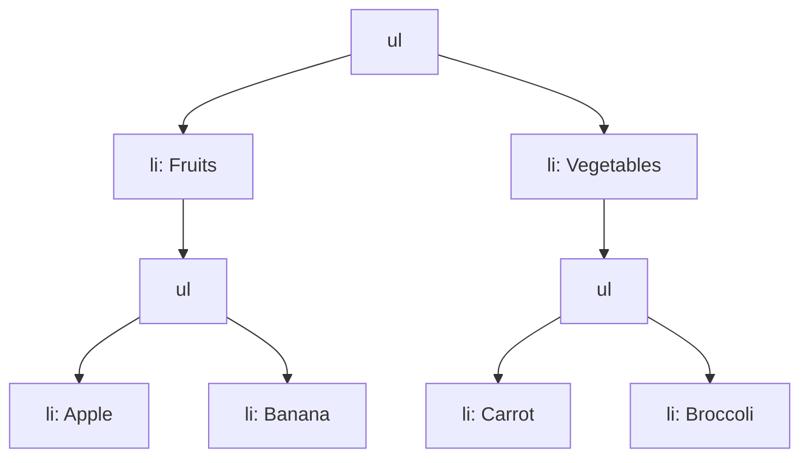

## 3.4 Working with Lists

Lists are a fundamental part of HTML and web design, allowing us to present information in a structured and organized manner. Whether you're listing ingredients for a recipe, steps in a process, or items in a shopping cart, HTML lists provide a clear and concise way to display content. In this section, we'll explore how to create and use lists in HTML, focusing on ordered and unordered lists, list items, and nested lists. By the end, you'll be able to effectively use lists to enhance your web pages.

### Understanding HTML Lists

HTML provides two primary types of lists: **ordered lists** and **unordered lists**. Each serves a different purpose and is used in different contexts.

#### Ordered Lists (`<ol>`)

An **ordered list** is used when the sequence of items is important. This type of list is typically numbered, making it ideal for instructions, rankings, or any situation where the order matters.

##### Syntax of Ordered Lists

The ordered list is created using the `<ol>` tag, and each item within the list is defined using the `<li>` (list item) tag.

```html
<ol>
  <li>First item</li>
  <li>Second item</li>
  <li>Third item</li>
</ol>
```

In the example above, the browser will display a numbered list:

1. First item
2. Second item
3. Third item

#### Unordered Lists (`<ul>`)

An **unordered list** is used when the order of items is not important. This type of list is typically bulleted, making it suitable for lists where sequence doesn't matter, such as features, options, or general information.

##### Syntax of Unordered Lists

The unordered list is created using the `<ul>` tag, with each item also defined using the `<li>` tag.

```html
<ul>
  <li>First item</li>
  <li>Second item</li>
  <li>Third item</li>
</ul>
```

This will display a bulleted list:

- First item
- Second item
- Third item

### Creating List Items with `<li>`

The `<li>` tag is used to define each item within both ordered and unordered lists. It's important to note that `<li>` tags must be nested within either `<ol>` or `<ul>` tags to be valid HTML.

#### Example of List Items

```html
<ul>
  <li>Apple</li>
  <li>Banana</li>
  <li>Cherry</li>
</ul>
```

This example creates an unordered list of fruits, each represented by a list item.

### Nesting Lists

Sometimes, you may need to create lists within lists, known as **nested lists**. This is useful for creating subcategories or detailing steps within steps.

#### Creating Nested Lists

To create a nested list, simply place a new `<ul>` or `<ol>` inside an `<li>` element of an existing list.

```html
<ul>
  <li>Fruits
    <ul>
      <li>Apple</li>
      <li>Banana</li>
    </ul>
  </li>
  <li>Vegetables
    <ul>
      <li>Carrot</li>
      <li>Broccoli</li>
    </ul>
  </li>
</ul>
```

This will display as:

- Fruits
  - Apple
  - Banana
- Vegetables
  - Carrot
  - Broccoli

### Practical Uses of Lists in Web Content

Lists are versatile and can be used in various contexts on a web page. Here are some practical uses:

- **Navigation Menus**: Lists are often used to create navigation menus, where each list item represents a link to a different page or section.
- **Feature Lists**: Highlighting features or benefits of a product or service.
- **Steps or Instructions**: Providing step-by-step instructions or processes.
- **Data Presentation**: Displaying data in a structured format, such as a list of items or categories.

### Styling Lists with CSS

While HTML provides the structure for lists, CSS can be used to style them, enhancing their appearance and usability.

#### Customizing List Markers

You can change the default markers (numbers or bullets) using the `list-style-type` property in CSS.

```css
ul {
  list-style-type: square;
}

ol {
  list-style-type: upper-roman;
}
```

This CSS will change the unordered list bullets to squares and the ordered list numbers to uppercase Roman numerals.

#### Removing List Markers

To remove markers altogether, set `list-style-type` to `none`.

```css
ul {
  list-style-type: none;
}
```

### Try It Yourself

To reinforce your understanding, try modifying the examples above. Experiment with different `list-style-type` values, create nested lists with more levels, or use CSS to change the appearance of your lists.

### Visualizing List Structures

To better understand how lists are structured, let's visualize an example using a diagram.



This diagram represents the nested list structure we discussed earlier, showing the hierarchy of elements.

### Summary

In this section, we've covered the basics of working with lists in HTML. You've learned how to create ordered and unordered lists, use list items, and nest lists for more complex structures. Lists are a powerful tool for organizing content on a web page, and with CSS, you can customize their appearance to fit your design needs.

### Further Reading

For more information on HTML lists and styling, check out these resources:

- [MDN Web Docs: HTML Lists](https://developer.mozilla.org/en-US/docs/Web/HTML/Element/ul)
- [W3Schools: HTML Lists](https://www.w3schools.com/html/html_lists.asp)

## Quiz Time!



### What tag is used to create an ordered list in HTML?

- [ ] `<ul>`
- [x] `<ol>`
- [ ] `<li>`
- [ ] `<list>`

> **Explanation:** The `<ol>` tag is used to create an ordered list in HTML.

### Which tag is used to define list items in both ordered and unordered lists?

- [ ] `<ul>`
- [ ] `<ol>`
- [x] `<li>`
- [ ] `<item>`

> **Explanation:** The `<li>` tag is used to define list items in both ordered and unordered lists.

### How do you create a nested list in HTML?

- [x] Place a new `<ul>` or `<ol>` inside an `<li>` element
- [ ] Use the `<nested>` tag
- [ ] Place a new `<li>` inside an `<ul>` or `<ol>` element
- [ ] Use the `<sublist>` tag

> **Explanation:** To create a nested list, you place a new `<ul>` or `<ol>` inside an existing `<li>` element.

### What CSS property is used to change the list marker style?

- [ ] `marker-style`
- [x] `list-style-type`
- [ ] `list-marker`
- [ ] `marker-type`

> **Explanation:** The `list-style-type` CSS property is used to change the list marker style.

### How can you remove list markers using CSS?

- [x] Set `list-style-type` to `none`
- [ ] Set `list-style-type` to `hidden`
- [ ] Set `marker-style` to `none`
- [ ] Set `marker-type` to `hidden`

> **Explanation:** To remove list markers, set `list-style-type` to `none`.

### Which of the following is a practical use of lists in web content?

- [x] Navigation menus
- [ ] Image galleries
- [ ] Video players
- [ ] Background images

> **Explanation:** Lists are often used to create navigation menus, among other things.

### What is the default list marker for an unordered list?

- [x] Bullet
- [ ] Number
- [ ] Dash
- [ ] Square

> **Explanation:** The default list marker for an unordered list is a bullet.

### What is the default list marker for an ordered list?

- [x] Number
- [ ] Bullet
- [ ] Dash
- [ ] Square

> **Explanation:** The default list marker for an ordered list is a number.

### True or False: `<li>` tags can be used outside of `<ul>` or `<ol>` tags.

- [ ] True
- [x] False

> **Explanation:** `<li>` tags must be nested within `<ul>` or `<ol>` tags to be valid HTML.

### True or False: You can use CSS to change the color of list markers.

- [x] True
- [ ] False

> **Explanation:** You can use CSS to change the color of list markers by styling the list items.


