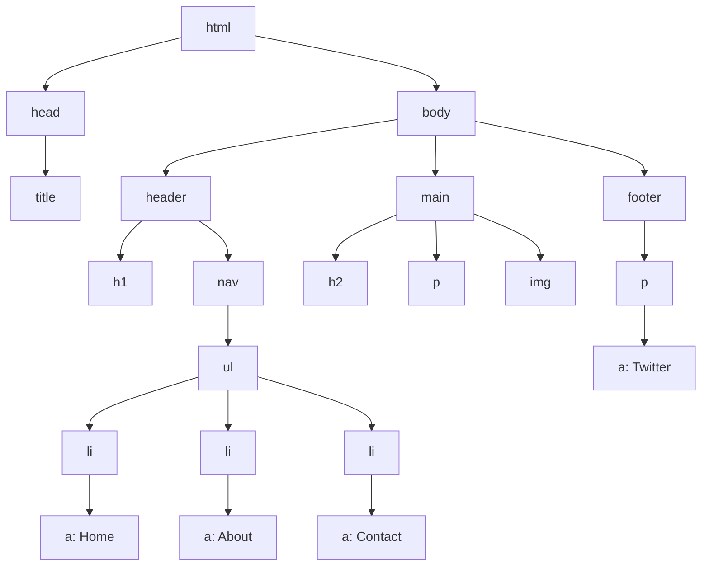

## 3.5 Adding Links and Images

In this section, we will explore how to add links and images to your web pages, enhancing their functionality and visual appeal. Links and images are fundamental components of the web, allowing users to navigate between pages and enjoy rich media content. By the end of this section, you'll be able to create hyperlinks to both internal and external resources and embed images effectively.

### Understanding the `<a>` Tag and the `href` Attribute

The `<a>` tag, also known as the anchor tag, is used to create hyperlinks in HTML. A hyperlink is a reference to data that the user can follow by clicking or tapping. The most crucial attribute of the `<a>` tag is `href`, which stands for "hypertext reference." This attribute specifies the URL of the page the link goes to.

#### Basic Structure of a Hyperlink

Here's a simple example of a hyperlink:

```html
<a href="https://www.example.com">Visit Example</a>
```

- **`<a>`**: This is the opening tag for the anchor element.
- **`href="https://www.example.com"`**: The `href` attribute contains the URL of the page you want to link to.
- **`Visit Example`**: This is the clickable text that users will see on the web page.
- **`</a>`**: This is the closing tag for the anchor element.

### Linking to Internal and External Pages

Links can point to different types of resources, including internal pages within the same website or external pages on the internet.

#### Linking to Internal Pages

To link to another page within the same website, you can use a relative path. A relative path is a way to specify the location of a file relative to the current document's location.

Example of an internal link:

```html
<a href="about.html">About Us</a>
```

In this example, clicking the link will take the user to the "about.html" page located in the same directory as the current page.

#### Linking to External Pages

For external links, you need to use an absolute path, which includes the full URL of the resource.

Example of an external link:

```html
<a href="https://www.google.com">Go to Google</a>
```

This link directs the user to Google's homepage.

### The `` Tag and the `src` and `alt` Attributes

The `` tag is used to embed images in a web page. Unlike the `<a>` tag, the `` tag is self-closing, meaning it doesn't have a separate closing tag. The two most important attributes of the `` tag are `src` and `alt`.

#### Basic Structure of an Image Element

Here's a simple example of an image element:

```html

```

- **``**: This is the tag used to embed an image.
- **`src="images/photo.jpg"`**: The `src` attribute specifies the path to the image file.
- **`alt="A beautiful scenery"`**: The `alt` attribute provides alternative text for the image, which is important for accessibility and SEO.

### Relative vs. Absolute Paths for Resources

When specifying paths for links and images, you can use either relative or absolute paths. Understanding the difference between these two is crucial for effective web development.

#### Relative Paths

A relative path is a way to specify the location of a file relative to the current document's location. This is useful for linking to resources within the same website.

Example:

```html
<a href="contact.html">Contact Us</a>

```

In these examples, "contact.html" and "images/logo.png" are relative paths.

#### Absolute Paths

An absolute path includes the full URL of the resource, starting with the protocol (e.g., `http://` or `https://`). This is necessary for linking to external resources.

Example:

```html
<a href="https://www.example.com/contact.html">Contact Us</a>

```

Here, the links point to resources hosted on "example.com."

### Inserting Images and Creating Navigational Links

Let's combine what we've learned to create a simple web page with links and images.

#### Example: A Simple Web Page with Links and Images

```html
<!DOCTYPE html>
<html lang="en">
<head>
    <meta charset="UTF-8">
    <meta name="viewport" content="width=device-width, initial-scale=1.0">
    <title>My First Web Page</title>
</head>
<body>
    <header>
        <h1>Welcome to My Website</h1>
        <nav>
            <ul>
                <li><a href="index.html">Home</a></li>
                <li><a href="about.html">About</a></li>
                <li><a href="contact.html">Contact</a></li>
            </ul>
        </nav>
    </header>
    <main>
        <h2>About Us</h2>
        <p>We are a company dedicated to providing the best services to our customers.</p>
        
    </main>
    <footer>
        <p>Follow us on <a href="https://www.twitter.com">Twitter</a></p>
    </footer>
</body>
</html>
```

In this example, we have:

- A navigation menu with internal links to "Home," "About," and "Contact" pages.
- An image of the company building with an appropriate `alt` attribute.
- A footer with an external link to Twitter.

### Try It Yourself

Now that you've seen how to add links and images, try modifying the example above:

- Change the `href` attributes to point to different pages or external websites.
- Replace the `src` attribute of the `` tag with a different image file path.
- Add more images and links to practice.

### Visualizing the DOM Structure

To better understand how links and images fit into the structure of an HTML document, let's visualize the DOM (Document Object Model) tree of our example page.



This diagram represents the hierarchical structure of the HTML elements in our example. The `<html>` element is the root, with `<head>` and `<body>` as its children. The `<body>` contains the main content, including the header, main section, and footer.

### Key Takeaways

- The `<a>` tag is used to create hyperlinks, with the `href` attribute specifying the destination URL.
- Use relative paths for internal links and absolute paths for external links.
- The `` tag embeds images, with `src` specifying the image file path and `alt` providing alternative text.
- Understanding the difference between relative and absolute paths is crucial for effective web development.
- Practice adding links and images to your web pages to enhance their functionality and visual appeal.

### Further Reading

For more information on HTML links and images, check out the following resources:

- [MDN Web Docs: `<a>`: The Anchor element](https://developer.mozilla.org/en-US/docs/Web/HTML/Element/a)
- [MDN Web Docs: ``: The Image element](https://developer.mozilla.org/en-US/docs/Web/HTML/Element/img)
- [W3Schools: HTML Links](https://www.w3schools.com/html/html_links.asp)
- [W3Schools: HTML Images](https://www.w3schools.com/html/html_images.asp)

## Quiz Time!



### What is the primary purpose of the `<a>` tag in HTML?

- [x] To create hyperlinks
- [ ] To display images
- [ ] To format text
- [ ] To create lists

> **Explanation:** The `<a>` tag is used to create hyperlinks, allowing users to navigate to different pages or resources.

### Which attribute of the `<a>` tag specifies the URL of the link destination?

- [x] href
- [ ] src
- [ ] alt
- [ ] title

> **Explanation:** The `href` attribute in the `<a>` tag specifies the URL of the page or resource the link points to.

### What does the `alt` attribute in the `` tag provide?

- [x] Alternative text for the image
- [ ] The URL of the image
- [ ] The title of the image
- [ ] The size of the image

> **Explanation:** The `alt` attribute provides alternative text for the image, which is important for accessibility and SEO.

### Which type of path should you use for linking to an external website?

- [x] Absolute path
- [ ] Relative path
- [ ] Internal path
- [ ] External path

> **Explanation:** An absolute path, which includes the full URL, is used for linking to external websites.

### What is the purpose of the `src` attribute in the `` tag?

- [x] To specify the path to the image file
- [ ] To provide alternative text for the image
- [ ] To set the image size
- [ ] To define the image format

> **Explanation:** The `src` attribute specifies the path to the image file that should be displayed.

### Which of the following is a self-closing tag?

- [x] ``
- [ ] `<a>`
- [ ] `<p>`
- [ ] `<div>`

> **Explanation:** The `` tag is self-closing, meaning it doesn't require a separate closing tag.

### What is the difference between relative and absolute paths?

- [x] Relative paths are relative to the current document's location, while absolute paths include the full URL.
- [ ] Relative paths include the full URL, while absolute paths are relative to the current document's location.
- [ ] Both are the same and can be used interchangeably.
- [ ] Relative paths are used for external links, while absolute paths are for internal links.

> **Explanation:** Relative paths are relative to the current document's location, while absolute paths include the full URL of the resource.

### Which tag is used to create a navigation menu in HTML?

- [x] `<nav>`
- [ ] `<menu>`
- [ ] `<ul>`
- [ ] `<header>`

> **Explanation:** The `<nav>` tag is used to define a set of navigation links.

### What is the purpose of the `title` attribute in the `<a>` tag?

- [x] To provide additional information about the link
- [ ] To specify the link destination
- [ ] To set the link color
- [ ] To define the link style

> **Explanation:** The `title` attribute provides additional information about the link, often displayed as a tooltip.

### True or False: The `` tag requires a closing tag.

- [ ] True
- [x] False

> **Explanation:** The `` tag is self-closing and does not require a separate closing tag.


