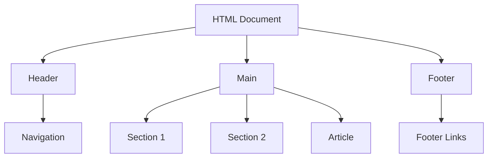

## 3.6 Structuring Content with Semantic Elements

In the world of web development, creating a well-structured and accessible web page is crucial. Semantic HTML elements introduced in HTML5 play a significant role in achieving this goal. These elements not only help in organizing content logically but also enhance the accessibility of your web pages and improve their search engine optimization (SEO). In this section, we will delve into the world of semantic HTML elements, understand their purpose, and learn how to use them effectively to build better web pages.

### What Are Semantic HTML Elements?

Semantic HTML elements are those that clearly describe their meaning in a human- and machine-readable way. These elements provide information about the type of content they contain, making it easier for browsers, search engines, and assistive technologies to understand the structure and content of a web page.

### The Importance of Semantic HTML

Semantic HTML is important for several reasons:

1. **Improved Accessibility**: Semantic elements help screen readers and other assistive technologies interpret the content of a web page more accurately, making it more accessible to users with disabilities.

2. **Better SEO**: Search engines use semantic elements to understand the content and context of a web page, which can improve the page's ranking in search results.

3. **Enhanced Readability**: Semantic elements make the HTML code more readable and maintainable for developers, as they provide a clear structure and meaning to the content.

4. **Consistent Structure**: Using semantic elements ensures a consistent structure across web pages, making it easier to manage and update content.

### Key Semantic HTML Elements

Let's explore some of the key semantic HTML elements introduced in HTML5 and understand their purpose and usage.

#### `<header>`

The `<header>` element represents a container for introductory content or navigational links. It typically contains headings, logos, and other introductory elements.

**Example:**

```html
<header>
  <h1>Welcome to My Website</h1>
  <nav>
    <ul>
      <li><a href="#home">Home</a></li>
      <li><a href="#about">About</a></li>
      <li><a href="#contact">Contact</a></li>
    </ul>
  </nav>
</header>
```

In this example, the `<header>` element contains a heading and a navigation menu, providing a clear introduction to the web page.

#### `<nav>`

The `<nav>` element is used to define a set of navigation links. It is typically used for the primary navigation menu of a website.

**Example:**

```html
<nav>
  <ul>
    <li><a href="#home">Home</a></li>
    <li><a href="#services">Services</a></li>
    <li><a href="#portfolio">Portfolio</a></li>
    <li><a href="#contact">Contact</a></li>
  </ul>
</nav>
```

The `<nav>` element in this example contains a list of links that allow users to navigate to different sections of the website.

#### `<main>`

The `<main>` element is used to encapsulate the dominant content of a web page. It should contain content that is unique to the page and not repeated across other pages, such as articles, blogs, or main features.

**Example:**

```html
<main>
  <article>
    <h2>Latest News</h2>
    <p>Stay updated with the latest news and trends in the industry.</p>
  </article>
</main>
```

In this example, the `<main>` element contains an article that represents the main content of the page.

#### `<section>`

The `<section>` element is used to define a thematic grouping of content. It is typically used to group related content together.

**Example:**

```html
<section>
  <h2>Our Services</h2>
  <p>We offer a wide range of services to meet your needs.</p>
</section>
```

The `<section>` element in this example groups together content related to the services offered by a business.

#### `<article>`

The `<article>` element is used to represent a self-contained piece of content that can be distributed or reused independently, such as a blog post, news article, or forum post.

**Example:**

```html
<article>
  <h2>Understanding Semantic HTML</h2>
  <p>Semantic HTML is a powerful tool for creating accessible and SEO-friendly web pages.</p>
</article>
```

In this example, the `<article>` element represents a standalone piece of content about semantic HTML.

#### `<footer>`

The `<footer>` element is used to define the footer of a document or section. It typically contains information about the author, copyright details, or links to related documents.

**Example:**

```html
<footer>
  <p>&copy; 2024 My Website. All rights reserved.</p>
  <nav>
    <ul>
      <li><a href="#privacy">Privacy Policy</a></li>
      <li><a href="#terms">Terms of Service</a></li>
    </ul>
  </nav>
</footer>
```

The `<footer>` element in this example contains copyright information and a navigation menu with links to important documents.

### Structuring a Web Page with Semantic Elements

Now that we understand the purpose of each semantic element, let's see how we can structure a simple web page using these elements.

**Example:**

```html
<!DOCTYPE html>
<html lang="en">
<head>
  <meta charset="UTF-8">
  <meta name="viewport" content="width=device-width, initial-scale=1.0">
  <title>My Semantic Web Page</title>
  <link rel="stylesheet" href="styles.css">
</head>
<body>
  <header>
    <h1>My Website</h1>
    <nav>
      <ul>
        <li><a href="#home">Home</a></li>
        <li><a href="#about">About</a></li>
        <li><a href="#services">Services</a></li>
        <li><a href="#contact">Contact</a></li>
      </ul>
    </nav>
  </header>

  <main>
    <section>
      <h2>About Us</h2>
      <p>Learn more about our company and our mission.</p>
    </section>
    <section>
      <h2>Our Services</h2>
      <p>Discover the wide range of services we offer.</p>
    </section>
    <article>
      <h2>Latest Blog Post</h2>
      <p>Stay updated with the latest trends and insights.</p>
    </article>
  </main>

  <footer>
    <p>&copy; 2024 My Website. All rights reserved.</p>
    <nav>
      <ul>
        <li><a href="#privacy">Privacy Policy</a></li>
        <li><a href="#terms">Terms of Service</a></li>
      </ul>
    </nav>
  </footer>
</body>
</html>
```

In this example, we have structured a web page using semantic elements to organize the content logically. The `<header>` contains the main heading and navigation menu, the `<main>` contains sections and an article, and the `<footer>` provides additional information and links.

### Benefits of Using Semantic HTML

Using semantic HTML elements offers several benefits:

1. **Accessibility**: Semantic elements provide meaningful context to assistive technologies, making it easier for users with disabilities to navigate and understand the content.

2. **SEO**: Search engines use semantic elements to better understand the content and context of a web page, which can improve the page's ranking in search results.

3. **Maintainability**: Semantic elements make the HTML code more readable and maintainable, as they provide a clear structure and meaning to the content.

4. **Consistency**: Using semantic elements ensures a consistent structure across web pages, making it easier to manage and update content.

### Encouraging the Use of Semantic HTML

As web developers, it's important to adopt semantic HTML in all projects. By using semantic elements, we can create web pages that are more accessible, SEO-friendly, and maintainable. Here are a few tips to encourage the use of semantic HTML:

- **Educate Yourself**: Stay informed about the latest developments in HTML and web accessibility. Resources like the [MDN Web Docs](https://developer.mozilla.org/en-US/docs/Web/HTML/Element) and [W3Schools](https://www.w3schools.com/html/html5_semantic_elements.asp) are great places to start.

- **Practice**: Regularly practice using semantic elements in your projects. Start with simple web pages and gradually incorporate more complex structures.

- **Collaborate**: Work with other developers to share knowledge and best practices for using semantic HTML. Join online communities and forums to learn from others.

- **Advocate**: Encourage your team and clients to adopt semantic HTML in their projects. Explain the benefits and provide examples of how it can improve accessibility and SEO.

### Try It Yourself

Now that we've covered the basics of semantic HTML elements, it's time to put your knowledge into practice. Try creating a simple web page using the semantic elements we've discussed. Experiment with different structures and see how they affect the readability and accessibility of your page.

**Challenge**: Create a web page for a fictional company using semantic HTML elements. Include a header with a navigation menu, a main section with multiple sections and articles, and a footer with additional information and links.

### Visual Aids

To help visualize the structure of a web page using semantic elements, let's look at a simple diagram representing the hierarchy of elements.



**Diagram Description**: This diagram represents the structure of a web page using semantic elements. The `<header>` contains the navigation, the `<main>` contains sections and an article, and the `<footer>` contains additional links.

### Summary

In this section, we've explored the importance of semantic HTML elements and how they can enhance the structure, accessibility, and SEO of a web page. By using elements like `<header>`, `<nav>`, `<main>`, `<section>`, `<article>`, and `<footer>`, we can create web pages that are more readable, maintainable, and accessible to all users. Remember to practice using these elements in your projects and encourage others to adopt semantic HTML for better web development practices.

## Quiz Time!



### Which semantic HTML element is used to define the main content of a web page?

- [ ] `<header>`
- [ ] `<footer>`
- [x] `<main>`
- [ ] `<nav>`

> **Explanation:** The `<main>` element is used to encapsulate the dominant content of a web page, which is unique to the page.

### What is the purpose of the `<nav>` element in HTML?

- [x] To define a set of navigation links
- [ ] To display images
- [ ] To contain the main content
- [ ] To provide footer information

> **Explanation:** The `<nav>` element is used to define a set of navigation links for a website.

### Which element should be used to represent a self-contained piece of content, such as a blog post?

- [ ] `<section>`
- [x] `<article>`
- [ ] `<header>`
- [ ] `<footer>`

> **Explanation:** The `<article>` element is used to represent a self-contained piece of content that can be distributed or reused independently.

### How do semantic HTML elements improve accessibility?

- [ ] By displaying images
- [x] By providing meaningful context to assistive technologies
- [ ] By reducing page load time
- [ ] By increasing font size

> **Explanation:** Semantic elements provide meaningful context to assistive technologies, making it easier for users with disabilities to navigate and understand the content.

### Which semantic element is typically used to group related content together?

- [x] `<section>`
- [ ] `<article>`
- [ ] `<header>`
- [ ] `<footer>`

> **Explanation:** The `<section>` element is used to define a thematic grouping of content, typically used to group related content together.

### What is the benefit of using semantic HTML for SEO?

- [x] It helps search engines understand the content and context of a web page
- [ ] It increases the font size
- [ ] It reduces the number of images
- [ ] It changes the background color

> **Explanation:** Semantic HTML helps search engines understand the content and context of a web page, which can improve the page's ranking in search results.

### Which element is used to define the footer of a document or section?

- [ ] `<header>`
- [ ] `<nav>`
- [ ] `<section>`
- [x] `<footer>`

> **Explanation:** The `<footer>` element is used to define the footer of a document or section, typically containing information about the author, copyright details, or links to related documents.

### How can semantic HTML elements enhance readability for developers?

- [ ] By reducing the number of lines of code
- [ ] By changing the font style
- [x] By providing a clear structure and meaning to the content
- [ ] By increasing the page load time

> **Explanation:** Semantic elements make the HTML code more readable and maintainable for developers, as they provide a clear structure and meaning to the content.

### What is a key advantage of using semantic HTML elements in web development?

- [x] Consistent structure across web pages
- [ ] Increased number of images
- [ ] Faster page load time
- [ ] Larger font size

> **Explanation:** Using semantic elements ensures a consistent structure across web pages, making it easier to manage and update content.

### True or False: The `<header>` element can contain a navigation menu.

- [x] True
- [ ] False

> **Explanation:** The `<header>` element can contain a navigation menu, along with other introductory content such as headings and logos.


