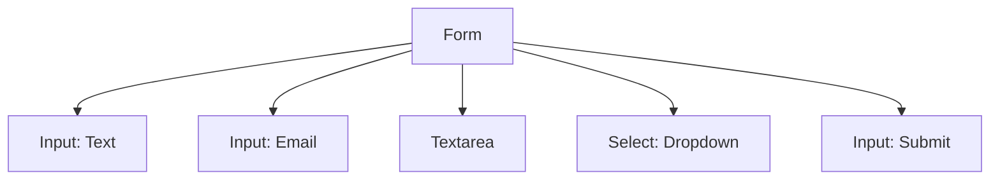

## 3.7 Forms and Input Elements

Forms are a fundamental part of the web, allowing users to interact with websites by providing input. Whether you're signing up for a newsletter, logging into an account, or submitting feedback, forms are the gateway to user interaction. In this section, we'll explore how to build basic forms using HTML, understand the different input elements available, and learn how to make your forms accessible and user-friendly.

### Understanding the `<form>` Tag

The `<form>` tag is the container for all form elements. It is used to collect user input and send it to a server for processing. A form can contain various types of input elements, such as text fields, checkboxes, radio buttons, and more.

#### Basic Structure of a Form

Here's a simple example of a form:

```html
<form action="/submit" method="post">
  <!-- Form elements go here -->
</form>
```

- **`action` attribute**: Specifies the URL where the form data should be sent.
- **`method` attribute**: Defines the HTTP method to use when sending form data. Common methods are `GET` and `POST`.

### Creating Input Fields

Input fields are the building blocks of forms. They allow users to enter data, select options, and submit information.

#### The `<input>` Element

The `<input>` element is one of the most versatile form elements. It can be used to create various types of input fields by changing the `type` attribute.

##### Common Input Types

1. **Text Input**: Used for single-line text input.
   ```html
   <input type="text" name="username" placeholder="Enter your username">
   ```

2. **Password Input**: Masks the input for privacy.
   ```html
   <input type="password" name="password" placeholder="Enter your password">
   ```

3. **Email Input**: Validates email addresses.
   ```html
   <input type="email" name="email" placeholder="Enter your email">
   ```

4. **Submit Button**: Submits the form data.
   ```html
   <input type="submit" value="Submit">
   ```

5. **Checkbox**: Allows for multiple selections.
   ```html
   <input type="checkbox" name="subscribe" value="newsletter"> Subscribe to newsletter
   ```

6. **Radio Button**: Allows for a single selection from a group.
   ```html
   <input type="radio" name="gender" value="male"> Male
   <input type="radio" name="gender" value="female"> Female
   ```

7. **Date Input**: Allows users to select a date.
   ```html
   <input type="date" name="birthday">
   ```

#### The `<textarea>` Element

The `<textarea>` element is used for multi-line text input, such as comments or messages.

```html
<textarea name="message" rows="4" cols="50" placeholder="Enter your message here"></textarea>
```

- **`rows` and `cols` attributes**: Define the visible number of lines and width of the textarea.

#### The `<select>` Element

The `<select>` element creates a dropdown list, allowing users to choose from a list of options.

```html
<select name="country">
  <option value="us">United States</option>
  <option value="ca">Canada</option>
  <option value="uk">United Kingdom</option>
</select>
```

- **`<option>` elements**: Define the options available in the dropdown.

### Labels and Accessibility

Labels are crucial for accessibility, as they associate text with form controls, making it easier for users to understand what input is required.

#### Using the `<label>` Element

The `<label>` element is used to define labels for input elements. It can be associated with an input element by using the `for` attribute, which matches the `id` of the input.

```html
<label for="username">Username:</label>
<input type="text" id="username" name="username">
```

### Importance of Forms in Interactive Web Pages

Forms are essential for creating interactive web pages. They enable user engagement by allowing users to provide input, which can be processed to perform various actions, such as:

- **User Registration**: Collecting user information to create accounts.
- **Feedback and Surveys**: Gathering user opinions and feedback.
- **Search Functionality**: Allowing users to search for content on a website.
- **E-commerce**: Facilitating online purchases and transactions.

### Building a Simple Form

Let's build a simple form that collects a user's name, email, and message.

```html
<form action="/submit" method="post">
  <label for="name">Name:</label>
  <input type="text" id="name" name="name" required><br>

  <label for="email">Email:</label>
  <input type="email" id="email" name="email" required><br>

  <label for="message">Message:</label>
  <textarea id="message" name="message" rows="4" cols="50" required></textarea><br>

  <input type="submit" value="Send">
</form>
```

- **`required` attribute**: Ensures that the field must be filled out before submitting the form.

### Try It Yourself

Experiment with the form by adding new input elements or changing the existing ones. For example, try adding a dropdown menu for selecting a topic:

```html
<label for="topic">Topic:</label>
<select id="topic" name="topic">
  <option value="general">General Inquiry</option>
  <option value="support">Support</option>
  <option value="feedback">Feedback</option>
</select><br>
```

### Visualizing Form Structure

Let's visualize the structure of a form using a diagram to better understand how different elements are organized.



This diagram shows the hierarchical structure of a form, with each input element connected to the main form container.

### Key Takeaways

- The `<form>` tag is the container for all form elements and is used to collect user input.
- Input elements like `<input>`, `<textarea>`, and `<select>` allow users to provide data.
- Different input types serve various purposes, such as text, email, password, and more.
- Labels improve accessibility by associating text with form controls.
- Forms are crucial for creating interactive web pages and engaging users.

### Further Reading

For more information on HTML forms and input elements, check out these resources:

- [MDN Web Docs: HTML Forms](https://developer.mozilla.org/en-US/docs/Learn/Forms)
- [W3Schools: HTML Forms](https://www.w3schools.com/html/html_forms.asp)

## Quiz Time!



### What is the purpose of the `<form>` tag in HTML?

- [x] To collect user input and send it to a server for processing.
- [ ] To display images on a web page.
- [ ] To create hyperlinks between pages.
- [ ] To style the web page with CSS.

> **Explanation:** The `<form>` tag is used to collect user input and send it to a server for processing, making it essential for interactive web pages.

### Which attribute of the `<form>` tag specifies the URL where the form data should be sent?

- [x] `action`
- [ ] `method`
- [ ] `name`
- [ ] `id`

> **Explanation:** The `action` attribute of the `<form>` tag specifies the URL where the form data should be sent for processing.

### What input type is used to mask the input for privacy?

- [ ] `text`
- [x] `password`
- [ ] `email`
- [ ] `submit`

> **Explanation:** The `password` input type masks the input for privacy, hiding the characters entered by the user.

### How can you associate a label with an input element for accessibility?

- [x] Use the `<label>` element with the `for` attribute matching the `id` of the input.
- [ ] Use the `<span>` element with the `class` attribute.
- [ ] Use the `<div>` element with the `id` attribute.
- [ ] Use the `<p>` element with the `name` attribute.

> **Explanation:** The `<label>` element can be associated with an input element by using the `for` attribute, which matches the `id` of the input, improving accessibility.

### Which input element allows users to select a date?

- [ ] `<input type="text">`
- [ ] `<input type="email">`
- [ ] `<input type="password">`
- [x] `<input type="date">`

> **Explanation:** The `<input type="date">` element allows users to select a date from a date picker.

### What is the purpose of the `required` attribute in form elements?

- [x] To ensure that the field must be filled out before submitting the form.
- [ ] To style the form element with CSS.
- [ ] To create a hyperlink to another page.
- [ ] To display an image in the form.

> **Explanation:** The `required` attribute ensures that the field must be filled out before submitting the form, making it a crucial part of form validation.

### Which input type allows for multiple selections?

- [ ] `radio`
- [x] `checkbox`
- [ ] `text`
- [ ] `submit`

> **Explanation:** The `checkbox` input type allows for multiple selections, enabling users to select more than one option.

### What element is used to create a dropdown list in a form?

- [ ] `<input>`
- [ ] `<textarea>`
- [x] `<select>`
- [ ] `<button>`

> **Explanation:** The `<select>` element is used to create a dropdown list in a form, allowing users to choose from a list of options.

### Which attribute of the `<input>` element specifies the type of input?

- [x] `type`
- [ ] `name`
- [ ] `value`
- [ ] `id`

> **Explanation:** The `type` attribute of the `<input>` element specifies the type of input, such as text, email, password, etc.

### True or False: The `<textarea>` element is used for single-line text input.

- [ ] True
- [x] False

> **Explanation:** False. The `<textarea>` element is used for multi-line text input, such as comments or messages.


