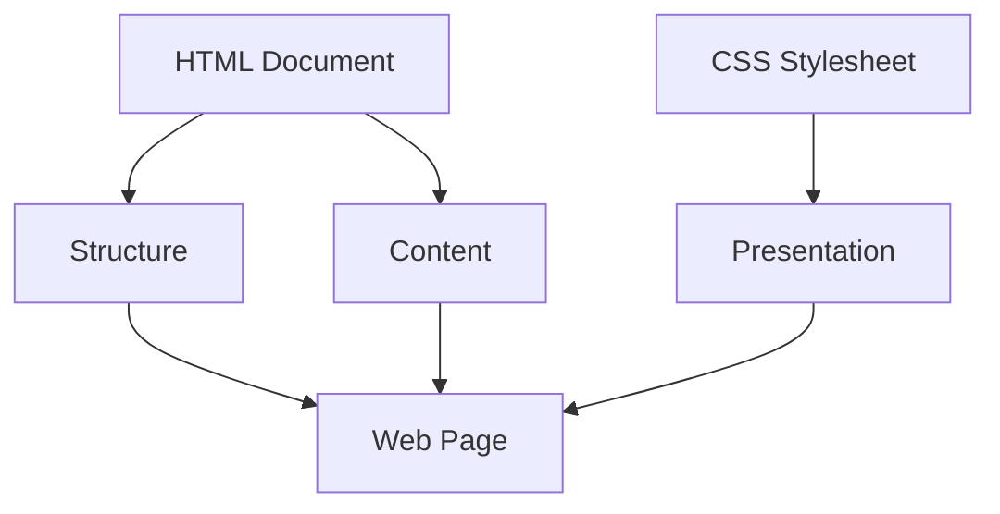

## 4.1 Introduction to CSS

Welcome to the world of CSS, or Cascading Style Sheets, a cornerstone technology in web development that allows us to bring life and style to our web pages. In this section, we will explore what CSS is, its role in web development, and how it helps us separate content from presentation. We will also look at examples of styled versus unstyled HTML pages and discuss the benefits of using CSS for design consistency. By the end of this section, you will view CSS as a powerful tool for styling and enhancing your web projects.

### What is CSS?

CSS stands for Cascading Style Sheets. It is a stylesheet language used to describe the presentation of a document written in HTML or XML. CSS defines how elements should be rendered on screen, on paper, or in other media. It allows you to apply styles such as colors, fonts, spacing, and layout to your web pages, making them visually appealing and user-friendly.

#### The Role of CSS in Web Development

CSS plays a crucial role in web development by providing a means to separate content from presentation. This separation allows developers to maintain and update the visual aspects of a website without altering the underlying HTML structure. Here’s a simple analogy: think of HTML as the skeleton of a web page, providing the structure, while CSS is the clothing and makeup, adding style and visual appeal.

### Separation of Content and Presentation

One of the fundamental principles of modern web development is the separation of content and presentation. This principle is achieved by using HTML to define the structure and content of a web page, while CSS is used to control its appearance. This separation offers several advantages:

1. **Maintainability**: By keeping HTML and CSS separate, you can update the styles of a website without touching the HTML. This makes it easier to maintain and update your site over time.

2. **Reusability**: CSS allows you to define styles once and apply them to multiple elements or pages. This reduces redundancy and ensures consistency across your website.

3. **Flexibility**: With CSS, you can easily change the look and feel of your website by modifying a few lines of code, allowing for quick design iterations.

4. **Accessibility**: Separating content from presentation helps ensure that your website is accessible to users with disabilities, as screen readers and other assistive technologies can more easily interpret the content.

### Styled vs. Unstyled HTML Pages

To truly appreciate the power of CSS, let's compare an unstyled HTML page with a styled one.

#### Unstyled HTML Example

```html
<!DOCTYPE html>
<html lang="en">
<head>
    <meta charset="UTF-8">
    <meta name="viewport" content="width=device-width, initial-scale=1.0">
    <title>Unstyled Page</title>
</head>
<body>
    <h1>Welcome to My Web Page</h1>
    <p>This is a paragraph of text on my web page. It is currently unstyled.</p>
    <ul>
        <li>Item 1</li>
        <li>Item 2</li>
        <li>Item 3</li>
    </ul>
</body>
</html>
```

#### Styled HTML Example with CSS

```html
<!DOCTYPE html>
<html lang="en">
<head>
    <meta charset="UTF-8">
    <meta name="viewport" content="width=device-width, initial-scale=1.0">
    <title>Styled Page</title>
    <style>
        body {
            font-family: Arial, sans-serif;
            background-color: #f0f0f0;
            color: #333;
            margin: 0;
            padding: 20px;
        }
        h1 {
            color: #007BFF;
            text-align: center;
        }
        p {
            font-size: 18px;
            line-height: 1.6;
        }
        ul {
            list-style-type: square;
            padding-left: 20px;
        }
    </style>
</head>
<body>
    <h1>Welcome to My Web Page</h1>
    <p>This is a paragraph of text on my web page. It is now styled with CSS for better readability and aesthetics.</p>
    <ul>
        <li>Item 1</li>
        <li>Item 2</li>
        <li>Item 3</li>
    </ul>
</body>
</html>
```

#### Explanation of the Styled Example

In the styled example, we have added a `<style>` block within the `<head>` section of the HTML document. This block contains CSS rules that define how the elements on the page should be styled. Let's break down some of these styles:

- **Body Styles**: We set a font family of Arial, a background color of light gray (`#f0f0f0`), and a text color of dark gray (`#333`). We also added some padding to the body for spacing.

- **Heading Styles**: The `<h1>` element is styled with a blue color (`#007BFF`) and centered text alignment.

- **Paragraph Styles**: The paragraph text is given a font size of 18px and a line height of 1.6 for improved readability.

- **List Styles**: The unordered list uses square bullets and has additional padding on the left.

### Benefits of Using CSS for Design Consistency

CSS is a powerful tool for achieving design consistency across your web pages. Here are some of the key benefits:

1. **Uniformity**: By defining styles in a single CSS file, you can ensure that all pages on your website have a consistent look and feel. This uniformity enhances the user experience and reinforces your brand identity.

2. **Efficiency**: CSS allows you to apply styles to multiple elements simultaneously, reducing the need for repetitive code. This efficiency speeds up development and makes your codebase easier to manage.

3. **Scalability**: As your website grows, CSS makes it easy to scale your design. You can add new styles or modify existing ones without having to rewrite large portions of your HTML.

4. **Customization**: CSS provides a wide range of styling options, from simple color changes to complex animations. This flexibility allows you to create unique and engaging designs that captivate your audience.

5. **Responsive Design**: CSS enables you to create responsive designs that adapt to different screen sizes and devices. With media queries and flexible layouts, you can ensure that your website looks great on desktops, tablets, and smartphones.

### Viewing CSS as a Powerful Styling Tool

As we delve deeper into CSS, it's important to view it as more than just a way to add color and fonts to your web pages. CSS is a powerful styling tool that allows you to create visually stunning and highly interactive web experiences. Here are a few ways to harness the full potential of CSS:

- **Experiment with Layouts**: Use CSS to experiment with different layouts, such as grid and flexbox, to create complex and responsive designs.

- **Incorporate Animations**: Add animations and transitions to your elements to enhance user interaction and engagement.

- **Utilize CSS Variables**: Use CSS variables to create dynamic and reusable styles that can be easily updated across your website.

- **Explore Advanced Selectors**: Learn about advanced CSS selectors and pseudo-classes to target specific elements and states for styling.

- **Stay Updated**: CSS is constantly evolving, with new features and capabilities being added regularly. Stay updated with the latest developments to keep your designs fresh and innovative.

### Try It Yourself

Now that we've covered the basics of CSS, it's time to put your knowledge into practice. Try modifying the styled HTML example above by changing the colors, fonts, and layout. Experiment with different styles to see how they affect the appearance of your web page. Remember, CSS is a creative tool, so don't be afraid to explore and have fun with it!

### Visual Aids

To help visualize the separation of content and presentation, let's use a simple diagram to illustrate how HTML and CSS work together:



**Diagram Explanation**: This diagram shows how the HTML document provides the structure and content of a web page, while the CSS stylesheet defines its presentation. Together, they create the final web page that users see.

### References and Links

For further reading and exploration of CSS, check out these reputable resources:

- [MDN Web Docs: CSS](https://developer.mozilla.org/en-US/docs/Web/CSS)
- [W3Schools: CSS Tutorial](https://www.w3schools.com/css/)
- [CSS-Tricks: A Complete Guide to CSS](https://css-tricks.com/snippets/css/complete-guide-grid/)

### Engagement and Reinforcement

To reinforce your learning, consider these questions and challenges:

- **Question**: What are the benefits of separating content and presentation in web development?
- **Challenge**: Create a simple web page with HTML and CSS that includes a header, a paragraph, and a list. Style the page with your choice of colors and fonts.

### Summary

In this section, we introduced CSS and its role in web development. We learned about the separation of content and presentation, explored examples of styled versus unstyled HTML pages, and discussed the benefits of using CSS for design consistency. We also encouraged you to view CSS as a powerful styling tool that can enhance your web projects. As you continue your journey in web development, remember that CSS is a versatile and creative tool that allows you to bring your designs to life.

## Quiz Time!



### What does CSS stand for?

- [x] Cascading Style Sheets
- [ ] Computer Style Sheets
- [ ] Creative Style Sheets
- [ ] Colorful Style Sheets

> **Explanation:** CSS stands for Cascading Style Sheets, which is used to style and layout web pages.

### What is the primary role of CSS in web development?

- [x] To separate content from presentation
- [ ] To create the structure of a web page
- [ ] To add interactivity to a web page
- [ ] To store data on a server

> **Explanation:** CSS is used to separate the content (HTML) from the presentation (styles) of a web page.

### Which of the following is a benefit of using CSS?

- [x] Design consistency
- [ ] Faster HTML loading
- [ ] Easier JavaScript integration
- [ ] Improved server performance

> **Explanation:** CSS provides design consistency by allowing styles to be applied uniformly across multiple pages.

### How does CSS improve maintainability?

- [x] By allowing styles to be updated without changing HTML
- [ ] By reducing the number of HTML tags
- [ ] By increasing server speed
- [ ] By storing data locally

> **Explanation:** CSS improves maintainability by separating styles from HTML, making it easier to update the design without altering the HTML structure.

### Which of the following is NOT a CSS property?

- [ ] color
- [ ] font-size
- [x] onClick
- [ ] margin

> **Explanation:** `onClick` is an event handler in JavaScript, not a CSS property.

### What is the purpose of the `<style>` tag in HTML?

- [x] To embed CSS directly within an HTML document
- [ ] To link to an external CSS file
- [ ] To add JavaScript to an HTML document
- [ ] To create a new HTML element

> **Explanation:** The `<style>` tag is used to embed CSS directly within an HTML document.

### What does the CSS rule `body { background-color: #f0f0f0; }` do?

- [x] Sets the background color of the body to light gray
- [ ] Changes the text color of the body to light gray
- [ ] Adds a border to the body
- [ ] Centers the text in the body

> **Explanation:** This CSS rule sets the background color of the body element to light gray.

### Which CSS property is used to change the text color?

- [x] color
- [ ] font-color
- [ ] text-color
- [ ] background-color

> **Explanation:** The `color` property is used to change the text color in CSS.

### How can you make a list use square bullets in CSS?

- [x] list-style-type: square;
- [ ] bullet-style: square;
- [ ] list-bullet: square;
- [ ] bullet-type: square;

> **Explanation:** The `list-style-type` property is used to change the bullet style of a list.

### True or False: CSS can be used to create animations.

- [x] True
- [ ] False

> **Explanation:** CSS can be used to create animations using properties like `animation` and `transition`.


