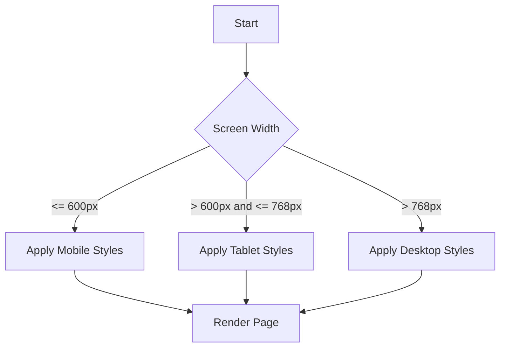

## 4.10 Responsive Design and Media Queries

In today's digital age, users access websites from a variety of devices, including smartphones, tablets, laptops, and desktops. Each of these devices has different screen sizes and resolutions, which can affect how a web page is displayed. Responsive design is a crucial aspect of modern web development that ensures your web pages look great and function well on any device. In this section, we'll explore the concept of responsive design, introduce media queries, and discuss how to use relative units for scalability. We'll also encourage a mobile-first approach to designing responsive web pages.

### Understanding Responsive Design

Responsive design is a design approach that aims to create web pages that adapt to the size and orientation of the user's screen. The goal is to provide an optimal viewing experience, with easy reading and navigation, across a wide range of devices. This means that a responsive web page should look good and be usable on both small screens, like those on smartphones, and large screens, like those on desktop computers.

#### Key Principles of Responsive Design

1. **Fluid Grids**: Use flexible grid layouts that adjust to the screen size. Instead of fixed pixel dimensions, use relative units like percentages to define widths.

2. **Flexible Images**: Ensure images scale with the grid. Use CSS to set the maximum width of images to 100% so they don't overflow their containers.

3. **Media Queries**: Apply different styles based on the characteristics of the user's device, such as screen width, height, and orientation.

### Introduction to Media Queries

Media queries are a powerful tool in CSS that allow you to apply styles based on the characteristics of the device displaying your web page. They enable you to create responsive designs by specifying different styles for different screen sizes and orientations.

#### How Media Queries Work

A media query consists of a media type and one or more expressions that check for the conditions of particular media features. When the conditions in a media query are met, the styles within the media query are applied.

Here's a basic example of a media query:

```css
/* Default styles for all devices */
body {
  font-size: 16px;
  background-color: white;
}

/* Styles for devices with a maximum width of 600px */
@media (max-width: 600px) {
  body {
    font-size: 14px;
    background-color: lightgray;
  }
}
```

In this example, the default styles are applied to all devices. However, if the device's screen width is 600 pixels or less, the styles inside the media query are applied, changing the font size and background color.

#### Common Media Features

- **Width and Height**: Target specific screen dimensions.
- **Orientation**: Apply styles based on whether the device is in portrait or landscape mode.
- **Resolution**: Adjust styles for high-resolution screens, such as Retina displays.

### Applying Styles for Different Screen Sizes

To create a truly responsive design, you should define styles for various screen sizes. This often involves setting breakpoints, which are specific screen widths where your design needs to change to accommodate the screen size.

#### Example: Responsive Navigation Menu

Let's create a simple navigation menu that adapts to different screen sizes using media queries.

```html
<!DOCTYPE html>
<html lang="en">
<head>
  <meta charset="UTF-8">
  <meta name="viewport" content="width=device-width, initial-scale=1.0">
  <title>Responsive Navigation Menu</title>
  <style>
    /* Base styles for the navigation menu */
    nav {
      background-color: #333;
      overflow: hidden;
    }

    nav ul {
      list-style-type: none;
      margin: 0;
      padding: 0;
      display: flex;
      justify-content: space-around;
    }

    nav ul li {
      display: inline;
    }

    nav ul li a {
      display: block;
      color: white;
      text-align: center;
      padding: 14px 16px;
      text-decoration: none;
    }

    nav ul li a:hover {
      background-color: #575757;
    }

    /* Styles for screens smaller than 600px */
    @media (max-width: 600px) {
      nav ul {
        flex-direction: column;
      }
    }
  </style>
</head>
<body>
  <nav>
    <ul>
      <li><a href="#home">Home</a></li>
      <li><a href="#about">About</a></li>
      <li><a href="#services">Services</a></li>
      <li><a href="#contact">Contact</a></li>
    </ul>
  </nav>
</body>
</html>
```

In this example, the navigation menu is displayed as a horizontal list on larger screens. When the screen width is 600 pixels or less, the menu items stack vertically, making it easier to navigate on smaller devices.

### Using Relative Units for Scalability

To ensure your web page scales well across different devices, it's important to use relative units like percentages (`%`), `em`, and `rem` instead of fixed units like pixels (`px`).

#### Percentages (`%`)

Percentages are relative to the parent element's size. They are often used for widths and heights to create fluid layouts.

```css
.container {
  width: 80%; /* The container takes up 80% of the parent's width */
}
```

#### `em` and `rem`

- **`em`**: Relative to the font size of the element. If an element has a font size of 16px, 1em is equal to 16px.
- **`rem`**: Relative to the root element's font size, usually the `<html>` element. This makes `rem` units more predictable and easier to manage.

```css
body {
  font-size: 16px; /* Base font size */
}

h1 {
  font-size: 2em; /* 32px, because 2 * 16px = 32px */
}

p {
  font-size: 1rem; /* 16px, because 1 * 16px = 16px */
}
```

### Designing with a Mobile-First Approach

A mobile-first approach involves designing your web page for mobile devices first and then adding styles for larger screens. This approach ensures your web page is optimized for smaller screens, which are often the most challenging to design for due to limited space.

#### Benefits of Mobile-First Design

- **Performance**: Mobile devices often have slower internet connections, so optimizing for mobile first can improve performance.
- **User Experience**: Designing for mobile first ensures a seamless experience for the growing number of mobile users.
- **Progressive Enhancement**: Start with a basic design and add enhancements for larger screens.

#### Implementing Mobile-First Design

To implement a mobile-first design, start with styles for the smallest screen size and use media queries to add styles for larger screens.

```css
/* Base styles for mobile devices */
body {
  font-size: 14px;
  background-color: white;
}

/* Styles for tablets and larger screens */
@media (min-width: 768px) {
  body {
    font-size: 16px;
  }
}

/* Styles for desktops and larger screens */
@media (min-width: 1024px) {
  body {
    font-size: 18px;
  }
}
```

### Try It Yourself

Now that we've covered the basics of responsive design and media queries, try creating a simple responsive layout on your own. Start with a basic HTML structure and use CSS to define styles for different screen sizes. Experiment with different breakpoints and relative units to see how they affect your design.

### Visual Aids

To better understand how media queries work, let's visualize the concept using a flowchart.



**Diagram Description**: This flowchart illustrates how media queries apply different styles based on screen width. The process starts by checking the screen width and applies the appropriate styles for mobile, tablet, or desktop devices.

### References and Links

For further reading on responsive design and media queries, check out these resources:

- [MDN Web Docs: Media Queries](https://developer.mozilla.org/en-US/docs/Web/CSS/Media_Queries/Using_media_queries)
- [W3Schools: CSS Media Queries](https://www.w3schools.com/css/css_rwd_mediaqueries.asp)
- [A List Apart: Responsive Web Design](https://alistapart.com/article/responsive-web-design/)

### Engagement and Reinforcement

To reinforce your understanding of responsive design and media queries, consider these questions:

- What are the key principles of responsive design?
- How do media queries work, and what are some common media features?
- Why is it beneficial to use relative units like `%`, `em`, and `rem`?
- What are the advantages of a mobile-first approach?

### Exercises

1. Create a responsive web page with a header, main content area, and footer. Use media queries to adjust the layout for mobile, tablet, and desktop screens.
2. Experiment with different relative units (`%`, `em`, `rem`) to see how they affect the scalability of your design.
3. Implement a mobile-first design by starting with styles for the smallest screen size and progressively enhancing for larger screens.

### Key Takeaways

- Responsive design ensures your web pages look good on all devices by adapting to different screen sizes and orientations.
- Media queries allow you to apply styles based on device characteristics, such as screen width and orientation.
- Using relative units like `%`, `em`, and `rem` helps create scalable designs that work well across different devices.
- A mobile-first approach focuses on designing for mobile devices first, ensuring a seamless experience for mobile users.

By understanding and implementing these concepts, you'll be well-equipped to create responsive web pages that provide an optimal user experience on any device.

## Quiz Time!



### What is the primary goal of responsive design?

- [x] To ensure web pages look good on all devices
- [ ] To make web pages load faster
- [ ] To improve search engine rankings
- [ ] To reduce server load

> **Explanation:** Responsive design aims to create web pages that adapt to different screen sizes and orientations, ensuring a good user experience on all devices.

### What are media queries used for in CSS?

- [x] To apply styles based on device characteristics
- [ ] To optimize images for the web
- [ ] To improve JavaScript performance
- [ ] To create animations

> **Explanation:** Media queries allow you to apply different styles based on the characteristics of the user's device, such as screen width and orientation.

### Which of the following is a relative unit in CSS?

- [x] %
- [ ] px
- [x] em
- [x] rem

> **Explanation:** `%`, `em`, and `rem` are relative units, while `px` is a fixed unit.

### What is the benefit of using a mobile-first approach?

- [x] It ensures a seamless experience for mobile users
- [ ] It makes the website load faster on desktops
- [ ] It reduces the need for media queries
- [ ] It improves server performance

> **Explanation:** A mobile-first approach focuses on designing for mobile devices first, ensuring a seamless experience for mobile users.

### How do you apply styles for devices with a maximum width of 600px?

- [x] @media (max-width: 600px) { ... }
- [ ] @media (min-width: 600px) { ... }
- [ ] @media (width: 600px) { ... }
- [ ] @media (max-height: 600px) { ... }

> **Explanation:** The `@media (max-width: 600px)` query applies styles to devices with a maximum width of 600 pixels.

### What does `1em` represent in CSS?

- [x] The font size of the element
- [ ] The width of the viewport
- [ ] The height of the viewport
- [ ] The root element's font size

> **Explanation:** `1em` is relative to the font size of the element.

### Why should you use relative units like `%`, `em`, and `rem`?

- [x] To create scalable designs
- [ ] To reduce code complexity
- [x] To ensure designs work well across devices
- [ ] To improve server performance

> **Explanation:** Relative units help create scalable designs that work well across different devices.

### Which media feature is used to apply styles based on screen orientation?

- [x] orientation
- [ ] width
- [ ] height
- [ ] resolution

> **Explanation:** The `orientation` media feature applies styles based on whether the device is in portrait or landscape mode.

### What is the purpose of a breakpoint in responsive design?

- [x] To define specific screen widths where the design needs to change
- [ ] To improve JavaScript performance
- [ ] To reduce server load
- [ ] To optimize images

> **Explanation:** Breakpoints define specific screen widths where the design needs to change to accommodate the screen size.

### True or False: A mobile-first approach involves designing for desktops first.

- [ ] True
- [x] False

> **Explanation:** A mobile-first approach involves designing for mobile devices first, not desktops.


