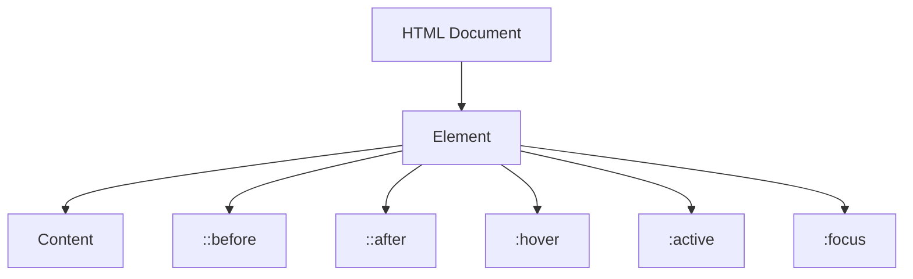

## 4.11 Pseudo-classes and Pseudo-elements

In this section, we will delve into the world of pseudo-classes and pseudo-elements in CSS, which are powerful tools for enhancing the interactivity and styling of web pages. By the end of this chapter, you'll be able to create dynamic effects and add stylistic elements without cluttering your HTML with additional tags.

### Understanding Pseudo-classes

Pseudo-classes are keywords added to selectors that specify a special state of the selected elements. They allow you to apply styles based on user interaction or the element's position in the document tree.

#### Common Pseudo-classes

Let's explore some of the most commonly used pseudo-classes:

1. **`:hover`**
   - **Purpose**: Applied when the user hovers over an element.
   - **Example**: Change the background color of a button when hovered.

   ```css
   button:hover {
       background-color: lightblue;
   }
   ```

   Here, when a user hovers over a button, its background color changes to light blue, providing visual feedback.

2. **`:active`**
   - **Purpose**: Applied when an element is being activated by the user, such as when a button is clicked.
   - **Example**: Change the color of a link when it is clicked.

   ```css
   a:active {
       color: red;
   }
   ```

   This changes the link color to red when it is clicked, indicating an active state.

3. **`:focus`**
   - **Purpose**: Applied when an element, such as an input field, gains focus.
   - **Example**: Highlight an input field when it is focused.

   ```css
   input:focus {
       border-color: green;
   }
   ```

   When a user clicks on or tabs into an input field, its border color changes to green, making it clear which field is active.

4. **`:nth-child()`**
   - **Purpose**: Targets elements based on their position among siblings.
   - **Example**: Style every other list item.

   ```css
   li:nth-child(odd) {
       background-color: #f2f2f2;
   }
   ```

   This applies a background color to every other list item, creating a striped effect.

5. **`:first-child` and `:last-child`**
   - **Purpose**: Targets the first or last child of a parent.
   - **Example**: Style the first paragraph differently.

   ```css
   p:first-child {
       font-weight: bold;
   }
   ```

   This bolds the first paragraph within a container, drawing attention to it.

#### Practical Use Cases for Pseudo-classes

- **Navigation Menus**: Use `:hover` to highlight menu items when the user hovers over them.
- **Form Validation**: Apply `:focus` to input fields to improve user experience by indicating which field is currently active.
- **Interactive Lists**: Use `:nth-child()` to create alternating row colors in tables or lists for better readability.

### Introducing Pseudo-elements

Pseudo-elements are used to style specific parts of an element. They allow you to insert content or apply styles to parts of an element without adding extra HTML.

#### Common Pseudo-elements

1. **`::before` and `::after`**
   - **Purpose**: Insert content before or after the content of an element.
   - **Example**: Add decorative elements to a heading.

   ```css
   h1::before {
       content: "★ ";
       color: gold;
   }

   h1::after {
       content: " ★";
       color: gold;
   }
   ```

   This adds a gold star before and after each `<h1>` element, enhancing its visual appeal.

2. **`::first-letter`**
   - **Purpose**: Style the first letter of a block-level element.
   - **Example**: Make the first letter of a paragraph larger.

   ```css
   p::first-letter {
       font-size: 2em;
       color: blue;
   }
   ```

   The first letter of each paragraph is enlarged and colored blue, creating a drop cap effect.

3. **`::first-line`**
   - **Purpose**: Style the first line of a block-level element.
   - **Example**: Change the font style of the first line of a paragraph.

   ```css
   p::first-line {
       font-weight: bold;
   }
   ```

   This bolds the first line of each paragraph, emphasizing the beginning of the text.

#### Practical Use Cases for Pseudo-elements

- **Decorative Elements**: Use `::before` and `::after` to add icons or decorative lines without additional HTML.
- **Typography Effects**: Apply `::first-letter` to create a drop cap effect in articles or blog posts.
- **Styling Quotes**: Use `::before` and `::after` to add quotation marks around blockquotes.

### Code Examples and Experiments

Let's put these concepts into practice with some examples. Feel free to modify and experiment with the code to see how pseudo-classes and pseudo-elements can transform your web pages.

#### Example 1: Interactive Button

```html
<!DOCTYPE html>
<html lang="en">
<head>
    <meta charset="UTF-8">
    <meta name="viewport" content="width=device-width, initial-scale=1.0">
    <title>Interactive Button</title>
    <style>
        button {
            padding: 10px 20px;
            font-size: 16px;
            cursor: pointer;
            transition: background-color 0.3s;
        }

        button:hover {
            background-color: lightblue;
        }

        button:active {
            background-color: blue;
            color: white;
        }
    </style>
</head>
<body>
    <button>Click Me!</button>
</body>
</html>
```

In this example, the button changes color when hovered over and becomes blue with white text when clicked, providing immediate feedback to the user.

#### Example 2: Styled Blockquote

```html
<!DOCTYPE html>
<html lang="en">
<head>
    <meta charset="UTF-8">
    <meta name="viewport" content="width=device-width, initial-scale=1.0">
    <title>Styled Blockquote</title>
    <style>
        blockquote {
            font-style: italic;
            color: #555;
            border-left: 5px solid #ccc;
            padding-left: 10px;
            margin: 20px;
            position: relative;
        }

        blockquote::before {
            content: "“";
            font-size: 2em;
            position: absolute;
            left: -20px;
            top: -10px;
            color: #ccc;
        }

        blockquote::after {
            content: "”";
            font-size: 2em;
            position: absolute;
            right: -20px;
            bottom: -10px;
            color: #ccc;
        }
    </style>
</head>
<body>
    <blockquote>
        The only limit to our realization of tomorrow is our doubts of today.
    </blockquote>
</body>
</html>
```

This example uses `::before` and `::after` to add quotation marks around a blockquote, enhancing its appearance without additional HTML.

### Try It Yourself

Now it's your turn to experiment! Try modifying the examples above:

- Change the colors and sizes in the button example to see how it affects the interaction.
- Add more pseudo-elements to the blockquote example, such as a background color or a shadow effect.

### Visual Aids

To better understand how pseudo-classes and pseudo-elements work, let's visualize the concept of a DOM tree and how these selectors interact with it.



**Diagram Description**: This diagram illustrates how pseudo-elements (`::before`, `::after`) and pseudo-classes (`:hover`, `:active`, `:focus`) relate to an HTML element and its content within the DOM tree.

### References and Further Reading

For more detailed information on pseudo-classes and pseudo-elements, check out the following resources:

- [MDN Web Docs: Pseudo-classes](https://developer.mozilla.org/en-US/docs/Web/CSS/Pseudo-classes)
- [MDN Web Docs: Pseudo-elements](https://developer.mozilla.org/en-US/docs/Web/CSS/Pseudo-elements)
- [W3Schools: CSS Pseudo-classes](https://www.w3schools.com/css/css_pseudo_classes.asp)
- [W3Schools: CSS Pseudo-elements](https://www.w3schools.com/css/css_pseudo_elements.asp)

### Engagement and Reinforcement

**Challenge**: Create a navigation menu using pseudo-classes to highlight the current page and pseudo-elements to add decorative lines under each menu item.

**Exercise**: Use pseudo-elements to create a custom bullet style for an unordered list.

### Summary

In this chapter, we've explored the powerful capabilities of pseudo-classes and pseudo-elements in CSS. These tools allow us to enhance the interactivity and styling of our web pages without adding extra HTML elements. By mastering these concepts, you can create more engaging and visually appealing web designs.

## Quiz Time!



### Which pseudo-class is used to style an element when it is hovered over?

- [x] :hover
- [ ] :active
- [ ] :focus
- [ ] :visited

> **Explanation:** The `:hover` pseudo-class is used to apply styles to an element when the user hovers over it with a mouse.

### What does the `::before` pseudo-element do?

- [x] Inserts content before an element's content
- [ ] Inserts content after an element's content
- [ ] Styles the first letter of an element
- [ ] Styles the first line of an element

> **Explanation:** The `::before` pseudo-element allows you to insert content before the main content of an element.

### Which pseudo-class would you use to style an input field when it is focused?

- [ ] :hover
- [x] :focus
- [ ] :active
- [ ] :checked

> **Explanation:** The `:focus` pseudo-class is used to apply styles to an element when it gains focus, such as when a user clicks on an input field.

### How can you style every other list item using pseudo-classes?

- [x] li:nth-child(odd)
- [ ] li:even
- [ ] li:odd
- [ ] li:nth-child(even)

> **Explanation:** The `li:nth-child(odd)` pseudo-class targets every other list item, starting with the first one.

### Which pseudo-element is used to style the first letter of a paragraph?

- [ ] ::before
- [ ] ::after
- [x] ::first-letter
- [ ] ::first-line

> **Explanation:** The `::first-letter` pseudo-element is used to style the first letter of a block-level element, such as a paragraph.

### What is the purpose of the `:active` pseudo-class?

- [x] To style an element when it is being clicked
- [ ] To style an element when it is hovered
- [ ] To style an element when it is focused
- [ ] To style an element when it is visited

> **Explanation:** The `:active` pseudo-class is used to apply styles to an element when it is being activated, such as when a button is clicked.

### Which pseudo-element can be used to style the first line of a paragraph?

- [ ] ::before
- [ ] ::after
- [ ] ::first-letter
- [x] ::first-line

> **Explanation:** The `::first-line` pseudo-element is used to style the first line of a block-level element, such as a paragraph.

### How can you add a decorative element before a heading without using additional HTML?

- [x] Use the `::before` pseudo-element
- [ ] Use the `::after` pseudo-element
- [ ] Use the `:hover` pseudo-class
- [ ] Use the `:focus` pseudo-class

> **Explanation:** The `::before` pseudo-element allows you to insert content before an element's main content, which can be used for decorative purposes.

### Which pseudo-class is used to style an element based on its position among siblings?

- [ ] :hover
- [ ] :focus
- [x] :nth-child()
- [ ] :active

> **Explanation:** The `:nth-child()` pseudo-class is used to target elements based on their position among siblings, allowing for complex styling patterns.

### Pseudo-elements can be used to add content to a web page without modifying the HTML.

- [x] True
- [ ] False

> **Explanation:** True. Pseudo-elements like `::before` and `::after` can be used to add content to a web page without changing the HTML structure.


