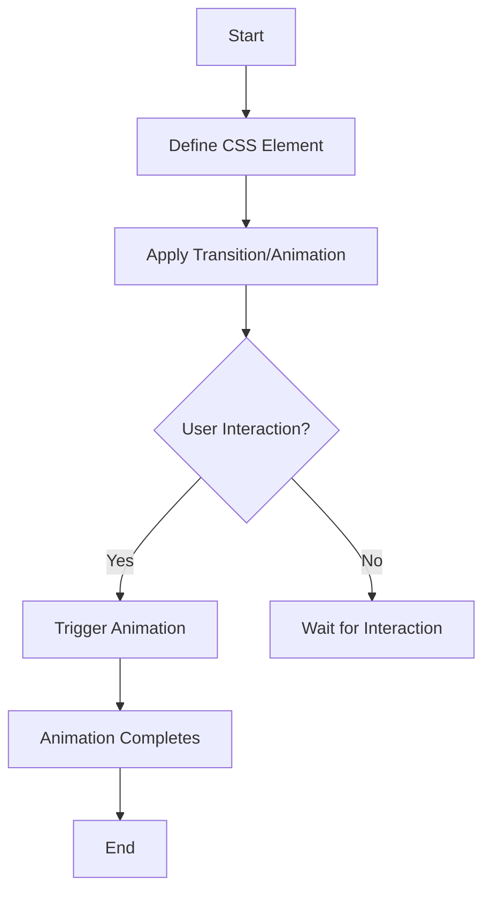

## 4.12 CSS Transitions and Animations

In the world of web development, creating a visually appealing and interactive user experience is crucial. CSS transitions and animations are powerful tools that allow us to add life to our web pages, making them more engaging and dynamic. In this section, we will explore how to create transitions using `transition` properties, introduce keyframe animations with `@keyframes`, and provide examples of hover effects and animated elements. We will also discuss performance considerations for animations and encourage subtlety to enhance rather than distract.

### Understanding CSS Transitions

CSS transitions allow you to change property values smoothly (over a given duration) from one state to another. They are perfect for hover effects, button animations, and any other UI element that benefits from a smooth transition.

#### The `transition` Property

The `transition` property is the shorthand for four transition-related properties:

- `transition-property`: Specifies the name of the CSS property to which the transition is applied.
- `transition-duration`: Defines how long the transition takes to complete.
- `transition-timing-function`: Describes the speed curve of the transition effect.
- `transition-delay`: Specifies when the transition effect will start.

Here's a simple example to illustrate how transitions work:

```css
.button {
  background-color: #4CAF50; /* Green */
  color: white;
  padding: 15px 32px;
  text-align: center;
  text-decoration: none;
  display: inline-block;
  font-size: 16px;
  margin: 4px 2px;
  cursor: pointer;
  border: none;
  transition: background-color 0.3s ease-in-out; /* Transition on background-color */
}

.button:hover {
  background-color: #45a049; /* Darker green */
}
```

In this example, when you hover over the button, the background color changes from green to a darker green over 0.3 seconds, creating a smooth transition effect.

#### Transition Timing Functions

The `transition-timing-function` property allows you to control the speed of the transition. Here are some common timing functions:

- `ease`: Starts slow, speeds up, then slows down.
- `linear`: Constant speed from start to end.
- `ease-in`: Starts slow and speeds up.
- `ease-out`: Starts fast and slows down.
- `ease-in-out`: Starts slow, speeds up, then slows down.

You can also define a custom timing function using `cubic-bezier` values.

#### Multiple Transitions

You can apply multiple transitions to a single element by separating them with commas:

```css
.box {
  width: 100px;
  height: 100px;
  background-color: blue;
  transition: width 0.5s ease, height 0.5s ease, transform 0.5s ease;
}

.box:hover {
  width: 200px;
  height: 200px;
  transform: rotate(45deg);
}
```

### Introducing CSS Animations

While transitions are great for simple effects, animations allow for more complex sequences of changes. CSS animations are created using the `@keyframes` rule, which defines the styles for various stages of the animation.

#### The `@keyframes` Rule

The `@keyframes` rule specifies the animation code. You define the animation's keyframes, which represent the start and end points of the animation, as well as any intermediate steps.

Here's an example of a simple animation:

```css
@keyframes example {
  from {background-color: red;}
  to {background-color: yellow;}
}

.div {
  width: 100px;
  height: 100px;
  background-color: red;
  animation-name: example;
  animation-duration: 4s;
}
```

In this example, the background color of the `div` changes from red to yellow over 4 seconds.

#### Animation Properties

CSS animations are controlled using several properties:

- `animation-name`: Specifies the name of the `@keyframes` animation.
- `animation-duration`: Defines how long the animation takes to complete.
- `animation-timing-function`: Describes the speed curve of the animation.
- `animation-delay`: Specifies when the animation will start.
- `animation-iteration-count`: Defines how many times the animation will play.
- `animation-direction`: Specifies whether the animation should play in reverse on alternate cycles.
- `animation-fill-mode`: Defines what styles are applied before and after the animation.
- `animation-play-state`: Allows you to pause and resume the animation.

#### Example: Bouncing Ball Animation

Let's create a bouncing ball animation using CSS:

```css
@keyframes bounce {
  0%, 20%, 50%, 80%, 100% {transform: translateY(0);}
  40% {transform: translateY(-150px);}
  60% {transform: translateY(-75px);}
}

.ball {
  width: 50px;
  height: 50px;
  background-color: blue;
  border-radius: 50%;
  position: relative;
  animation: bounce 2s infinite;
}
```

In this example, the ball moves up and down, creating a bouncing effect. The `animation` shorthand property is used to define the animation name, duration, and iteration count.

### Hover Effects and Animated Elements

Hover effects are a great way to add interactivity to your web pages. By combining transitions and animations, you can create engaging hover effects that enhance the user experience.

#### Example: Hover Effect with Transition

Here's a simple hover effect using transitions:

```css
.card {
  width: 200px;
  height: 300px;
  background-color: #f3f3f3;
  transition: transform 0.3s ease;
}

.card:hover {
  transform: scale(1.1);
}
```

In this example, the card scales up when hovered over, creating a zoom effect.

#### Example: Animated Button

Let's create an animated button using keyframes:

```css
@keyframes pulse {
  0% {transform: scale(1);}
  50% {transform: scale(1.1);}
  100% {transform: scale(1);}
}

.button {
  padding: 10px 20px;
  background-color: #4CAF50;
  color: white;
  border: none;
  cursor: pointer;
  animation: pulse 1s infinite;
}
```

The button pulses continuously, drawing attention to itself.

### Performance Considerations for Animations

While animations can enhance the user experience, they can also impact performance if not used carefully. Here are some tips to ensure your animations run smoothly:

- **Use Hardware Acceleration**: Use `transform` and `opacity` properties for animations, as they can be optimized by the GPU.
- **Avoid Animating Layout Properties**: Properties like `width`, `height`, `top`, and `left` can trigger layout recalculations, which are costly.
- **Limit the Number of Simultaneous Animations**: Too many animations running at once can slow down your page.
- **Test on Different Devices**: Ensure your animations perform well on various devices, especially those with lower processing power.

### Encouraging Subtlety in Animations

While animations can be exciting, it's important to use them subtly to enhance rather than distract. Here are some best practices:

- **Keep It Simple**: Use animations to highlight important elements or actions, not as a distraction.
- **Ensure Accessibility**: Consider users with motion sensitivity and provide options to disable animations if necessary.
- **Maintain Consistency**: Use consistent animation styles across your site to create a cohesive experience.

### Try It Yourself

Now that we've covered the basics of CSS transitions and animations, it's time to experiment! Try modifying the examples above to create your own unique effects. For instance, change the timing functions, durations, or even combine multiple animations to see what you can come up with.

### Visual Aids

To better understand the concepts of transitions and animations, let's visualize the process using a flowchart:



This flowchart represents the process of applying CSS transitions and animations to an element, waiting for user interaction, and then executing the animation.

### Summary

In this section, we've explored the world of CSS transitions and animations. We've learned how to create smooth transitions using the `transition` property and how to define complex animations with `@keyframes`. We've also discussed performance considerations and the importance of subtlety in animations. By mastering these techniques, you can create engaging and dynamic web pages that enhance the user experience.

### Further Reading

For more information on CSS transitions and animations, check out these resources:

- [MDN Web Docs: CSS Transitions](https://developer.mozilla.org/en-US/docs/Web/CSS/CSS_Transitions)
- [MDN Web Docs: CSS Animations](https://developer.mozilla.org/en-US/docs/Web/CSS/CSS_Animations)
- [W3Schools: CSS Transitions](https://www.w3schools.com/css/css3_transitions.asp)
- [W3Schools: CSS Animations](https://www.w3schools.com/css/css3_animations.asp)

---

## Quiz Time!



### What is the primary purpose of CSS transitions?

- [x] To change property values smoothly over a given duration.
- [ ] To define complex sequences of changes.
- [ ] To create static styles for web pages.
- [ ] To replace JavaScript animations.

> **Explanation:** CSS transitions allow property values to change smoothly over a specified duration, enhancing user interaction.

### Which property is NOT part of the `transition` shorthand?

- [ ] transition-property
- [ ] transition-duration
- [ ] transition-timing-function
- [x] transition-iteration-count

> **Explanation:** `transition-iteration-count` is not part of the `transition` shorthand. It is used in animations, not transitions.

### What does the `ease-in-out` timing function do?

- [ ] Starts fast and slows down.
- [ ] Starts slow and speeds up.
- [x] Starts slow, speeds up, then slows down.
- [ ] Maintains a constant speed.

> **Explanation:** The `ease-in-out` timing function starts slow, speeds up in the middle, and slows down at the end.

### How do you define keyframes for an animation?

- [ ] Using the `transition` property.
- [x] Using the `@keyframes` rule.
- [ ] Using the `animation-name` property.
- [ ] Using the `transform` property.

> **Explanation:** Keyframes for an animation are defined using the `@keyframes` rule, specifying the animation's stages.

### Which property allows an animation to play in reverse on alternate cycles?

- [ ] animation-duration
- [ ] animation-delay
- [x] animation-direction
- [ ] animation-fill-mode

> **Explanation:** The `animation-direction` property specifies whether the animation should play in reverse on alternate cycles.

### What is a key consideration for animation performance?

- [ ] Use as many animations as possible.
- [ ] Animate layout properties like `width` and `height`.
- [x] Use hardware-accelerated properties like `transform` and `opacity`.
- [ ] Avoid testing on different devices.

> **Explanation:** Using hardware-accelerated properties like `transform` and `opacity` helps improve animation performance.

### What is the effect of the `animation-fill-mode` property?

- [ ] It defines the animation's speed curve.
- [ ] It specifies the animation's name.
- [x] It defines what styles are applied before and after the animation.
- [ ] It specifies the animation's duration.

> **Explanation:** The `animation-fill-mode` property defines what styles are applied before and after the animation.

### How can you ensure accessibility in animations?

- [ ] Use as many animations as possible.
- [x] Provide options to disable animations for users with motion sensitivity.
- [ ] Avoid testing on different devices.
- [ ] Use complex animations for all elements.

> **Explanation:** Providing options to disable animations for users with motion sensitivity ensures accessibility.

### What is a benefit of using CSS animations over JavaScript animations?

- [x] CSS animations can be more performant as they can be optimized by the browser.
- [ ] CSS animations require more code than JavaScript animations.
- [ ] CSS animations are less flexible than JavaScript animations.
- [ ] CSS animations cannot be paused or resumed.

> **Explanation:** CSS animations can be more performant as they can be optimized by the browser, reducing the need for JavaScript.

### True or False: Animating `width` and `height` properties is recommended for performance.

- [ ] True
- [x] False

> **Explanation:** Animating `width` and `height` properties is not recommended for performance as it can trigger layout recalculations.



---
