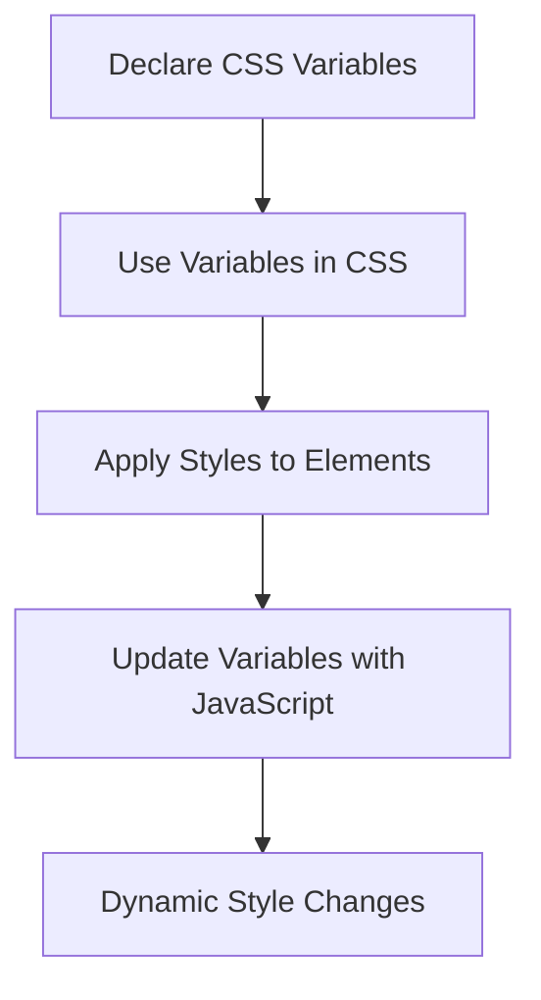

## 4.13 Working with CSS Variables

CSS variables, also known as custom properties, are a powerful feature in CSS that allow you to store values that can be reused throughout your stylesheet. They can significantly simplify code maintenance, improve theming, and ensure consistency across your web pages. In this section, we'll explore how to declare and use CSS variables, the benefits they offer, and how they can be dynamically updated with JavaScript.

### Understanding CSS Variables

CSS variables are essentially placeholders for values that you can define once and use multiple times throughout your CSS. They are particularly useful for maintaining consistency in your styles and making it easier to update values across your entire stylesheet.

#### Declaring CSS Variables

CSS variables are declared within a CSS rule using the `--` prefix. They are typically defined in the `:root` selector, which represents the document's root element. This makes the variables globally accessible throughout your stylesheet.

```css
:root {
  --primary-color: #3498db;
  --secondary-color: #2ecc71;
  --font-size: 16px;
}
```

In the example above, we have declared three CSS variables: `--primary-color`, `--secondary-color`, and `--font-size`. These variables can now be used anywhere in our CSS file.

#### Using CSS Variables

To use a CSS variable, you use the `var()` function, passing the variable name as an argument.

```css
body {
  font-size: var(--font-size);
  color: var(--primary-color);
}

button {
  background-color: var(--secondary-color);
  font-size: var(--font-size);
}
```

In this example, the `body` element uses the `--font-size` and `--primary-color` variables, while the `button` element uses the `--secondary-color` and `--font-size` variables. This ensures that any changes to these variables will automatically update all elements that use them.

### Benefits of CSS Variables

CSS variables offer several benefits that make them a valuable tool for web developers:

1. **Consistency**: By defining a variable once and using it throughout your stylesheet, you ensure consistent styling across your web pages.

2. **Theming**: CSS variables make it easy to implement themes by simply changing the values of your variables. This can be particularly useful for websites that offer light and dark mode options.

3. **Maintainability**: With CSS variables, you can update a value in one place, and it will automatically apply to all instances where the variable is used. This simplifies the process of making changes to your styles.

4. **Dynamic Updates**: CSS variables can be updated dynamically using JavaScript, allowing for interactive and responsive design changes.

### Theming with CSS Variables

One of the most powerful uses of CSS variables is theming. By defining a set of variables for colors, fonts, and other style properties, you can easily switch between different themes by updating the variable values.

#### Example: Light and Dark Themes

Let's create a simple example of light and dark themes using CSS variables.

```css
:root {
  --background-color: #ffffff;
  --text-color: #000000;
}

body {
  background-color: var(--background-color);
  color: var(--text-color);
}

.dark-theme {
  --background-color: #333333;
  --text-color: #ffffff;
}
```

In this example, we define default values for `--background-color` and `--text-color` in the `:root` selector. We then create a `.dark-theme` class that overrides these variables with dark theme values.

To switch themes, you can simply add or remove the `.dark-theme` class from the `body` element using JavaScript.

```javascript
const toggleThemeButton = document.querySelector('#toggle-theme');

toggleThemeButton.addEventListener('click', () => {
  document.body.classList.toggle('dark-theme');
});
```

This JavaScript code adds an event listener to a button with the ID `toggle-theme`. When the button is clicked, it toggles the `.dark-theme` class on the `body` element, effectively switching between light and dark themes.

### Dynamic Updates with JavaScript

One of the most exciting features of CSS variables is their ability to be updated dynamically with JavaScript. This allows for real-time changes to your styles based on user interactions or other events.

#### Example: Changing Font Size Dynamically

Let's create an example where we change the font size of the `body` element dynamically using a range input.

```html
<input type="range" id="font-size-slider" min="10" max="30" value="16">
```

```css
:root {
  --font-size: 16px;
}

body {
  font-size: var(--font-size);
}
```

```javascript
const fontSizeSlider = document.querySelector('#font-size-slider');

fontSizeSlider.addEventListener('input', (event) => {
  const newFontSize = event.target.value + 'px';
  document.documentElement.style.setProperty('--font-size', newFontSize);
});
```

In this example, we have a range input with the ID `font-size-slider`. When the user adjusts the slider, the `input` event is triggered, and the font size is updated by setting the `--font-size` variable using `document.documentElement.style.setProperty()`.

### Encouraging the Use of CSS Variables

CSS variables are particularly useful for values that are repeated throughout your stylesheet, such as colors, font sizes, and spacing. By using variables, you can ensure consistency and make it easier to update your styles in the future.

#### Example: Consistent Spacing

```css
:root {
  --spacing-small: 8px;
  --spacing-medium: 16px;
  --spacing-large: 32px;
}

.container {
  padding: var(--spacing-medium);
}

.card {
  margin-bottom: var(--spacing-large);
}

.button {
  padding: var(--spacing-small) var(--spacing-medium);
}
```

In this example, we define variables for small, medium, and large spacing values. These variables are then used throughout the stylesheet to ensure consistent spacing across different elements.

### Try It Yourself

Experiment with the examples provided in this section by modifying the CSS variables and observing the changes. Try creating your own themes or dynamically updating other style properties with JavaScript.

### Visualizing CSS Variables

To better understand how CSS variables work and how they can be applied, let's visualize the process using a flowchart.



This flowchart illustrates the process of declaring CSS variables, using them in your CSS, applying styles to elements, updating variables with JavaScript, and achieving dynamic style changes.

### References and Further Reading

- [MDN Web Docs: Using CSS Custom Properties (Variables)](https://developer.mozilla.org/en-US/docs/Web/CSS/Using_CSS_custom_properties)
- [W3Schools: CSS Variables](https://www.w3schools.com/css/css3_variables.asp)

### Key Takeaways

- CSS variables allow you to store values that can be reused throughout your stylesheet, improving consistency and maintainability.
- They are declared using the `--` prefix and are typically defined in the `:root` selector for global access.
- CSS variables can be dynamically updated with JavaScript, enabling interactive and responsive design changes.
- They are particularly useful for theming and ensuring consistent styling across your web pages.

By incorporating CSS variables into your web development process, you can simplify code maintenance, improve theming, and ensure consistency across your web pages. Experiment with the examples provided in this section and explore the possibilities that CSS variables offer.

## Quiz Time!



### What is the primary benefit of using CSS variables?

- [x] Consistency and maintainability
- [ ] Faster page loading
- [ ] Improved security
- [ ] Better SEO

> **Explanation:** CSS variables help maintain consistency and make it easier to update styles across your entire stylesheet.

### How do you declare a CSS variable?

- [x] Using the `--` prefix
- [ ] Using the `$` prefix
- [ ] Using the `@` prefix
- [ ] Using the `#` prefix

> **Explanation:** CSS variables are declared with the `--` prefix, followed by the variable name.

### Where are CSS variables typically defined for global access?

- [x] In the `:root` selector
- [ ] In the `body` selector
- [ ] In the `head` selector
- [ ] In the `footer` selector

> **Explanation:** CSS variables are typically defined in the `:root` selector to make them globally accessible.

### How do you use a CSS variable in a style rule?

- [x] Using the `var()` function
- [ ] Using the `calc()` function
- [ ] Using the `url()` function
- [ ] Using the `attr()` function

> **Explanation:** The `var()` function is used to access the value of a CSS variable in a style rule.

### What is a common use case for CSS variables?

- [x] Theming
- [ ] Image optimization
- [ ] Database management
- [ ] Server-side scripting

> **Explanation:** CSS variables are commonly used for theming, allowing for easy changes to styles across a website.

### How can CSS variables be updated dynamically?

- [x] Using JavaScript
- [ ] Using PHP
- [ ] Using SQL
- [ ] Using XML

> **Explanation:** CSS variables can be updated dynamically using JavaScript, allowing for real-time style changes.

### What function is used in JavaScript to update a CSS variable?

- [x] `setProperty()`
- [ ] `getElementById()`
- [ ] `querySelector()`
- [ ] `addEventListener()`

> **Explanation:** The `setProperty()` function is used in JavaScript to update the value of a CSS variable.

### Which of the following is a valid CSS variable name?

- [x] `--main-color`
- [ ] `main-color`
- [ ] `#main-color`
- [ ] `$main-color`

> **Explanation:** CSS variable names must begin with the `--` prefix, followed by the variable name.

### Can CSS variables be used for responsive design?

- [x] True
- [ ] False

> **Explanation:** CSS variables can be used to store values that adjust for different screen sizes, aiding in responsive design.

### CSS variables can simplify which aspect of web development?

- [x] Code maintenance
- [ ] Database queries
- [ ] Server configuration
- [ ] Network security

> **Explanation:** CSS variables simplify code maintenance by allowing developers to update styles in one place and have those changes reflected throughout the stylesheet.


