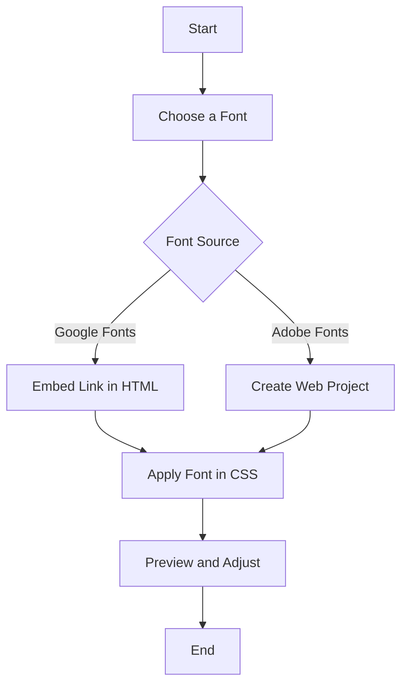

## 4.14 Importing and Using Fonts

Typography is a crucial aspect of web design that significantly impacts the readability and aesthetics of your web page. In this section, we'll explore how to import and use fonts to enhance your web page's typography. We'll cover importing fonts using `@font-face`, introduce popular font services like Google Fonts and Adobe Fonts, and discuss best practices for font selection and licensing considerations.

### Understanding Font Basics

Before diving into importing fonts, let's briefly understand the basics of fonts and why they matter in web design.

**Fonts** are digital representations of typefaces, which are collections of characters with a specific style and design. Fonts can be broadly categorized into two types:

- **Web-safe fonts**: These are fonts that are commonly available on most devices, such as Arial, Times New Roman, and Verdana. They are reliable but offer limited design flexibility.
- **Web fonts**: These are fonts that are not pre-installed on devices but can be loaded from external sources, providing a wider variety of styles and designs.

### Importing Fonts Using `@font-face`

The `@font-face` rule in CSS allows you to specify custom fonts to be loaded and used on your web page. This technique gives you the flexibility to use any font you want, as long as you have the necessary font files.

#### Step-by-Step Guide to Using `@font-face`

1. **Obtain the Font Files**: First, you need the font files in various formats such as `.woff`, `.woff2`, `.ttf`, or `.eot`. These formats ensure compatibility across different browsers.

2. **Define the `@font-face` Rule**: Use the `@font-face` rule in your CSS to define the font family and specify the path to the font files.

```css
@font-face {
    font-family: 'CustomFont';
    src: url('fonts/CustomFont.woff2') format('woff2'),
         url('fonts/CustomFont.woff') format('woff');
    font-weight: normal;
    font-style: normal;
}
```

3. **Apply the Font to Elements**: Once the font is defined, you can apply it to any element using the `font-family` property.

```css
body {
    font-family: 'CustomFont', sans-serif;
}
```

#### Key Points to Remember

- **Multiple Formats**: Always provide multiple font formats to ensure compatibility with different browsers.
- **Fallback Fonts**: Specify fallback fonts in the `font-family` property to ensure text is displayed even if the custom font fails to load.

### Using Google Fonts

Google Fonts is a popular service that provides a vast library of free and open-source fonts that you can easily integrate into your web page.

#### How to Use Google Fonts

1. **Visit Google Fonts**: Go to [Google Fonts](https://fonts.google.com) and browse the available fonts.

2. **Select a Font**: Click on a font to view its details and select the styles you want to use.

3. **Embed the Font**: Google Fonts provides an HTML `<link>` tag that you can add to your HTML file's `<head>` section.

```html
<link href="https://fonts.googleapis.com/css2?family=Roboto:wght@400;700&display=swap" rel="stylesheet">
```

4. **Apply the Font**: Use the `font-family` property in your CSS to apply the font to elements.

```css
h1, h2, h3 {
    font-family: 'Roboto', sans-serif;
}
```

#### Advantages of Google Fonts

- **Ease of Use**: Simple integration with just a few lines of code.
- **Wide Selection**: A large variety of fonts to choose from.
- **Performance**: Fonts are served from Google's fast and reliable servers.

### Using Adobe Fonts

Adobe Fonts, formerly known as Typekit, is another excellent service for accessing a wide range of high-quality fonts.

#### How to Use Adobe Fonts

1. **Create an Adobe Account**: Sign up for an Adobe account if you don't have one.

2. **Browse and Select Fonts**: Visit [Adobe Fonts](https://fonts.adobe.com) and choose the fonts you want to use.

3. **Create a Web Project**: Add the selected fonts to a web project, which generates a unique embed code.

4. **Embed the Fonts**: Add the provided `<link>` or `<script>` tag to your HTML file's `<head>` section.

```html
<link rel="stylesheet" href="https://use.typekit.net/xyz123.css">
```

5. **Apply the Font**: Use the `font-family` property in your CSS to apply the font.

```css
p {
    font-family: 'MyAdobeFont', serif;
}
```

#### Benefits of Adobe Fonts

- **High-Quality Fonts**: Access to premium fonts with professional design quality.
- **Customization**: Advanced typographic features and controls.

### Licensing Considerations for Fonts

When using fonts, it's essential to consider licensing to ensure you have the right to use them on your web page.

#### Key Licensing Points

- **Free vs. Paid Fonts**: Some fonts are free to use, while others require a license fee. Always check the licensing terms before using a font.
- **Web Font Licenses**: Ensure the font license covers web usage, as some fonts may only be licensed for print.
- **Attribution Requirements**: Some fonts may require you to provide attribution to the font creator.

### Best Practices for Font Selection

Choosing the right fonts is crucial for creating a visually appealing and readable web page. Here are some best practices:

#### Consider Readability

- **Legibility**: Choose fonts that are easy to read, especially for body text. Avoid overly decorative fonts for large blocks of text.
- **Contrast**: Ensure sufficient contrast between the text and background to enhance readability.

#### Limit Font Variations

- **Consistency**: Use a limited number of font families to maintain a consistent look and feel.
- **Hierarchy**: Use different font weights and styles to create a visual hierarchy, guiding the reader's eye through the content.

#### Performance Considerations

- **Load Times**: Each additional font file increases the page load time. Use only the necessary font weights and styles.
- **Font Display**: Use the `font-display` property to control how fonts are displayed while loading.

```css
@font-face {
    font-family: 'CustomFont';
    src: url('fonts/CustomFont.woff2') format('woff2');
    font-display: swap;
}
```

### Try It Yourself

Let's put what we've learned into practice. Try importing a font from Google Fonts and applying it to your web page. Here's a simple exercise:

1. **Choose a Font**: Visit Google Fonts and select a font you like.
2. **Embed the Font**: Copy the embed link and add it to your HTML file.
3. **Apply the Font**: Use CSS to apply the font to your headings or paragraphs.
4. **Experiment**: Try changing the font weight or style and observe the effect on your web page.

### Visual Aids

To help visualize the process of importing and using fonts, let's look at a simple flowchart that outlines the steps involved:



**Caption**: This flowchart illustrates the process of importing and using fonts from Google Fonts or Adobe Fonts.

### Summary

In this section, we've explored how to import and use fonts to enhance the typography of your web page. We've covered using the `@font-face` rule, integrating fonts from Google Fonts and Adobe Fonts, and best practices for font selection. Remember to consider readability, performance, and licensing when choosing fonts for your web page.

### Further Reading

For more information on fonts and typography, check out these resources:

- [MDN Web Docs on `@font-face`](https://developer.mozilla.org/en-US/docs/Web/CSS/@font-face)
- [Google Fonts](https://fonts.google.com)
- [Adobe Fonts](https://fonts.adobe.com)

## Quiz Time!



### What is the primary purpose of the `@font-face` rule in CSS?

- [x] To import and define custom fonts for use on a web page.
- [ ] To apply styles to text elements.
- [ ] To create animations for text.
- [ ] To define the layout of a web page.

> **Explanation:** The `@font-face` rule allows you to import and define custom fonts that can be used in your web page's CSS.

### Which of the following is a web-safe font?

- [x] Arial
- [ ] Roboto
- [ ] Open Sans
- [ ] Lato

> **Explanation:** Arial is a web-safe font, meaning it is commonly available on most devices.

### How do you apply a font from Google Fonts to your web page?

- [x] By embedding a `<link>` tag in the HTML `<head>` section and using the `font-family` property in CSS.
- [ ] By downloading the font file and using the `@font-face` rule.
- [ ] By writing a JavaScript function to load the font.
- [ ] By using the `font-embed` property in CSS.

> **Explanation:** Google Fonts provides an HTML `<link>` tag that you can embed in your HTML file, and then apply the font using the `font-family` property in CSS.

### What is a key advantage of using Google Fonts?

- [x] Easy integration and a wide selection of fonts.
- [ ] Requires no internet connection.
- [ ] Provides only premium fonts.
- [ ] Automatically optimizes page load times.

> **Explanation:** Google Fonts offers easy integration with a wide selection of fonts, making it a popular choice for web designers.

### What should you consider when choosing fonts for your web page?

- [x] Readability and performance.
- [ ] Only the aesthetics.
- [ ] The number of colors in the font.
- [ ] The font's popularity.

> **Explanation:** Readability and performance are crucial factors to consider when choosing fonts for your web page.

### What is the purpose of the `font-display` property?

- [x] To control how fonts are displayed while loading.
- [ ] To set the font size.
- [ ] To change the font color.
- [ ] To apply animations to fonts.

> **Explanation:** The `font-display` property controls how fonts are displayed while loading, affecting user experience.

### Which service provides high-quality fonts with advanced typographic features?

- [x] Adobe Fonts
- [ ] Google Fonts
- [ ] Font Squirrel
- [ ] DaFont

> **Explanation:** Adobe Fonts provides high-quality fonts with advanced typographic features and controls.

### Why is it important to provide multiple font formats in the `@font-face` rule?

- [x] To ensure compatibility across different browsers.
- [ ] To reduce the size of the font files.
- [ ] To increase the number of fonts available.
- [ ] To improve the aesthetics of the font.

> **Explanation:** Providing multiple font formats ensures compatibility across different browsers, as not all browsers support the same formats.

### What is a potential drawback of using too many fonts on a web page?

- [x] Increased page load times.
- [ ] Improved readability.
- [ ] Enhanced aesthetics.
- [ ] Better SEO.

> **Explanation:** Using too many fonts can increase page load times, negatively impacting performance.

### True or False: All fonts on Google Fonts are free to use without any licensing restrictions.

- [x] True
- [ ] False

> **Explanation:** All fonts on Google Fonts are free to use, as they are open-source and come with no licensing restrictions.


