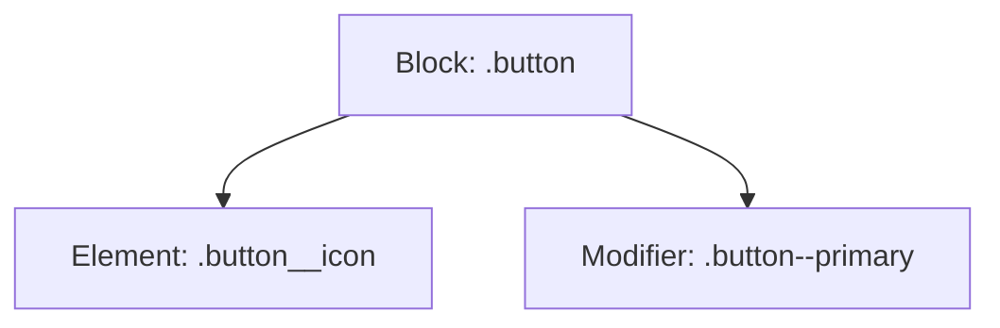

## 4.15 CSS Best Practices

Creating a well-structured and maintainable CSS codebase is crucial for developing efficient and scalable web pages. In this section, we will explore best practices that will help you write clean, organized, and efficient CSS. These practices will not only make your code easier to read and maintain but also ensure that your web pages load faster and perform better.

### Organizing Your CSS

Organizing your CSS is the foundation of writing maintainable code. A well-organized stylesheet makes it easier to find and update styles, reducing the risk of introducing bugs. Here are some tips for organizing your CSS:

#### Group Related Styles

Group related styles together to make your CSS more readable. For example, keep styles for a specific component or section of your page together. This approach helps you quickly locate styles when you need to make changes.

```css
/* Header styles */
header {
  background-color: #f8f9fa;
  padding: 20px;
}

header h1 {
  font-size: 24px;
  color: #333;
}

/* Navigation styles */
nav {
  margin-top: 10px;
}

nav ul {
  list-style-type: none;
  padding: 0;
}

nav li {
  display: inline;
  margin-right: 15px;
}
```

#### Use a Consistent Order

Adopt a consistent order for your CSS properties. A common approach is to order properties alphabetically or by type (e.g., positioning, box model, typography). Consistency makes it easier to scan and understand your styles.

```css
/* Alphabetical order */
button {
  background-color: #007bff;
  border: none;
  border-radius: 5px;
  color: white;
  padding: 10px 20px;
}
```

#### Separate Concerns

Consider separating your CSS into multiple files based on functionality or components. This modular approach makes it easier to manage large projects and reuse styles across different pages.

```plaintext
styles/
  ├── base.css
  ├── layout.css
  ├── components/
  │   ├── header.css
  │   ├── footer.css
  │   └── button.css
```

### Using Comments for Clarification

Comments are essential for explaining the purpose of your styles and providing context for future developers (or yourself). Use comments to describe complex styles, indicate sections of your stylesheet, or explain why certain decisions were made.

```css
/* Base styles for the entire page */
body {
  font-family: Arial, sans-serif;
  line-height: 1.6;
  margin: 0;
  padding: 0;
}

/* Button styles */
/* These styles are used for primary action buttons */
.button-primary {
  background-color: #28a745;
  border: none;
  color: white;
  padding: 10px 15px;
  text-align: center;
  text-decoration: none;
  display: inline-block;
  font-size: 16px;
}
```

### Avoiding Overly Specific Selectors

Overly specific selectors can make your CSS difficult to maintain and override. Aim for simplicity and avoid using more specificity than necessary. This practice ensures that your styles are flexible and easy to update.

#### Example of Overly Specific Selector

```css
/* Overly specific */
div.container > ul > li > a {
  color: #333;
}
```

#### Simplified Selector

```css
/* Simplified */
.container a {
  color: #333;
}
```

### Encouraging Modular CSS

Modular CSS helps you create reusable and maintainable styles. One popular methodology for achieving modular CSS is BEM (Block Element Modifier). BEM encourages a structured naming convention that makes it clear how styles relate to each other.

#### BEM Methodology

- **Block**: The standalone entity that is meaningful on its own (e.g., `button`).
- **Element**: A part of a block that has no standalone meaning (e.g., `button__icon`).
- **Modifier**: A flag on a block or element that changes its appearance or behavior (e.g., `button--primary`).

```css
/* BEM Example */
.button {
  background-color: #007bff;
  border: none;
  color: white;
  padding: 10px 20px;
}

.button--primary {
  background-color: #28a745;
}

.button__icon {
  margin-right: 5px;
}
```

### Consistent Formatting and Naming Conventions

Consistent formatting and naming conventions improve readability and make it easier for others to understand your code. Here are some guidelines:

#### Use Lowercase and Hyphens

Use lowercase letters and hyphens for class and ID names. This convention is widely adopted and ensures compatibility across different browsers and tools.

```css
/* Consistent naming */
.header-title {
  font-size: 24px;
  color: #333;
}
```

#### Indentation and Spacing

Use consistent indentation and spacing to make your CSS more readable. A common practice is to use two or four spaces for indentation.

```css
/* Consistent indentation */
.card {
  background-color: #fff;
  border: 1px solid #ddd;
  padding: 15px;
}
```

### Try It Yourself

Now that we've covered some CSS best practices, try applying them to your own stylesheets. Here are a few suggestions:

1. **Organize Your Styles**: Group related styles together and separate them into different files if necessary.
2. **Add Comments**: Use comments to explain complex styles or sections of your stylesheet.
3. **Simplify Selectors**: Review your selectors and simplify them where possible.
4. **Adopt BEM**: Try using the BEM methodology for a component in your project.
5. **Consistent Formatting**: Ensure your CSS uses consistent indentation, spacing, and naming conventions.

### Visual Aids

To help you visualize the structure of a well-organized CSS file, here's a diagram representing a modular CSS structure using the BEM methodology:



**Diagram Description**: This diagram illustrates the BEM methodology, showing a block (`.button`) with an element (`.button__icon`) and a modifier (`.button--primary`).

### References and Links

For further reading on CSS best practices, consider exploring the following resources:

- [MDN Web Docs: CSS](https://developer.mozilla.org/en-US/docs/Web/CSS)
- [W3Schools: CSS](https://www.w3schools.com/css/)
- [BEM Methodology](https://en.bem.info/methodology/)

### Engagement and Reinforcement

Let's reinforce what we've learned with a few questions and challenges:

1. **Question**: Why is it important to avoid overly specific selectors in CSS?
2. **Challenge**: Refactor a section of your CSS to use the BEM methodology.

### Summary

In this section, we've explored CSS best practices that help you write clean, maintainable, and efficient code. By organizing your styles, using comments, avoiding overly specific selectors, adopting modular CSS, and maintaining consistent formatting, you can create stylesheets that are easy to read and update. These practices will not only improve your workflow but also enhance the performance and scalability of your web projects.

---

## Quiz Time!



### Why is it important to group related styles together in CSS?

- [x] It makes the code more readable and easier to maintain.
- [ ] It increases the file size of the CSS.
- [ ] It makes the website load faster.
- [ ] It is required by the CSS specification.

> **Explanation:** Grouping related styles together improves readability and maintainability, making it easier to find and update styles.

### What is a common approach to ordering CSS properties?

- [x] Alphabetically or by type (e.g., positioning, box model, typography).
- [ ] Randomly, as it doesn't affect the outcome.
- [ ] Based on the length of the property name.
- [ ] By the number of characters in the property value.

> **Explanation:** Ordering CSS properties alphabetically or by type is a common practice that enhances readability and consistency.

### What is the BEM methodology used for?

- [x] Creating a structured naming convention for CSS classes.
- [ ] Minimizing the size of CSS files.
- [ ] Automatically generating CSS code.
- [ ] Improving the performance of CSS animations.

> **Explanation:** BEM (Block Element Modifier) is a methodology that provides a structured naming convention for CSS classes, making it easier to understand and maintain styles.

### Why should you avoid overly specific selectors in CSS?

- [x] They make the CSS difficult to maintain and override.
- [ ] They improve the performance of the website.
- [ ] They are required for responsive design.
- [ ] They are not supported by all browsers.

> **Explanation:** Overly specific selectors can complicate maintenance and make it hard to override styles, reducing flexibility.

### What is a benefit of using comments in CSS?

- [x] They provide context and explanations for styles.
- [ ] They reduce the file size of the CSS.
- [ ] They are required for CSS to work.
- [ ] They automatically optimize the CSS for performance.

> **Explanation:** Comments in CSS provide context and explanations, helping developers understand the purpose and logic behind styles.

### Which of the following is a consistent naming convention for CSS classes?

- [x] Lowercase letters and hyphens (e.g., `.header-title`).
- [ ] Uppercase letters and underscores (e.g., `.HEADER_TITLE`).
- [ ] CamelCase (e.g., `.headerTitle`).
- [ ] Random letters and numbers (e.g., `.a1b2c3`).

> **Explanation:** Using lowercase letters and hyphens is a widely adopted naming convention for CSS classes, ensuring compatibility and readability.

### What is the purpose of separating CSS into multiple files?

- [x] To manage large projects and reuse styles across different pages.
- [ ] To increase the complexity of the project.
- [ ] To make the website load slower.
- [ ] To reduce the number of HTTP requests.

> **Explanation:** Separating CSS into multiple files helps manage large projects and reuse styles, improving maintainability and scalability.

### What does the `.button--primary` class represent in BEM?

- [x] A modifier that changes the appearance or behavior of the `.button` block.
- [ ] An element that is part of the `.button` block.
- [ ] A standalone block with no relation to `.button`.
- [ ] A global style applied to all buttons.

> **Explanation:** In BEM, `.button--primary` is a modifier that changes the appearance or behavior of the `.button` block.

### Why is consistent formatting important in CSS?

- [x] It improves readability and makes it easier for others to understand the code.
- [ ] It reduces the file size of the CSS.
- [ ] It is required by the CSS specification.
- [ ] It automatically optimizes the CSS for performance.

> **Explanation:** Consistent formatting improves readability and makes it easier for others to understand and work with the code.

### True or False: Using comments in CSS can help explain complex styles and provide context for future developers.

- [x] True
- [ ] False

> **Explanation:** True. Comments in CSS are valuable for explaining complex styles and providing context, making it easier for future developers to understand the code.


