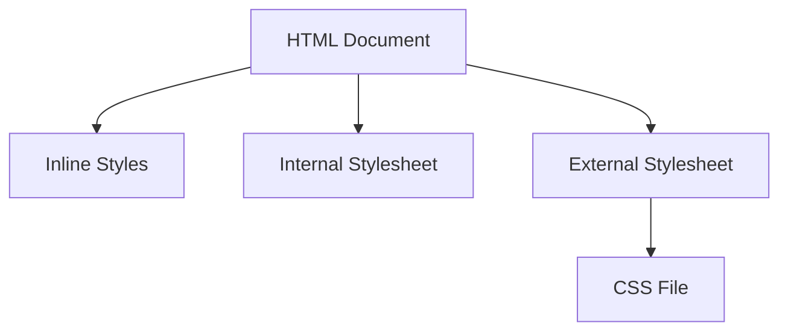

## 4.2 Adding CSS to HTML

In this section, we will explore the various methods of adding CSS to HTML, which include inline styles, internal stylesheets, and external stylesheets. Each method has its own advantages and disadvantages, and understanding these will help you choose the right approach for your project. Let's dive in!

### Understanding CSS and Its Role in Web Design

Before we delve into the methods of adding CSS to HTML, let's briefly recap what CSS is and why it's essential. CSS, or Cascading Style Sheets, is a stylesheet language used to describe the presentation of a document written in HTML. CSS controls the layout, colors, fonts, and overall visual appearance of web pages, allowing you to create visually appealing and user-friendly websites.

### Method 1: Inline Styles

Inline styles are CSS rules applied directly to an HTML element using the `style` attribute. This method allows you to apply styles to specific elements without affecting others.

#### How to Use Inline Styles

To use inline styles, add the `style` attribute to an HTML element and specify CSS properties and values within the attribute. Here's an example:

```html
<!DOCTYPE html>
<html lang="en">
<head>
    <meta charset="UTF-8">
    <meta name="viewport" content="width=device-width, initial-scale=1.0">
    <title>Inline Styles Example</title>
</head>
<body>
    <h1 style="color: blue; font-size: 24px;">Hello, World!</h1>
    <p style="color: green; font-weight: bold;">This is a paragraph with inline styles.</p>
</body>
</html>
```

In this example, the `<h1>` element is styled with a blue color and a font size of 24 pixels, while the `<p>` element is styled with a green color and bold font weight.

#### Pros and Cons of Inline Styles

**Pros:**
- **Simplicity**: Easy to apply and understand for small changes.
- **Specificity**: Directly targets individual elements.

**Cons:**
- **Repetition**: Styles must be repeated for each element, leading to redundancy.
- **Maintenance**: Difficult to manage and update styles across multiple elements.
- **Separation of Concerns**: Violates the principle of separating content (HTML) from presentation (CSS).

### Method 2: Internal Stylesheets

Internal stylesheets allow you to define CSS rules within the `<style>` tag, located in the `<head>` section of an HTML document. This method is useful for styling a single page.

#### How to Use Internal Stylesheets

To use an internal stylesheet, add a `<style>` tag within the `<head>` section and write your CSS rules inside it. Here's an example:

```html
<!DOCTYPE html>
<html lang="en">
<head>
    <meta charset="UTF-8">
    <meta name="viewport" content="width=device-width, initial-scale=1.0">
    <title>Internal Stylesheet Example</title>
    <style>
        body {
            background-color: #f0f0f0;
        }
        h1 {
            color: blue;
            font-size: 24px;
        }
        p {
            color: green;
            font-weight: bold;
        }
    </style>
</head>
<body>
    <h1>Hello, World!</h1>
    <p>This is a paragraph with internal styles.</p>
</body>
</html>
```

In this example, the CSS rules are defined within the `<style>` tag, affecting all `<h1>` and `<p>` elements on the page.

#### Pros and Cons of Internal Stylesheets

**Pros:**
- **Centralized**: Styles are defined in one place, making them easier to manage.
- **Specificity**: Useful for styling a single page.

**Cons:**
- **Limited Scope**: Styles are not reusable across multiple pages.
- **Increased Load Time**: Larger HTML files due to embedded styles.

### Method 3: External Stylesheets

External stylesheets involve linking a separate CSS file to your HTML document using the `<link>` tag. This method is ideal for styling multiple pages consistently.

#### How to Use External Stylesheets

To use an external stylesheet, create a CSS file (e.g., `styles.css`) and link it to your HTML document using the `<link>` tag in the `<head>` section. Here's an example:

**styles.css:**

```css
body {
    background-color: #f0f0f0;
}
h1 {
    color: blue;
    font-size: 24px;
}
p {
    color: green;
    font-weight: bold;
}
```

**index.html:**

```html
<!DOCTYPE html>
<html lang="en">
<head>
    <meta charset="UTF-8">
    <meta name="viewport" content="width=device-width, initial-scale=1.0">
    <title>External Stylesheet Example</title>
    <link rel="stylesheet" href="styles.css">
</head>
<body>
    <h1>Hello, World!</h1>
    <p>This is a paragraph with external styles.</p>
</body>
</html>
```

In this example, the CSS rules are defined in `styles.css`, and the HTML document links to this file using the `<link>` tag.

#### Pros and Cons of External Stylesheets

**Pros:**
- **Reusability**: Styles can be applied across multiple pages.
- **Separation of Concerns**: Keeps HTML and CSS separate, improving maintainability.
- **Reduced Load Time**: Browsers cache external CSS files, reducing load times for subsequent page visits.

**Cons:**
- **Dependency**: Requires an additional file, which must be correctly linked.
- **Initial Load Time**: Slightly increased initial load time due to additional HTTP requests.

### Best Practices for Adding CSS to HTML

Now that we've explored the three methods of adding CSS to HTML, let's discuss best practices for choosing the right approach:

1. **Use Inline Styles Sparingly**: Reserve inline styles for quick, one-off changes or when dynamically applying styles with JavaScript.

2. **Opt for Internal Stylesheets for Single Pages**: Use internal stylesheets when styling a single page or when prototyping.

3. **Favor External Stylesheets for Larger Projects**: Use external stylesheets for projects with multiple pages to ensure consistency and maintainability.

4. **Maintain a Clear Separation of Concerns**: Keep HTML and CSS separate to enhance readability and maintainability.

5. **Optimize for Performance**: Minimize the use of inline styles and large internal stylesheets to reduce page load times.

6. **Leverage CSS Preprocessors**: Consider using CSS preprocessors like SASS or LESS for more advanced styling features and better organization.

### Try It Yourself

Now that we've covered the basics of adding CSS to HTML, let's put your knowledge to the test. Try modifying the code examples above to experiment with different styles:

1. **Change the Colors**: Modify the color properties in the examples to see how they affect the appearance of the elements.

2. **Add New Styles**: Introduce new CSS properties, such as `margin`, `padding`, or `border`, to enhance the layout.

3. **Create a New External Stylesheet**: Create a new CSS file and link it to an HTML document to practice using external stylesheets.

### Visual Aids

To help visualize the different methods of adding CSS to HTML, let's use a diagram to represent the relationship between HTML and CSS in each method.



**Diagram Description**: This diagram illustrates the three methods of adding CSS to HTML. Inline styles are directly within the HTML document, internal stylesheets are embedded within the `<head>` section, and external stylesheets link to a separate CSS file.

### Further Reading

For more information on CSS and web design, check out these resources:

- [MDN Web Docs: CSS](https://developer.mozilla.org/en-US/docs/Web/CSS)
- [W3Schools: CSS Tutorial](https://www.w3schools.com/css/)
- [CSS-Tricks: A Complete Guide to CSS](https://css-tricks.com/)

### Summary

In this section, we've explored the three primary methods of adding CSS to HTML: inline styles, internal stylesheets, and external stylesheets. Each method has its own advantages and disadvantages, and the choice of which to use depends on the specific needs of your project. By following best practices and experimenting with different approaches, you can create well-structured, maintainable, and visually appealing web pages.

---

## Quiz Time!



### What is the primary purpose of CSS in web design?

- [x] To control the layout and appearance of web pages
- [ ] To structure the content of web pages
- [ ] To add interactivity to web pages
- [ ] To store data on web pages

> **Explanation:** CSS is used to style and layout web pages, controlling their visual presentation.

### Which method of adding CSS is best for styling a single page?

- [ ] Inline styles
- [x] Internal stylesheets
- [ ] External stylesheets
- [ ] None of the above

> **Explanation:** Internal stylesheets are ideal for styling a single page, as they centralize styles within the HTML document.

### What is a disadvantage of using inline styles?

- [ ] They are easy to apply
- [ ] They allow for quick changes
- [x] They lead to code repetition
- [ ] They separate content from presentation

> **Explanation:** Inline styles can lead to code repetition, making maintenance difficult.

### How do you link an external stylesheet to an HTML document?

- [ ] Using the `<style>` tag
- [x] Using the `<link>` tag
- [ ] Using the `<script>` tag
- [ ] Using the `<meta>` tag

> **Explanation:** The `<link>` tag is used in the `<head>` section to link an external CSS file to an HTML document.

### What is a benefit of using external stylesheets?

- [ ] They are limited to a single page
- [x] They allow styles to be reused across multiple pages
- [ ] They increase the size of HTML files
- [ ] They violate the separation of concerns principle

> **Explanation:** External stylesheets enable styles to be reused across multiple pages, promoting consistency and maintainability.

### Which CSS method should be used for quick, one-off changes?

- [x] Inline styles
- [ ] Internal stylesheets
- [ ] External stylesheets
- [ ] None of the above

> **Explanation:** Inline styles are suitable for quick, one-off changes directly within the HTML element.

### What is a disadvantage of using internal stylesheets?

- [ ] They are centralized
- [ ] They are easy to manage
- [x] They are not reusable across multiple pages
- [ ] They increase the load time

> **Explanation:** Internal stylesheets are limited to a single page and cannot be reused across multiple pages.

### What does the `<style>` tag do in an HTML document?

- [ ] Links to an external CSS file
- [x] Embeds CSS rules within the HTML document
- [ ] Adds JavaScript to the page
- [ ] Defines metadata for the page

> **Explanation:** The `<style>` tag is used to embed CSS rules directly within the HTML document.

### What is the principle of separating content from presentation?

- [ ] Keeping HTML and CSS together
- [x] Keeping HTML and CSS separate
- [ ] Using inline styles for all styling
- [ ] Embedding all styles within the HTML document

> **Explanation:** The principle of separating content from presentation involves keeping HTML (content) and CSS (presentation) separate for better maintainability.

### True or False: External stylesheets can reduce page load times on subsequent visits.

- [x] True
- [ ] False

> **Explanation:** External stylesheets can be cached by browsers, reducing load times on subsequent visits.




