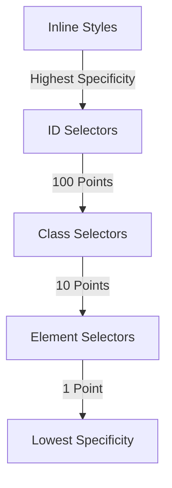

## 4.3 Selectors and Specificity

In this section, we will explore the fascinating world of CSS selectors and specificity. As you build your first web page, understanding how to target HTML elements effectively is crucial for applying styles. CSS selectors allow you to pinpoint specific elements in your HTML document, while specificity determines which styles are applied when multiple rules could affect an element. Let's dive into these concepts and learn how to wield the power of CSS selectors and specificity.

### Understanding CSS Selectors

CSS selectors are patterns used to select the elements you want to style. They form the backbone of CSS, allowing you to apply styles to specific HTML elements. Let's explore some basic selectors:

#### Element Selectors

Element selectors target HTML elements by their tag name. For example, to style all `<p>` (paragraph) elements, you would use the following CSS:

```css
p {
  color: blue;
  font-size: 16px;
}
```

This rule applies a blue color and a font size of 16 pixels to all paragraph elements in your document.

#### Class Selectors

Class selectors target elements with a specific class attribute. Classes are defined in HTML using the `class` attribute and are prefixed with a dot (`.`) in CSS. Here's an example:

```html
<p class="highlight">This is a highlighted paragraph.</p>
```

```css
.highlight {
  background-color: yellow;
  font-weight: bold;
}
```

In this example, only the paragraph with the class `highlight` will have a yellow background and bold text.

#### ID Selectors

ID selectors target elements with a specific ID attribute. IDs are unique within a page, meaning each ID should only be used once. They are prefixed with a hash (`#`) in CSS:

```html
<p id="intro">Welcome to our website!</p>
```

```css
#intro {
  font-size: 20px;
  color: green;
}
```

Here, the paragraph with the ID `intro` will have a font size of 20 pixels and green text.

### Specificity: Determining Which Styles Apply

Specificity is a crucial concept in CSS that determines which styles are applied when multiple rules could affect an element. It is calculated based on the types of selectors used in a rule. Let's break down how specificity works.

#### Specificity Calculation

Specificity is calculated using a point system, where different types of selectors contribute different points:

- Inline styles (e.g., `style="color: red;"`) have the highest specificity and override any other styles.
- ID selectors contribute 100 points.
- Class selectors, attribute selectors, and pseudo-classes contribute 10 points.
- Element selectors and pseudo-elements contribute 1 point.

Let's look at an example to understand specificity calculations:

```css
/* Specificity: 001 (element selector) */
p {
  color: black;
}

/* Specificity: 010 (class selector) */
.highlight {
  color: blue;
}

/* Specificity: 100 (ID selector) */
#intro {
  color: green;
}
```

If an element has all three selectors applied, the ID selector will take precedence due to its higher specificity.

#### Example: Specificity in Action

Consider the following HTML and CSS:

```html
<p class="highlight" id="intro">Welcome to our website!</p>
```

```css
p {
  color: black;
}

.highlight {
  color: blue;
}

#intro {
  color: green;
}
```

In this case, the paragraph will be green because the ID selector `#intro` has the highest specificity.

### Combinators: Combining Selectors

Combinators allow you to combine multiple selectors to target elements based on their relationship in the HTML structure. Let's explore some common combinators:

#### Descendant Combinator

The descendant combinator (a space) selects elements that are descendants of a specified element. For example:

```css
div p {
  color: red;
}
```

This rule targets all `<p>` elements that are descendants of a `<div>` element.

#### Child Combinator

The child combinator (`>`) selects elements that are direct children of a specified element:

```css
ul > li {
  list-style-type: none;
}
```

This rule targets `<li>` elements that are direct children of a `<ul>` element.

#### Adjacent Sibling Combinator

The adjacent sibling combinator (`+`) selects an element that is the immediate sibling of a specified element:

```css
h1 + p {
  margin-top: 0;
}
```

This rule targets a `<p>` element that immediately follows an `<h1>` element.

#### General Sibling Combinator

The general sibling combinator (`~`) selects all siblings of a specified element:

```css
h1 ~ p {
  color: gray;
}
```

This rule targets all `<p>` elements that are siblings of an `<h1>` element.

### Experimenting with Selectors

To reinforce your understanding of CSS selectors and specificity, try experimenting with different combinations of selectors. Here are some exercises to get you started:

1. **Target Specific Elements**: Create a CSS rule that targets all `<h2>` elements and changes their color to purple.

2. **Combine Selectors**: Write a CSS rule that targets all `<p>` elements inside a `<div>` with the class `container` and changes their font size to 18 pixels.

3. **Override Styles**: Use an ID selector to override the styles applied by a class selector on a specific element.

4. **Sibling Selectors**: Use the adjacent sibling combinator to style a `<p>` element that immediately follows an `<h2>` element.

5. **Experiment with Specificity**: Create multiple CSS rules with different selectors and predict which styles will be applied based on specificity.

### Visualizing Selectors and Specificity

To help visualize how selectors and specificity work, let's use a Mermaid.js diagram to represent the specificity hierarchy:



This diagram illustrates the hierarchy of specificity, with inline styles having the highest specificity and element selectors having the lowest.

### Further Reading and Resources

To deepen your understanding of CSS selectors and specificity, consider exploring the following resources:

- [MDN Web Docs: CSS Selectors](https://developer.mozilla.org/en-US/docs/Web/CSS/CSS_Selectors)
- [W3Schools: CSS Specificity](https://www.w3schools.com/css/css_specificity.asp)
- [CSS Tricks: Specifics on CSS Specificity](https://css-tricks.com/specifics-on-css-specificity/)

### Key Takeaways

- CSS selectors allow you to target specific HTML elements for styling.
- Specificity determines which styles are applied when multiple rules could affect an element.
- Combinators enable you to target elements based on their relationship in the HTML structure.
- Experimenting with selectors and specificity helps reinforce your understanding of CSS.

By mastering CSS selectors and specificity, you'll be well-equipped to create beautifully styled web pages. Keep practicing and experimenting with different combinations to see how they affect your designs.

## Quiz Time!



### Which selector targets all `<p>` elements in a document?

- [x] `p`
- [ ] `.p`
- [ ] `#p`
- [ ] `*p`

> **Explanation:** The element selector `p` targets all `<p>` elements in a document.

### How do you target an element with the class `highlight`?

- [ ] `highlight`
- [x] `.highlight`
- [ ] `#highlight`
- [ ] `*highlight`

> **Explanation:** Class selectors are prefixed with a dot (`.`), so `.highlight` targets elements with the class `highlight`.

### Which selector has the highest specificity?

- [ ] Element selector
- [ ] Class selector
- [x] ID selector
- [ ] Universal selector

> **Explanation:** ID selectors have the highest specificity among the listed options.

### What does the child combinator (`>`) do?

- [x] Selects direct children of a specified element
- [ ] Selects all descendants of a specified element
- [ ] Selects all siblings of a specified element
- [ ] Selects the parent of a specified element

> **Explanation:** The child combinator (`>`) selects direct children of a specified element.

### Which CSS rule will apply if both an ID and a class selector target the same element?

- [x] The rule with the ID selector
- [ ] The rule with the class selector
- [ ] Both rules will apply
- [ ] Neither rule will apply

> **Explanation:** The rule with the ID selector will apply because it has higher specificity.

### How many points does a class selector contribute to specificity?

- [ ] 1
- [x] 10
- [ ] 100
- [ ] 1000

> **Explanation:** A class selector contributes 10 points to specificity.

### What is the purpose of the descendant combinator (a space)?

- [x] Selects elements that are descendants of a specified element
- [ ] Selects direct children of a specified element
- [ ] Selects all siblings of a specified element
- [ ] Selects the parent of a specified element

> **Explanation:** The descendant combinator (a space) selects elements that are descendants of a specified element.

### Which selector targets an element with the ID `intro`?

- [ ] `intro`
- [ ] `.intro`
- [x] `#intro`
- [ ] `*intro`

> **Explanation:** ID selectors are prefixed with a hash (`#`), so `#intro` targets an element with the ID `intro`.

### What is the specificity of an inline style?

- [x] Highest specificity
- [ ] 100 points
- [ ] 10 points
- [ ] 1 point

> **Explanation:** Inline styles have the highest specificity and override other styles.

### True or False: The universal selector (`*`) has higher specificity than an element selector.

- [ ] True
- [x] False

> **Explanation:** The universal selector (`*`) has the lowest specificity, even lower than an element selector.


