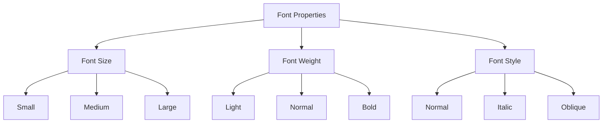

## 4.4 Styling Text and Fonts

In this section, we will explore how to style text and fonts using CSS to enhance the visual appeal and readability of your web pages. Typography plays a crucial role in web design, influencing how users perceive and interact with content. We'll cover essential CSS properties for styling text and fonts, introduce web-safe fonts, and discuss best practices for readability and accessibility.

### Understanding Font-Related Properties

CSS provides several properties to control the appearance of text on a web page. Let's dive into some of the most commonly used font-related properties.

#### Font-Family

The `font-family` property specifies the typeface to be used for an element. You can list multiple fonts as a "font stack," which allows the browser to choose the first available font in the list. This ensures that your text is displayed even if the preferred font is unavailable.

```css
p {
  font-family: "Arial", "Helvetica", sans-serif;
}
```

In this example, the paragraph text will use Arial if available. If not, it will fall back to Helvetica, and finally to the generic sans-serif font.

#### Font-Size

The `font-size` property defines the size of the text. You can specify font size using various units, such as pixels (`px`), ems (`em`), rems (`rem`), or percentages (`%`).

```css
h1 {
  font-size: 2em; /* 2 times the size of the parent element's font size */
}

p {
  font-size: 16px; /* Fixed size in pixels */
}
```

Using relative units like `em` and `rem` can help create responsive designs that adapt to different screen sizes.

#### Font-Weight

The `font-weight` property controls the thickness of the text. You can use predefined keywords like `normal`, `bold`, or numeric values ranging from 100 to 900.

```css
strong {
  font-weight: bold;
}

h2 {
  font-weight: 600; /* Semi-bold */
}
```

#### Font-Style

The `font-style` property allows you to make text italic or oblique.

```css
em {
  font-style: italic;
}

blockquote {
  font-style: oblique;
}
```

### Exploring Text Properties

Besides font-related properties, CSS provides several text properties to further customize the appearance of text.

#### Color

The `color` property sets the color of the text. You can specify colors using names, hexadecimal values, RGB, or RGBA.

```css
h1 {
  color: #333333; /* Dark gray */
}

a {
  color: rgb(0, 120, 215); /* Blue */
}
```

#### Text-Align

The `text-align` property determines the horizontal alignment of text within an element. Common values include `left`, `right`, `center`, and `justify`.

```css
h1 {
  text-align: center;
}

p {
  text-align: justify;
}
```

#### Text-Decoration

The `text-decoration` property adds decorative lines to text, such as underlining or striking through.

```css
a {
  text-decoration: none; /* Removes underline from links */
}

del {
  text-decoration: line-through;
}
```

#### Line-Height

The `line-height` property sets the space between lines of text, improving readability.

```css
p {
  line-height: 1.5; /* 1.5 times the font size */
}
```

### Styling Headings and Paragraphs

Let's apply what we've learned to style headings and paragraphs on a web page.

```html
<!DOCTYPE html>
<html lang="en">
<head>
  <meta charset="UTF-8">
  <meta name="viewport" content="width=device-width, initial-scale=1.0">
  <title>Styled Text Example</title>
  <style>
    body {
      font-family: "Arial", sans-serif;
      color: #333;
      line-height: 1.6;
    }

    h1 {
      font-size: 2.5em;
      font-weight: bold;
      text-align: center;
      color: #0056b3;
    }

    p {
      font-size: 1em;
      text-align: justify;
      margin-bottom: 1em;
    }
  </style>
</head>
<body>
  <h1>Welcome to Our Website</h1>
  <p>Lorem ipsum dolor sit amet, consectetur adipiscing elit. Sed do eiusmod tempor incididunt ut labore et dolore magna aliqua.</p>
  <p>Ut enim ad minim veniam, quis nostrud exercitation ullamco laboris nisi ut aliquip ex ea commodo consequat.</p>
</body>
</html>
```

### Introducing Web-Safe Fonts and Font Stacks

Web-safe fonts are fonts that are commonly available across different operating systems and devices. Using web-safe fonts ensures that your text appears consistently across various platforms. Here are some popular web-safe fonts:

- Arial
- Helvetica
- Times New Roman
- Georgia
- Courier New
- Verdana

When specifying fonts, it's a good practice to include a generic font family as a fallback. This is known as a font stack.

```css
body {
  font-family: "Georgia", "Times New Roman", serif;
}
```

### Attention to Readability and Accessibility

When styling text, it's essential to consider readability and accessibility. Here are some best practices:

- **Contrast**: Ensure sufficient contrast between text and background colors to improve readability.
- **Font Size**: Use a font size that is easy to read, especially on smaller screens.
- **Line Height**: Set an appropriate line height to make text easier to read.
- **Avoid All Caps**: Avoid using all uppercase letters, as it can be harder to read.
- **Accessible Fonts**: Choose fonts that are easy to read for users with visual impairments.

### Try It Yourself

Experiment with the code examples provided above. Try changing font families, sizes, and colors to see how they affect the appearance of your text. You can also explore different font stacks and observe how they impact the look of your web page.

### Visualizing Font Properties

To help visualize how different font properties affect text, let's use a simple diagram to illustrate the impact of font size, weight, and style.



This diagram shows how different font properties can be adjusted to achieve various text styles.

### References and Further Reading

For more information on CSS text and font properties, check out these resources:

- [MDN Web Docs: CSS Fonts](https://developer.mozilla.org/en-US/docs/Web/CSS/font)
- [W3Schools: CSS Text](https://www.w3schools.com/css/css_text.asp)

### Engagement and Reinforcement

To reinforce your understanding, try styling a sample web page with different font and text properties. Experiment with various font stacks and observe how they affect the appearance of your text.

### Key Takeaways

- CSS provides several properties to style text and fonts, including `font-family`, `font-size`, `font-weight`, `font-style`, `color`, `text-align`, `text-decoration`, and `line-height`.
- Use web-safe fonts and font stacks to ensure consistent text appearance across different platforms.
- Pay attention to readability and accessibility when styling text.

## Quiz Time!



### What property is used to change the font type in CSS?

- [x] font-family
- [ ] font-size
- [ ] font-weight
- [ ] font-style

> **Explanation:** The `font-family` property is used to specify the typeface for an element.

### Which unit is relative to the font size of the root element?

- [ ] px
- [ ] em
- [x] rem
- [ ] %

> **Explanation:** The `rem` unit is relative to the font size of the root element, making it useful for responsive designs.

### How can you remove the underline from a hyperlink in CSS?

- [ ] color: none;
- [x] text-decoration: none;
- [ ] font-style: normal;
- [ ] font-weight: normal;

> **Explanation:** The `text-decoration: none;` property removes the underline from hyperlinks.

### What property adjusts the space between lines of text?

- [ ] font-size
- [x] line-height
- [ ] text-align
- [ ] font-weight

> **Explanation:** The `line-height` property sets the space between lines of text, improving readability.

### Which of the following is a web-safe font?

- [x] Arial
- [ ] Comic Sans
- [ ] Papyrus
- [ ] Impact

> **Explanation:** Arial is a web-safe font commonly available across different operating systems and devices.

### What is the purpose of a font stack?

- [ ] To increase font size
- [x] To provide fallback fonts
- [ ] To change text color
- [ ] To align text

> **Explanation:** A font stack provides a list of fonts to use, allowing the browser to choose the first available font, ensuring consistent text appearance.

### Which property is used to make text italic in CSS?

- [ ] font-weight
- [ ] text-align
- [x] font-style
- [ ] line-height

> **Explanation:** The `font-style` property is used to make text italic or oblique.

### How can you center-align text in a heading element?

- [ ] font-weight: center;
- [x] text-align: center;
- [ ] font-size: center;
- [ ] line-height: center;

> **Explanation:** The `text-align: center;` property centers the text within the element.

### What is the best practice for ensuring text readability?

- [ ] Use all uppercase letters
- [x] Ensure sufficient contrast
- [ ] Use small font sizes
- [ ] Avoid line height

> **Explanation:** Ensuring sufficient contrast between text and background colors improves readability.

### True or False: The `font-weight` property can only be set to `normal` or `bold`.

- [ ] True
- [x] False

> **Explanation:** The `font-weight` property can be set to numeric values ranging from 100 to 900, in addition to `normal` and `bold`.


