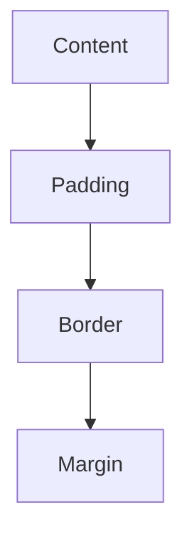

## 4.6 The CSS Box Model

Welcome to the fascinating world of the CSS Box Model! Understanding this concept is crucial for anyone looking to build visually appealing and well-structured web pages. The CSS Box Model is a fundamental concept that describes how elements are structured and displayed on a web page. It consists of several components that determine the size and spacing of elements. Let's dive in and explore each part of the box model, how they interact, and how you can use them to create beautiful layouts.

### What is the CSS Box Model?

The CSS Box Model is a box that wraps around every HTML element. It consists of four main components: content, padding, border, and margin. Each of these components plays a vital role in determining the size and spacing of elements on a web page.

- **Content**: This is the innermost part of the box, where text and images appear.
- **Padding**: This is the space between the content and the border. It creates a buffer around the content.
- **Border**: This is the line that surrounds the padding (if any) and content.
- **Margin**: This is the outermost space that separates the element from other elements.

Let's visualize the CSS Box Model with a diagram:



**Diagram Explanation**: The diagram above illustrates the hierarchical structure of the CSS Box Model, with the content at the center, surrounded by padding, then the border, and finally the margin.

### Components of the CSS Box Model

#### 1. Content

The content area is where your text, images, or other media are displayed. The size of the content area can be controlled using properties like `width` and `height`.

```css
.element {
    width: 200px;
    height: 100px;
}
```

In the example above, the content area of the element is set to 200 pixels wide and 100 pixels tall.

#### 2. Padding

Padding is the space between the content and the border. It can be used to create breathing room around the content, making it more visually appealing.

```css
.element {
    padding: 20px;
}
```

**Key Points**:
- Padding can be set individually for each side using `padding-top`, `padding-right`, `padding-bottom`, and `padding-left`.
- Padding adds to the total size of the element.

#### 3. Border

The border is a line that surrounds the padding and content. It can be styled in various ways, including color, width, and style (solid, dashed, dotted, etc.).

```css
.element {
    border: 2px solid black;
}
```

**Key Points**:
- Borders can be customized for each side using `border-top`, `border-right`, `border-bottom`, and `border-left`.
- The border adds to the total size of the element.

#### 4. Margin

Margin is the space outside the border. It separates the element from other elements on the page.

```css
.element {
    margin: 10px;
}
```

**Key Points**:
- Margins can be set individually for each side using `margin-top`, `margin-right`, `margin-bottom`, and `margin-left`.
- Margins do not affect the size of the element itself but affect the spacing between elements.

### The `box-sizing` Property

The `box-sizing` property is used to alter the default CSS Box Model behavior. By default, the width and height you set for an element only apply to the content area. Padding and border are added to the content dimensions, which can sometimes lead to unexpected results.

#### Values of `box-sizing`

1. **content-box** (default): The `width` and `height` properties apply only to the content. Padding and border are added to the content dimensions.

2. **border-box**: The `width` and `height` properties include the padding and border, but not the margin.

```css
.element {
    box-sizing: border-box;
    width: 200px;
    padding: 20px;
    border: 10px solid black;
}
```

In the example above, the total width of the element remains 200 pixels, even with padding and border applied, because of the `border-box` setting.

### Common Issues and Solutions

#### Issue 1: Unexpected Element Size

When using the default `content-box` model, you might find that your elements are larger than expected due to padding and border.

**Solution**: Use `box-sizing: border-box;` to include padding and border in the element's total width and height.

#### Issue 2: Overlapping Margins

When two elements have adjacent vertical margins, they can collapse into a single margin. This is known as margin collapse.

**Solution**: Use padding or border to separate elements, or adjust the margins to prevent collapse.

### Practical Examples

Let's put the CSS Box Model into practice with some examples.

#### Example 1: Adjusting Padding and Margin

```html
<!DOCTYPE html>
<html lang="en">
<head>
    <meta charset="UTF-8">
    <meta name="viewport" content="width=device-width, initial-scale=1.0">
    <style>
        .box {
            width: 150px;
            height: 100px;
            padding: 10px;
            border: 2px solid blue;
            margin: 20px;
            box-sizing: border-box;
        }
    </style>
    <title>Box Model Example</title>
</head>
<body>
    <div class="box">Hello, Box Model!</div>
</body>
</html>
```

**Explanation**: In this example, the `.box` class has a width and height set, with padding, border, and margin applied. The `box-sizing: border-box;` ensures that the total width and height include padding and border.

#### Example 2: Solving Margin Collapse

```html
<!DOCTYPE html>
<html lang="en">
<head>
    <meta charset="UTF-8">
    <meta name="viewport" content="width=device-width, initial-scale=1.0">
    <style>
        .box1, .box2 {
            width: 150px;
            height: 100px;
            border: 2px solid red;
            margin-bottom: 20px;
        }
        .box2 {
            margin-top: 20px;
        }
    </style>
    <title>Margin Collapse Example</title>
</head>
<body>
    <div class="box1">Box 1</div>
    <div class="box2">Box 2</div>
</body>
</html>
```

**Explanation**: In this example, both `.box1` and `.box2` have margins that would normally collapse. By adding a border or padding, you can prevent the collapse and maintain the desired spacing.

### Try It Yourself

To reinforce your understanding, try modifying the examples above:

- Change the padding and margin values to see how they affect the layout.
- Experiment with different border styles and colors.
- Use `box-sizing: content-box;` and observe the changes in element size.

### Key Takeaways

- The CSS Box Model is essential for understanding how elements are sized and spaced on a web page.
- `box-sizing: border-box;` is often preferred for predictable element sizing.
- Padding and border add to the element's dimensions, while margin affects spacing between elements.
- Margin collapse can be managed with padding, border, or adjusted margins.

### Further Reading

For more information on the CSS Box Model, you can explore these resources:

- [MDN Web Docs: CSS Box Model](https://developer.mozilla.org/en-US/docs/Learn/CSS/Building_blocks/The_box_model)
- [W3Schools: CSS Box Model](https://www.w3schools.com/css/css_boxmodel.asp)

## Quiz Time!



### What is the innermost part of the CSS Box Model?

- [x] Content
- [ ] Padding
- [ ] Border
- [ ] Margin

> **Explanation:** The content is the innermost part of the CSS Box Model where text and images appear.


### Which property is used to include padding and border in the element's total width and height?

- [ ] content-box
- [x] border-box
- [ ] margin-box
- [ ] padding-box

> **Explanation:** The `box-sizing: border-box;` property includes padding and border in the element's total width and height.


### What happens when two adjacent vertical margins collapse?

- [ ] They double in size
- [ ] They disappear
- [x] They merge into a single margin
- [ ] They remain unchanged

> **Explanation:** When two adjacent vertical margins collapse, they merge into a single margin.


### How can you prevent margin collapse?

- [x] Use padding or border
- [ ] Increase margin size
- [ ] Use `box-sizing: content-box;`
- [ ] Add more elements

> **Explanation:** Using padding or border can prevent margin collapse by separating the elements.


### What does the `padding` property affect?

- [ ] The space outside the border
- [x] The space between the content and the border
- [ ] The width of the border
- [ ] The height of the element

> **Explanation:** The `padding` property affects the space between the content and the border.


### Which of the following is NOT a part of the CSS Box Model?

- [ ] Margin
- [ ] Border
- [ ] Padding
- [x] Background

> **Explanation:** Background is not a part of the CSS Box Model; it is a separate property.


### What is the default value of the `box-sizing` property?

- [x] content-box
- [ ] border-box
- [ ] margin-box
- [ ] padding-box

> **Explanation:** The default value of the `box-sizing` property is `content-box`.


### Which property affects the space outside the border?

- [ ] Padding
- [ ] Border
- [x] Margin
- [ ] Content

> **Explanation:** The `margin` property affects the space outside the border.


### How can you set different padding for each side of an element?

- [x] Use `padding-top`, `padding-right`, `padding-bottom`, and `padding-left`
- [ ] Use `padding-all`
- [ ] Use `padding-side`
- [ ] Use `padding-box`

> **Explanation:** You can set different padding for each side using `padding-top`, `padding-right`, `padding-bottom`, and `padding-left`.


### The CSS Box Model is crucial for understanding what aspect of web design?

- [x] Element sizing and spacing
- [ ] Color schemes
- [ ] Font styles
- [ ] Image resolution

> **Explanation:** The CSS Box Model is crucial for understanding element sizing and spacing on a web page.


