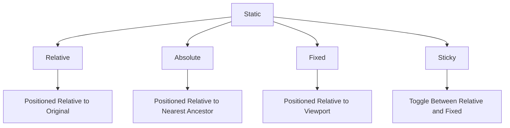

## 4.7 Layout with CSS

Creating a visually appealing and functional web page requires more than just content; it involves arranging elements in a way that enhances user experience. In this section, we will explore how to use CSS to position and arrange elements on a web page effectively. We'll cover the `display` property, floating elements, and various positioning techniques. By the end of this section, you'll have a solid understanding of how to control layout with CSS.

### Understanding the `display` Property

The `display` property is a fundamental CSS property that determines how an element is displayed on a web page. It controls the layout behavior of an element and its children. Let's explore the most common values for the `display` property:

#### `block`

Elements with `display: block` take up the full width available, and each element starts on a new line. Common block elements include `<div>`, `<h1>`, `<p>`, and `<section>`.

```html
<!DOCTYPE html>
<html lang="en">
<head>
    <meta charset="UTF-8">
    <meta name="viewport" content="width=device-width, initial-scale=1.0">
    <title>Block Display Example</title>
    <style>
        .block-element {
            display: block;
            width: 100%;
            background-color: lightblue;
            margin-bottom: 10px;
        }
    </style>
</head>
<body>
    <div class="block-element">Block Element 1</div>
    <div class="block-element">Block Element 2</div>
</body>
</html>
```

#### `inline`

Elements with `display: inline` do not start on a new line and only take up as much width as necessary. Common inline elements include `<span>`, `<a>`, and `<strong>`.

```html
<!DOCTYPE html>
<html lang="en">
<head>
    <meta charset="UTF-8">
    <meta name="viewport" content="width=device-width, initial-scale=1.0">
    <title>Inline Display Example</title>
    <style>
        .inline-element {
            display: inline;
            background-color: lightgreen;
            padding: 5px;
        }
    </style>
</head>
<body>
    <span class="inline-element">Inline Element 1</span>
    <span class="inline-element">Inline Element 2</span>
</body>
</html>
```

#### `inline-block`

Elements with `display: inline-block` are similar to inline elements, but they can have a width and height set. This makes them useful for creating layouts where you need elements to sit side by side but still have block-like properties.

```html
<!DOCTYPE html>
<html lang="en">
<head>
    <meta charset="UTF-8">
    <meta name="viewport" content="width=device-width, initial-scale=1.0">
    <title>Inline-Block Display Example</title>
    <style>
        .inline-block-element {
            display: inline-block;
            width: 100px;
            height: 100px;
            background-color: lightcoral;
            margin-right: 10px;
        }
    </style>
</head>
<body>
    <div class="inline-block-element">Inline-Block 1</div>
    <div class="inline-block-element">Inline-Block 2</div>
</body>
</html>
```

#### `none`

Elements with `display: none` are not displayed at all. They do not take up any space in the layout.

```html
<!DOCTYPE html>
<html lang="en">
<head>
    <meta charset="UTF-8">
    <meta name="viewport" content="width=device-width, initial-scale=1.0">
    <title>Display None Example</title>
    <style>
        .hidden-element {
            display: none;
        }
    </style>
</head>
<body>
    <div class="hidden-element">This element is hidden and takes no space.</div>
    <div>This element is visible.</div>
</body>
</html>
```

### Floating Elements with `float`

The `float` property is used to position elements to the left or right of their container, allowing text and inline elements to wrap around them. This property was widely used for creating layouts before the advent of Flexbox and CSS Grid.

#### Using `float`

```html
<!DOCTYPE html>
<html lang="en">
<head>
    <meta charset="UTF-8">
    <meta name="viewport" content="width=device-width, initial-scale=1.0">
    <title>Float Example</title>
    <style>
        .float-left {
            float: left;
            width: 200px;
            height: 100px;
            background-color: lightpink;
            margin-right: 10px;
        }
        .float-right {
            float: right;
            width: 200px;
            height: 100px;
            background-color: lightyellow;
            margin-left: 10px;
        }
    </style>
</head>
<body>
    <div class="float-left">Float Left</div>
    <div class="float-right">Float Right</div>
    <p>This paragraph will wrap around the floated elements.</p>
</body>
</html>
```

#### Clearing Floats

When elements are floated, they can affect the layout of subsequent elements. The `clear` property is used to control the behavior of elements after floated elements.

```html
<!DOCTYPE html>
<html lang="en">
<head>
    <meta charset="UTF-8">
    <meta name="viewport" content="width=device-width, initial-scale=1.0">
    <title>Clear Example</title>
    <style>
        .float-element {
            float: left;
            width: 100px;
            height: 100px;
            background-color: lightblue;
            margin-right: 10px;
        }
        .clear-both {
            clear: both;
        }
    </style>
</head>
<body>
    <div class="float-element">Float 1</div>
    <div class="float-element">Float 2</div>
    <div class="clear-both"></div>
    <p>This paragraph is below the floated elements.</p>
</body>
</html>
```

### Positioning Elements

CSS provides several positioning schemes to control the placement of elements. Let's explore each positioning property:

#### `static`

This is the default positioning for elements. Elements are positioned according to the normal flow of the document.

```html
<!DOCTYPE html>
<html lang="en">
<head>
    <meta charset="UTF-8">
    <meta name="viewport" content="width=device-width, initial-scale=1.0">
    <title>Static Position Example</title>
    <style>
        .static-element {
            position: static;
            background-color: lightgray;
        }
    </style>
</head>
<body>
    <div class="static-element">This is a static element.</div>
</body>
</html>
```

#### `relative`

Elements with `position: relative` are positioned relative to their normal position. You can use the `top`, `right`, `bottom`, and `left` properties to adjust their position.

```html
<!DOCTYPE html>
<html lang="en">
<head>
    <meta charset="UTF-8">
    <meta name="viewport" content="width=device-width, initial-scale=1.0">
    <title>Relative Position Example</title>
    <style>
        .relative-element {
            position: relative;
            top: 20px;
            left: 20px;
            background-color: lightgreen;
        }
    </style>
</head>
<body>
    <div class="relative-element">This element is relatively positioned.</div>
</body>
</html>
```

#### `absolute`

Elements with `position: absolute` are positioned relative to the nearest positioned ancestor. If no ancestor is positioned, it uses the document body, and moves along with page scrolling.

```html
<!DOCTYPE html>
<html lang="en">
<head>
    <meta charset="UTF-8">
    <meta name="viewport" content="width=device-width, initial-scale=1.0">
    <title>Absolute Position Example</title>
    <style>
        .absolute-element {
            position: absolute;
            top: 50px;
            left: 50px;
            background-color: lightcoral;
        }
        .container {
            position: relative;
            width: 300px;
            height: 200px;
            background-color: lightgray;
        }
    </style>
</head>
<body>
    <div class="container">
        <div class="absolute-element">This element is absolutely positioned.</div>
    </div>
</body>
</html>
```

#### `fixed`

Elements with `position: fixed` are positioned relative to the viewport, which means they stay in the same place even when the page is scrolled.

```html
<!DOCTYPE html>
<html lang="en">
<head>
    <meta charset="UTF-8">
    <meta name="viewport" content="width=device-width, initial-scale=1.0">
    <title>Fixed Position Example</title>
    <style>
        .fixed-element {
            position: fixed;
            top: 0;
            right: 0;
            background-color: lightyellow;
        }
    </style>
</head>
<body>
    <div class="fixed-element">This element is fixed.</div>
    <p>Scroll down to see the fixed element in action.</p>
    <p style="margin-top: 1000px;">End of content.</p>
</body>
</html>
```

#### `sticky`

Elements with `position: sticky` toggle between relative and fixed, depending on the user's scroll position. It's useful for creating sticky headers or sidebars.

```html
<!DOCTYPE html>
<html lang="en">
<head>
    <meta charset="UTF-8">
    <meta name="viewport" content="width=device-width, initial-scale=1.0">
    <title>Sticky Position Example</title>
    <style>
        .sticky-element {
            position: sticky;
            top: 0;
            background-color: lightblue;
        }
    </style>
</head>
<body>
    <div class="sticky-element">This element is sticky.</div>
    <p>Scroll down to see the sticky element in action.</p>
    <p style="margin-top: 1000px;">End of content.</p>
</body>
</html>
```

### Understanding How Positioning Affects Layout

Positioning elements using CSS can significantly affect the layout of your web page. Here's a brief overview of how different positioning properties impact layout:

- **Static**: Elements follow the normal flow of the document. This is the default behavior.
- **Relative**: Elements are positioned relative to their original position, allowing for slight adjustments without affecting other elements.
- **Absolute**: Elements are removed from the normal document flow and positioned relative to their nearest positioned ancestor.
- **Fixed**: Elements are positioned relative to the viewport and remain in place during scrolling.
- **Sticky**: Elements switch between relative and fixed positioning based on the scroll position.

### Try It Yourself

Experiment with the code examples provided above. Try changing the values of the `top`, `left`, `right`, and `bottom` properties to see how they affect the positioning of elements. You can also try combining different positioning properties to create complex layouts.

### Visualizing Layout with Mermaid.js

To better understand how different positioning properties affect layout, let's visualize the relationship between elements using Mermaid.js diagrams.



This diagram illustrates how different positioning properties relate to each other and their effects on layout.

### Further Reading

For more information on CSS layout techniques, consider exploring these resources:

- [MDN Web Docs: CSS Layout](https://developer.mozilla.org/en-US/docs/Learn/CSS/CSS_layout)
- [W3Schools: CSS Layout](https://www.w3schools.com/css/css_positioning.asp)

### Key Takeaways

- The `display` property controls how elements are displayed on a web page.
- The `float` property allows elements to be positioned to the left or right, with text wrapping around them.
- Positioning properties (`static`, `relative`, `absolute`, `fixed`, `sticky`) provide different ways to control the placement of elements.
- Understanding how these properties affect layout is crucial for creating visually appealing and functional web pages.

## Quiz Time!



### Which `display` property value makes an element take up the full width available and start on a new line?

- [x] block
- [ ] inline
- [ ] inline-block
- [ ] none

> **Explanation:** The `block` value makes an element take up the full width available and start on a new line.

### What is the default positioning property for elements in CSS?

- [x] static
- [ ] relative
- [ ] absolute
- [ ] fixed

> **Explanation:** The default positioning property for elements in CSS is `static`.

### Which property is used to position an element relative to its nearest positioned ancestor?

- [ ] static
- [ ] relative
- [x] absolute
- [ ] fixed

> **Explanation:** The `absolute` property positions an element relative to its nearest positioned ancestor.

### What does the `clear` property do in CSS?

- [x] Controls the behavior of elements after floated elements
- [ ] Positions elements to the left or right
- [ ] Hides elements from the layout
- [ ] Adjusts the opacity of elements

> **Explanation:** The `clear` property controls the behavior of elements after floated elements.

### Which positioning property keeps an element in the same place even when the page is scrolled?

- [ ] static
- [ ] relative
- [ ] absolute
- [x] fixed

> **Explanation:** The `fixed` property keeps an element in the same place even when the page is scrolled.

### What does the `sticky` positioning property do?

- [x] Toggles between relative and fixed based on scroll position
- [ ] Positions elements relative to the viewport
- [ ] Positions elements relative to their original position
- [ ] Positions elements relative to the nearest ancestor

> **Explanation:** The `sticky` property toggles between relative and fixed positioning based on the scroll position.

### Which `display` property value allows elements to have a width and height set while sitting side by side?

- [ ] block
- [ ] inline
- [x] inline-block
- [ ] none

> **Explanation:** The `inline-block` value allows elements to have a width and height set while sitting side by side.

### What is the effect of `display: none` on an element?

- [x] The element is not displayed and takes up no space.
- [ ] The element is displayed as a block.
- [ ] The element is displayed inline.
- [ ] The element is displayed with a width and height.

> **Explanation:** `display: none` means the element is not displayed and takes up no space.

### Which property is used to float elements to the left or right?

- [ ] display
- [x] float
- [ ] position
- [ ] clear

> **Explanation:** The `float` property is used to float elements to the left or right.

### True or False: The `relative` positioning property allows elements to be positioned relative to their nearest ancestor.

- [ ] True
- [x] False

> **Explanation:** The `relative` positioning property allows elements to be positioned relative to their original position, not their nearest ancestor.



By mastering the layout techniques discussed in this section, you'll be well-equipped to create web pages that are not only visually appealing but also functional and user-friendly. Happy coding!
