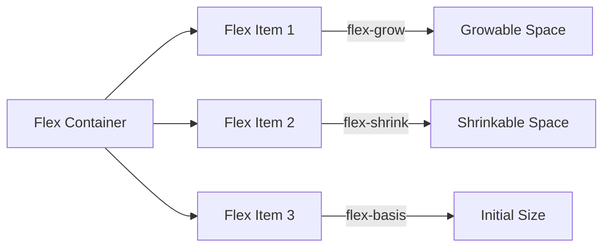

## 4.8 Flexbox Basics

In the ever-evolving world of web design, creating layouts that are both flexible and responsive is crucial. Enter Flexbox, a CSS layout model that provides a more efficient way to design complex layouts without the need for float or positioning hacks. In this section, we will explore the fundamentals of Flexbox, its properties, and how you can use it to build responsive web pages.

### Introduction to the Flexbox Model

Flexbox, short for the Flexible Box Layout, is a CSS module designed to help you align and distribute space among items in a container, even when their size is unknown or dynamic. Unlike traditional layout models, Flexbox is direction-agnostic, meaning it can handle both horizontal and vertical layouts with ease.

#### Advantages of Flexbox

- **Responsive Design**: Flexbox makes it easier to create layouts that adapt to different screen sizes and orientations.
- **Simplified Alignment**: Aligning items vertically and horizontally becomes straightforward with Flexbox properties.
- **Dynamic Layouts**: Flexbox can adjust the size of items based on the available space, making it ideal for dynamic content.
- **Order Management**: You can easily change the order of items without altering the HTML structure.

### The Flex Container

To start using Flexbox, you need to define a flex container. This is done by applying the `display: flex` property to a parent element. The children of this container become flex items, which can be manipulated using various Flexbox properties.

#### Setting Up a Flex Container

```html
<!DOCTYPE html>
<html lang="en">
<head>
    <meta charset="UTF-8">
    <meta name="viewport" content="width=device-width, initial-scale=1.0">
    <title>Flexbox Example</title>
    <style>
        .flex-container {
            display: flex;
            border: 1px solid #ccc;
            padding: 10px;
        }
        .flex-item {
            background-color: #f0f0f0;
            margin: 5px;
            padding: 20px;
            text-align: center;
        }
    </style>
</head>
<body>
    <div class="flex-container">
        <div class="flex-item">Item 1</div>
        <div class="flex-item">Item 2</div>
        <div class="flex-item">Item 3</div>
    </div>
</body>
</html>
```

In this example, we have a `.flex-container` that holds three `.flex-item` elements. By setting `display: flex`, the container becomes a flex container, and its children are automatically arranged in a row.

#### Key Properties of the Flex Container

1. **`flex-direction`**: Determines the direction of the flex items within the container.

   - `row` (default): Items are placed in a row from left to right.
   - `row-reverse`: Items are placed in a row from right to left.
   - `column`: Items are placed in a column from top to bottom.
   - `column-reverse`: Items are placed in a column from bottom to top.

   ```css
   .flex-container {
       display: flex;
       flex-direction: column;
   }
   ```

2. **`justify-content`**: Aligns items along the main axis (horizontal by default).

   - `flex-start`: Items are packed toward the start of the flex container.
   - `flex-end`: Items are packed toward the end of the flex container.
   - `center`: Items are centered along the main axis.
   - `space-between`: Items are evenly distributed with the first item at the start and the last item at the end.
   - `space-around`: Items are evenly distributed with equal space around them.

   ```css
   .flex-container {
       display: flex;
       justify-content: space-between;
   }
   ```

3. **`align-items`**: Aligns items along the cross axis (vertical by default).

   - `stretch` (default): Items are stretched to fill the container.
   - `flex-start`: Items are aligned at the start of the cross axis.
   - `flex-end`: Items are aligned at the end of the cross axis.
   - `center`: Items are centered along the cross axis.
   - `baseline`: Items are aligned along their baseline.

   ```css
   .flex-container {
       display: flex;
       align-items: center;
   }
   ```

### Flex Items Properties

Flex items are the children of a flex container. They can be individually controlled using several properties that determine their size and behavior within the container.

#### Key Properties of Flex Items

1. **`flex-grow`**: Defines the ability of a flex item to grow relative to the rest of the items in the container.

   - A value of `1` allows the item to grow and take up any remaining space.
   - A value of `0` (default) prevents the item from growing.

   ```css
   .flex-item {
       flex-grow: 1;
   }
   ```

2. **`flex-shrink`**: Defines the ability of a flex item to shrink if necessary.

   - A value of `1` allows the item to shrink to prevent overflow.
   - A value of `0` prevents the item from shrinking.

   ```css
   .flex-item {
       flex-shrink: 1;
   }
   ```

3. **`flex-basis`**: Specifies the initial size of a flex item before any remaining space is distributed.

   - Can be set to a specific length (e.g., `200px`) or a percentage.

   ```css
   .flex-item {
       flex-basis: 100px;
   }
   ```

4. **`flex`**: A shorthand property for `flex-grow`, `flex-shrink`, and `flex-basis`.

   ```css
   .flex-item {
       flex: 1 1 100px; /* flex-grow: 1, flex-shrink: 1, flex-basis: 100px */
   }
   ```

### Practical Examples of Flexbox Layouts

Let's explore some practical examples to see how Flexbox can be used to create different layouts.

#### Example 1: Simple Navigation Bar

```html
<div class="navbar">
    <div class="nav-item">Home</div>
    <div class="nav-item">About</div>
    <div class="nav-item">Contact</div>
</div>
```

```css
.navbar {
    display: flex;
    justify-content: space-around;
    background-color: #333;
    padding: 10px;
}

.nav-item {
    color: white;
    padding: 10px;
    text-decoration: none;
}
```

In this example, we create a simple navigation bar where the items are evenly distributed across the container.

#### Example 2: Responsive Card Layout

```html
<div class="card-container">
    <div class="card">Card 1</div>
    <div class="card">Card 2</div>
    <div class="card">Card 3</div>
</div>
```

```css
.card-container {
    display: flex;
    flex-wrap: wrap;
    justify-content: space-between;
}

.card {
    flex: 1 1 calc(33.333% - 20px);
    margin: 10px;
    background-color: #f8f8f8;
    padding: 20px;
    box-shadow: 0 2px 4px rgba(0,0,0,0.1);
}
```

Here, we use `flex-wrap: wrap` to allow the cards to wrap onto the next line if the container is too narrow, making the layout responsive.

#### Example 3: Vertical Centering

```html
<div class="center-container">
    <div class="center-item">Centered Item</div>
</div>
```

```css
.center-container {
    display: flex;
    justify-content: center;
    align-items: center;
    height: 200px;
    background-color: #e0e0e0;
}

.center-item {
    padding: 20px;
    background-color: #fff;
    box-shadow: 0 2px 4px rgba(0,0,0,0.1);
}
```

This example demonstrates how to center an item both vertically and horizontally within a container using Flexbox.

### Encouraging Experimentation

Flexbox is a powerful tool, and the best way to master it is through experimentation. Try modifying the examples above by changing property values, adding more items, or nesting flex containers. Observe how these changes affect the layout and behavior of the elements.

### Visual Aid: Flexbox Layout

To help visualize how Flexbox properties affect layout, consider the following diagram:



This diagram illustrates how flex items are arranged within a flex container and how properties like `flex-grow`, `flex-shrink`, and `flex-basis` influence their size and distribution.

### Summary

Flexbox is an essential tool for modern web design, offering a flexible and efficient way to create responsive layouts. By understanding and applying Flexbox properties, you can build web pages that adapt seamlessly to different devices and screen sizes. Remember, practice is key, so keep experimenting with different Flexbox configurations to deepen your understanding.

## Quiz Time!



### What is the primary purpose of Flexbox?

- [x] To create flexible and responsive layouts
- [ ] To style text and fonts
- [ ] To add animations to a webpage
- [ ] To manage server-side data

> **Explanation:** Flexbox is a CSS module designed to help create flexible and responsive layouts by aligning and distributing space among items in a container.

### Which property is used to define a flex container?

- [x] `display: flex`
- [ ] `flex-direction`
- [ ] `justify-content`
- [ ] `align-items`

> **Explanation:** The `display: flex` property is used to define a flex container, making its children flex items.

### What does the `flex-direction: column` property do?

- [x] Arranges flex items in a column from top to bottom
- [ ] Arranges flex items in a row from left to right
- [ ] Centers flex items horizontally
- [ ] Aligns flex items to the baseline

> **Explanation:** The `flex-direction: column` property arranges flex items in a column from top to bottom.

### How does `justify-content: space-between` affect flex items?

- [x] It distributes items evenly with the first item at the start and the last item at the end
- [ ] It centers items along the main axis
- [ ] It packs items toward the start of the flex container
- [ ] It aligns items along their baseline

> **Explanation:** The `justify-content: space-between` property distributes items evenly with the first item at the start and the last item at the end of the flex container.

### Which property allows a flex item to grow and take up remaining space?

- [x] `flex-grow`
- [ ] `flex-shrink`
- [ ] `flex-basis`
- [ ] `align-items`

> **Explanation:** The `flex-grow` property allows a flex item to grow and take up any remaining space in the flex container.

### What is the default value of `flex-shrink`?

- [x] 1
- [ ] 0
- [ ] 2
- [ ] 3

> **Explanation:** The default value of `flex-shrink` is 1, which allows the item to shrink if necessary to prevent overflow.

### Which property specifies the initial size of a flex item?

- [x] `flex-basis`
- [ ] `flex-grow`
- [ ] `flex-shrink`
- [ ] `justify-content`

> **Explanation:** The `flex-basis` property specifies the initial size of a flex item before any remaining space is distributed.

### What does `align-items: center` do?

- [x] Centers flex items along the cross axis
- [ ] Aligns flex items at the start of the cross axis
- [ ] Aligns flex items at the end of the cross axis
- [ ] Stretches flex items to fill the container

> **Explanation:** The `align-items: center` property centers flex items along the cross axis (vertical by default).

### True or False: Flexbox can handle both horizontal and vertical layouts.

- [x] True
- [ ] False

> **Explanation:** True. Flexbox is direction-agnostic and can handle both horizontal and vertical layouts with ease.

### Which shorthand property combines `flex-grow`, `flex-shrink`, and `flex-basis`?

- [x] `flex`
- [ ] `flex-direction`
- [ ] `align-items`
- [ ] `justify-content`

> **Explanation:** The `flex` property is a shorthand for combining `flex-grow`, `flex-shrink`, and `flex-basis`.



By mastering Flexbox, you're well on your way to creating web pages that are not only visually appealing but also adaptable to a wide range of devices and screen sizes. Keep practicing, and soon you'll be able to tackle even the most complex layout challenges with confidence!
