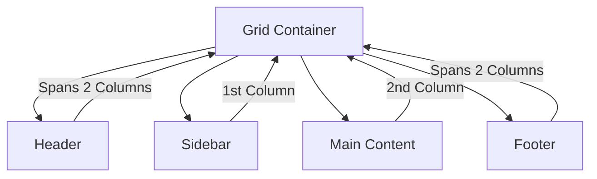

## 4.9 CSS Grid Basics

Welcome to the world of CSS Grid, a powerful layout system that revolutionizes how we design web pages. If you've ever struggled with aligning elements or creating complex layouts using floats or Flexbox, CSS Grid is here to simplify your life. In this section, we'll explore the fundamentals of CSS Grid, its advantages, and how to implement it in your web projects.

### Introduction to CSS Grid

CSS Grid is a two-dimensional layout system that allows you to create complex web layouts with ease. Unlike Flexbox, which is primarily one-dimensional (either row or column), CSS Grid enables you to work with both rows and columns simultaneously. This makes it an ideal choice for creating grid-based designs that require precise control over both axes.

#### Benefits of CSS Grid

- **Two-Dimensional Layouts**: CSS Grid allows you to control both rows and columns, making it perfect for complex designs.
- **Simplified Alignment**: Aligning items within a grid is straightforward, reducing the need for hacks or complex calculations.
- **Responsive Design**: CSS Grid provides tools for creating responsive layouts that adapt to different screen sizes effortlessly.
- **Flexibility**: You can easily rearrange grid items without altering the HTML structure, making it highly flexible.

### Setting Up a Grid Container

To start using CSS Grid, you need to define a grid container. This is done by applying `display: grid` to a parent element. Once an element is a grid container, its direct children become grid items.

```css
.container {
  display: grid;
}
```

#### Defining Grid Tracks

Grid tracks are the rows and columns that make up your grid. You can define them using `grid-template-columns` and `grid-template-rows`.

```css
.container {
  display: grid;
  grid-template-columns: 100px 200px 100px;
  grid-template-rows: 50px 100px;
}
```

In the example above, we have a grid with three columns and two rows. The columns are 100px, 200px, and 100px wide, while the rows are 50px and 100px tall.

### Grid Item Placement and Spanning

Once your grid container is set up, you can place grid items within it. By default, grid items are placed in the grid cells in the order they appear in the HTML. However, CSS Grid provides powerful tools for positioning items explicitly.

#### Placing Grid Items

You can position grid items using `grid-column` and `grid-row` properties. These properties allow you to specify the starting and ending lines for an item.

```css
.item1 {
  grid-column: 1 / 3;
  grid-row: 1 / 2;
}
```

In this example, `.item1` spans from the first to the third column and occupies the first row.

#### Spanning Grid Items

Grid items can span multiple rows or columns using the `span` keyword.

```css
.item2 {
  grid-column: span 2;
  grid-row: span 2;
}
```

Here, `.item2` spans two columns and two rows, occupying a larger area within the grid.

### Creating Simple Grid Layouts

Let's create a simple grid layout to see CSS Grid in action. We'll design a basic webpage layout with a header, sidebar, main content area, and footer.

```html
<div class="grid-container">
  <header class="header">Header</header>
  <aside class="sidebar">Sidebar</aside>
  <main class="main-content">Main Content</main>
  <footer class="footer">Footer</footer>
</div>
```

```css
.grid-container {
  display: grid;
  grid-template-columns: 1fr 3fr;
  grid-template-rows: auto 1fr auto;
  gap: 10px;
}

.header {
  grid-column: 1 / -1;
}

.sidebar {
  grid-column: 1 / 2;
}

.main-content {
  grid-column: 2 / 3;
}

.footer {
  grid-column: 1 / -1;
}
```

In this layout:

- The header and footer span across both columns.
- The sidebar occupies the first column.
- The main content area occupies the second column.
- We use `1fr` to distribute available space proportionally.

### When to Choose CSS Grid Over Flexbox

While both CSS Grid and Flexbox are powerful layout tools, they serve different purposes. Here's when to choose CSS Grid:

- **Complex Layouts**: Use CSS Grid for layouts that require precise control over both rows and columns.
- **Grid-Based Designs**: If your design follows a grid pattern, CSS Grid is the natural choice.
- **Alignment Across Both Axes**: When you need to align items along both the horizontal and vertical axes, CSS Grid provides more flexibility.

On the other hand, Flexbox is ideal for:

- **One-Dimensional Layouts**: Use Flexbox when you only need to control either rows or columns.
- **Simple Alignments**: For straightforward alignment tasks, Flexbox is often simpler to implement.

### Try It Yourself

Now that you have a basic understanding of CSS Grid, try modifying the example layout. Experiment with different grid-template values, add more grid items, or change the item placements. This hands-on practice will reinforce your learning and help you become more comfortable with CSS Grid.

### Visualizing CSS Grid

To better understand how CSS Grid organizes elements, let's visualize a simple grid layout using Mermaid.js.



This diagram represents the layout structure of our example grid. The header and footer span across both columns, while the sidebar and main content occupy individual columns.

### Further Reading and Resources

To deepen your understanding of CSS Grid, consider exploring the following resources:

- [MDN Web Docs on CSS Grid Layout](https://developer.mozilla.org/en-US/docs/Web/CSS/CSS_Grid_Layout)
- [CSS-Tricks: A Complete Guide to Grid](https://css-tricks.com/snippets/css/complete-guide-grid/)
- [W3Schools CSS Grid Tutorial](https://www.w3schools.com/css/css_grid.asp)

### Key Takeaways

- CSS Grid is a powerful two-dimensional layout system that simplifies complex web designs.
- Use `display: grid` to create a grid container and define grid tracks with `grid-template-columns` and `grid-template-rows`.
- Position grid items using `grid-column` and `grid-row` properties, and use `span` to extend items across multiple tracks.
- Choose CSS Grid for grid-based designs and complex layouts, while Flexbox is better for simpler, one-dimensional layouts.

## Quiz Time!



### What is CSS Grid primarily used for?

- [x] Two-dimensional layouts
- [ ] One-dimensional layouts
- [ ] Styling text
- [ ] Adding animations

> **Explanation:** CSS Grid is designed for two-dimensional layouts, allowing control over both rows and columns.

### Which property is used to define a grid container?

- [x] display: grid
- [ ] display: flex
- [ ] grid-template
- [ ] grid-area

> **Explanation:** The `display: grid` property is used to define a grid container.

### How do you specify the number of columns in a grid?

- [x] grid-template-columns
- [ ] grid-template-rows
- [ ] grid-area
- [ ] grid-gap

> **Explanation:** The `grid-template-columns` property is used to define the number and size of columns in a grid.

### What does the `span` keyword do in CSS Grid?

- [x] Allows an item to span multiple rows or columns
- [ ] Sets the grid gap
- [ ] Aligns items in the center
- [ ] Defines the grid area

> **Explanation:** The `span` keyword allows a grid item to extend across multiple rows or columns.

### When should you choose CSS Grid over Flexbox?

- [x] For complex, grid-based designs
- [ ] For simple, one-dimensional layouts
- [ ] When styling text
- [ ] For adding animations

> **Explanation:** CSS Grid is ideal for complex, grid-based designs that require control over both rows and columns.

### What is the default placement of grid items?

- [x] In the order they appear in the HTML
- [ ] Alphabetically by class name
- [ ] Randomly
- [ ] Based on their size

> **Explanation:** By default, grid items are placed in the order they appear in the HTML.

### Which property allows you to define the size of grid rows?

- [x] grid-template-rows
- [ ] grid-template-columns
- [ ] grid-area
- [ ] grid-gap

> **Explanation:** The `grid-template-rows` property is used to define the size of grid rows.

### What does `1fr` represent in CSS Grid?

- [x] A fractional unit of available space
- [ ] A fixed pixel size
- [ ] A percentage of the container
- [ ] An absolute unit

> **Explanation:** `1fr` represents a fractional unit of the available space in the grid container.

### Can CSS Grid and Flexbox be used together?

- [x] True
- [ ] False

> **Explanation:** CSS Grid and Flexbox can be used together to create complex layouts, leveraging the strengths of both systems.

### Which property is used to specify the gap between grid items?

- [x] grid-gap
- [ ] grid-template
- [ ] grid-area
- [ ] grid-column

> **Explanation:** The `grid-gap` property is used to specify the space between grid items.



By mastering CSS Grid, you'll be well-equipped to create sophisticated and responsive web layouts. Keep experimenting and exploring, and you'll soon find CSS Grid to be an indispensable tool in your web development toolkit.
