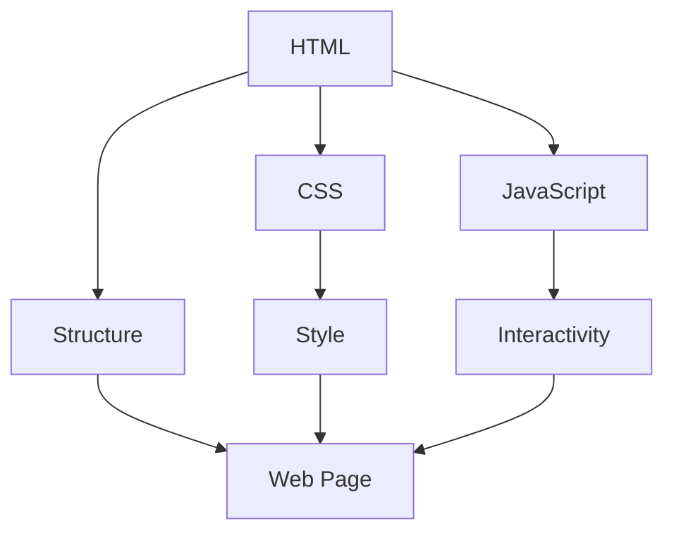

## 5.1 What is JavaScript?

JavaScript is an essential programming language that powers the interactive elements of the web. As we embark on this journey to build your first web page with JavaScript, let's delve into its history, understand its role in web development, and explore its ubiquity in modern technology.

### A Brief History of JavaScript

JavaScript was created in 1995 by Brendan Eich while he was working at Netscape Communications. Initially, it was developed in just ten days and was named Mocha, later renamed to LiveScript, and finally to JavaScript. Despite its name, JavaScript is not related to Java; the name was a marketing strategy to capitalize on Java's popularity at the time.

JavaScript was designed to be a lightweight scripting language that could be embedded directly into web pages. Its primary purpose was to enable client-side scripts to interact with users, control the browser, and alter document content dynamically. Over the years, JavaScript has evolved significantly, becoming a robust language capable of powering complex web applications.

### The Role of JavaScript in Web Development

JavaScript plays a crucial role in adding interactivity and dynamism to web pages. While HTML provides the structure and CSS the style, JavaScript brings web pages to life by enabling interactive features such as:

- **Form Validation**: Ensuring that user inputs meet certain criteria before submission.
- **Dynamic Content Updates**: Changing content on the page without needing to reload it.
- **Animations**: Creating engaging animations and transitions.
- **Event Handling**: Responding to user actions like clicks, mouse movements, and keyboard inputs.
- **Asynchronous Requests**: Fetching data from servers without disrupting the user experience, often using technologies like AJAX.

JavaScript is the backbone of modern web applications, allowing developers to create rich, interactive experiences that engage users and provide seamless functionality.

### Where Does JavaScript Run?

JavaScript is a versatile language that can run in various environments. Primarily, it runs in web browsers, which have built-in JavaScript engines that execute the code. Some popular JavaScript engines include:

- **V8**: Used by Google Chrome and Node.js.
- **SpiderMonkey**: Used by Mozilla Firefox.
- **JavaScriptCore**: Used by Safari.

In addition to browsers, JavaScript can run on servers using Node.js, an open-source, cross-platform runtime environment. Node.js allows developers to use JavaScript for server-side scripting, enabling the development of scalable network applications. This capability has expanded JavaScript's role beyond the client side, making it a full-stack language.

### The Ubiquity of JavaScript in Modern Web Development

JavaScript's ubiquity in modern web development is undeniable. It is the most widely used programming language, with a vast ecosystem of libraries and frameworks that simplify and enhance web development. Some popular JavaScript frameworks and libraries include:

- **React**: A library for building user interfaces, developed by Facebook.
- **Angular**: A platform for building mobile and desktop web applications, developed by Google.
- **Vue.js**: A progressive framework for building user interfaces.

These tools have revolutionized web development, allowing developers to build complex, high-performance applications efficiently. JavaScript's versatility and widespread adoption have made it an indispensable skill for web developers.

### Viewing JavaScript as an Essential Skill

As we progress through this guide, it's important to view JavaScript as an essential skill in your web development toolkit. Mastering JavaScript will empower you to create dynamic, interactive web pages that provide a rich user experience. Whether you're building a simple website or a complex web application, JavaScript is the key to unlocking your creative potential.

### Code Examples

Let's explore some basic JavaScript code examples to illustrate its capabilities.

#### Example 1: Displaying a Message

```html
<!DOCTYPE html>
<html lang="en">
<head>
    <meta charset="UTF-8">
    <meta name="viewport" content="width=device-width, initial-scale=1.0">
    <title>JavaScript Example</title>
</head>
<body>
    <h1>Welcome to JavaScript!</h1>
    <button onclick="displayMessage()">Click Me</button>

    <script>
        // Function to display a message
        function displayMessage() {
            alert('Hello, JavaScript!');
        }
    </script>
</body>
</html>
```

In this example, we create a simple web page with a button. When the button is clicked, a JavaScript function `displayMessage()` is called, which displays an alert with a message.

#### Example 2: Changing Content Dynamically

```html
<!DOCTYPE html>
<html lang="en">
<head>
    <meta charset="UTF-8">
    <meta name="viewport" content="width=device-width, initial-scale=1.0">
    <title>Dynamic Content</title>
</head>
<body>
    <h1 id="heading">Original Heading</h1>
    <button onclick="changeContent()">Change Heading</button>

    <script>
        // Function to change the content of the heading
        function changeContent() {
            document.getElementById('heading').innerText = 'Updated Heading';
        }
    </script>
</body>
</html>
```

This example demonstrates how JavaScript can change the content of a web page dynamically. By clicking the button, the text of the `<h1>` element is updated.

### Visual Aids

To better understand JavaScript's role in web development, let's visualize the interaction between HTML, CSS, and JavaScript using a flowchart.



**Figure 1: Interaction between HTML, CSS, and JavaScript**

This diagram illustrates how HTML provides the structure, CSS adds style, and JavaScript introduces interactivity to create a complete web page experience.

### References and Links

For further reading and exploration, consider visiting the following resources:

- [MDN Web Docs: JavaScript](https://developer.mozilla.org/en-US/docs/Web/JavaScript)
- [W3Schools: JavaScript Tutorial](https://www.w3schools.com/js/)
- [JavaScript.info](https://javascript.info/)

These resources provide comprehensive information and tutorials to deepen your understanding of JavaScript.

### Engagement and Reinforcement

To reinforce your learning, try modifying the code examples provided. Experiment with changing the messages, adding new elements, or creating your own functions. This hands-on practice will solidify your understanding of JavaScript's capabilities.

### Summary

In this section, we've explored the history, role, and ubiquity of JavaScript in web development. We've seen how JavaScript adds interactivity to web pages, where it runs, and why it's an essential skill for modern developers. As we continue our journey, remember that mastering JavaScript will open up a world of possibilities in web development.

## Quiz Time!



### What is the primary purpose of JavaScript in web development?

- [x] To add interactivity to web pages
- [ ] To style web pages
- [ ] To structure web pages
- [ ] To store data on the server

> **Explanation:** JavaScript is primarily used to add interactivity to web pages, enabling dynamic content and user interactions.

### Who created JavaScript and in what year?

- [x] Brendan Eich in 1995
- [ ] Tim Berners-Lee in 1990
- [ ] James Gosling in 1995
- [ ] Guido van Rossum in 1991

> **Explanation:** Brendan Eich created JavaScript in 1995 while working at Netscape Communications.

### What is Node.js?

- [x] A runtime environment for executing JavaScript on the server
- [ ] A JavaScript library for building user interfaces
- [ ] A CSS framework for responsive design
- [ ] A database management system

> **Explanation:** Node.js is a runtime environment that allows JavaScript to be executed on the server side.

### Which JavaScript engine is used by Google Chrome?

- [x] V8
- [ ] SpiderMonkey
- [ ] JavaScriptCore
- [ ] Chakra

> **Explanation:** Google Chrome uses the V8 JavaScript engine.

### What is the relationship between Java and JavaScript?

- [ ] They are the same language
- [ ] JavaScript is a subset of Java
- [x] They are unrelated languages
- [ ] JavaScript is a framework for Java

> **Explanation:** Despite the similar names, Java and JavaScript are unrelated languages.

### Which of the following is a popular JavaScript library for building user interfaces?

- [x] React
- [ ] Django
- [ ] Laravel
- [ ] Flask

> **Explanation:** React is a popular JavaScript library for building user interfaces.

### What does AJAX stand for?

- [x] Asynchronous JavaScript and XML
- [ ] Advanced JavaScript and XML
- [ ] Automated JavaScript and XML
- [ ] Adaptive JavaScript and XML

> **Explanation:** AJAX stands for Asynchronous JavaScript and XML, a technique for creating asynchronous web applications.

### Which of the following is NOT a JavaScript framework?

- [ ] Angular
- [ ] Vue.js
- [x] Bootstrap
- [ ] Ember.js

> **Explanation:** Bootstrap is a CSS framework, not a JavaScript framework.

### What is the role of JavaScript in the web development stack?

- [x] It adds interactivity and dynamic content to web pages
- [ ] It provides the structure of web pages
- [ ] It handles server-side logic
- [ ] It manages databases

> **Explanation:** JavaScript adds interactivity and dynamic content to web pages, enhancing the user experience.

### True or False: JavaScript can only run in web browsers.

- [ ] True
- [x] False

> **Explanation:** JavaScript can run in web browsers and on servers using environments like Node.js.


