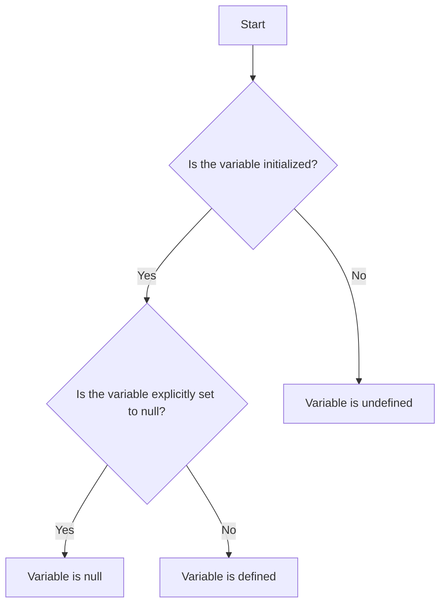

## 5.10 Understanding `null` and `undefined`

In JavaScript, `null` and `undefined` are two special values that represent the absence of a value. While they might seem similar at first glance, they have distinct meanings and uses. Understanding the differences between them is crucial for writing effective and bug-free JavaScript code. In this section, we will explore what `null` and `undefined` are, when they occur, how to check for them, and best practices for handling these values.

### What is `undefined`?

`undefined` is a primitive value in JavaScript that indicates the absence of a value. It is automatically assigned to variables that have been declared but not initialized. Additionally, it is the default return value of functions that do not explicitly return a value.

#### When Does `undefined` Occur?

1. **Uninitialized Variables**: When a variable is declared but not assigned a value, it is automatically given the value `undefined`.

   ```javascript
   let myVariable;
   console.log(myVariable); // Output: undefined
   ```

2. **Missing Function Parameters**: If a function is called with fewer arguments than it is defined to accept, the missing parameters are assigned `undefined`.

   ```javascript
   function greet(name) {
     console.log("Hello, " + name);
   }

   greet(); // Output: Hello, undefined
   ```

3. **Non-Existent Object Properties**: Accessing a property that does not exist on an object returns `undefined`.

   ```javascript
   const person = { name: "Alice" };
   console.log(person.age); // Output: undefined
   ```

4. **Return Value of Functions Without a Return Statement**: Functions that do not explicitly return a value will return `undefined`.

   ```javascript
   function doNothing() {}
   console.log(doNothing()); // Output: undefined
   ```

### What is `null`?

`null` is another primitive value in JavaScript that represents the intentional absence of any object value. It is often used to indicate that a variable should have no value or to reset a variable.

#### When to Use `null`?

1. **Intentional Absence of Value**: Use `null` when you want to explicitly indicate that a variable should have no value.

   ```javascript
   let selectedElement = document.getElementById("myElement");
   if (!selectedElement) {
     selectedElement = null; // Explicitly setting to null
   }
   ```

2. **Resetting Variables**: Assign `null` to a variable when you need to clear its value.

   ```javascript
   let user = { name: "Bob" };
   user = null; // Resetting the user object
   ```

### Differences Between `null` and `undefined`

While both `null` and `undefined` represent the absence of a value, they are used in different contexts and have different meanings.

| Aspect                   | `undefined`                                      | `null`                                      |
|--------------------------|--------------------------------------------------|---------------------------------------------|
| Type                     | `undefined`                                      | `object`                                    |
| Usage                    | Default value for uninitialized variables        | Intentional absence of any object value     |
| Assignment               | Automatically assigned by JavaScript             | Explicitly assigned by the programmer       |
| Typical Use Case         | Uninitialized variables, missing parameters      | Resetting variables, intentional empty value|
| Equality Check (`==`)    | `undefined == null` is true                      | `null == undefined` is true                 |
| Strict Equality Check (`===`) | `undefined === null` is false               | `null === undefined` is false               |

### Checking for `null` and `undefined`

When working with JavaScript, it is important to know how to check for `null` and `undefined` values to avoid errors and unexpected behavior.

#### Using Equality Operators

1. **Equality (`==`)**: This operator checks for equality of value, but not type. It considers `null` and `undefined` equal.

   ```javascript
   console.log(null == undefined); // Output: true
   ```

2. **Strict Equality (`===`)**: This operator checks for equality of both value and type. It does not consider `null` and `undefined` equal.

   ```javascript
   console.log(null === undefined); // Output: false
   ```

#### Using `typeof` Operator

The `typeof` operator can be used to check if a variable is `undefined`.

```javascript
let myVar;
console.log(typeof myVar === "undefined"); // Output: true
```

However, `typeof` is not suitable for checking `null` because it returns `"object"` for `null`.

```javascript
let myVar = null;
console.log(typeof myVar); // Output: "object"
```

#### Using `==` and `===` for `null` and `undefined`

To check for both `null` and `undefined`, you can use the loose equality operator (`==`).

```javascript
let value;
if (value == null) {
  console.log("Value is either null or undefined");
}
```

For a strict check, use the strict equality operator (`===`).

```javascript
let value = null;
if (value === null) {
  console.log("Value is null");
}
```

### Best Practices for Handling `null` and `undefined`

1. **Initialize Variables**: Always initialize variables to avoid unexpected `undefined` values.

   ```javascript
   let count = 0; // Initialize with a default value
   ```

2. **Use `null` for Intentional Absence**: Use `null` when you want to explicitly indicate that a variable should have no value.

   ```javascript
   let user = null; // No user is currently logged in
   ```

3. **Check for `null` and `undefined`**: Use checks to handle `null` and `undefined` values gracefully.

   ```javascript
   function getLength(str) {
     if (str == null) {
       return 0;
     }
     return str.length;
   }
   ```

4. **Avoid Using `==` for Comparisons**: Prefer strict equality checks (`===`) to avoid unintended type coercion.

   ```javascript
   if (value === null) {
     // Handle null value
   }
   ```

5. **Use Default Parameters**: Provide default values for function parameters to avoid `undefined`.

   ```javascript
   function greet(name = "Guest") {
     console.log("Hello, " + name);
   }

   greet(); // Output: Hello, Guest
   ```

### Code Examples

Let's explore some code examples to reinforce our understanding of `null` and `undefined`.

#### Example 1: Uninitialized Variables

```javascript
let myVariable;
console.log(myVariable); // Output: undefined

myVariable = null;
console.log(myVariable); // Output: null
```

#### Example 2: Function Parameters

```javascript
function displayInfo(name, age) {
  console.log("Name: " + name);
  console.log("Age: " + age);
}

displayInfo("Alice"); // Output: Name: Alice, Age: undefined
```

#### Example 3: Object Properties

```javascript
const car = { brand: "Toyota", model: "Corolla" };
console.log(car.year); // Output: undefined

car.year = null; // Setting year to null
console.log(car.year); // Output: null
```

#### Example 4: Checking for `null` and `undefined`

```javascript
function checkValue(value) {
  if (value == null) {
    console.log("Value is either null or undefined");
  } else {
    console.log("Value is defined");
  }
}

checkValue(); // Output: Value is either null or undefined
checkValue(null); // Output: Value is either null or undefined
checkValue(0); // Output: Value is defined
```

### Visual Aids

To better understand the concept of `null` and `undefined`, let's look at a flowchart that illustrates the decision-making process when checking for these values.



**Description**: This flowchart helps visualize the process of determining whether a variable is `undefined`, `null`, or defined.

### Try It Yourself

Experiment with the following code examples to deepen your understanding of `null` and `undefined`. Try modifying the examples to see how the behavior changes.

1. **Modify Function Parameters**: Try calling a function with different numbers of arguments and observe the output.

2. **Change Object Properties**: Add and remove properties from an object and see how `undefined` and `null` are used.

3. **Use Default Parameters**: Implement default parameters in your functions to handle `undefined` values.

### Summary

In this section, we explored the differences between `null` and `undefined` in JavaScript. We learned that `undefined` is automatically assigned to uninitialized variables, while `null` is used to represent an intentional absence of value. We also discussed how to check for these values and best practices for handling them. By understanding these concepts, you can write more robust and error-free JavaScript code.

## Quiz Time!



### What is the default value of an uninitialized variable in JavaScript?

- [x] undefined
- [ ] null
- [ ] 0
- [ ] ""

> **Explanation:** In JavaScript, uninitialized variables are automatically assigned the value `undefined`.

### Which operator checks for equality of both value and type?

- [ ] ==
- [x] ===
- [ ] !=
- [ ] !==

> **Explanation:** The strict equality operator (`===`) checks for equality of both value and type.

### What does `typeof null` return in JavaScript?

- [ ] "null"
- [x] "object"
- [ ] "undefined"
- [ ] "boolean"

> **Explanation:** In JavaScript, `typeof null` returns "object" due to a historical bug in the language.

### Which value should you use to explicitly indicate that a variable should have no value?

- [ ] undefined
- [x] null
- [ ] NaN
- [ ] 0

> **Explanation:** Use `null` to explicitly indicate that a variable should have no value.

### How can you check if a variable is either `null` or `undefined`?

- [x] if (value == null)
- [ ] if (value === null)
- [ ] if (value === undefined)
- [ ] if (value != null)

> **Explanation:** Using `if (value == null)` checks for both `null` and `undefined` due to type coercion.

### What is the output of `console.log(null == undefined)`?

- [x] true
- [ ] false
- [ ] null
- [ ] undefined

> **Explanation:** The loose equality operator (`==`) considers `null` and `undefined` equal, so the output is `true`.

### What is the output of `console.log(null === undefined)`?

- [ ] true
- [x] false
- [ ] null
- [ ] undefined

> **Explanation:** The strict equality operator (`===`) does not consider `null` and `undefined` equal, so the output is `false`.

### Which of the following is a best practice for handling `undefined` values?

- [x] Initialize variables with a default value
- [ ] Use `==` for comparisons
- [ ] Avoid checking for `undefined`
- [ ] Use `null` for uninitialized variables

> **Explanation:** Initializing variables with a default value helps avoid unexpected `undefined` values.

### What is the output of the following code?
```javascript
let value;
if (value === null) {
  console.log("Value is null");
} else {
  console.log("Value is not null");
}
```

- [ ] Value is null
- [x] Value is not null
- [ ] Value is undefined
- [ ] Value is neither null nor undefined

> **Explanation:** The variable `value` is `undefined`, not `null`, so the output is "Value is not null".

### True or False: `null` and `undefined` are considered equal when using the loose equality operator (`==`).

- [x] True
- [ ] False

> **Explanation:** When using the loose equality operator (`==`), `null` and `undefined` are considered equal.


