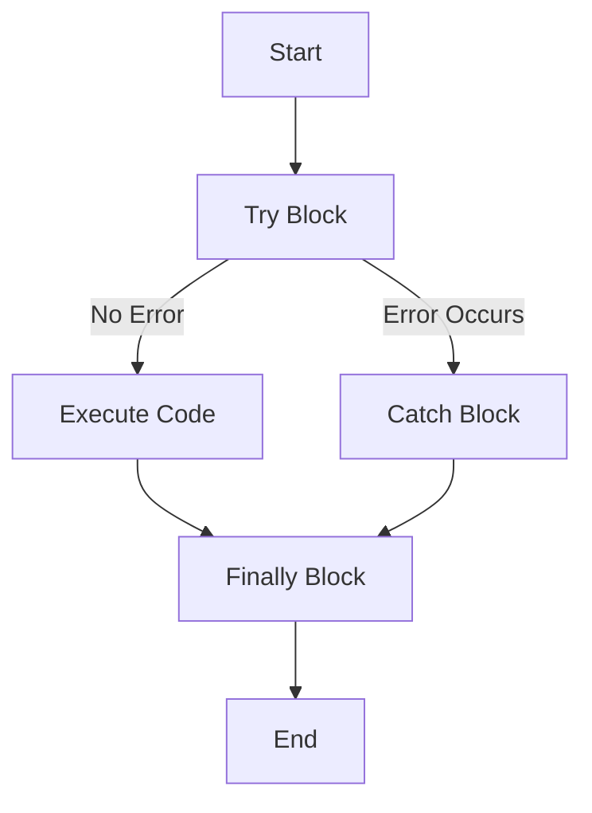

## 5.11 Error Handling with Try/Catch

In the world of programming, errors are inevitable. They can occur due to a variety of reasons, such as invalid user input, network issues, or unforeseen bugs in the code. As developers, it's crucial to anticipate these errors and handle them gracefully to ensure a smooth user experience. In this section, we will delve into error handling in JavaScript using the `try`, `catch`, and `finally` blocks. By the end of this guide, you'll understand how to manage errors effectively and write robust code that can withstand unexpected situations.

### Understanding the Try/Catch/Finally Structure

The `try...catch` statement in JavaScript is a powerful tool for error handling. It allows you to test a block of code for errors and handle them if they occur. Let's break down each component:

- **`try` block**: This is where you place the code that might throw an error. If an error occurs within this block, the control is passed to the `catch` block.

- **`catch` block**: This block is executed if an error is thrown in the `try` block. It allows you to define how to handle the error, often by logging it or providing feedback to the user.

- **`finally` block**: This block contains code that will run regardless of whether an error was thrown or not. It's typically used for cleanup tasks, such as closing files or releasing resources.

#### Basic Syntax

Here's the basic syntax of a `try...catch...finally` statement:

```javascript
try {
  // Code that may throw an error
} catch (error) {
  // Code to handle the error
} finally {
  // Code that will always execute
}
```

### Example: Handling Exceptions

Let's look at a simple example to illustrate how `try...catch` works:

```javascript
function divideNumbers(a, b) {
  try {
    if (b === 0) {
      throw new Error("Division by zero is not allowed.");
    }
    let result = a / b;
    console.log(`Result: ${result}`);
  } catch (error) {
    console.error(`Error: ${error.message}`);
  } finally {
    console.log("Division operation complete.");
  }
}

divideNumbers(10, 2); // Output: Result: 5, Division operation complete.
divideNumbers(10, 0); // Output: Error: Division by zero is not allowed., Division operation complete.
```

In this example, the `divideNumbers` function attempts to divide two numbers. If the divisor (`b`) is zero, it throws an error. The `catch` block catches this error and logs an appropriate message. The `finally` block runs regardless of whether an error occurred, ensuring that the operation is marked as complete.

### Common Error Objects and Messages

JavaScript provides several built-in error objects that can be used to represent different types of errors. Understanding these can help you handle errors more effectively:

- **`Error`**: The generic error object. You can use it to create custom error messages.
- **`SyntaxError`**: Thrown when there is a syntax error in the code.
- **`ReferenceError`**: Occurs when a non-existent variable is referenced.
- **`TypeError`**: Thrown when a value is not of the expected type.
- **`RangeError`**: Occurs when a value is not within the set or expected range.
- **`URIError`**: Thrown when there is an error in URI handling functions.

#### Example: Handling Different Error Types

```javascript
try {
  // ReferenceError example
  console.log(nonExistentVariable);
} catch (error) {
  if (error instanceof ReferenceError) {
    console.error("ReferenceError caught: ", error.message);
  }
}

try {
  // TypeError example
  null.f();
} catch (error) {
  if (error instanceof TypeError) {
    console.error("TypeError caught: ", error.message);
  }
}
```

In this example, we demonstrate handling different types of errors using `instanceof` to check the error type and provide specific handling logic.

### Importance of Error Handling for Robustness

Error handling is not just about fixing bugs; it's about anticipating potential issues and ensuring that your application can handle them gracefully. Here are some key reasons why error handling is crucial:

- **User Experience**: Proper error handling can prevent your application from crashing and provide users with meaningful feedback, improving their overall experience.

- **Debugging**: By logging errors, you can gain insights into what went wrong and where, making it easier to debug and fix issues.

- **Security**: Handling errors can prevent sensitive information from being exposed to users, enhancing the security of your application.

- **Stability**: Anticipating and managing errors can prevent unexpected behavior and ensure that your application runs smoothly under various conditions.

### Writing Code That Anticipates Potential Errors

To write robust code, it's essential to anticipate potential errors and handle them proactively. Here are some best practices:

- **Validate Input**: Always validate user input to prevent errors caused by invalid data.

- **Use Default Values**: Provide default values for function parameters to handle missing or undefined inputs.

- **Check for Null or Undefined**: Before accessing properties or methods, check if the object is null or undefined.

- **Use Try/Catch Sparingly**: While `try...catch` is useful, overusing it can make your code harder to read. Use it for code that is likely to throw errors.

- **Log Errors**: Always log errors to help with debugging and monitoring.

### Try It Yourself: Experiment with Error Handling

Now that we've covered the basics of error handling, it's time to experiment with it yourself. Try modifying the examples provided above or create your own scenarios where errors might occur. Here are some ideas:

- **Create a function that reads a JSON string and parses it. Use `try...catch` to handle any parsing errors.**

- **Write a function that accesses an API and handles network errors using `try...catch`.**

- **Experiment with throwing custom errors using the `throw` statement and handle them in a `catch` block.**

### Visualizing Error Handling Flow

To better understand the flow of error handling, let's visualize it using a flowchart:



**Description**: This flowchart illustrates the flow of a `try...catch...finally` statement. If no error occurs in the `try` block, the code executes normally. If an error occurs, the `catch` block is executed. Regardless of the outcome, the `finally` block runs before the program ends.

### References and Links

For more information on error handling in JavaScript, you can refer to the following resources:

- [MDN Web Docs: try...catch](https://developer.mozilla.org/en-US/docs/Web/JavaScript/Reference/Statements/try...catch)
- [W3Schools: JavaScript Errors](https://www.w3schools.com/js/js_errors.asp)
- [JavaScript.info: Error handling, "try...catch"](https://javascript.info/try-catch)

### Engagement and Reinforcement

Let's reinforce what we've learned with a few questions:

- **What is the purpose of the `finally` block in error handling?**
- **How can you differentiate between different types of errors in a `catch` block?**
- **Why is it important to validate user input in your code?**

### Exercises

1. **Create a function that reads a file and handles any errors that occur during the file reading process. Use `try...catch` to manage the errors.**

2. **Write a script that attempts to connect to a database. Use `try...catch` to handle connection errors and log appropriate messages.**

3. **Implement a function that calculates the square root of a number. Use `try...catch` to handle cases where the input is negative and throw a custom error.**

### Summary

In this section, we've explored the fundamentals of error handling in JavaScript using `try`, `catch`, and `finally` blocks. We've learned how to handle different types of errors, the importance of error handling for robustness, and best practices for writing error-resistant code. By anticipating potential errors and managing them effectively, you can create applications that are more stable, secure, and user-friendly.

## Quiz Time!



### What is the primary purpose of the `try` block in JavaScript?

- [x] To contain code that might throw an error
- [ ] To handle errors that occur
- [ ] To execute code after an error occurs
- [ ] To log error messages

> **Explanation:** The `try` block is used to wrap code that might throw an error, allowing for error handling in the subsequent `catch` block.

### Which block is executed regardless of whether an error occurs in the `try` block?

- [ ] try
- [ ] catch
- [x] finally
- [ ] error

> **Explanation:** The `finally` block is executed after the `try` and `catch` blocks, regardless of whether an error occurred.

### What type of error is thrown when a non-existent variable is referenced?

- [ ] SyntaxError
- [x] ReferenceError
- [ ] TypeError
- [ ] RangeError

> **Explanation:** A `ReferenceError` is thrown when a non-existent variable is accessed.

### How can you differentiate between different types of errors in a `catch` block?

- [ ] By using a switch statement
- [x] By using the `instanceof` operator
- [ ] By checking the error message
- [ ] By using a for loop

> **Explanation:** The `instanceof` operator can be used to check the type of error object caught in the `catch` block.

### Why is it important to validate user input in your code?

- [x] To prevent errors caused by invalid data
- [ ] To make the code run faster
- [ ] To improve code readability
- [ ] To reduce the number of lines of code

> **Explanation:** Validating user input helps prevent errors and ensures that the data being processed is in the expected format.

### What is the purpose of the `throw` statement in JavaScript?

- [x] To manually trigger an error
- [ ] To catch an error
- [ ] To log an error message
- [ ] To execute code after an error occurs

> **Explanation:** The `throw` statement is used to manually trigger an error, which can then be caught and handled in a `catch` block.

### Which error type is thrown when a value is not of the expected type?

- [ ] SyntaxError
- [ ] ReferenceError
- [x] TypeError
- [ ] RangeError

> **Explanation:** A `TypeError` is thrown when a value is not of the expected type.

### What should you do before accessing properties or methods of an object?

- [ ] Use a for loop
- [ ] Log the object to the console
- [x] Check if the object is null or undefined
- [ ] Use a switch statement

> **Explanation:** Checking if an object is null or undefined before accessing its properties or methods helps prevent runtime errors.

### What is a common use case for the `finally` block?

- [x] Performing cleanup tasks
- [ ] Logging error messages
- [ ] Throwing custom errors
- [ ] Validating user input

> **Explanation:** The `finally` block is often used for cleanup tasks, such as closing files or releasing resources.

### True or False: Overusing `try...catch` can make your code harder to read.

- [x] True
- [ ] False

> **Explanation:** While `try...catch` is useful, overusing it can lead to cluttered code, making it harder to read and maintain.


