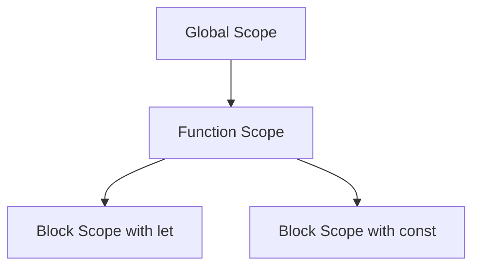
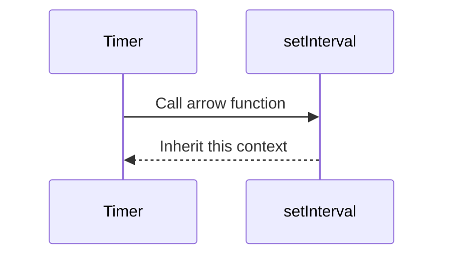

## 5.12 Introduction to ES6 Features

Welcome to the exciting world of ECMAScript 6 (ES6), a significant update to JavaScript that brought a host of new features and syntax improvements. As we continue our journey in building dynamic web pages, understanding ES6 will empower you to write cleaner, more efficient, and more readable code. In this section, we will explore some of the most impactful features introduced in ES6, including `let` and `const` for variable declarations, arrow functions, template literals, default parameters, and destructuring assignments.

### Understanding `let` and `const` for Variable Declarations

Before ES6, JavaScript variables were declared using the `var` keyword. However, `var` has some quirks, particularly with scope, that can lead to bugs and confusion. ES6 introduced `let` and `const` to address these issues.

#### `let`: Block-Scoped Variable Declaration

The `let` keyword allows you to declare variables that are block-scoped, meaning they are only accessible within the block they are defined in. This is particularly useful for loops and conditional statements.

```javascript
function showNumbers() {
  for (let i = 0; i < 5; i++) {
    console.log(i); // 0, 1, 2, 3, 4
  }
  // console.log(i); // Uncaught ReferenceError: i is not defined
}

showNumbers();
```

In the example above, `i` is only accessible within the `for` loop. Trying to access `i` outside the loop results in an error, preventing accidental variable leakage.

#### `const`: Immutable Variable Declaration

The `const` keyword is used to declare variables whose values cannot be reassigned. This is ideal for values that should remain constant throughout the program.

```javascript
const PI = 3.14159;
console.log(PI); // 3.14159

// PI = 3.14; // Uncaught TypeError: Assignment to constant variable.
```

While `const` prevents reassignment, it does not make objects immutable. You can still modify the properties of an object declared with `const`.

```javascript
const person = { name: 'Alice', age: 25 };
person.age = 26; // This is allowed
console.log(person); // { name: 'Alice', age: 26 }
```

### Arrow Functions: A Concise Way to Write Functions

Arrow functions provide a more concise syntax for writing functions and also lexically bind the `this` value, making them particularly useful in certain contexts.

#### Basic Syntax

An arrow function is defined using the `=>` syntax. Here's a simple example:

```javascript
// Traditional function expression
const add = function(a, b) {
  return a + b;
};

// Arrow function
const addArrow = (a, b) => a + b;

console.log(add(2, 3)); // 5
console.log(addArrow(2, 3)); // 5
```

Arrow functions are especially useful for short functions. If the function body contains a single expression, you can omit the braces and the `return` keyword.

#### Lexical `this` Binding

Arrow functions do not have their own `this` context; they inherit `this` from the surrounding scope. This behavior is beneficial when working with methods that require the `this` keyword.

```javascript
function Timer() {
  this.seconds = 0;
  setInterval(() => {
    this.seconds++;
    console.log(this.seconds);
  }, 1000);
}

const timer = new Timer();
```

In the example above, the arrow function inside `setInterval` uses the `this` value from the `Timer` function, ensuring `this.seconds` is correctly incremented.

### Template Literals: Enhanced String Interpolation

Template literals, introduced in ES6, provide a more powerful way to work with strings. They allow for multi-line strings and embedded expressions, making string manipulation more intuitive.

#### Basic Usage

Template literals are enclosed by backticks (`` ` ``) instead of quotes. You can embed expressions using `${}`.

```javascript
const name = 'John';
const greeting = `Hello, ${name}!`;
console.log(greeting); // Hello, John!
```

#### Multi-line Strings

With template literals, you can easily create multi-line strings without using escape characters.

```javascript
const message = `This is a
multi-line
string.`;
console.log(message);
```

### Default Parameters: Simplifying Function Arguments

Default parameters allow you to specify default values for function parameters, reducing the need for manual checks and assignments.

```javascript
function greet(name = 'Guest') {
  console.log(`Hello, ${name}!`);
}

greet(); // Hello, Guest!
greet('Alice'); // Hello, Alice!
```

In the example above, if no argument is provided, `name` defaults to `'Guest'`.

### Destructuring Assignments: Extracting Values with Ease

Destructuring assignments provide a convenient way to extract values from arrays or objects and assign them to variables.

#### Array Destructuring

Array destructuring allows you to unpack values from arrays into distinct variables.

```javascript
const colors = ['red', 'green', 'blue'];
const [first, second, third] = colors;

console.log(first); // red
console.log(second); // green
console.log(third); // blue
```

#### Object Destructuring

Object destructuring enables you to extract properties from objects into variables.

```javascript
const person = { name: 'Alice', age: 25 };
const { name, age } = person;

console.log(name); // Alice
console.log(age); // 25
```

Destructuring can also be used in function parameters to extract values directly from objects passed as arguments.

```javascript
function displayPerson({ name, age }) {
  console.log(`Name: ${name}, Age: ${age}`);
}

displayPerson(person); // Name: Alice, Age: 25
```

### Try It Yourself

Now that we've explored the basics of ES6 features, it's time to experiment with these concepts. Try modifying the code examples to see how they work in different scenarios. For instance, change the values in the destructuring examples or add more parameters to the arrow functions.

### Visual Aids

To better understand the scope and behavior of `let`, `const`, and arrow functions, let's visualize these concepts using Mermaid.js diagrams.

#### Variable Scope with `let` and `const`



**Caption:** This diagram illustrates the scope hierarchy in JavaScript, showing how `let` and `const` are confined to block scope within a function.

#### Arrow Function `this` Binding



**Caption:** This sequence diagram demonstrates how arrow functions inherit the `this` context from their enclosing scope.

### References and Links

For further reading and a deeper dive into ES6 features, you can explore the following resources:

- [MDN Web Docs: ES6 Features](https://developer.mozilla.org/en-US/docs/Web/JavaScript/New_in_JavaScript/ECMAScript_2015_support_in_Mozilla)
- [W3Schools: JavaScript ES6](https://www.w3schools.com/js/js_es6.asp)

### Engagement and Reinforcement

To reinforce your understanding, consider the following questions:

- How do `let` and `const` differ from `var` in terms of scope?
- What are the advantages of using arrow functions over traditional function expressions?
- How can template literals simplify string manipulation in JavaScript?

### Exercises

1. **Exercise 1:** Write a function using `let` and `const` to calculate the area of a rectangle. Ensure that the width and height cannot be reassigned.

2. **Exercise 2:** Convert a traditional function expression to an arrow function and test its behavior with different inputs.

3. **Exercise 3:** Use template literals to create a multi-line string that includes embedded expressions.

4. **Exercise 4:** Write a function with default parameters and test it with various arguments.

5. **Exercise 5:** Use destructuring to extract values from a nested object and log them to the console.

### Key Takeaways

- **`let` and `const`** provide block-scoped variable declarations, enhancing code safety and readability.
- **Arrow functions** offer a concise syntax and lexically bind `this`, making them ideal for certain use cases.
- **Template literals** simplify string interpolation and support multi-line strings.
- **Default parameters** allow functions to have default values, reducing the need for manual checks.
- **Destructuring assignments** enable easy extraction of values from arrays and objects.

By mastering these ES6 features, you'll be well-equipped to write modern JavaScript code that's both efficient and maintainable.

## Quiz Time!



### What is the main advantage of using `let` over `var`?

- [x] Block scope
- [ ] Global scope
- [ ] Function scope
- [ ] No scope

> **Explanation:** `let` provides block scope, which limits the variable's accessibility to the block in which it is defined, preventing accidental leakage outside the block.

### Which keyword is used to declare a variable that cannot be reassigned?

- [ ] let
- [x] const
- [ ] var
- [ ] static

> **Explanation:** The `const` keyword is used to declare variables whose values cannot be reassigned, ensuring immutability for primitive values.

### How do arrow functions differ from traditional functions in terms of `this` binding?

- [x] Arrow functions lexically bind `this`
- [ ] Arrow functions have their own `this`
- [ ] Arrow functions do not use `this`
- [ ] Arrow functions bind `this` dynamically

> **Explanation:** Arrow functions lexically bind `this`, meaning they inherit `this` from the surrounding scope, unlike traditional functions which have their own `this`.

### What symbol is used to create template literals?

- [ ] Single quotes
- [ ] Double quotes
- [x] Backticks
- [ ] Parentheses

> **Explanation:** Template literals are created using backticks (`` ` ``), allowing for embedded expressions and multi-line strings.

### What feature allows you to specify default values for function parameters?

- [ ] Destructuring
- [ ] Template literals
- [x] Default parameters
- [ ] Arrow functions

> **Explanation:** Default parameters allow you to specify default values for function parameters, simplifying function calls and reducing the need for manual checks.

### Which of the following is a correct example of array destructuring?

- [x] `const [a, b] = [1, 2];`
- [ ] `const a, b = [1, 2];`
- [ ] `const a = [1, 2];`
- [ ] `const [a, b] = {1, 2};`

> **Explanation:** Array destructuring uses square brackets to unpack values from arrays into distinct variables, as shown in `const [a, b] = [1, 2];`.

### Which keyword is used to declare a block-scoped variable?

- [x] let
- [ ] var
- [ ] const
- [ ] static

> **Explanation:** The `let` keyword is used to declare block-scoped variables, confining their accessibility to the block they are defined in.

### How can you create a multi-line string in JavaScript using ES6?

- [ ] Using single quotes
- [ ] Using double quotes
- [x] Using template literals
- [ ] Using escape characters

> **Explanation:** Template literals allow for multi-line strings without the need for escape characters, using backticks to enclose the string.

### What is the result of the following code: `const [x, y] = [10, 20]; console.log(x, y);`?

- [x] 10 20
- [ ] 20 10
- [ ] 10
- [ ] 20

> **Explanation:** The array destructuring assigns `10` to `x` and `20` to `y`, so `console.log(x, y);` outputs `10 20`.

### True or False: Arrow functions can have their own `this` context.

- [ ] True
- [x] False

> **Explanation:** False. Arrow functions do not have their own `this` context; they inherit `this` from the enclosing scope.


