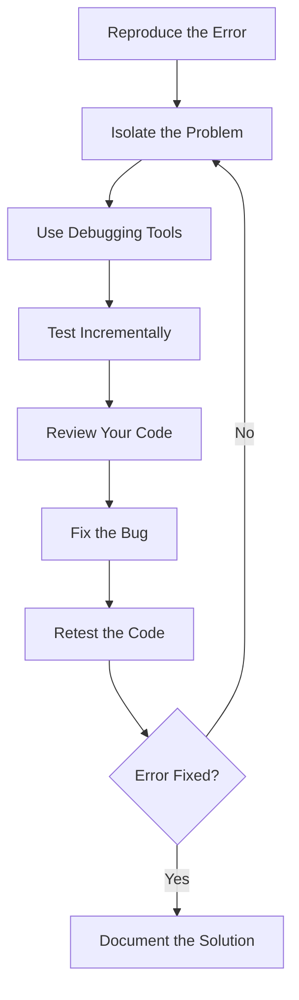

## 5.13 Debugging JavaScript Code

Debugging is an essential skill for any developer. As you build your first web page with JavaScript, you'll inevitably encounter errors and bugs. This section will guide you through the process of identifying and fixing these issues using various debugging techniques. By the end of this chapter, you'll be equipped with the tools and knowledge to tackle common JavaScript errors and improve your code's reliability.

### Understanding Debugging

Before we dive into specific techniques, let's clarify what debugging is. Debugging is the process of identifying, analyzing, and removing errors or bugs in your code. These errors can range from syntax errors, which prevent your code from running, to logical errors, which cause your code to behave unexpectedly.

### Using `console.log()` for Debugging

One of the simplest and most effective debugging tools is the `console.log()` function. It allows you to output messages to the browser's console, providing insight into what's happening in your code.

#### Example: Debugging with `console.log()`

```javascript
function calculateTotal(price, tax) {
    console.log("Price:", price); // Log the price
    console.log("Tax:", tax); // Log the tax
    let total = price + tax;
    console.log("Total:", total); // Log the total
    return total;
}

calculateTotal(100, 20);
```

In this example, `console.log()` is used to print the values of `price`, `tax`, and `total` to the console. This helps you verify that the function is receiving the correct inputs and producing the expected output.

#### Try It Yourself

Modify the code above by changing the values passed to `calculateTotal()` and observe the output in the console. Experiment with different values to see how the function behaves.

### Introducing Breakpoints and the Debugger Statement

While `console.log()` is useful, it can become cumbersome for more complex debugging tasks. This is where breakpoints and the `debugger` statement come in handy.

#### Breakpoints

Breakpoints allow you to pause the execution of your code at specific points, enabling you to inspect variables and the call stack. You can set breakpoints in your browser's developer tools.

1. **Open Developer Tools**: Press `F12` or right-click on the page and select "Inspect" to open the developer tools.
2. **Navigate to the Sources Tab**: This tab allows you to view and debug your JavaScript code.
3. **Set a Breakpoint**: Click on the line number where you want to pause execution.

#### Example: Using Breakpoints

```javascript
function multiply(a, b) {
    let result = a * b;
    return result;
}

let product = multiply(5, 4);
console.log("Product:", product);
```

Set a breakpoint on the line `let result = a * b;` and run the code. The execution will pause, allowing you to inspect the values of `a`, `b`, and `result`.

#### The `debugger` Statement

The `debugger` statement is another way to pause code execution. When the JavaScript engine encounters this statement, it will stop execution if developer tools are open.

```javascript
function divide(a, b) {
    debugger; // Execution will pause here
    if (b === 0) {
        console.error("Cannot divide by zero");
        return null;
    }
    return a / b;
}

divide(10, 0);
```

### Tips for Reading and Understanding Error Messages

Error messages can be intimidating, but they are valuable clues for debugging. Let's break down how to read and understand them.

#### Common Error Types

1. **Syntax Errors**: These occur when the JavaScript engine encounters code it can't parse. They often include the line number and a brief description.
   
   Example: `SyntaxError: Unexpected token }`

2. **Reference Errors**: These occur when you try to access a variable that hasn't been declared.
   
   Example: `ReferenceError: myVariable is not defined`

3. **Type Errors**: These occur when a value is not of the expected type.
   
   Example: `TypeError: undefined is not a function`

#### Analyzing Error Messages

- **Read the Error Message**: Start by reading the error message carefully. It often includes the type of error, a description, and the line number where it occurred.
- **Check the Line Number**: Navigate to the line number mentioned in the error message to inspect the code.
- **Look for Typos**: Many errors are caused by simple typos or missing characters.
- **Use Google**: If you're stuck, search for the error message online. Chances are, someone else has encountered the same issue.

### Encouraging Systematic Debugging Approaches

Debugging can be overwhelming, especially for beginners. Here are some systematic approaches to help you tackle bugs effectively.

#### 1. **Reproduce the Error**

Before you can fix a bug, you need to reproduce it consistently. This helps you understand the conditions under which the error occurs.

#### 2. **Isolate the Problem**

Narrow down the section of code where the error occurs. Comment out parts of your code to see if the error persists.

#### 3. **Use Debugging Tools**

Leverage tools like `console.log()`, breakpoints, and the `debugger` statement to inspect variables and the flow of your code.

#### 4. **Test Incrementally**

Make small changes to your code and test frequently. This helps you identify which change introduced or fixed the error.

#### 5. **Review Your Code**

Take a step back and review your code with fresh eyes. Sometimes, a simple oversight is the root cause of the bug.

### Discussing Common Mistakes and How to Avoid Them

Let's explore some common JavaScript mistakes and how to avoid them.

#### 1. **Off-by-One Errors**

These occur when you loop through arrays or strings and accidentally go one index too far or too short.

**Solution**: Double-check your loop conditions and ensure they match the length of the array or string.

#### 2. **Incorrect Variable Scoping**

JavaScript has function scope and block scope, which can lead to unexpected behavior if not understood properly.

**Solution**: Use `let` and `const` instead of `var` to avoid hoisting issues and ensure variables are scoped correctly.

#### 3. **Misusing `this`**

The value of `this` can change depending on how a function is called.

**Solution**: Use arrow functions to maintain the value of `this` from the enclosing context.

#### 4. **Forgetting to Return Values**

Functions that are supposed to return a value but don't can lead to `undefined` errors.

**Solution**: Ensure that all code paths in your function return a value.

### Visual Aids: Understanding the Debugging Process

Below is a flowchart illustrating a systematic debugging process:



This diagram represents a typical debugging workflow, guiding you through each step to efficiently resolve issues.

### References and Links

For more information on debugging JavaScript, consider exploring the following resources:

- [MDN Web Docs: Debugging JavaScript](https://developer.mozilla.org/en-US/docs/Learn/JavaScript/First_steps/What_is_JavaScript)
- [W3Schools: JavaScript Debugging](https://www.w3schools.com/js/js_debugging.asp)

### Engagement and Reinforcement

To reinforce your understanding of debugging, try the following exercises:

1. **Exercise 1**: Create a function with a deliberate syntax error and use the console to identify and fix it.
2. **Exercise 2**: Write a function that calculates the factorial of a number. Introduce a logical error and use breakpoints to find and fix it.
3. **Exercise 3**: Experiment with the `debugger` statement in a simple JavaScript program and observe how it pauses execution.

### Summary of Key Takeaways

- **Debugging is a crucial skill** for identifying and fixing errors in your code.
- **`console.log()` is a simple yet powerful tool** for inspecting values and understanding code flow.
- **Breakpoints and the `debugger` statement** allow you to pause execution and inspect variables.
- **Error messages provide valuable clues** for identifying the source of issues.
- **Systematic debugging approaches** help you tackle bugs effectively and efficiently.

By mastering these debugging techniques, you'll be better equipped to handle errors and improve the quality of your JavaScript code.

## Quiz Time!



### What is the primary purpose of `console.log()` in debugging?

- [x] To output messages to the console for inspection
- [ ] To pause code execution
- [ ] To fix syntax errors automatically
- [ ] To create new variables

> **Explanation:** `console.log()` is used to print messages to the console, helping developers inspect values and understand code flow.

### How can you pause the execution of your JavaScript code?

- [x] By using breakpoints in the developer tools
- [ ] By using `console.log()`
- [x] By using the `debugger` statement
- [ ] By using `alert()`

> **Explanation:** Breakpoints and the `debugger` statement can pause code execution, allowing you to inspect variables and the call stack.

### Which type of error occurs when you try to access a variable that hasn't been declared?

- [ ] Syntax Error
- [x] Reference Error
- [ ] Type Error
- [ ] Logical Error

> **Explanation:** A Reference Error occurs when you try to access a variable that hasn't been declared.

### What should you do first when you encounter an error in your code?

- [x] Reproduce the error consistently
- [ ] Immediately start changing code
- [ ] Ignore the error
- [ ] Delete the code

> **Explanation:** Reproducing the error helps you understand the conditions under which it occurs, which is crucial for effective debugging.

### What is a common mistake when looping through arrays?

- [x] Off-by-One Errors
- [ ] Using `console.log()`
- [ ] Using breakpoints
- [ ] Using the `debugger` statement

> **Explanation:** Off-by-One Errors occur when you loop through arrays and go one index too far or too short.

### What is the benefit of using `let` and `const` over `var`?

- [x] They provide block scope
- [ ] They automatically fix errors
- [ ] They make code run faster
- [ ] They are easier to type

> **Explanation:** `let` and `const` provide block scope, which helps avoid hoisting issues and ensures variables are scoped correctly.

### How can you maintain the value of `this` in JavaScript?

- [x] By using arrow functions
- [ ] By using `console.log()`
- [ ] By using `var`
- [ ] By using breakpoints

> **Explanation:** Arrow functions maintain the value of `this` from the enclosing context, preventing unexpected behavior.

### What should you do after fixing a bug?

- [x] Retest the code
- [ ] Delete the code
- [ ] Ignore the fix
- [ ] Use `console.log()`

> **Explanation:** Retesting the code ensures that the fix works and hasn't introduced new issues.

### What is the purpose of the `debugger` statement?

- [x] To pause code execution for inspection
- [ ] To log messages to the console
- [ ] To fix syntax errors
- [ ] To create new variables

> **Explanation:** The `debugger` statement pauses code execution, allowing you to inspect variables and the call stack.

### True or False: Error messages are not helpful for debugging.

- [ ] True
- [x] False

> **Explanation:** Error messages provide valuable clues about the source of issues and are essential for effective debugging.


