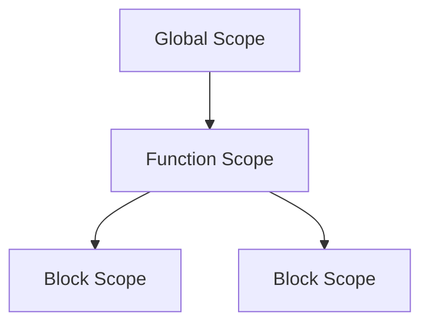

## 5.14 JavaScript Coding Best Practices

As we embark on our journey to master JavaScript, it's crucial to adopt best practices that will help us write clean, efficient, and maintainable code. This section will guide you through essential coding conventions, the importance of commenting and documentation, and strategies to avoid common pitfalls. By the end of this chapter, you'll be equipped with the tools to write JavaScript code that not only works but is also a joy to read and maintain.

### Naming Conventions and Code Organization

**Explain the Importance of Naming Conventions**

Naming conventions are the backbone of readable and maintainable code. They help us and others understand the purpose of variables, functions, and classes at a glance. Let's explore some key naming conventions:

- **Variables and Functions**: Use camelCase for naming variables and functions. This means starting with a lowercase letter and capitalizing each subsequent word. For example, `let userName = "John";` or `function calculateTotal() {}`.

- **Constants**: Use UPPERCASE letters with underscores to separate words for constants. For example, `const MAX_USERS = 100;`.

- **Classes**: Use PascalCase for class names, which means capitalizing the first letter of each word. For example, `class UserAccount {}`.

**Organize Your Code for Clarity**

Organizing your code logically is just as important as naming conventions. Here are some tips:

- **Group Related Code**: Keep related functions and variables together. This makes it easier to find and understand the code.

- **Use Modules**: As your codebase grows, consider using modules to separate different parts of your application. This helps in managing dependencies and improves readability.

- **Consistent Indentation**: Use consistent indentation (usually 2 or 4 spaces) to make your code more readable. This helps in visually distinguishing different code blocks.

```javascript
// Example of organized code
function calculateTotal(price, tax) {
    const total = price + tax;
    return total;
}

function displayTotal(total) {
    console.log(`The total is: $${total}`);
}

const price = 100;
const tax = 7.5;
const total = calculateTotal(price, tax);
displayTotal(total);
```

### Commenting and Documentation

**Emphasize the Importance of Commenting**

Comments are an essential part of writing maintainable code. They provide context and explanations for complex logic, making it easier for others (and your future self) to understand the code.

- **Single-line Comments**: Use `//` for single-line comments to explain specific lines of code.

- **Multi-line Comments**: Use `/* ... */` for multi-line comments to provide detailed explanations or documentation.

```javascript
// Calculate the total price including tax
function calculateTotal(price, tax) {
    // Add price and tax to get the total
    const total = price + tax;
    return total;
}

/* 
Display the total price in the console.
This function takes the total amount as an argument.
*/
function displayTotal(total) {
    console.log(`The total is: $${total}`);
}
```

**Encourage Writing Documentation**

Documentation is a step beyond commenting. It involves creating comprehensive guides or notes that describe the overall functionality of your codebase. Consider using tools like JSDoc to generate documentation from your comments.

- **Function Descriptions**: Include a brief description of what each function does, its parameters, and its return value.

- **Module Descriptions**: For larger codebases, provide an overview of each module or file, explaining its purpose and how it fits into the larger application.

### Avoiding Global Variables and Using Strict Mode

**Avoid Global Variables**

Global variables can lead to code that is difficult to debug and maintain. They can be accessed and modified from anywhere in the code, leading to unintended side effects. Here are some strategies to avoid them:

- **Use Local Variables**: Declare variables within functions to limit their scope.

- **Use Closures**: Encapsulate variables within functions to prevent them from polluting the global scope.

```javascript
// Example of using local variables
function calculateTotal(price, tax) {
    const total = price + tax; // Local variable
    return total;
}
```

**Use Strict Mode**

Strict mode is a feature in JavaScript that helps catch common coding errors and "unsafe" actions. It can be enabled by adding `"use strict";` at the beginning of your scripts or functions.

- **Benefits of Strict Mode**: It prevents the use of undeclared variables, throws errors for assignments to non-writable properties, and more.

```javascript
"use strict";

function calculateTotal(price, tax) {
    const total = price + tax;
    return total;
}
```

### Writing DRY (Don't Repeat Yourself) Code

**Explain the DRY Principle**

The DRY principle is a fundamental concept in programming that encourages us to avoid duplicating code. Instead, we should aim to write reusable functions and components.

- **Identify Repeated Code**: Look for patterns or blocks of code that are repeated in your application.

- **Create Reusable Functions**: Encapsulate repeated logic into functions that can be called whenever needed.

```javascript
// Example of DRY code
function calculateTotal(price, tax) {
    return price + tax;
}

function displayTotal(total) {
    console.log(`The total is: $${total}`);
}

const price1 = 100;
const tax1 = 7.5;
const total1 = calculateTotal(price1, tax1);
displayTotal(total1);

const price2 = 200;
const tax2 = 15;
const total2 = calculateTotal(price2, tax2);
displayTotal(total2);
```

### Using Linters for Code Quality

**Highlight the Use of Linters**

Linters are tools that analyze your code for potential errors and enforce coding standards. They help maintain code quality and consistency across your codebase.

- **ESLint**: One of the most popular linters for JavaScript. It can be configured to enforce specific coding styles and catch common errors.

- **Benefits of Using Linters**: They help catch syntax errors, enforce best practices, and improve code readability.

**Setting Up ESLint**

To set up ESLint in your project, follow these steps:

1. **Install ESLint**: Use npm to install ESLint in your project.

   ```bash
   npm install eslint --save-dev
   ```

2. **Initialize ESLint**: Run the following command to create an ESLint configuration file.

   ```bash
   npx eslint --init
   ```

3. **Configure ESLint**: Choose the coding style and rules you want to enforce.

4. **Run ESLint**: Use the following command to analyze your code.

   ```bash
   npx eslint yourfile.js
   ```

### Try It Yourself

Now that we've covered some best practices, let's put them into action. Try modifying the following code to adhere to the best practices we've discussed:

```javascript
// Original Code
function calc(price, tax) {
    return price + tax;
}
console.log(calc(100, 7.5));
console.log(calc(200, 15));
```

**Challenges:**

1. Rename the function and variables to follow naming conventions.
2. Add comments to explain the code.
3. Use strict mode.
4. Implement ESLint in your project and run it on this code.

### Visual Aids

To help visualize some of these concepts, let's look at a diagram representing variable scope in JavaScript:



**Description**: This diagram illustrates the hierarchy of variable scopes in JavaScript. Variables declared in the global scope are accessible everywhere, while those in function scope are limited to the function. Block scope is even more restricted, applying to variables declared within blocks like `if` or `for` statements.

### References and Links

For further reading and to deepen your understanding of JavaScript best practices, consider exploring the following resources:

- [MDN Web Docs: JavaScript Guide](https://developer.mozilla.org/en-US/docs/Web/JavaScript/Guide)
- [JavaScript.info: The Modern JavaScript Tutorial](https://javascript.info/)
- [ESLint Official Documentation](https://eslint.org/docs/user-guide/getting-started)

### Engagement and Reinforcement

Let's reinforce what we've learned with some questions and exercises:

1. **Why is it important to follow naming conventions in JavaScript?**
2. **What are the benefits of using strict mode?**
3. **How can linters improve code quality?**

**Exercise**: Refactor a small piece of code from your project to follow the DRY principle. Identify repeated logic and encapsulate it into a reusable function.

### Summary

In this chapter, we've explored essential JavaScript coding best practices. By following naming conventions, organizing code logically, and using tools like linters, we can write clean, efficient, and maintainable code. Remember to comment and document your code, avoid global variables, and embrace the DRY principle. These practices will not only improve your code quality but also make you a more effective and confident developer.

## Quiz Time!



### What is the primary benefit of following naming conventions in JavaScript?

- [x] Improves code readability and maintainability
- [ ] Increases execution speed
- [ ] Reduces file size
- [ ] Enhances security

> **Explanation:** Naming conventions improve code readability and maintainability by making it easier to understand the purpose of variables, functions, and classes at a glance.

### Which of the following is a recommended naming convention for JavaScript variables?

- [x] camelCase
- [ ] snake_case
- [ ] kebab-case
- [ ] UPPERCASE

> **Explanation:** camelCase is the recommended naming convention for JavaScript variables, where the first word is lowercase and subsequent words are capitalized.

### What is the purpose of using comments in your code?

- [x] To provide context and explanations for complex logic
- [ ] To increase code execution speed
- [ ] To reduce the size of the code
- [ ] To make the code more secure

> **Explanation:** Comments provide context and explanations for complex logic, making it easier for others (and your future self) to understand the code.

### How can you enable strict mode in JavaScript?

- [x] By adding "use strict"; at the beginning of your scripts or functions
- [ ] By using the strict keyword
- [ ] By setting a global variable
- [ ] By using a special library

> **Explanation:** Strict mode can be enabled by adding "use strict"; at the beginning of your scripts or functions, which helps catch common coding errors.

### What is the DRY principle in programming?

- [x] Don't Repeat Yourself
- [ ] Do Repeat Yourself
- [ ] Don't Reuse Yourself
- [ ] Do Reuse Yourself

> **Explanation:** The DRY principle stands for "Don't Repeat Yourself," encouraging developers to avoid duplicating code and instead write reusable functions and components.

### Which tool is commonly used as a linter for JavaScript?

- [x] ESLint
- [ ] JSLint
- [ ] CSSLint
- [ ] HTMLLint

> **Explanation:** ESLint is a popular linter for JavaScript that helps maintain code quality and consistency by analyzing code for potential errors and enforcing coding standards.

### What is the benefit of using linters like ESLint?

- [x] They help catch syntax errors and enforce best practices
- [ ] They increase code execution speed
- [ ] They reduce file size
- [ ] They enhance security

> **Explanation:** Linters like ESLint help catch syntax errors, enforce best practices, and improve code readability, contributing to overall code quality.

### Why should global variables be avoided in JavaScript?

- [x] They can lead to code that is difficult to debug and maintain
- [ ] They increase execution speed
- [ ] They reduce file size
- [ ] They enhance security

> **Explanation:** Global variables can lead to code that is difficult to debug and maintain because they can be accessed and modified from anywhere in the code, leading to unintended side effects.

### What is the purpose of using modules in JavaScript?

- [x] To separate different parts of an application for better management
- [ ] To increase execution speed
- [ ] To reduce file size
- [ ] To enhance security

> **Explanation:** Modules help separate different parts of an application, making it easier to manage dependencies and improve readability, especially as the codebase grows.

### True or False: Consistent indentation is important for code readability.

- [x] True
- [ ] False

> **Explanation:** Consistent indentation is important for code readability as it helps visually distinguish different code blocks, making it easier to understand the structure and flow of the code.


