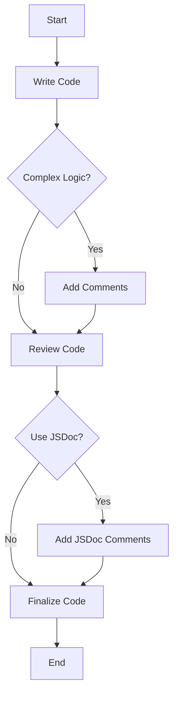

## 5.15 Commenting and Documentation

In the world of programming, writing code is only part of the journey. Equally important is ensuring that your code is understandable, not only to others but also to your future self. This is where commenting and documentation come into play. In this section, we will explore the art of commenting in JavaScript, learn about the syntax for single-line and multi-line comments, and discuss best practices for when and where to include comments. Additionally, we'll introduce documentation tools like JSDoc, which help in creating comprehensive documentation for your code. By the end of this section, you will understand how comments and documentation can significantly aid in collaboration and maintenance.

### Understanding Comments in JavaScript

Comments are annotations in the source code that are ignored by the JavaScript engine. They are meant for developers to explain what the code does, why certain decisions were made, or to leave reminders for future updates. Comments are crucial for making code more readable and maintainable.

#### Single-line Comments

Single-line comments in JavaScript start with `//`. Everything following these two slashes on the same line is considered a comment and is ignored by the JavaScript interpreter.

```javascript
// This is a single-line comment
let userName = "John"; // Initialize the userName variable
```

#### Multi-line Comments

Multi-line comments begin with `/*` and end with `*/`. These are useful for writing longer explanations or commenting out blocks of code.

```javascript
/*
  This is a multi-line comment.
  It can span multiple lines.
*/
let age = 30;

/*
  The following code calculates the user's age
  based on the current year and the birth year.
*/
let currentYear = 2024;
let birthYear = 1994;
let userAge = currentYear - birthYear;
```

### Effective Commenting Practices

While comments are incredibly useful, they should be used judiciously. Over-commenting can clutter your code, while under-commenting can leave others (or yourself) confused. Here are some guidelines for effective commenting:

#### When to Comment

1. **Complex Logic**: Explain complex algorithms or logic that might not be immediately clear.
   
   ```javascript
   // Using the Euclidean algorithm to find the greatest common divisor
   function gcd(a, b) {
     while (b !== 0) {
       let temp = b;
       b = a % b;
       a = temp;
     }
     return a;
   }
   ```

2. **Important Decisions**: Document why a specific approach was chosen, especially if it's not the most obvious one.

   ```javascript
   // Using a recursive approach for better readability
   function factorial(n) {
     if (n <= 1) return 1;
     return n * factorial(n - 1);
   }
   ```

3. **External Dependencies**: Note any libraries or APIs your code relies on.

   ```javascript
   // Requires lodash library for deep cloning
   const _ = require('lodash');
   let deepCopy = _.cloneDeep(originalObject);
   ```

4. **TODOs and Fixes**: Leave notes for future improvements or known issues.

   ```javascript
   // TODO: Optimize this loop for better performance
   for (let i = 0; i < largeArray.length; i++) {
     process(largeArray[i]);
   }
   ```

#### Where to Comment

1. **At the Top of Files**: Provide a brief description of what the file contains.

   ```javascript
   // user.js - Handles user authentication and profile management
   ```

2. **Before Functions and Classes**: Describe the purpose and usage of functions and classes.

   ```javascript
   // Calculates the area of a rectangle
   // Parameters: width (number), height (number)
   // Returns: area (number)
   function calculateArea(width, height) {
     return width * height;
   }
   ```

3. **Inline Comments**: Use sparingly to clarify specific lines of code.

   ```javascript
   let total = 0;
   for (let i = 0; i < numbers.length; i++) {
     total += numbers[i]; // Add each number to the total
   }
   ```

### Introduction to JSDoc

JSDoc is a popular tool for adding structured comments to your JavaScript code. It allows you to generate HTML documentation from comments in your code, making it easier for others to understand and use your code.

#### JSDoc Syntax

JSDoc comments are written using a specific syntax within multi-line comments. They start with `/**` and include tags to describe the code.

```javascript
/**
 * Calculates the area of a rectangle.
 * @param {number} width - The width of the rectangle.
 * @param {number} height - The height of the rectangle.
 * @returns {number} The area of the rectangle.
 */
function calculateArea(width, height) {
  return width * height;
}
```

#### Common JSDoc Tags

- `@param`: Describes a parameter of a function.
- `@returns`: Describes the return value of a function.
- `@throws`: Documents exceptions that a function might throw.
- `@deprecated`: Marks a method as deprecated.
- `@example`: Provides an example of how to use a function.

#### Generating Documentation

To generate documentation using JSDoc, you need to install it and run it on your codebase. Here’s a simple guide:

1. **Install JSDoc**: You can install JSDoc globally using npm.

   ```bash
   npm install -g jsdoc
   ```

2. **Run JSDoc**: Use the command line to generate documentation.

   ```bash
   jsdoc yourFile.js
   ```

This will create a `docs` folder containing HTML files with the documentation.

### Benefits of Commenting and Documentation

1. **Improved Collaboration**: Comments and documentation make it easier for team members to understand and work with your code.

2. **Ease of Maintenance**: Well-documented code is easier to update and debug.

3. **Knowledge Transfer**: Documentation helps onboard new developers and ensures continuity even if the original developer is unavailable.

4. **Self-Documentation**: Writing comments forces you to think through your logic and can help identify potential issues.

### Try It Yourself

Let's put what we've learned into practice. Below is a simple JavaScript function. Add comments to explain what each part of the code does. Then, use JSDoc to document the function.

```javascript
function greetUser(name, timeOfDay) {
  let greeting = "Hello";

  if (timeOfDay === "morning") {
    greeting = "Good morning";
  } else if (timeOfDay === "evening") {
    greeting = "Good evening";
  }

  return `${greeting}, ${name}!`;
}
```

**Challenge**: Modify the function to include a new parameter for the user's title (e.g., Mr., Ms., Dr.) and update the comments accordingly.

### Visual Aids

To better understand the flow of commenting and documentation, let's visualize the process of adding comments to a function using a flowchart.



### Summary

In this section, we've explored the importance of commenting and documentation in JavaScript. By using comments effectively, you can make your code more understandable and maintainable. We've also introduced JSDoc, a powerful tool for generating structured documentation. Remember, the goal of commenting and documentation is to make your code accessible to others and your future self. Practice writing clear and concise comments, and consider using JSDoc for more formal documentation needs.

## Quiz Time!



### What is the primary purpose of comments in JavaScript?

- [x] To make the code more understandable for developers
- [ ] To improve the performance of the code
- [ ] To execute additional code
- [ ] To change the behavior of the JavaScript engine

> **Explanation:** Comments are used to explain the code to developers, making it more understandable and maintainable.

### Which syntax is used for a single-line comment in JavaScript?

- [x] //
- [ ] /*
- [ ] <!--
- [ ] #

> **Explanation:** Single-line comments in JavaScript start with `//`.

### How do you start a multi-line comment in JavaScript?

- [x] /*
- [ ] //
- [ ] <!--
- [ ] #

> **Explanation:** Multi-line comments in JavaScript start with `/*` and end with `*/`.

### When should you use comments in your code?

- [x] To explain complex logic
- [x] To note important decisions
- [ ] To increase code execution speed
- [ ] To replace variable names

> **Explanation:** Comments are used to explain complex logic and note important decisions, not for performance or replacing variable names.

### What is JSDoc used for?

- [x] Generating documentation from comments
- [ ] Executing JavaScript code
- [ ] Compiling JavaScript files
- [ ] Debugging JavaScript code

> **Explanation:** JSDoc is a tool used to generate documentation from comments in the code.

### Which JSDoc tag is used to describe a function parameter?

- [x] @param
- [ ] @returns
- [ ] @throws
- [ ] @example

> **Explanation:** The `@param` tag is used in JSDoc to describe a function parameter.

### What is the benefit of using comments in code?

- [x] Improved collaboration
- [x] Ease of maintenance
- [ ] Faster code execution
- [ ] Reduced file size

> **Explanation:** Comments improve collaboration and ease of maintenance, but they do not affect execution speed or file size.

### How can comments help in debugging?

- [x] By explaining the logic and decisions
- [ ] By changing the code execution order
- [ ] By increasing the speed of execution
- [ ] By reducing the number of errors

> **Explanation:** Comments help in debugging by explaining the logic and decisions, making it easier to identify issues.

### What does the `@returns` tag in JSDoc specify?

- [x] The return value of a function
- [ ] The parameters of a function
- [ ] The exceptions thrown by a function
- [ ] The examples of using a function

> **Explanation:** The `@returns` tag in JSDoc specifies the return value of a function.

### True or False: Comments are executed by the JavaScript engine.

- [ ] True
- [x] False

> **Explanation:** Comments are ignored by the JavaScript engine and are not executed.


