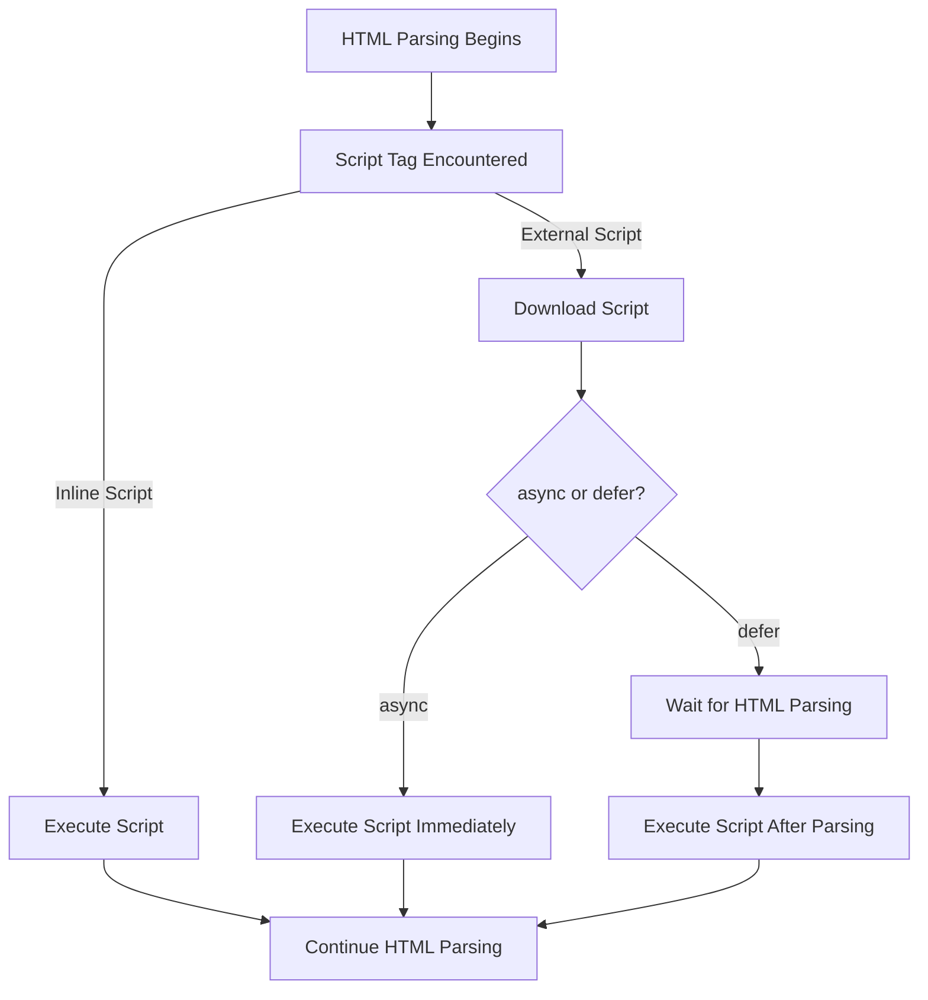

## 5.2 Embedding JavaScript in HTML

JavaScript is a powerful programming language used to create dynamic and interactive web pages. To harness its power, we need to embed JavaScript into our HTML documents. This section will guide you through the process of embedding JavaScript, explaining the `<script>` tag, the differences between inline scripts and external files, and best practices to follow.

### Understanding the `<script>` Tag

The `<script>` tag is the key to embedding JavaScript in HTML. It tells the browser to execute the code contained within it or linked to it. The `<script>` tag can be placed in various parts of an HTML document, but its placement can affect how and when the JavaScript code is executed.

#### Basic Structure of the `<script>` Tag

Here's a simple example of a `<script>` tag:

```html
<script>
  // JavaScript code goes here
  console.log('Hello, World!');
</script>
```

In this example, the JavaScript code inside the `<script>` tag will be executed when the browser encounters it while parsing the HTML document.

### Placement of the `<script>` Tag

The placement of the `<script>` tag in an HTML document is crucial for the performance and behavior of the web page. Let's explore the common placements:

1. **In the `<head>` Section**: Placing the `<script>` tag in the `<head>` section of an HTML document is common for scripts that need to be loaded before the page content is rendered. However, this can delay the rendering of the page, as the browser must load and execute the script before continuing.

   ```html
   <head>
     <script>
       console.log('Script in the head');
     </script>
   </head>
   ```

2. **Before the `</body>` Tag**: This is the recommended placement for most scripts. By placing the `<script>` tag just before the closing `</body>` tag, you ensure that the HTML content is loaded and rendered before the JavaScript is executed. This improves page load times and user experience.

   ```html
   <body>
     <!-- Page content -->
     <script>
       console.log('Script before closing body');
     </script>
   </body>
   ```

### Inline Scripts vs. External Files

JavaScript can be embedded directly within an HTML document (inline scripts) or linked as an external file. Each method has its advantages and use cases.

#### Inline Scripts

Inline scripts are JavaScript code written directly within the HTML document. They are useful for small scripts or when you need to quickly test a piece of code.

**Example of an Inline Script:**

```html
<!DOCTYPE html>
<html lang="en">
<head>
  <meta charset="UTF-8">
  <meta name="viewport" content="width=device-width, initial-scale=1.0">
  <title>Inline Script Example</title>
</head>
<body>
  <h1>Welcome to My Web Page</h1>
  <script>
    document.querySelector('h1').style.color = 'blue';
  </script>
</body>
</html>
```

In this example, the JavaScript code changes the color of the `<h1>` element to blue.

#### External JavaScript Files

External JavaScript files are separate `.js` files that are linked to the HTML document. This method is preferred for larger scripts or when you want to reuse the same script across multiple pages.

**Example of an External Script:**

1. Create a file named `script.js` with the following content:

   ```javascript
   document.querySelector('h1').style.color = 'green';
   ```

2. Link the external file in your HTML document:

   ```html
   <!DOCTYPE html>
   <html lang="en">
   <head>
     <meta charset="UTF-8">
     <meta name="viewport" content="width=device-width, initial-scale=1.0">
     <title>External Script Example</title>
   </head>
   <body>
     <h1>Welcome to My Web Page</h1>
     <script src="script.js"></script>
   </body>
   </html>
   ```

In this example, the JavaScript code in `script.js` changes the color of the `<h1>` element to green.

### Best Practices for Embedding JavaScript

To ensure optimal performance and maintainability, follow these best practices when embedding JavaScript:

1. **Place Scripts at the Bottom**: As mentioned earlier, placing `<script>` tags just before the closing `</body>` tag ensures that the HTML content is loaded before the JavaScript is executed, improving page load times.

2. **Use External Scripts for Reusability**: For larger scripts or scripts used across multiple pages, use external JavaScript files. This makes your code more organized and easier to maintain.

3. **Minimize Inline Scripts**: While inline scripts are convenient for small tasks, they can clutter your HTML document and make it harder to maintain. Use them sparingly.

4. **Comment Your Code**: Use comments to explain the purpose of your code, especially in larger scripts. This helps others (and your future self) understand your code.

5. **Use the `async` and `defer` Attributes**: These attributes can be added to the `<script>` tag to control how scripts are loaded and executed.

   - **`async`**: The script is downloaded in parallel with the HTML parsing and executed as soon as it is available. This is useful for scripts that do not depend on other scripts or the DOM.

     ```html
     <script src="script.js" async></script>
     ```

   - **`defer`**: The script is downloaded in parallel with the HTML parsing but executed only after the HTML document is fully parsed. This is ideal for scripts that need access to the entire DOM.

     ```html
     <script src="script.js" defer></script>
     ```

### Try It Yourself

Let's put what we've learned into practice. Try modifying the following code examples to see how they affect the behavior of the web page:

1. **Change the Color**: Modify the inline script to change the color of the `<h1>` element to red.

2. **Add an External Script**: Create a new external JavaScript file that changes the text content of the `<h1>` element to "Hello, JavaScript!".

3. **Experiment with `async` and `defer`**: Add the `async` and `defer` attributes to the external script tag and observe the differences in script execution.

### Visualizing Script Execution

To better understand how scripts are executed in an HTML document, let's visualize the process using a flowchart.



**Description**: This flowchart illustrates the process of HTML parsing and script execution. When a script tag is encountered, inline scripts are executed immediately, while external scripts are downloaded. If the `async` attribute is used, the script is executed as soon as it is available. If the `defer` attribute is used, the script is executed after the HTML document is fully parsed.

### Summary

In this section, we've explored how to embed JavaScript in HTML using the `<script>` tag. We've discussed the differences between inline scripts and external files, the importance of script placement, and best practices for embedding JavaScript. By following these guidelines, you can create efficient and maintainable web pages that leverage the power of JavaScript.

### Quiz Time!



### What is the primary purpose of the `<script>` tag in HTML?

- [x] To embed JavaScript code in an HTML document
- [ ] To style HTML elements
- [ ] To define the structure of an HTML document
- [ ] To create hyperlinks

> **Explanation:** The `<script>` tag is used to embed JavaScript code in an HTML document, allowing for dynamic and interactive web pages.

### Where is the recommended placement for the `<script>` tag in an HTML document?

- [ ] In the `<head>` section
- [x] Just before the closing `</body>` tag
- [ ] At the very top of the HTML document
- [ ] Anywhere in the document

> **Explanation:** Placing the `<script>` tag just before the closing `</body>` tag ensures that the HTML content is loaded before the JavaScript is executed, improving page load times.

### What is the advantage of using external JavaScript files?

- [x] Reusability and maintainability
- [ ] Faster execution
- [ ] Easier to write
- [ ] Requires less code

> **Explanation:** External JavaScript files allow for code reusability and maintainability, especially for larger scripts or scripts used across multiple pages.

### How does the `async` attribute affect script execution?

- [x] The script is executed as soon as it is available
- [ ] The script is executed after the HTML document is fully parsed
- [ ] The script is executed before the HTML document is parsed
- [ ] The script is executed only when the user interacts with the page

> **Explanation:** The `async` attribute allows the script to be executed as soon as it is available, without waiting for the HTML document to be fully parsed.

### What is the difference between the `async` and `defer` attributes?

- [x] `async` executes the script immediately, while `defer` waits for HTML parsing
- [ ] `defer` executes the script immediately, while `async` waits for HTML parsing
- [ ] Both attributes have the same effect
- [ ] Neither attribute affects script execution

> **Explanation:** The `async` attribute executes the script as soon as it is available, while the `defer` attribute waits for the HTML document to be fully parsed before executing the script.

### Why should inline scripts be minimized?

- [x] To keep the HTML document organized and maintainable
- [ ] To improve script execution speed
- [ ] To reduce the amount of code written
- [ ] To make the page load faster

> **Explanation:** Minimizing inline scripts helps keep the HTML document organized and maintainable, especially for larger projects.

### What is a common use case for inline scripts?

- [x] Quick testing of small pieces of code
- [ ] Large-scale web applications
- [ ] Reusable code across multiple pages
- [ ] Styling HTML elements

> **Explanation:** Inline scripts are useful for quick testing of small pieces of code, but should be minimized in larger projects for maintainability.

### How can you change the color of an `<h1>` element using JavaScript?

- [x] `document.querySelector('h1').style.color = 'blue';`
- [ ] `document.querySelector('h1').color = 'blue';`
- [ ] `document.querySelector('h1').setColor('blue');`
- [ ] `document.querySelector('h1').style.setColor('blue');`

> **Explanation:** The correct way to change the color of an `<h1>` element using JavaScript is by setting the `style.color` property.

### What is the purpose of comments in JavaScript code?

- [x] To explain the purpose of the code
- [ ] To execute additional code
- [ ] To style the code
- [ ] To link external scripts

> **Explanation:** Comments in JavaScript code are used to explain the purpose of the code, making it easier to understand and maintain.

### True or False: The `defer` attribute causes the script to be executed before the HTML document is fully parsed.

- [ ] True
- [x] False

> **Explanation:** False. The `defer` attribute causes the script to be executed only after the HTML document is fully parsed.


