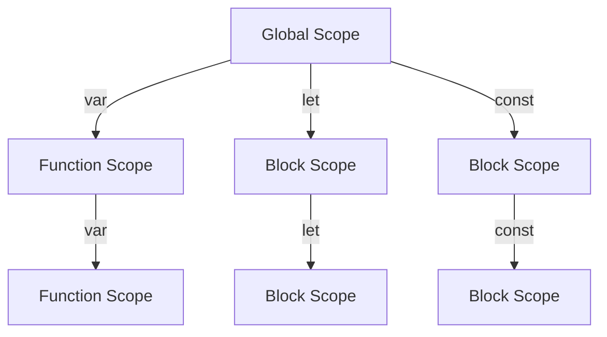

## 5.3 Variables and Data Types

Welcome to the exciting world of JavaScript! In this section, we will delve into the fundamental concepts of variables and data types, which are the building blocks of any programming language. Understanding these concepts is crucial for creating dynamic and interactive web pages. Let's embark on this journey together!

### What are Variables?

Variables in JavaScript are used to store data that can be manipulated and retrieved later in your program. Think of variables as containers or boxes that hold information. You can put different types of data into these boxes, and you can change the contents as needed.

#### Declaring Variables

In JavaScript, you can declare variables using three keywords: `var`, `let`, and `const`. Each of these keywords has its own characteristics and use cases.

1. **`var`**: This is the oldest way to declare variables in JavaScript. Variables declared with `var` are function-scoped, meaning they are accessible within the function they are declared in. If declared outside of a function, they are globally scoped.

   ```javascript
   var name = "John"; // Declaring a variable using var
   console.log(name); // Output: John
   ```

2. **`let`**: Introduced in ES6 (ECMAScript 2015), `let` allows you to declare block-scoped variables. This means the variable is only accessible within the block (e.g., a loop or an if statement) in which it is declared.

   ```javascript
   let age = 25; // Declaring a variable using let
   if (true) {
       let age = 30;
       console.log(age); // Output: 30
   }
   console.log(age); // Output: 25
   ```

3. **`const`**: Also introduced in ES6, `const` is used to declare variables that should not be reassigned. Like `let`, `const` is block-scoped. However, it's important to note that while the variable itself cannot be reassigned, if it holds an object or array, the contents of that object or array can still be modified.

   ```javascript
   const birthYear = 1990; // Declaring a constant variable
   console.log(birthYear); // Output: 1990

   const person = { name: "Alice" };
   person.name = "Bob"; // Allowed
   console.log(person.name); // Output: Bob
   ```

### Understanding Data Types

JavaScript is a dynamically typed language, meaning you don't need to specify the data type of a variable when you declare it. The type is determined automatically based on the value assigned to the variable. Let's explore the basic data types in JavaScript:

1. **String**: Represents textual data. Strings are created by enclosing text in single quotes (`'`), double quotes (`"`), or backticks (`` ` ``).

   ```javascript
   let greeting = "Hello, World!";
   let anotherGreeting = 'Hi there!';
   let templateString = `This is a template string`;
   ```

2. **Number**: Represents numeric data. JavaScript does not differentiate between integers and floating-point numbers; both are considered numbers.

   ```javascript
   let integer = 42;
   let floatingPoint = 3.14;
   ```

3. **Boolean**: Represents logical entities and can have only two values: `true` or `false`.

   ```javascript
   let isJavaScriptFun = true;
   let isTired = false;
   ```

4. **Undefined**: A variable that has been declared but not assigned a value is of type `undefined`.

   ```javascript
   let notAssigned;
   console.log(notAssigned); // Output: undefined
   ```

5. **Null**: Represents the intentional absence of any object value. It is one of JavaScript's primitive values.

   ```javascript
   let emptyValue = null;
   console.log(emptyValue); // Output: null
   ```

6. **Symbol**: Introduced in ES6, symbols are unique and immutable data types used to create unique identifiers for objects.

   ```javascript
   let uniqueID = Symbol('id');
   console.log(uniqueID); // Output: Symbol(id)
   ```

### Dynamic Typing in JavaScript

JavaScript's dynamic typing means that the type of a variable is determined at runtime based on the value it holds. This allows for flexibility but can also lead to unexpected behavior if not handled carefully.

#### Example of Dynamic Typing

```javascript
let dynamicVariable = "I am a string";
console.log(typeof dynamicVariable); // Output: string

dynamicVariable = 100;
console.log(typeof dynamicVariable); // Output: number

dynamicVariable = true;
console.log(typeof dynamicVariable); // Output: boolean
```

As you can see, the same variable `dynamicVariable` can hold different types of data at different times.

### Experimenting with Variables and Data Types

Let's encourage some hands-on experimentation. Try declaring variables using `var`, `let`, and `const`, and assign them different data types. Observe how JavaScript handles the dynamic typing.

#### Try It Yourself

1. Declare a variable using `let` and assign it a string value. Then change its value to a number.
2. Use `const` to declare an object and modify one of its properties.
3. Create a variable with `var` and observe its scope within a function and outside of it.

### Visualizing Variable Scope

To better understand variable scope, let's visualize it using a diagram. This will help you see how variables declared with `var`, `let`, and `const` behave in different contexts.



**Diagram Description**: This diagram illustrates the different scopes of variables declared with `var`, `let`, and `const`. Variables declared with `var` are function-scoped, while those declared with `let` and `const` are block-scoped.

### Key Takeaways

- **Variables** are containers for storing data values.
- **`var`, `let`, and `const`** are used to declare variables, each with different scoping rules.
- **Data types** in JavaScript include strings, numbers, booleans, undefined, null, and symbols.
- **Dynamic typing** allows variables to hold different types of data at different times.
- Experimenting with variables and data types helps solidify understanding.

### Further Reading

For more information on JavaScript variables and data types, you can explore the following resources:

- [MDN Web Docs: JavaScript Data Types and Data Structures](https://developer.mozilla.org/en-US/docs/Web/JavaScript/Data_structures)
- [W3Schools: JavaScript Variables](https://www.w3schools.com/js/js_variables.asp)

## Quiz Time!



### Which keyword is used to declare a block-scoped variable in JavaScript?

- [ ] var
- [x] let
- [ ] const
- [ ] function

> **Explanation:** The `let` keyword is used to declare a block-scoped variable in JavaScript.

### What is the output of `typeof null` in JavaScript?

- [ ] null
- [x] object
- [ ] undefined
- [ ] boolean

> **Explanation:** In JavaScript, `typeof null` returns "object" due to a historical bug in the language.

### Which data type represents textual data in JavaScript?

- [x] String
- [ ] Number
- [ ] Boolean
- [ ] Symbol

> **Explanation:** The String data type is used to represent textual data in JavaScript.

### What is the default value of a variable that has been declared but not initialized?

- [ ] null
- [ ] 0
- [x] undefined
- [ ] ""

> **Explanation:** A variable that has been declared but not initialized has the default value of `undefined`.

### Can a variable declared with `const` be reassigned?

- [ ] Yes
- [x] No

> **Explanation:** A variable declared with `const` cannot be reassigned. However, if it holds an object or array, the contents can be modified.

### Which of the following is a primitive data type in JavaScript?

- [x] Boolean
- [ ] Array
- [ ] Object
- [ ] Function

> **Explanation:** Boolean is a primitive data type in JavaScript, representing true or false values.

### What is the output of `typeof Symbol('id')`?

- [ ] string
- [ ] number
- [x] symbol
- [ ] object

> **Explanation:** The `typeof` operator returns "symbol" for a symbol data type.

### Which keyword should be used to declare a constant variable?

- [ ] var
- [ ] let
- [x] const
- [ ] static

> **Explanation:** The `const` keyword is used to declare a constant variable in JavaScript.

### What is dynamic typing in JavaScript?

- [x] The ability to change the data type of a variable at runtime
- [ ] The ability to declare variables without specifying a data type
- [ ] The ability to use variables without declaring them
- [ ] The ability to use the same variable name in different scopes

> **Explanation:** Dynamic typing in JavaScript refers to the ability to change the data type of a variable at runtime.

### True or False: JavaScript differentiates between integers and floating-point numbers.

- [ ] True
- [x] False

> **Explanation:** JavaScript does not differentiate between integers and floating-point numbers; both are considered numbers.



By understanding variables and data types, you're well on your way to mastering JavaScript. Keep experimenting and exploring, and you'll soon be creating dynamic and interactive web pages with ease!
