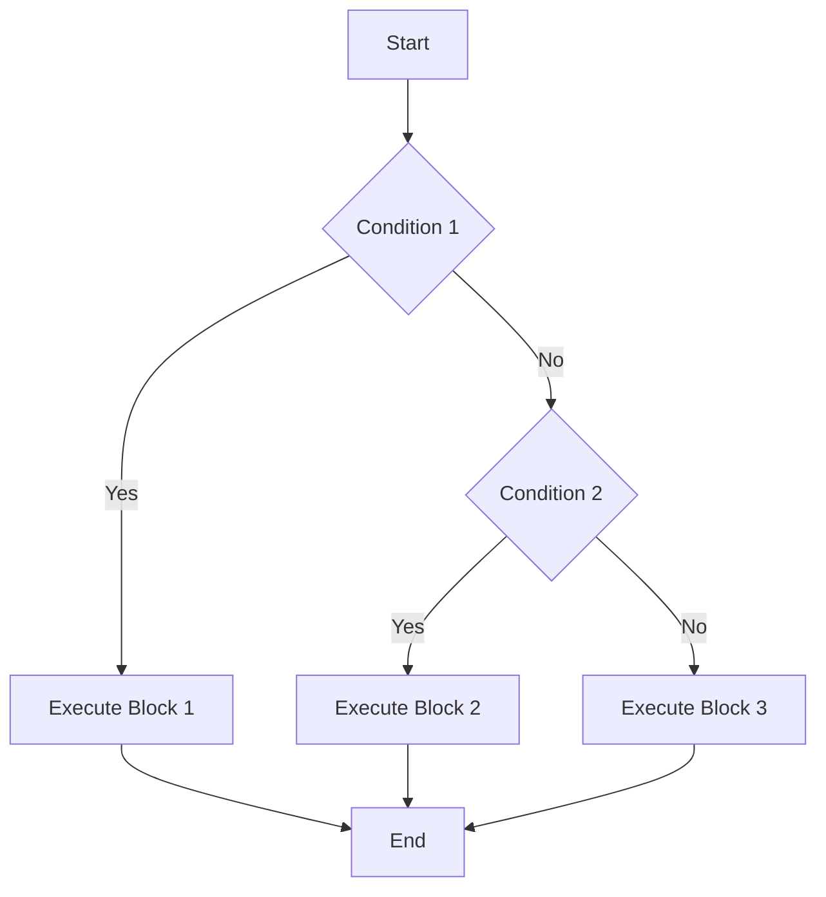

## 5.5 Conditional Statements

In the world of programming, making decisions is crucial. Conditional statements in JavaScript allow us to control the flow of our programs by executing different blocks of code based on certain conditions. This section will guide you through the basics of conditional statements, including `if`, `else if`, `else`, and the ternary operator. We'll also explore truthy and falsy values, which are essential for understanding how conditions are evaluated in JavaScript.

### Understanding Conditional Statements

Conditional statements enable your program to make decisions and execute specific code blocks based on whether a condition is `true` or `false`. This decision-making ability is fundamental for creating dynamic and interactive web pages.

#### The `if` Statement

The `if` statement is the most basic form of conditional statement. It allows you to execute a block of code only if a specified condition evaluates to `true`.

**Syntax:**

```javascript
if (condition) {
  // Code to execute if the condition is true
}
```

**Example:**

```javascript
let temperature = 30;

if (temperature > 25) {
  console.log("It's a hot day!");
}
```

In this example, the message "It's a hot day!" will be logged to the console only if the `temperature` is greater than 25.

#### The `else` Statement

The `else` statement can be used in conjunction with the `if` statement to execute a block of code if the condition is `false`.

**Syntax:**

```javascript
if (condition) {
  // Code to execute if the condition is true
} else {
  // Code to execute if the condition is false
}
```

**Example:**

```javascript
let temperature = 20;

if (temperature > 25) {
  console.log("It's a hot day!");
} else {
  console.log("It's a cool day!");
}
```

Here, "It's a cool day!" will be logged to the console because the condition `temperature > 25` is `false`.

#### The `else if` Statement

When you have multiple conditions to evaluate, you can use the `else if` statement. This allows you to check additional conditions if the previous ones are `false`.

**Syntax:**

```javascript
if (condition1) {
  // Code to execute if condition1 is true
} else if (condition2) {
  // Code to execute if condition2 is true
} else {
  // Code to execute if none of the conditions are true
}
```

**Example:**

```javascript
let temperature = 15;

if (temperature > 25) {
  console.log("It's a hot day!");
} else if (temperature > 15) {
  console.log("It's a warm day!");
} else {
  console.log("It's a cold day!");
}
```

In this case, "It's a cold day!" will be logged because both conditions `temperature > 25` and `temperature > 15` are `false`.

### Truthy and Falsy Values

In JavaScript, conditions are evaluated based on truthy and falsy values. Understanding these concepts is essential for writing effective conditional statements.

#### Falsy Values

A falsy value is a value that translates to `false` when evaluated in a Boolean context. The following values are considered falsy in JavaScript:

- `false`
- `0`
- `""` (an empty string)
- `null`
- `undefined`
- `NaN` (Not-a-Number)

**Example:**

```javascript
let value = 0;

if (value) {
  console.log("This is truthy!");
} else {
  console.log("This is falsy!");
}
```

Since `0` is a falsy value, "This is falsy!" will be logged to the console.

#### Truthy Values

A truthy value is any value that is not falsy. This means that most values in JavaScript are truthy, including:

- Non-zero numbers (e.g., `1`, `-1`)
- Non-empty strings (e.g., `"hello"`)
- Arrays and objects (even if they are empty)

**Example:**

```javascript
let value = "hello";

if (value) {
  console.log("This is truthy!");
} else {
  console.log("This is falsy!");
}
```

Since `"hello"` is a truthy value, "This is truthy!" will be logged to the console.

### The Ternary Operator

The ternary operator is a shorthand way of writing an `if...else` statement. It is a concise way to evaluate a condition and return one of two values based on whether the condition is `true` or `false`.

**Syntax:**

```javascript
condition ? expressionIfTrue : expressionIfFalse;
```

**Example:**

```javascript
let temperature = 30;
let message = temperature > 25 ? "It's a hot day!" : "It's a cool day!";
console.log(message);
```

In this example, the ternary operator checks if `temperature > 25`. If `true`, it assigns "It's a hot day!" to `message`; otherwise, it assigns "It's a cool day!".

### Writing Conditional Logic

Now that we've covered the basics of conditional statements, let's apply this knowledge to solve simple problems.

#### Example: Checking Age Eligibility

Let's write a program that checks if a person is eligible to vote.

```javascript
let age = 18;

if (age >= 18) {
  console.log("You are eligible to vote.");
} else {
  console.log("You are not eligible to vote.");
}
```

In this example, the program checks if `age` is greater than or equal to 18. If `true`, it logs "You are eligible to vote."; otherwise, it logs "You are not eligible to vote."

#### Example: Grading System

Let's create a simple grading system that assigns a letter grade based on a numerical score.

```javascript
let score = 85;
let grade;

if (score >= 90) {
  grade = "A";
} else if (score >= 80) {
  grade = "B";
} else if (score >= 70) {
  grade = "C";
} else if (score >= 60) {
  grade = "D";
} else {
  grade = "F";
}

console.log(`Your grade is: ${grade}`);
```

In this example, the program assigns a letter grade based on the value of `score`. It uses multiple `else if` statements to check different ranges of scores.

### Try It Yourself

Now it's your turn! Try modifying the examples above to see how different conditions affect the output. Here are a few suggestions:

- Change the `temperature` value in the first example to see how the output changes.
- Modify the `age` value to test different eligibility scenarios.
- Experiment with different `score` values to see how the grading system assigns grades.

### Visualizing Conditional Flow

To better understand how conditional statements work, let's visualize the flow of a simple `if...else if...else` structure using a flowchart.



**Diagram Description:** This flowchart represents a basic `if...else if...else` structure. The program checks `Condition 1`. If `true`, it executes `Block 1` and ends. If `false`, it checks `Condition 2`. If `Condition 2` is `true`, it executes `Block 2` and ends. If both conditions are `false`, it executes `Block 3` and ends.

### Further Reading

To deepen your understanding of conditional statements in JavaScript, consider exploring the following resources:

- [MDN Web Docs: if...else](https://developer.mozilla.org/en-US/docs/Web/JavaScript/Reference/Statements/if...else)
- [W3Schools: JavaScript Conditions](https://www.w3schools.com/js/js_if_else.asp)

### Key Takeaways

- Conditional statements allow you to control the flow of your program by executing different code blocks based on conditions.
- The `if` statement executes a block of code if a condition is `true`.
- The `else` statement executes a block of code if the `if` condition is `false`.
- The `else if` statement allows you to check multiple conditions.
- Truthy and falsy values determine how conditions are evaluated in JavaScript.
- The ternary operator provides a shorthand way to write `if...else` statements.

By mastering conditional statements, you can create more dynamic and interactive web pages. Practice writing conditional logic to solve various problems and enhance your programming skills.

## Quiz Time!



### What is the purpose of conditional statements in JavaScript?

- [x] To control the flow of the program based on conditions
- [ ] To declare variables
- [ ] To perform arithmetic operations
- [ ] To define functions

> **Explanation:** Conditional statements allow you to control the flow of your program by executing different code blocks based on whether conditions are true or false.


### Which of the following is a falsy value in JavaScript?

- [ ] "hello"
- [ ] 1
- [x] 0
- [ ] {}

> **Explanation:** In JavaScript, `0` is considered a falsy value, meaning it evaluates to `false` in a Boolean context.


### What does the `else` statement do?

- [ ] Executes code if the `if` condition is true
- [x] Executes code if the `if` condition is false
- [ ] Checks multiple conditions
- [ ] Declares variables

> **Explanation:** The `else` statement executes a block of code if the `if` condition is false.


### How is the ternary operator used in JavaScript?

- [ ] To declare variables
- [x] As a shorthand for `if...else` statements
- [ ] To perform loops
- [ ] To define functions

> **Explanation:** The ternary operator is a shorthand way of writing `if...else` statements in JavaScript.


### What will the following code output?

```javascript
let temperature = 30;
let message = temperature > 25 ? "It's a hot day!" : "It's a cool day!";
console.log(message);
```

- [x] "It's a hot day!"
- [ ] "It's a cool day!"
- [ ] "It's a warm day!"
- [ ] "It's a cold day!"

> **Explanation:** Since `temperature` is 30, which is greater than 25, the ternary operator assigns "It's a hot day!" to `message`.


### Which of the following values is truthy?

- [ ] false
- [ ] 0
- [ ] ""
- [x] "hello"

> **Explanation:** In JavaScript, non-empty strings like `"hello"` are considered truthy values.


### What is the correct syntax for an `if` statement?

- [x] `if (condition) { // code }`
- [ ] `if condition { // code }`
- [ ] `if condition then { // code }`
- [ ] `if (condition) then { // code }`

> **Explanation:** The correct syntax for an `if` statement in JavaScript is `if (condition) { // code }`.


### What will the following code output?

```javascript
let score = 85;
let grade;

if (score >= 90) {
  grade = "A";
} else if (score >= 80) {
  grade = "B";
} else if (score >= 70) {
  grade = "C";
} else if (score >= 60) {
  grade = "D";
} else {
  grade = "F";
}

console.log(`Your grade is: ${grade}`);
```

- [ ] "Your grade is: A"
- [x] "Your grade is: B"
- [ ] "Your grade is: C"
- [ ] "Your grade is: D"

> **Explanation:** Since `score` is 85, which is greater than or equal to 80 but less than 90, the grade assigned is "B".


### What is the result of the following condition?

```javascript
if ("") {
  console.log("This is truthy!");
} else {
  console.log("This is falsy!");
}
```

- [ ] "This is truthy!"
- [x] "This is falsy!"
- [ ] "This is undefined!"
- [ ] "This is null!"

> **Explanation:** An empty string `""` is a falsy value in JavaScript, so "This is falsy!" will be logged.


### True or False: The `else if` statement allows you to check multiple conditions.

- [x] True
- [ ] False

> **Explanation:** The `else if` statement is used to check multiple conditions in sequence, allowing for more complex decision-making.


