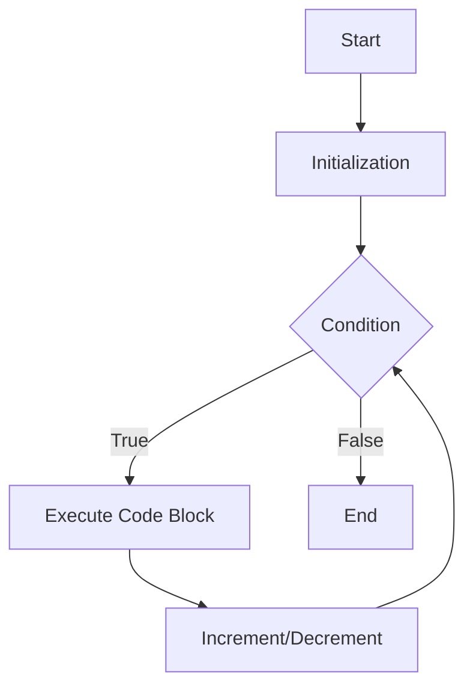

## 5.6 Loops and Iteration

In programming, we often encounter situations where we need to repeat a set of instructions multiple times. JavaScript provides several loop constructs that allow us to perform repetitive tasks efficiently. In this section, we'll explore the fundamental loop types in JavaScript: `for`, `while`, and `do...while`. We'll also discuss how to control loop execution using `break` and `continue` statements and provide practical examples, including iterating over arrays.

### Understanding Loops

Loops are control structures that allow us to execute a block of code multiple times. They are essential for tasks such as processing data collections, automating repetitive tasks, and creating dynamic web content. Let's dive into the different types of loops available in JavaScript.

### The `for` Loop

The `for` loop is one of the most commonly used loops in JavaScript. It is particularly useful when you know in advance how many times you want to execute a block of code. The `for` loop consists of three parts: initialization, condition, and increment/decrement.

#### Syntax of the `for` Loop

```javascript
for (initialization; condition; increment) {
    // Code to be executed
}
```

- **Initialization**: This is executed once before the loop starts. It is typically used to declare and initialize a loop counter variable.
- **Condition**: This is evaluated before each iteration. If the condition is `true`, the loop continues; if `false`, the loop stops.
- **Increment/Decrement**: This is executed after each iteration. It is usually used to update the loop counter.

#### Example: Using a `for` Loop

Let's create a simple `for` loop that prints numbers from 1 to 5.

```javascript
for (let i = 1; i <= 5; i++) {
    console.log(i);
}
```

**Explanation**:
- **Initialization**: `let i = 1` sets the starting point.
- **Condition**: `i <= 5` ensures the loop runs as long as `i` is less than or equal to 5.
- **Increment**: `i++` increases `i` by 1 after each iteration.

### The `while` Loop

The `while` loop is another fundamental loop type in JavaScript. It is ideal when the number of iterations is not known beforehand. The loop continues as long as the specified condition is `true`.

#### Syntax of the `while` Loop

```javascript
while (condition) {
    // Code to be executed
}
```

- **Condition**: The loop checks this condition before each iteration. If it evaluates to `true`, the loop executes; otherwise, it stops.

#### Example: Using a `while` Loop

Let's create a `while` loop that prints numbers from 1 to 5.

```javascript
let i = 1;
while (i <= 5) {
    console.log(i);
    i++;
}
```

**Explanation**:
- We initialize `i` to 1 before the loop.
- The loop continues as long as `i <= 5`.
- `i++` increments `i` after each iteration.

### The `do...while` Loop

The `do...while` loop is similar to the `while` loop, but it guarantees that the loop body is executed at least once, even if the condition is `false` initially.

#### Syntax of the `do...while` Loop

```javascript
do {
    // Code to be executed
} while (condition);
```

- **Condition**: The loop checks this condition after executing the loop body.

#### Example: Using a `do...while` Loop

Let's create a `do...while` loop that prints numbers from 1 to 5.

```javascript
let i = 1;
do {
    console.log(i);
    i++;
} while (i <= 5);
```

**Explanation**:
- The loop body executes once before checking the condition.
- The loop continues as long as `i <= 5`.

### Controlling Loop Execution

JavaScript provides two statements, `break` and `continue`, to control the flow of loops.

#### The `break` Statement

The `break` statement terminates the loop immediately, regardless of the loop condition.

#### Example: Using `break`

```javascript
for (let i = 1; i <= 5; i++) {
    if (i === 3) {
        break; // Exit the loop when i is 3
    }
    console.log(i);
}
```

**Output**:
```
1
2
```

**Explanation**:
- The loop stops when `i` equals 3, so numbers 1 and 2 are printed.

#### The `continue` Statement

The `continue` statement skips the current iteration and proceeds to the next iteration of the loop.

#### Example: Using `continue`

```javascript
for (let i = 1; i <= 5; i++) {
    if (i === 3) {
        continue; // Skip the iteration when i is 3
    }
    console.log(i);
}
```

**Output**:
```
1
2
4
5
```

**Explanation**:
- The loop skips printing 3 and continues with the next iteration.

### When to Use Each Loop Type

- **`for` Loop**: Use when you know the exact number of iterations or need to iterate over arrays or collections with a known length.
- **`while` Loop**: Use when the number of iterations is not predetermined, and you need to continue until a certain condition is met.
- **`do...while` Loop**: Use when you need the loop to execute at least once, regardless of the condition.

### Iterating Over Arrays

Arrays are a common data structure in JavaScript, and loops are often used to iterate over their elements.

#### Example: Iterating Over an Array with a `for` Loop

```javascript
const fruits = ['apple', 'banana', 'cherry'];

for (let i = 0; i < fruits.length; i++) {
    console.log(fruits[i]);
}
```

**Output**:
```
apple
banana
cherry
```

**Explanation**:
- We use `fruits.length` to determine the number of iterations.
- The loop prints each fruit in the array.

#### Example: Iterating Over an Array with a `for...of` Loop

The `for...of` loop provides a simpler syntax for iterating over iterable objects like arrays.

```javascript
const fruits = ['apple', 'banana', 'cherry'];

for (const fruit of fruits) {
    console.log(fruit);
}
```

**Output**:
```
apple
banana
cherry
```

**Explanation**:
- The `for...of` loop iterates directly over the array elements.

### Visualizing Loop Execution

To help you understand how loops work, let's visualize the flow of a `for` loop using a flowchart.



**Description**:
- The flowchart illustrates the sequence of steps in a `for` loop: initialization, condition check, code execution, and increment/decrement.

### Try It Yourself

Experiment with the following code examples to reinforce your understanding:

1. **Modify the `for` Loop**: Change the loop to print numbers from 10 to 1.
2. **Use `while` Loop**: Create a `while` loop that prints even numbers from 2 to 10.
3. **Implement `do...while` Loop**: Write a `do...while` loop that prompts the user for input until they enter "stop".
4. **Explore `break` and `continue`**: Use `break` to exit a loop when a specific condition is met, and `continue` to skip certain iterations.

### Key Takeaways

- Loops are essential for automating repetitive tasks in JavaScript.
- The `for` loop is ideal for known iteration counts, while the `while` loop is suitable for unknown iteration counts.
- The `do...while` loop ensures the loop body executes at least once.
- The `break` statement exits a loop, while the `continue` statement skips the current iteration.
- Use loops to iterate over arrays and process data collections efficiently.

### Further Reading

For more information on loops and iteration in JavaScript, check out these resources:

- [MDN Web Docs: Loops and Iteration](https://developer.mozilla.org/en-US/docs/Web/JavaScript/Guide/Loops_and_iteration)
- [W3Schools: JavaScript Loops](https://www.w3schools.com/js/js_loop_for.asp)

---

## Quiz Time!



### What is the main purpose of loops in programming?

- [x] To execute a block of code multiple times
- [ ] To define variables
- [ ] To create functions
- [ ] To handle errors

> **Explanation:** Loops are used to execute a block of code repeatedly based on a condition.

### Which loop is best suited for iterating over an array when the number of elements is known?

- [x] `for` loop
- [ ] `while` loop
- [ ] `do...while` loop
- [ ] `if` statement

> **Explanation:** The `for` loop is ideal for iterating over arrays when the number of elements is known.

### What is the difference between a `while` loop and a `do...while` loop?

- [x] A `do...while` loop executes the code block at least once before checking the condition.
- [ ] A `while` loop executes the code block at least once before checking the condition.
- [ ] Both loops are identical in behavior.
- [ ] A `while` loop does not require a condition.

> **Explanation:** A `do...while` loop executes the code block once before evaluating the condition.

### How can you exit a loop prematurely in JavaScript?

- [x] Using the `break` statement
- [ ] Using the `continue` statement
- [ ] Using the `return` statement
- [ ] Using the `exit` statement

> **Explanation:** The `break` statement is used to exit a loop prematurely.

### What does the `continue` statement do in a loop?

- [x] Skips the current iteration and continues with the next one
- [ ] Exits the loop
- [ ] Restarts the loop
- [ ] Ends the program

> **Explanation:** The `continue` statement skips the current iteration and proceeds to the next iteration of the loop.

### Which loop guarantees at least one execution of the code block?

- [x] `do...while` loop
- [ ] `for` loop
- [ ] `while` loop
- [ ] `if` statement

> **Explanation:** The `do...while` loop executes the code block at least once before checking the condition.

### How can you iterate over an array using a simplified syntax in JavaScript?

- [x] Using the `for...of` loop
- [ ] Using the `for` loop
- [ ] Using the `while` loop
- [ ] Using the `do...while` loop

> **Explanation:** The `for...of` loop provides a simplified syntax for iterating over iterable objects like arrays.

### What is the role of the condition in a loop?

- [x] To determine whether the loop should continue executing
- [ ] To initialize the loop counter
- [ ] To increment the loop counter
- [ ] To define the loop body

> **Explanation:** The condition determines whether the loop should continue executing or stop.

### Which statement is used to skip an iteration in a loop?

- [x] `continue`
- [ ] `break`
- [ ] `return`
- [ ] `exit`

> **Explanation:** The `continue` statement is used to skip the current iteration and proceed to the next one.

### True or False: The `for` loop can only be used with arrays.

- [ ] True
- [x] False

> **Explanation:** The `for` loop can be used with any iterable object, not just arrays.



---
