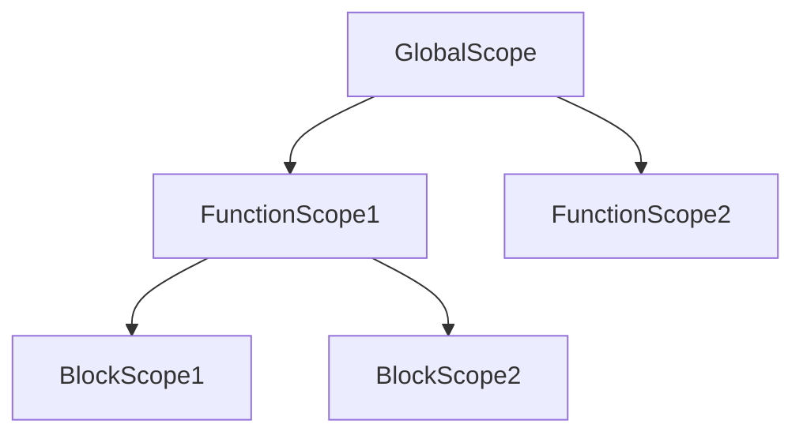

## 5.7 Functions and Scope

Welcome to an exciting part of your JavaScript journey! In this section, we will explore the concept of functions and scope, which are fundamental building blocks in JavaScript programming. By the end of this guide, you'll be able to create reusable blocks of code and understand how variables are accessed and managed within your scripts.

### Understanding Functions

Functions are one of the most powerful features in JavaScript. They allow you to encapsulate code into reusable blocks, making your programs more organized and efficient. Let's dive into the basics of defining and invoking functions.

#### Defining a Function

To define a function in JavaScript, you use the `function` keyword followed by a name, a set of parentheses `()`, and a block of code enclosed in curly braces `{}`. Here's a simple example:

```javascript
function greet() {
    console.log("Hello, World!");
}
```

In this example, `greet` is the name of the function. The code inside the curly braces is the function body, which contains the statements to be executed when the function is called.

#### Invoking a Function

To execute the code inside a function, you need to invoke or call the function. You do this by writing the function name followed by parentheses:

```javascript
greet(); // Output: Hello, World!
```

When you call `greet()`, the code inside the function is executed, and "Hello, World!" is printed to the console.

### Parameters and Return Values

Functions can accept inputs, known as parameters, and can return outputs. This makes them incredibly versatile and powerful.

#### Function Parameters

Parameters are variables that you define in the function declaration to accept input values. You can pass arguments to a function when you call it. Here's an example:

```javascript
function greetUser(name) {
    console.log("Hello, " + name + "!");
}

greetUser("Alice"); // Output: Hello, Alice!
greetUser("Bob");   // Output: Hello, Bob!
```

In this example, `name` is a parameter of the `greetUser` function. When you call the function, you pass the argument (e.g., "Alice") that replaces the parameter within the function body.

#### Return Values

A function can also return a value using the `return` statement. This allows you to capture the result of a function and use it elsewhere in your code:

```javascript
function add(a, b) {
    return a + b;
}

let sum = add(5, 3);
console.log(sum); // Output: 8
```

Here, the `add` function takes two parameters, `a` and `b`, and returns their sum. The `return` statement ends the function execution and specifies the value to be returned.

### Variable Scope: Global vs. Local

Understanding variable scope is crucial for writing effective JavaScript code. Scope determines the visibility and lifetime of variables within your code.

#### Global Scope

Variables declared outside of any function have global scope. They can be accessed from anywhere in the script:

```javascript
let globalVar = "I'm global!";

function showGlobalVar() {
    console.log(globalVar);
}

showGlobalVar(); // Output: I'm global!
```

In this example, `globalVar` is a global variable and can be accessed inside the `showGlobalVar` function.

#### Local Scope

Variables declared within a function are local to that function. They cannot be accessed from outside the function:

```javascript
function showLocalVar() {
    let localVar = "I'm local!";
    console.log(localVar);
}

showLocalVar(); // Output: I'm local!
// console.log(localVar); // Error: localVar is not defined
```

Here, `localVar` is a local variable and is only accessible within the `showLocalVar` function.

#### Block Scope

With the introduction of `let` and `const` in ES6, JavaScript now supports block scope. Variables declared with `let` or `const` within a block (e.g., inside an `if` statement or a loop) are only accessible within that block:

```javascript
if (true) {
    let blockVar = "I'm block-scoped!";
    console.log(blockVar); // Output: I'm block-scoped!
}

// console.log(blockVar); // Error: blockVar is not defined
```

### Function Expressions and Declarations

JavaScript provides two main ways to define functions: function declarations and function expressions.

#### Function Declarations

A function declaration defines a named function using the `function` keyword. It is hoisted to the top of its scope, meaning it can be called before it is defined in the code:

```javascript
console.log(square(4)); // Output: 16

function square(x) {
    return x * x;
}
```

In this example, the `square` function is called before its declaration, thanks to hoisting.

#### Function Expressions

A function expression defines a function as part of a larger expression, typically assigned to a variable. Function expressions are not hoisted, so they cannot be called before they are defined:

```javascript
// console.log(cube(3)); // Error: cube is not defined

let cube = function(x) {
    return x * x * x;
};

console.log(cube(3)); // Output: 27
```

Here, the `cube` function is defined as a function expression and assigned to the variable `cube`.

### Arrow Functions

Arrow functions, introduced in ES6, provide a more concise syntax for writing function expressions. They are particularly useful for short functions and have a different behavior when it comes to handling the `this` keyword.

Here's how you can write an arrow function:

```javascript
let multiply = (a, b) => a * b;

console.log(multiply(2, 3)); // Output: 6
```

In this example, the arrow function takes two parameters, `a` and `b`, and returns their product. Arrow functions are especially handy for inline functions and callbacks.

### Visualizing Scope with Diagrams

To better understand how scope works, let's visualize it using a scope chain diagram. The scope chain is the hierarchy of scopes that JavaScript uses to resolve variable references.



In this diagram, the `GlobalScope` contains two function scopes (`FunctionScope1` and `FunctionScope2`). `FunctionScope1` further contains two block scopes (`BlockScope1` and `BlockScope2`). Variables are resolved by looking up the scope chain, starting from the innermost scope.

### Try It Yourself

Now that we've covered the basics, it's time to experiment! Try modifying the code examples to see how they behave:

1. **Create a function** that takes a number as a parameter and returns its square.
2. **Modify the `greetUser` function** to accept a second parameter for the user's age and print a personalized greeting.
3. **Experiment with variable scope** by declaring variables in different scopes and accessing them.

### Key Takeaways

- Functions allow you to encapsulate code into reusable blocks.
- Parameters and return values enable functions to accept inputs and produce outputs.
- Understanding scope is crucial for managing variable visibility and lifetime.
- Function declarations are hoisted, while function expressions are not.
- Arrow functions provide a concise syntax for writing functions.

### Further Reading

For more information on functions and scope in JavaScript, check out these resources:

- [MDN Web Docs: Functions](https://developer.mozilla.org/en-US/docs/Web/JavaScript/Guide/Functions)
- [W3Schools: JavaScript Functions](https://www.w3schools.com/js/js_functions.asp)
- [MDN Web Docs: Scope](https://developer.mozilla.org/en-US/docs/Glossary/Scope)

## Quiz Time!



### What is the correct way to define a function named `greet`?

- [x] `function greet() { console.log("Hello!"); }`
- [ ] `greet function() { console.log("Hello!"); }`
- [ ] `def greet() { console.log("Hello!"); }`
- [ ] `function: greet() { console.log("Hello!"); }`

> **Explanation:** The correct syntax for defining a function in JavaScript is using the `function` keyword followed by the function name and parentheses.

### How do you call a function named `calculate`?

- [x] `calculate();`
- [ ] `call calculate();`
- [ ] `calculate;`
- [ ] `execute calculate();`

> **Explanation:** To call a function, you use the function name followed by parentheses.

### What is the output of the following code?
```javascript
function add(a, b) {
    return a + b;
}
console.log(add(2, 3));
```

- [x] `5`
- [ ] `23`
- [ ] `undefined`
- [ ] `null`

> **Explanation:** The `add` function returns the sum of `a` and `b`, which is `5` in this case.

### Which keyword is used to declare a variable with block scope?

- [x] `let`
- [ ] `var`
- [ ] `global`
- [ ] `scope`

> **Explanation:** The `let` keyword is used to declare variables with block scope in JavaScript.

### What is the main difference between function declarations and function expressions?

- [x] Function declarations are hoisted, while function expressions are not.
- [ ] Function expressions are hoisted, while function declarations are not.
- [ ] Both are hoisted.
- [ ] Neither are hoisted.

> **Explanation:** Function declarations are hoisted, meaning they can be called before they are defined in the code, while function expressions are not.

### What is the syntax for an arrow function that adds two numbers?

- [x] `(a, b) => a + b`
- [ ] `function(a, b) => a + b`
- [ ] `(a, b) -> a + b`
- [ ] `a, b => a + b`

> **Explanation:** The correct syntax for an arrow function is `(a, b) => a + b`.

### Which of the following is a global variable?

- [x] A variable declared outside any function.
- [ ] A variable declared inside a function.
- [ ] A variable declared with `let` inside a block.
- [ ] A variable declared with `const` inside a block.

> **Explanation:** A global variable is one that is declared outside any function and can be accessed from anywhere in the script.

### What does the `return` statement do in a function?

- [x] Ends the function execution and specifies a value to be returned.
- [ ] Ends the function execution without returning a value.
- [ ] Continues the function execution.
- [ ] Starts the function execution.

> **Explanation:** The `return` statement ends the function execution and specifies a value to be returned.

### What will happen if you try to access a local variable outside its function?

- [x] An error will occur because the variable is not defined in the global scope.
- [ ] The variable will be accessible.
- [ ] The variable will be undefined but accessible.
- [ ] The variable will be automatically converted to a global variable.

> **Explanation:** Local variables are only accessible within the function they are declared in. Accessing them outside will result in an error.

### True or False: Arrow functions have their own `this` context.

- [ ] True
- [x] False

> **Explanation:** Arrow functions do not have their own `this` context; they inherit `this` from the surrounding lexical context.


