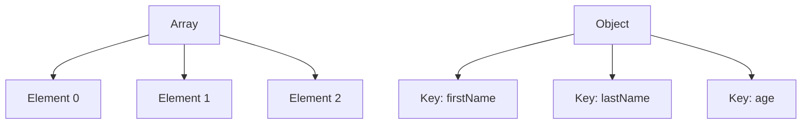

## 5.8 Arrays and Objects

In the world of JavaScript, arrays and objects are fundamental data structures used to store collections of data. Understanding how to create, manipulate, and utilize these structures is crucial for any aspiring web developer. In this section, we will explore arrays and objects in depth, providing you with the knowledge needed to effectively manage data in your JavaScript applications.

### What Are Arrays?

Arrays are special variables in JavaScript that can hold more than one value at a time. They are ordered collections, which means each element in an array has a numbered position known as an index. Arrays are particularly useful when you need to store lists of items, such as numbers, strings, or even other arrays.

#### Creating Arrays

To create an array in JavaScript, you can use square brackets `[]` or the `Array` constructor. Let's look at some examples:

```javascript
// Using square brackets
let fruits = ['apple', 'banana', 'cherry'];

// Using the Array constructor
let numbers = new Array(1, 2, 3, 4, 5);
```

In the first example, we created an array of strings representing different fruits. In the second example, we used the `Array` constructor to create an array of numbers.

#### Accessing Array Elements

You can access elements in an array using their index, which starts at 0. Here's how you can retrieve elements from an array:

```javascript
let fruits = ['apple', 'banana', 'cherry'];

console.log(fruits[0]); // Output: apple
console.log(fruits[1]); // Output: banana
console.log(fruits[2]); // Output: cherry
```

#### Modifying Array Elements

Arrays are mutable, meaning you can change their elements after they have been created. You can modify an element by assigning a new value to a specific index:

```javascript
let fruits = ['apple', 'banana', 'cherry'];

fruits[1] = 'blueberry';
console.log(fruits); // Output: ['apple', 'blueberry', 'cherry']
```

### Common Array Methods

JavaScript provides several built-in methods to manipulate arrays. Let's explore some of the most commonly used methods.

#### `push()`

The `push()` method adds one or more elements to the end of an array and returns the new length of the array.

```javascript
let fruits = ['apple', 'banana'];
fruits.push('cherry');
console.log(fruits); // Output: ['apple', 'banana', 'cherry']
```

#### `pop()`

The `pop()` method removes the last element from an array and returns that element.

```javascript
let fruits = ['apple', 'banana', 'cherry'];
let lastFruit = fruits.pop();
console.log(lastFruit); // Output: cherry
console.log(fruits); // Output: ['apple', 'banana']
```

#### `shift()`

The `shift()` method removes the first element from an array and returns that element. This method changes the length of the array.

```javascript
let fruits = ['apple', 'banana', 'cherry'];
let firstFruit = fruits.shift();
console.log(firstFruit); // Output: apple
console.log(fruits); // Output: ['banana', 'cherry']
```

#### `unshift()`

The `unshift()` method adds one or more elements to the beginning of an array and returns the new length of the array.

```javascript
let fruits = ['banana', 'cherry'];
fruits.unshift('apple');
console.log(fruits); // Output: ['apple', 'banana', 'cherry']
```

### Try It Yourself

Experiment with these array methods by creating your own array and using `push()`, `pop()`, `shift()`, and `unshift()` to manipulate it. Try adding and removing different elements to see how the array changes.

### What Are Objects?

Objects in JavaScript are collections of key-value pairs. They are used to store data in a structured way, allowing you to associate values with names (keys). Objects are incredibly versatile and can represent complex data structures.

#### Creating Objects

You can create an object using curly braces `{}` or the `Object` constructor. Let's see some examples:

```javascript
// Using curly braces
let person = {
    firstName: 'John',
    lastName: 'Doe',
    age: 30
};

// Using the Object constructor
let car = new Object();
car.make = 'Toyota';
car.model = 'Corolla';
car.year = 2020;
```

In the first example, we created an object representing a person with properties for the first name, last name, and age. In the second example, we used the `Object` constructor to create a car object with properties for make, model, and year.

#### Accessing Object Properties

You can access object properties using dot notation or bracket notation:

```javascript
let person = {
    firstName: 'John',
    lastName: 'Doe',
    age: 30
};

console.log(person.firstName); // Output: John
console.log(person['lastName']); // Output: Doe
```

#### Modifying Object Properties

Objects are mutable, so you can change their properties after they have been created:

```javascript
let person = {
    firstName: 'John',
    lastName: 'Doe',
    age: 30
};

person.age = 31;
console.log(person.age); // Output: 31
```

### Arrays and Objects: A Powerful Combination

Arrays and objects can be combined to create complex data structures. For example, you can have an array of objects, where each object represents a different entity with its own properties.

```javascript
let people = [
    { firstName: 'John', lastName: 'Doe', age: 30 },
    { firstName: 'Jane', lastName: 'Smith', age: 25 },
    { firstName: 'Emily', lastName: 'Jones', age: 35 }
];

console.log(people[1].firstName); // Output: Jane
```

In this example, we have an array called `people`, which contains three objects. Each object represents a person with properties for their first name, last name, and age.

### Visualizing Arrays and Objects

To help you better understand the structure of arrays and objects, let's use a diagram to illustrate how they are organized in memory.



In the diagram above, we see an array with three elements and an object with three key-value pairs. This visualization helps to conceptualize how data is stored and accessed in arrays and objects.

### Importance of Arrays and Objects

Arrays and objects are essential in JavaScript because they allow you to organize and manage data efficiently. They are used in nearly every JavaScript application, from simple scripts to complex web applications. Understanding how to work with arrays and objects will enable you to build more dynamic and interactive web pages.

### Practice Problems

To reinforce your understanding of arrays and objects, try solving the following practice problems:

1. Create an array of your favorite foods and use array methods to add and remove items.
2. Create an object representing a book with properties for title, author, and year. Modify one of the properties.
3. Combine arrays and objects by creating an array of objects representing different products, each with properties for name, price, and quantity.

### Key Takeaways

- Arrays are ordered collections of data, accessed by index.
- Objects are collections of key-value pairs, accessed by keys.
- JavaScript provides built-in methods to manipulate arrays and objects.
- Arrays and objects can be combined to create complex data structures.
- Understanding arrays and objects is crucial for effective JavaScript programming.

By mastering arrays and objects, you'll be well-equipped to handle data in your JavaScript applications, making your web pages more dynamic and interactive.

## Quiz Time!



### What is an array in JavaScript?

- [x] An ordered collection of data
- [ ] A single variable that holds a value
- [ ] A function that performs operations
- [ ] A method for styling web pages

> **Explanation:** An array is an ordered collection of data, allowing you to store multiple values in a single variable.

### Which method adds an element to the end of an array?

- [ ] pop()
- [x] push()
- [ ] shift()
- [ ] unshift()

> **Explanation:** The `push()` method adds one or more elements to the end of an array.

### How do you access the first element of an array named `fruits`?

- [ ] fruits[1]
- [x] fruits[0]
- [ ] fruits.first()
- [ ] fruits[-1]

> **Explanation:** Array indices start at 0, so `fruits[0]` accesses the first element.

### What is an object in JavaScript?

- [ ] A type of loop
- [x] A collection of key-value pairs
- [ ] A function that returns a value
- [ ] A method for manipulating strings

> **Explanation:** An object is a collection of key-value pairs, allowing you to store data in a structured way.

### How do you access the `age` property of an object named `person`?

- [x] person.age
- [ ] person[age]
- [ ] person->age
- [ ] person(age)

> **Explanation:** You can access object properties using dot notation, such as `person.age`.

### Which method removes the last element from an array?

- [x] pop()
- [ ] push()
- [ ] shift()
- [ ] unshift()

> **Explanation:** The `pop()` method removes the last element from an array.

### How do you add a property to an object in JavaScript?

- [x] object.property = value;
- [ ] object->property = value;
- [ ] object[property] = value;
- [ ] object.addProperty(value);

> **Explanation:** You can add a property to an object using dot notation, like `object.property = value;`.

### What is the index of the last element in an array with 5 elements?

- [ ] 5
- [ ] 4
- [x] 3
- [ ] 6

> **Explanation:** The index of the last element in an array is the length of the array minus one. For an array with 5 elements, the last index is 4.

### Can arrays and objects be combined in JavaScript?

- [x] True
- [ ] False

> **Explanation:** Arrays and objects can be combined to create complex data structures, such as an array of objects.

### What is the purpose of using arrays and objects in JavaScript?

- [x] To organize and manage data efficiently
- [ ] To style web pages
- [ ] To create server-side applications
- [ ] To perform mathematical calculations

> **Explanation:** Arrays and objects are used to organize and manage data efficiently, making them essential for JavaScript programming.



By understanding arrays and objects, you're taking a significant step toward mastering JavaScript and building dynamic web applications. Keep practicing and experimenting with these data structures to enhance your skills!
