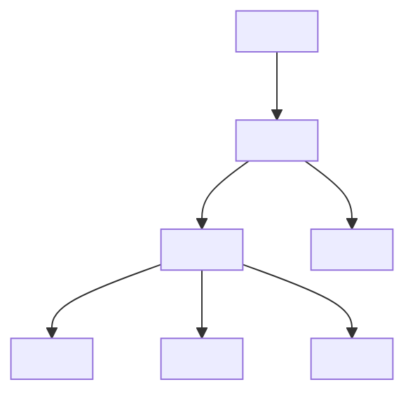

## 6.1 Setting Up the HTML Boilerplate

Welcome to the exciting journey of building your first web page! Before we dive into the dynamic world of JavaScript, it's essential to lay a solid foundation with HTML, the backbone of any web page. In this section, we'll explore the concept of an HTML boilerplate, which serves as the starting template for creating web pages. By the end of this guide, you'll understand each component of the boilerplate and be ready to create your own HTML file.

### What is an HTML Boilerplate?

An HTML boilerplate is a basic template that provides the essential structure for any web page. Think of it as the skeleton of your web page, upon which you will build and add content. The boilerplate ensures that your web page is correctly formatted and compatible with web standards, making it a crucial starting point for any web development project.

### The Standard HTML Boilerplate

Let's take a look at the standard HTML boilerplate code:

```html
<!DOCTYPE html>
<html lang="en">
<head>
    <meta charset="UTF-8">
    <meta name="viewport" content="width=device-width, initial-scale=1.0">
    <title>Your Page Title</title>
</head>
<body>
</body>
</html>
```

This simple yet powerful template is the foundation of every web page. Let's break down each line to understand its purpose and importance.

### Breaking Down the HTML Boilerplate

#### `<!DOCTYPE html>`

The `<!DOCTYPE html>` declaration is the first line of any HTML document. It tells the web browser that the document is written in HTML5, the latest version of HTML. This declaration is crucial because it ensures that the browser renders the page correctly according to modern web standards. Without it, browsers might revert to "quirks mode," where they attempt to render the page using outdated rules, leading to inconsistent and unpredictable results.

#### `<html lang="en">`

The `<html>` tag is the root element of an HTML document, and it wraps all the content on the page. The `lang="en"` attribute specifies the language of the document's content, in this case, English. This attribute is important for accessibility and search engines, as it helps them understand the language in which the content is written. It also assists screen readers in pronouncing the text correctly for visually impaired users.

#### `<head>`

The `<head>` section contains metadata about the document, such as its title and character set. This information is not displayed on the web page but is essential for the browser and search engines.

##### `<meta charset="UTF-8">`

The `<meta charset="UTF-8">` tag specifies the character encoding for the document. UTF-8 is a universal character set that supports almost all characters and symbols from all languages. By using UTF-8, you ensure that your web page can display text correctly, regardless of the language or special characters used.

##### `<meta name="viewport" content="width=device-width, initial-scale=1.0">`

This meta tag is crucial for responsive web design. It instructs the browser to adjust the page's width based on the device's screen size. The `width=device-width` part sets the width of the page to follow the screen's width, while `initial-scale=1.0` ensures that the page is displayed at a 1:1 scale, meaning no zooming in or out by default. This tag is especially important for ensuring that your web page looks good on mobile devices.

##### `<title>Your Page Title</title>`

The `<title>` tag sets the title of the web page, which appears in the browser's title bar or tab. It's also used by search engines when displaying your page in search results. A descriptive and concise title can improve your page's search engine optimization (SEO) and make it easier for users to understand the content of your page.

#### `<body>`

The `<body>` section is where all the visible content of your web page goes. This includes text, images, links, and any other elements you want to display. The body is the main part of your HTML document, and everything within it is rendered by the browser for users to see.

### Importance of Correct Syntax and Nesting

When writing HTML, it's crucial to follow the correct syntax and nesting rules. HTML is a markup language that uses tags to define elements, and these tags must be properly opened and closed. For example, the `<html>`, `<head>`, and `<body>` tags must be closed with `</html>`, `</head>`, and `</body>`, respectively. Proper nesting means that tags should be closed in the reverse order in which they were opened. This ensures that your HTML document is well-structured and easy for browsers to interpret.

### Creating Your Own HTML File

Now that we've explored the HTML boilerplate, it's time to create your own HTML file. Follow these steps to get started:

1. **Open Your Text Editor**: Use a text editor like Visual Studio Code, Sublime Text, or Atom to write your HTML code. If you haven't set up a text editor yet, refer to the previous section on choosing and installing a text editor.

2. **Create a New File**: In your text editor, create a new file and save it with a `.html` extension. For example, you can name it `index.html`.

3. **Type the Boilerplate Code**: Manually type the HTML boilerplate code into your new file. This practice helps reinforce your understanding of each component and its purpose.

4. **Save Your File**: Save your file to ensure that your changes are preserved.

5. **Open Your File in a Browser**: Locate your HTML file in your file explorer and double-click it to open it in your default web browser. You should see a blank page with your specified title in the browser's tab.

### Try It Yourself

To reinforce your learning, try modifying the boilerplate code:

- Change the language attribute to a different language, such as `lang="es"` for Spanish, and observe how it affects the page.
- Update the `<title>` tag to reflect the content of your page.
- Add a simple paragraph inside the `<body>` section using the `<p>` tag, like this:

  ```html
  <body>
      <p>Hello, world! Welcome to my first web page.</p>
  </body>
  ```

- Save your changes and refresh the browser to see the updates.

### Visualizing the HTML Structure

To better understand the structure of an HTML document, let's visualize it using a diagram. This diagram represents the hierarchical relationship between the elements in the boilerplate:



This diagram illustrates how the `<!DOCTYPE html>` declaration is at the top level, followed by the `<html>` element, which contains both the `<head>` and `<body>` sections. The `<head>` section includes metadata elements, while the `<body>` section is reserved for content.

### Key Takeaways

- An HTML boilerplate is a starting template that provides the essential structure for any web page.
- The `<!DOCTYPE html>` declaration ensures that the browser renders the page according to modern web standards.
- The `<html lang="en">` tag specifies the language of the document's content, aiding accessibility and search engines.
- The `<head>` section contains metadata, including character encoding and viewport settings, which are crucial for responsive design.
- The `<body>` section is where all visible content is placed.
- Correct syntax and nesting are essential for creating well-structured HTML documents.
- Creating your own HTML file and typing the boilerplate code manually reinforces your understanding of each component.

### Further Reading

For more information on HTML and web development, consider exploring the following resources:

- [MDN Web Docs: HTML Basics](https://developer.mozilla.org/en-US/docs/Learn/Getting_started_with_the_web/HTML_basics)
- [W3Schools: HTML Introduction](https://www.w3schools.com/html/html_intro.asp)

These resources provide additional insights and examples to help you deepen your understanding of HTML and web development.

---

## Quiz Time!



### What is the purpose of the `<!DOCTYPE html>` declaration?

- [x] To ensure the browser renders the page according to modern web standards
- [ ] To specify the language of the document
- [ ] To define the character encoding
- [ ] To set the title of the web page

> **Explanation:** The `<!DOCTYPE html>` declaration tells the browser to render the page using HTML5 standards, ensuring compatibility and consistency.

### What does the `lang="en"` attribute in the `<html>` tag specify?

- [x] The language of the document's content
- [ ] The character encoding
- [ ] The title of the web page
- [ ] The viewport settings

> **Explanation:** The `lang="en"` attribute specifies that the content of the document is in English, aiding accessibility and search engines.

### Where do you place metadata about the document in an HTML file?

- [x] In the `<head>` section
- [ ] In the `<body>` section
- [ ] In the `<html>` tag
- [ ] In the `<!DOCTYPE html>` declaration

> **Explanation:** The `<head>` section contains metadata about the document, such as character encoding and viewport settings.

### What does the `<meta charset="UTF-8">` tag do?

- [x] Specifies the character encoding for the document
- [ ] Sets the language of the document
- [ ] Defines the viewport settings
- [ ] Sets the title of the web page

> **Explanation:** The `<meta charset="UTF-8">` tag specifies that the document uses UTF-8 character encoding, supporting a wide range of characters.

### Why is the `<meta name="viewport" content="width=device-width, initial-scale=1.0">` tag important?

- [x] It ensures the page is responsive and looks good on mobile devices
- [ ] It sets the language of the document
- [ ] It defines the character encoding
- [ ] It sets the title of the web page

> **Explanation:** This tag helps the page adjust to different screen sizes, making it responsive and user-friendly on mobile devices.

### What is the purpose of the `<title>` tag?

- [x] To set the title of the web page displayed in the browser's tab
- [ ] To specify the character encoding
- [ ] To define the viewport settings
- [ ] To set the language of the document

> **Explanation:** The `<title>` tag sets the title of the web page, which appears in the browser's title bar or tab.

### Where should all visible content of a web page be placed?

- [x] In the `<body>` section
- [ ] In the `<head>` section
- [ ] In the `<html>` tag
- [ ] In the `<!DOCTYPE html>` declaration

> **Explanation:** The `<body>` section contains all the visible content of a web page, such as text, images, and links.

### What is the correct order for closing tags in HTML?

- [x] In the reverse order in which they were opened
- [ ] In any order
- [ ] In alphabetical order
- [ ] In the order they were opened

> **Explanation:** Tags should be closed in the reverse order in which they were opened to ensure proper nesting and structure.

### What should you do after typing the HTML boilerplate code?

- [x] Save your file and open it in a browser to view the page
- [ ] Delete the file
- [ ] Print the file
- [ ] Email the file

> **Explanation:** After typing the HTML boilerplate code, save your file and open it in a browser to see how it renders.

### True or False: The `<head>` section is where all visible content of a web page is placed.

- [ ] True
- [x] False

> **Explanation:** The `<head>` section contains metadata about the document, while the `<body>` section contains all visible content.


