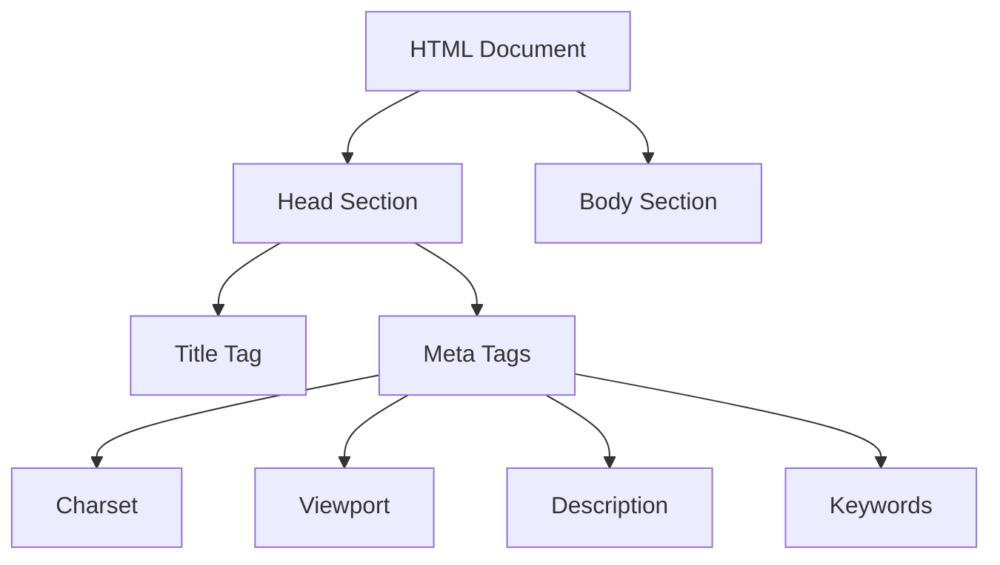

## 6.2 Adding a Title and Metadata

Welcome to an exciting step in building your first web page! In this section, we will explore how to add a title and metadata to your HTML document. These elements are crucial for both user experience and search engine optimization (SEO). Let's dive in and understand how these components work and why they are essential.

### Understanding the Role of the `<title>` Tag

The `<title>` tag is a fundamental part of your HTML document. It defines the title of the web page, which appears in the browser tab and is used by search engines to display the page title in search results. A well-crafted title can significantly impact both user engagement and SEO.

#### Why is the `<title>` Tag Important?

1. **User Experience**: The title helps users identify the content of the page quickly. When multiple tabs are open, a clear and descriptive title makes it easier for users to navigate between them.

2. **Search Engine Optimization (SEO)**: Search engines use the title tag as a primary factor in determining the relevance of a page to a search query. A concise and keyword-rich title can improve your page's visibility in search results.

3. **Social Sharing**: When users share your page on social media, the title often appears as the headline of the shared link, making it crucial for attracting clicks.

#### How to Add a `<title>` Tag

Let's see how to add a title to your HTML document. The `<title>` tag is placed within the `<head>` section of your HTML document:

```html
<!DOCTYPE html>
<html lang="en">
<head>
    <meta charset="UTF-8">
    <meta name="viewport" content="width=device-width, initial-scale=1.0">
    <title>My First Web Page</title>
</head>
<body>
    <h1>Welcome to My First Web Page</h1>
    <p>This is an example of a simple web page with a title.</p>
</body>
</html>
```

In this example, the title "My First Web Page" will appear in the browser tab and in search engine results.

### Exploring the Importance of `<meta>` Tags

Meta tags provide metadata about the HTML document. They are used to specify character set, page description, keywords, author, and viewport settings, among other things. These tags do not affect the appearance of the page but play a crucial role in SEO and responsive design.

#### Key `<meta>` Tags and Their Uses

1. **Character Encoding with `charset="UTF-8"`**

   The `charset` meta tag specifies the character encoding for the HTML document. UTF-8 is the most widely used character encoding, supporting a vast range of characters from different languages.

   ```html
   <meta charset="UTF-8">
   ```

   **Why Use UTF-8?**
   - **Compatibility**: UTF-8 is compatible with ASCII, making it a safe choice for web pages.
   - **Internationalization**: Supports characters from virtually all languages, making your page accessible to a global audience.

2. **Responsive Design with `name="viewport"`**

   The viewport meta tag is essential for responsive web design. It controls the layout on mobile browsers, ensuring that your page is displayed correctly on devices of various sizes.

   ```html
   <meta name="viewport" content="width=device-width, initial-scale=1.0">
   ```

   **Key Attributes**:
   - **width=device-width**: Sets the width of the page to follow the screen-width of the device.
   - **initial-scale=1.0**: Sets the initial zoom level when the page is first loaded.

3. **SEO with `name="description"` and `name="keywords"`**

   These meta tags provide information to search engines about the content of your page.

   ```html
   <meta name="description" content="A brief description of your page.">
   <meta name="keywords" content="HTML, CSS, JavaScript, tutorial">
   ```

   **Description**:
   - **Purpose**: Provides a brief summary of the page content.
   - **Impact**: Appears in search engine results, influencing click-through rates.

   **Keywords**:
   - **Purpose**: Lists important keywords relevant to the page content.
   - **Note**: While not as heavily weighted by search engines as before, keywords can still provide context.

### How Metadata Affects Search Engine Indexing and User Experience

Metadata plays a pivotal role in how search engines index your page and how users experience it. Let's explore these effects in more detail.

#### Search Engine Indexing

- **Relevance**: Metadata helps search engines understand the content and purpose of your page, improving its relevance to search queries.
- **Ranking**: While not the only factor, well-optimized metadata can contribute to higher search rankings.
- **Visibility**: A compelling title and description can increase the likelihood of users clicking on your page in search results.

#### User Experience

- **Navigation**: A clear title aids in easy navigation, especially when multiple tabs are open.
- **Accessibility**: Proper character encoding ensures that all users, regardless of language, can view your content correctly.
- **Mobile Experience**: The viewport meta tag ensures that your page is user-friendly on mobile devices, enhancing overall accessibility.

### Encouraging Best Practices for Metadata

As you build your web pages, it's essential to include relevant metadata to enhance both SEO and user experience. Here are some best practices to follow:

- **Craft Descriptive Titles**: Ensure your title is descriptive and includes relevant keywords.
- **Write Compelling Descriptions**: Create a concise and engaging description that summarizes the page content.
- **Use UTF-8 Encoding**: Always specify UTF-8 as your character encoding to support a wide range of characters.
- **Optimize for Mobile**: Include the viewport meta tag to ensure your page is responsive on all devices.
- **Keep Keywords Relevant**: Use keywords that are directly related to the content of your page.

### Try It Yourself: Experiment with Metadata

Now that you understand the importance of titles and metadata, let's try adding them to your HTML document. Use the following template and modify the title and metadata to suit your page's content:

```html
<!DOCTYPE html>
<html lang="en">
<head>
    <meta charset="UTF-8">
    <meta name="viewport" content="width=device-width, initial-scale=1.0">
    <meta name="description" content="Learn how to add titles and metadata to your HTML page for better SEO and responsiveness.">
    <meta name="keywords" content="HTML, metadata, SEO, responsive design">
    <title>Your Custom Page Title</title>
</head>
<body>
    <h1>Your Page Heading</h1>
    <p>Your page content goes here.</p>
</body>
</html>
```

**Challenge**: Try changing the title and description to reflect a different topic or theme. Observe how these changes affect the display in the browser tab and search engine results.

### Visualizing Metadata in HTML

To better understand how metadata fits into an HTML document, let's visualize the structure using a diagram.



**Diagram Explanation**: This diagram illustrates the relationship between the HTML document, the head section, and the various metadata elements. The head section contains the title and meta tags, which provide crucial information about the page.

### Summary and Key Takeaways

In this section, we explored the importance of adding a title and metadata to your HTML document. Here are the key takeaways:

- The `<title>` tag defines the page title, impacting user experience, SEO, and social sharing.
- Meta tags provide essential information for search engines and improve user experience through character encoding and responsive design.
- Properly optimized metadata can enhance your page's visibility in search results and ensure a better user experience across devices.

By following these guidelines and incorporating relevant metadata, you can create web pages that are both user-friendly and search engine optimized.

---

## Quiz Time!



### What is the primary purpose of the `<title>` tag in an HTML document?

- [x] To define the title of the web page that appears in the browser tab
- [ ] To specify the character encoding of the document
- [ ] To provide a brief summary of the page content
- [ ] To list important keywords relevant to the page content

> **Explanation:** The `<title>` tag is used to define the title of the web page, which appears in the browser tab and is used by search engines to display the page title in search results.

### Which meta tag is essential for responsive web design?

- [ ] `<meta charset="UTF-8">`
- [x] `<meta name="viewport" content="width=device-width, initial-scale=1.0">`
- [ ] `<meta name="description" content="...">`
- [ ] `<meta name="keywords" content="...">`

> **Explanation:** The viewport meta tag is essential for responsive web design, as it controls the layout on mobile browsers and ensures that the page is displayed correctly on devices of various sizes.

### What does the `charset="UTF-8"` meta tag do?

- [x] Specifies the character encoding for the HTML document
- [ ] Provides a brief summary of the page content
- [ ] Lists important keywords relevant to the page content
- [ ] Sets the width of the page to follow the screen-width of the device

> **Explanation:** The `charset="UTF-8"` meta tag specifies the character encoding for the HTML document, supporting a vast range of characters from different languages.

### How does the `name="description"` meta tag affect SEO?

- [x] It provides a brief summary of the page content that appears in search engine results
- [ ] It sets the initial zoom level when the page is first loaded
- [ ] It defines the title of the web page that appears in the browser tab
- [ ] It lists important keywords relevant to the page content

> **Explanation:** The `name="description"` meta tag provides a brief summary of the page content, which appears in search engine results and can influence click-through rates.

### Why is it important to use UTF-8 character encoding in your HTML document?

- [x] It supports characters from virtually all languages, making your page accessible to a global audience
- [ ] It sets the width of the page to follow the screen-width of the device
- [ ] It provides a brief summary of the page content
- [ ] It lists important keywords relevant to the page content

> **Explanation:** UTF-8 character encoding supports characters from virtually all languages, ensuring your page is accessible to a global audience and compatible with ASCII.

### What is the impact of a well-crafted title on SEO?

- [x] It can improve your page's visibility in search results
- [ ] It sets the initial zoom level when the page is first loaded
- [ ] It specifies the character encoding for the HTML document
- [ ] It lists important keywords relevant to the page content

> **Explanation:** A well-crafted title can significantly impact your page's visibility in search results by making it more relevant to search queries.

### Which meta tag would you use to list important keywords relevant to the page content?

- [ ] `<meta charset="UTF-8">`
- [ ] `<meta name="viewport" content="width=device-width, initial-scale=1.0">`
- [ ] `<meta name="description" content="...">`
- [x] `<meta name="keywords" content="...">`

> **Explanation:** The `name="keywords"` meta tag is used to list important keywords relevant to the page content, although it is not as heavily weighted by search engines as before.

### What is the purpose of the `name="viewport"` meta tag?

- [x] It controls the layout on mobile browsers, ensuring the page is displayed correctly on devices of various sizes
- [ ] It provides a brief summary of the page content
- [ ] It lists important keywords relevant to the page content
- [ ] It specifies the character encoding for the HTML document

> **Explanation:** The `name="viewport"` meta tag controls the layout on mobile browsers, ensuring the page is displayed correctly on devices of various sizes.

### How does metadata affect user experience?

- [x] It improves navigation, accessibility, and mobile experience
- [ ] It sets the initial zoom level when the page is first loaded
- [ ] It defines the title of the web page that appears in the browser tab
- [ ] It lists important keywords relevant to the page content

> **Explanation:** Metadata improves user experience by enhancing navigation, ensuring proper character encoding for accessibility, and optimizing the mobile experience through the viewport meta tag.

### True or False: The `<title>` tag is placed within the `<body>` section of an HTML document.

- [ ] True
- [x] False

> **Explanation:** False. The `<title>` tag is placed within the `<head>` section of an HTML document, not the `<body>` section.


