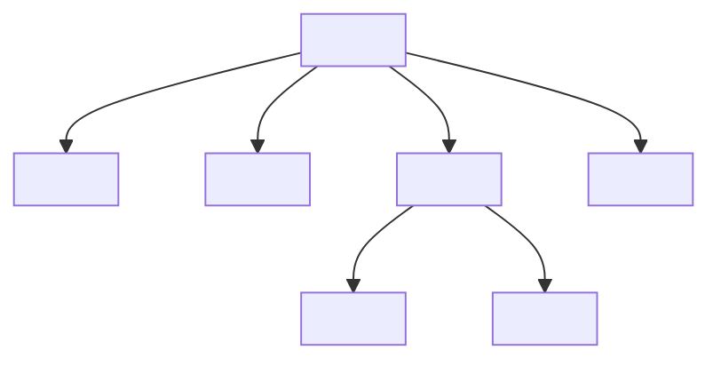

## 6.3 Structuring the Content Area

Creating a well-structured web page is crucial for both user experience and search engine optimization (SEO). In this section, we will explore how to organize your web page content using semantic HTML elements. These elements not only provide meaning to your content but also enhance accessibility and improve SEO. Let's dive into the world of semantic HTML and learn how to structure the content area of your web page effectively.

### Introduction to Semantic HTML

Semantic HTML refers to the use of HTML tags that convey meaning about the content they enclose. Unlike generic `<div>` or `<span>` tags, semantic elements like `<header>`, `<nav>`, `<main>`, `<section>`, `<article>`, `<aside>`, and `<footer>` describe the role of the content within them. This makes it easier for browsers, search engines, and assistive technologies to understand the structure and importance of your content.

### Key Semantic HTML Elements

Let's explore some of the key semantic HTML elements and their purposes:

#### `<header>`

The `<header>` element is used to define introductory content or navigational links for a section or page. It typically contains the site's logo, title, and main navigation links.

```html
<header>
    <h1>My Website</h1>
    <nav>
        <ul>
            <li><a href="#home">Home</a></li>
            <li><a href="#about">About</a></li>
            <li><a href="#contact">Contact</a></li>
        </ul>
    </nav>
</header>
```

#### `<nav>`

The `<nav>` element is specifically for navigation links. It helps users and search engines identify the primary navigation areas of your site.

```html
<nav>
    <ul>
        <li><a href="#home">Home</a></li>
        <li><a href="#services">Services</a></li>
        <li><a href="#portfolio">Portfolio</a></li>
        <li><a href="#contact">Contact</a></li>
    </ul>
</nav>
```

#### `<main>`

The `<main>` element is used to encapsulate the dominant content of the `<body>` of a document. It should contain content that is unique to the document, excluding repeated content like sidebars, navigation links, and footers.

```html
<main>
    <section>
        <h2>About Us</h2>
        <p>Welcome to our website. We offer a range of services to help you achieve the results you’re after.</p>
    </section>
</main>
```

#### `<section>`

The `<section>` element is a thematic grouping of content, typically with a heading. It is used to divide content into sections, each with its own purpose or theme.

```html
<section>
    <h2>Our Services</h2>
    <p>We provide a variety of services including web development, graphic design, and digital marketing.</p>
</section>
```

#### `<article>`

The `<article>` element represents a self-contained piece of content that could stand independently, such as a blog post, news article, or forum post.

```html
<article>
    <h2>Latest News</h2>
    <p>Stay updated with the latest news in the tech industry.</p>
</article>
```

#### `<aside>`

The `<aside>` element is used for content that is tangentially related to the content around it. This could include sidebars, callout boxes, or advertisements.

```html
<aside>
    <h3>Related Articles</h3>
    <ul>
        <li><a href="#article1">Understanding Semantic HTML</a></li>
        <li><a href="#article2">Improving Web Accessibility</a></li>
    </ul>
</aside>
```

#### `<footer>`

The `<footer>` element is used to define the footer for a section or page. It typically contains information about the author, copyright information, or links to related documents.

```html
<footer>
    <p>&copy; 2024 My Website. All rights reserved.</p>
    <nav>
        <ul>
            <li><a href="#privacy">Privacy Policy</a></li>
            <li><a href="#terms">Terms of Service</a></li>
        </ul>
    </nav>
</footer>
```

### Example Layout Using Semantic HTML

Now that we've introduced the key semantic elements, let's see how they can be used together to structure a web page. Below is an example layout that demonstrates how to organize content using these elements:

```html
<body>
    <header>
        <!-- Site header content -->
        <h1>My Website</h1>
        <nav>
            <!-- Navigation links -->
            <ul>
                <li><a href="#home">Home</a></li>
                <li><a href="#about">About</a></li>
                <li><a href="#services">Services</a></li>
                <li><a href="#contact">Contact</a></li>
            </ul>
        </nav>
    </header>
    <main>
        <section>
            <!-- Main content -->
            <h2>Welcome to Our Website</h2>
            <p>We offer a range of services to help you achieve the results you’re after.</p>
        </section>
        <aside>
            <!-- Sidebar content -->
            <h3>Latest News</h3>
            <p>Stay updated with the latest news in the tech industry.</p>
        </aside>
    </main>
    <footer>
        <!-- Footer content -->
        <p>&copy; 2024 My Website. All rights reserved.</p>
    </footer>
</body>
```

### Benefits of Semantic HTML

Using semantic HTML offers several benefits:

1. **Improved Accessibility**: Semantic elements provide context to assistive technologies like screen readers, making it easier for users with disabilities to navigate your site.

2. **Better SEO**: Search engines use semantic tags to understand the structure and content of your site, which can improve your site's search ranking.

3. **Easier Maintenance**: Semantic HTML makes your code more readable and maintainable, as it clearly defines the purpose of each section.

4. **Consistent Styling**: Semantic elements allow for more consistent styling across different sections of your site.

### Planning Your Content Structure

Before you start coding, it's important to plan the structure of your content. Consider the following steps:

- **Identify the Main Sections**: Determine the main sections of your site, such as the header, navigation, main content, and footer.

- **Define the Purpose of Each Section**: Decide what content will be included in each section and how it will be organized.

- **Use Semantic Elements**: Choose the appropriate semantic elements to structure your content.

- **Create a Wireframe**: Sketch a wireframe of your layout to visualize the structure before coding.

### Try It Yourself

Now that you understand the basics of structuring the content area using semantic HTML, try creating your own layout. Experiment with different elements and see how they affect the structure and appearance of your page. Consider adding additional sections or articles to practice using the `<section>` and `<article>` elements.

### Visualizing the DOM Structure

To better understand how semantic HTML elements fit into the Document Object Model (DOM), let's visualize a simple DOM tree structure using Mermaid.js:



**Diagram Description**: This diagram represents the hierarchical structure of a web page using semantic HTML elements. The `<body>` is the root element, containing `<header>`, `<nav>`, `<main>`, and `<footer>`. The `<main>` element further contains `<section>` and `<aside>`.

### Conclusion

Structuring your web page content using semantic HTML is a fundamental skill for any web developer. By using semantic elements, you can create more accessible, SEO-friendly, and maintainable web pages. Remember to plan your content structure before coding and experiment with different layouts to find what works best for your site.

## Quiz Time!



### Which HTML element is used to define the main navigation links of a web page?

- [ ] `<header>`
- [x] `<nav>`
- [ ] `<main>`
- [ ] `<aside>`

> **Explanation:** The `<nav>` element is specifically used for defining navigation links on a web page.

### What is the purpose of the `<main>` element in HTML?

- [x] To encapsulate the dominant content of the document
- [ ] To define the footer of the document
- [ ] To include navigation links
- [ ] To display sidebar content

> **Explanation:** The `<main>` element is used to encapsulate the dominant content of the document, excluding repeated content like sidebars and footers.

### Which semantic HTML element is typically used for sidebar content?

- [ ] `<header>`
- [ ] `<footer>`
- [x] `<aside>`
- [ ] `<article>`

> **Explanation:** The `<aside>` element is used for content that is tangentially related to the main content, such as sidebars.

### What is a benefit of using semantic HTML?

- [x] Improved accessibility
- [ ] Increased file size
- [ ] Slower page load times
- [ ] Reduced readability

> **Explanation:** Semantic HTML improves accessibility by providing context to assistive technologies, making it easier for users with disabilities to navigate the site.

### Which element is used to define a self-contained piece of content, such as a blog post?

- [ ] `<section>`
- [ ] `<aside>`
- [x] `<article>`
- [ ] `<footer>`

> **Explanation:** The `<article>` element is used to define a self-contained piece of content that could stand independently.

### What should you do before coding the structure of your web page?

- [ ] Start coding immediately
- [x] Plan the content structure
- [ ] Ignore semantic elements
- [ ] Use only `<div>` tags

> **Explanation:** It's important to plan the content structure before coding to ensure a well-organized and maintainable layout.

### Which element is used to define the footer of a web page?

- [ ] `<header>`
- [ ] `<nav>`
- [ ] `<main>`
- [x] `<footer>`

> **Explanation:** The `<footer>` element is used to define the footer of a web page, typically containing information about the author or related links.

### What is the role of the `<section>` element in HTML?

- [x] To group related content thematically
- [ ] To define the main navigation
- [ ] To encapsulate the entire document
- [ ] To display advertisements

> **Explanation:** The `<section>` element is used to group related content thematically, often with a heading.

### How does semantic HTML benefit SEO?

- [x] By helping search engines understand the structure and content of the site
- [ ] By increasing the number of keywords on the page
- [ ] By reducing the number of HTML tags
- [ ] By making the site load faster

> **Explanation:** Semantic HTML helps search engines understand the structure and content of the site, which can improve search ranking.

### True or False: The `<header>` element can contain a `<nav>` element.

- [x] True
- [ ] False

> **Explanation:** The `<header>` element can contain a `<nav>` element, as it often includes navigational links along with the site's logo and title.


